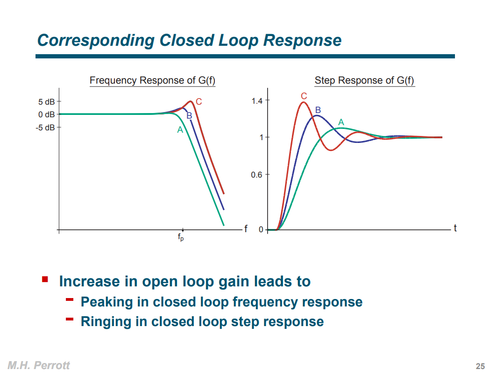

## standard form of the second-order system


> $\omega_d$ called *damped natural frequency*

---


## closed loop


$$\begin{align}
A &= \frac{\frac{A_0}{(1+s/\omega_1)(1+s/\omega_2)}}{1+\beta \frac{A_0} {(1+s/\omega_1)(1+s/\omega_2)}} \\
&= \frac{A_0}{1+A_0 \beta}\frac{1}{\frac{s^2}{\omega_1\omega_2(1+A_0\beta)}+\frac{1/\omega_1+1/\omega_2}{1+A_0\beta}s+1} \\
&\simeq \frac{A_0}{1+A_0 \beta}\frac{1}{\frac{s^2}{\omega_u\omega_2}+\frac{1}{\omega_u}s+1} \\
&= \frac{A_0}{1+A_0 \beta}\frac{\omega_u\omega_2}{s^2+\omega_2s+\omega_u\omega_2}
\end{align}$$

That is $\omega_n = \sqrt{\omega_u\omega_2}$ and $\zeta = \frac{1}{2}\sqrt{\frac{\omega_2}{\omega_u}}$

where $\omega_u$ is the unity gain bandwidth


where $f_r$ is *resonant frequency*, $\zeta$ is *damping ratio*, $P_f$ *maximum peaking*,  $P_t$ is the peak of the first overshoot (step response)


## damping factor & phase margin

- phase margin is defined for *open loop* system

- damping factor ($\zeta$) is defined for *close loop* system

The roughly 90 to 100 times of damping factor ($\zeta$​) is phase margin
$$
\mathrm{PM} = 90\zeta \sim 100\zeta
$$
In order to have a good stable system, we want $\zeta > 0.5$ or phase margin more than $45^o$

We can analyze open loop system in a better perspective because it is simpler. So, we always use the loop gain analysis to find the phase margin and see whether the system is stable or not.


## Closed Loop Poles Versus Open Loop Gain




> [[Michael H. Perrott, High Speed Communication Circuits and Systems, Lecture 15 Integer-N Frequency Synthesizers](https://www.cppsim.com/CommCircuitLectures/lec15.pdf)]


## additional Zero

$$\begin{align}
TF &= \frac{s +\omega_z}{s^2+2\zeta \omega_ns+\omega_n^2} \\
&= \frac{\omega _z}{\omega _n^2}\cdot \frac{1+s/\omega _z}{1+s^2/\omega_n^2+2\zeta s/\omega_n}
\end{align}$$

Let $s=j\omega$ and omit factor, 
$$
A_\text{dB}(\omega) = 10\log[1+(\frac{\omega}{\omega _z})^2] - 10\log[1+\frac{\omega^4}{\omega_n^4}+\frac{2\omega^2(2\zeta ^2 -1)}{\omega_n^2}]
$$
peaking frequency $\omega_\text{peak}$ can be obtained via $\frac{d A_\text{dB}(\omega)}{d\omega} = 0$
$$
\omega_\text{peak} = \omega_z \sqrt{\sqrt{(\frac{\omega_n}{\omega_z})^4 - 2(\frac{\omega_n}{\omega_z})^2(2\zeta ^2-1)+1} - 1}
$$


## Step Response of higher order system


Since $1/sC_1+R_1 \gg R_0$
$$
\frac{V_m}{V_i}(s) \simeq \frac{R_0}{R_0 + 1/sC_0} = \frac{sR_0C_0}{1+sR_0C_0}
$$
*step response* of $V_m$
$$
V_m(t) = e^{-t/R_0C_0}
$$
where $\tau = R_0C_0$


And $V_o(s)$ can be expressed as
$$\begin{align}
\frac{V_o}{V_i}(s)  & \simeq \frac{sR_0C_0}{1+sR_0C_0} \cdot \frac{sR_1C_1}{1+sR_1C_1} \\
&= \frac{sR_0C_0R_1C_1}{R_0C_0-R_1C_1}\left(\frac{1}{1+sR_1C_1} - \frac{1}{1+sR_0C_0}\right)
\end{align}$$

Then *step response* of $Vo$
$$\begin{align}
Vo(t) &= \frac{R_0C_0R_1C_1}{R_0C_0-R_1C_1} \left(\frac{1}{R_1C_1}e^{-t/R_1C_1} - \frac{1}{R_0C_0}e^{-t/R_0C_0}\right) \\
&= \frac{1}{R_0C_0-R_1C_1}\left(R_0C_0e^{-t/R_1C_1} - R_1C_1e^{-t/R_0C_0}\right) \\
&\simeq = \frac{1}{R_0C_0-R_1C_1}\left(R_0C_0e^{-t/R_1C_1} - R_1C_1\right)
\end{align}$$

where $\tau=R_1C_1$


### Partial-fraction Expansion

```matlab
syms C0
syms R0
syms C1
syms R1
syms s

Z0 = 1/s/C1 + R1;
Z1 = R0*Z0/(R0+Z0);
vm = Z1 / (Z1 + 1/s/C0);
vo = R1/Z0 * vm;
```

```matlab
>> partfrac(vm, s)
 
ans =
 
1 - (s*(C1*R0 + C1*R1) + 1)/(C0*C1*R0*R1*s^2 + (C0*R0 + C1*R0 + C1*R1)*s + 1)
 
>> partfrac(vo, s)
 
ans =
 
1 - (s*(C0*R0 + C1*R0 + C1*R1) + 1)/(C0*C1*R0*R1*s^2 + (C0*R0 + C1*R0 + C1*R1)*s + 1)
```

$$\begin{align}
V_m(s) &= 1 - \frac{s(C_1R_0+C_1R_1)+1}{C_0C_1R_0R_1s^2+(C_0R_0+C_1R_0+C_1R_1)s+1} \\
V_o(s) &= 1 - \frac{s(C_0R_0+C_1R_0+C_1R_1)+1}{C_0C_1R_0R_1s^2+(C_0R_0+C_1R_0+C_1R_1)s+1}
\end{align}$$


```matlab
C0 = 200e-9;
R0 = 50;
C1 = 400e-15;
R1 = 200e3;

s = tf("s");

Z0 = 1/s/C1 + R1;
Z1 = R0*Z0/(R0+Z0);
vm = Z1 / (Z1 + 1/s/C0);
vo = R1/Z0 * vm;

vm_exp = 1 - (s*(C1*R0 + C1*R1) + 1)/(C0*C1*R0*R1*s^2 + (C0*R0 + C1*R0 + C1*R1)*s + 1);
vo_exp = 1 - (s*(C0*R0 + C1*R0 + C1*R1) + 1)/(C0*C1*R0*R1*s^2 + (C0*R0 + C1*R0 + C1*R1)*s + 1);

figure(1)
subplot(1,2,1)
step(vm, 500e-9, 'k-o');
hold on;
step(vm_exp, 500e-9, 'r-^')
title('vm step response')
grid on;
legend()


subplot(1,2,2)
step(vo, 500e-9, 'k-o');
hold on;
step(vo_exp, 500e-9, 'r-^')
title('vo step response')
grid on;
legend()


% with approximation
figure(2)
vm_exp2 = s*R0*C0/(1+s*R0*C0);
vo_exp2 = s*R0*C0/(1+s*R0*C0) * s*R1*C1/(1+s*R1*C1);

subplot(1,2,1)
step(vm, 500e-9, 'k-o');
hold on;
step(vm_exp2, 500e-9, 'r-^')
title('vm step response')
grid on;
legend()

subplot(1,2,2)
step(vo, 500e-9, 'k-o');
hold on;
step(vo_exp2, 500e-9, 'r-^')
title('vo step response')
grid on;
legend()
```


---
spectre simulation vs matlab


```matlab
C0 = 200e-9;
R0 = 50;
C1 = 400e-15;
R1 = 200e3;

s = tf("s");

Z0 = 1/s/C1 + R1;
Z1 = R0*Z0/(R0+Z0);
vm = Z1 / (Z1 + 1/s/C0);
vo = R1/Z0 * vm;

step(vm, 500e-9);
hold on;
step(vo, 500e-9);

grid on
```

```matlab
>> vm

vm =
 
          1.024e-44 s^5 + 2.56e-37 s^4 + 1.6e-30 s^3
  -----------------------------------------------------------
  1.024e-44 s^5 + 2.571e-37 s^4 + 1.626e-30 s^3 + 1.6e-25 s^2
 
Continuous-time transfer function.

>> vo

vo =
 
                 8.194e-52 s^6 + 2.048e-44 s^5 + 1.28e-37 s^4
  ---------------------------------------------------------------------------
  8.194e-52 s^6 + 3.081e-44 s^5 + 3.871e-37 s^4 + 1.638e-30 s^3 + 1.6e-25 s^2
 
Continuous-time transfer function.
```


## reference

*Gene F. Franklin, J. David Powell, and Abbas Emami-Naeini. 2018. Feedback Control of Dynamic Systems (8th Edition) (8th. ed.). Pearson.*

Katsuhiko Ogata, Modern Control Engineering, 5th edition
