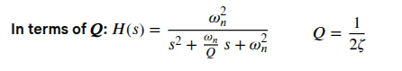
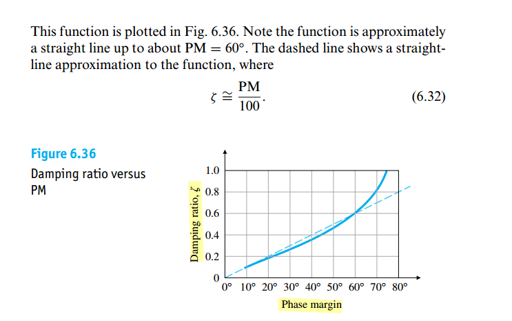

> show qualitatively how changing pole locations in the s-plane affect impulse responses
>
> 


> $\omega_d$ called *damped natural frequency*
> $$
> \omega_n^2 = \sigma^2 + \omega_d^2
> $$
> 


## Resonant Frequency


## Phase Margin & Damping Factor

- Phase Margin is defined for *open loop* system

- Damping Factor ($\zeta$) is defined for *close loop* system



> 

We can analyze open loop system in a better perspective because it is simpler. So, we always use the loop gain analysis to find the phase margin and see whether the system is stable or not.


---


```matlab
zta = 0:.001:1;
PM = atan(2*zta ./ sqrt(sqrt(1+4*zta.^4) - 2*zta.^2))/pi*180;

[~, idx45] = min(abs(PM - 45));
[~, idx60] = min(abs(PM - 60));
[~, idx70] = min(abs(PM - 70));

plot(PM, zta, 'b',  LineWidth=3);
hold on
plot(PM(idx45), zta(idx45), 'ro', MarkerFaceColor='r', LineWidth=3, MarkerSize=8)
text(PM(idx45)+2, zta(idx45), ['\zeta=' num2str(zta(idx45)) ' @PM=45^o'])
plot(PM(idx60), zta(idx60), 'ro', MarkerFaceColor='r', LineWidth=3, MarkerSize=8)
text(PM(idx60)+2, zta(idx60), ['\zeta=' num2str(zta(idx60)) ' @PM=60^o'])
plot(PM(idx70), zta(idx70), 'ro', MarkerFaceColor='r', LineWidth=3, MarkerSize=8)
text(PM(idx70)-10, zta(idx70), ['\zeta=' num2str(zta(idx70)) ' @PM=70^o'])
grid on; xlabel('Phase Margin, ^o'); ylabel('Damping ratio, \zeta')
```


## Zeros & Non-Minimum Phase Zeros

> Influence of Zeros and Non-Minimum Phase Zeros of Transfer Functions on Dynamical System Behavior [[https://aleksandarhaber.com/effect-of-zeros-of-transfer-functions-on-dynamical-system-behavior/](https://aleksandarhaber.com/effect-of-zeros-of-transfer-functions-on-dynamical-system-behavior/)]
>
> The *zeros in the right half of the complex plane* are called ***nonminimum phase zeros***. Systems with nonminimum phase zeros are called ***nonminimum phase systems***

***Zero close to the real pole attenuates the effect of that pole on the system response***


---

***Zeros Tend to Increase the Overshoot of the System***


---

***Nonminimum Phase Zeros – Effect on the Transient Response***


---

$$\begin{align}
TF &= \frac{s +\omega_z}{s^2+2\zeta \omega_ns+\omega_n^2} \\
&= \frac{\omega _z}{\omega _n^2}\cdot \frac{1+s/\omega _z}{1+s^2/\omega_n^2+2\zeta s/\omega_n}
\end{align}$$

Let $s=j\omega$ and omit factor, 
$$
A_\text{dB}(\omega) = 10\log[1+(\frac{\omega}{\omega _z})^2] - 10\log[1+\frac{\omega^4}{\omega_n^4}+\frac{2\omega^2(2\zeta ^2 -1)}{\omega_n^2}]
$$
peaking frequency $\omega_\text{peak}$ can be obtained via $\frac{d A_\text{dB}(\omega)}{d\omega} = 0$
$$
\omega_\text{peak} = \omega_z \sqrt{\sqrt{(\frac{\omega_n}{\omega_z})^4 - 2(\frac{\omega_n}{\omega_z})^2(2\zeta ^2-1)+1} - 1}
$$


## Settling Time

### One Pole


we have
$$
\tau \approx \left(1 + \frac{R_1}{R_2}\right)\frac{1}{A_0\omega_0}= \frac{1}{\beta \omega_\text{ugb}}
$$

> 


### Two Poles

with *open-loop* transfer function $A_{OL}=\frac{A_0}{(1+s/\omega_1)(1+s/\omega_2)}$ and assuming $\omega_1$ is dominant pole,  then yield *closed-loop* transfer function

$$\begin{align}
A_{CL}(s) &= \frac{\frac{A_0}{(1+s/\omega_1)(1+s/\omega_2)}}{1+\beta \frac{A_0} {(1+s/\omega_1)(1+s/\omega_2)}} \\
&= \frac{A_0}{1+A_0 \beta}\frac{1}{\frac{s^2}{\omega_1\omega_2(1+A_0\beta)}+\frac{1/\omega_1+1/\omega_2}{1+A_0\beta}s+1} \\
&\approx \frac{A_0}{1+A_0 \beta}\frac{1}{\frac{s^2}{\omega_u\omega_2}+\frac{1}{\omega_u}s+1} \\
&= \frac{A_0}{1+A_0 \beta}\frac{\omega_u\omega_2}{s^2+\omega_2s+\omega_u\omega_2}
\end{align}$$

That is $\omega_n = \sqrt{\omega_u\omega_2}$, $\zeta = \frac{1}{2}\sqrt{\frac{\omega_2}{\omega_u}}$ , where $\omega_u\approx \beta A_0 \omega_1$ is the *unity gain bandwidth*

> 

---


***Rise Time*** (***0%*** to ***100%*** )


$$
t_r = \frac{\pi - \beta}{\omega_d}=\frac{\pi - \arctan\frac{\omega_n\sqrt{1-\zeta^2}}{\zeta\omega_n}}{\omega_n\sqrt{1-\zeta^2}}\approx\frac{\pi - \arctan\frac{\sqrt{1-\zeta^2}}{\zeta}}{\sqrt{\omega_u\omega_2}\sqrt{1-\zeta^2}}=\frac{\pi - \arctan\frac{\sqrt{1-\zeta^2}}{\zeta}}{\omega_u\sqrt{k(1-\zeta^2)}}
$$
where $k = \frac{\omega_2}{\omega_u}$, is the function of PM

| PM          | $45^o$                 | $60^o$                  | $70^o$                  |
| ----------- | ---------------------- | ----------------------- | ----------------------- |
| **$k$**     | 1                      | 1.73                    | 2.75                    |
| **$\zeta$** | 0.42                   | 0.61                    | 0.80                    |
| **$t_r$**   | $\frac{2.2}{\omega_u}$ | $\frac{2.14}{\omega_u}$ | $\frac{2.53}{\omega_u}$ |

```matlab
PM = 70;
ztap = 0.80;
k = 1/tan((90-PM)/180*pi)
tr = (pi - atan(sqrt(1-ztap^2)/ztap))/sqrt(k*(1-ztap^2))
```


***Settling Time***

>   Gene F. Franklin, Feedback Control of Dynamic Systems, 8th Edition


As we know
$$
\zeta \omega_n=\frac{1}{2}\sqrt{\frac{\omega_2}{\omega_u}}\cdot \sqrt{\omega_u\omega_2}=\frac{1}{2}\omega_2
$$

Then
$$
t_s = \frac{9.2}{\omega_2}
$$

For $\text{PM}=70^o$, $\omega_2 = 2.75\omega_u$, that is
$$
t_s \approx \frac{3.35}{\omega_u}
$$


For $\text{PM}=45^o$, $\omega_2 = \omega_u$, that is
$$
t_s \approx \frac{9.2}{\omega_u}
$$


> Above equation is valid only for **underdamped**, $\zeta=\frac{1}{2}\sqrt{\frac{\omega_2}{\omega_u}}\lt 1$, that is $\omega_2\lt 4\omega_u$


## 2 Stage RC filter

### High Pass Filter


Since $1/sC_1+R_1 \gg R_0$
$$
\frac{V_m}{V_i}(s) \approx \frac{R_0}{R_0 + 1/sC_0} = \frac{sR_0C_0}{1+sR_0C_0}
$$
*step response* of $V_m$
$$
V_m(t) = e^{-t/R_0C_0}
$$
where $\tau = R_0C_0$


And $V_o(s)$ can be expressed as
$$\begin{align}
\frac{V_o}{V_i}(s)  & \approx \frac{sR_0C_0}{1+sR_0C_0} \cdot \frac{sR_1C_1}{1+sR_1C_1} \\
&= \frac{sR_0C_0R_1C_1}{R_0C_0-R_1C_1}\left(\frac{1}{1+sR_1C_1} - \frac{1}{1+sR_0C_0}\right)
\end{align}$$

Then *step response* of $Vo$
$$\begin{align}
Vo(t) &= \frac{R_0C_0R_1C_1}{R_0C_0-R_1C_1} \left(\frac{1}{R_1C_1}e^{-t/R_1C_1} - \frac{1}{R_0C_0}e^{-t/R_0C_0}\right) \\
&= \frac{1}{R_0C_0-R_1C_1}\left(R_0C_0e^{-t/R_1C_1} - R_1C_1e^{-t/R_0C_0}\right) \\
&\approx \frac{1}{R_0C_0-R_1C_1}\left(R_0C_0e^{-t/R_1C_1} - R_1C_1\right)
\end{align}$$

where $\tau=R_1C_1$

---

***Partial-fraction Expansion***

```matlab
syms C0
syms R0
syms C1
syms R1
syms s

Z0 = 1/s/C1 + R1;
Z1 = R0*Z0/(R0+Z0);
vm = Z1 / (Z1 + 1/s/C0);
vo = R1/Z0 * vm;
```

```matlab
>> partfrac(vm, s)
 
ans =
 
1 - (s*(C1*R0 + C1*R1) + 1)/(C0*C1*R0*R1*s^2 + (C0*R0 + C1*R0 + C1*R1)*s + 1)
 
>> partfrac(vo, s)
 
ans =
 
1 - (s*(C0*R0 + C1*R0 + C1*R1) + 1)/(C0*C1*R0*R1*s^2 + (C0*R0 + C1*R0 + C1*R1)*s + 1)
```

$$\begin{align}
V_m(s) &= 1 - \frac{s(C_1R_0+C_1R_1)+1}{C_0C_1R_0R_1s^2+(C_0R_0+C_1R_0+C_1R_1)s+1} \\
V_o(s) &= 1 - \frac{s(C_0R_0+C_1R_0+C_1R_1)+1}{C_0C_1R_0R_1s^2+(C_0R_0+C_1R_0+C_1R_1)s+1}
\end{align}$$

---

```matlab
C0 = 200e-9;
R0 = 50;
C1 = 400e-15;
R1 = 200e3;

s = tf("s");

Z0 = 1/s/C1 + R1;
Z1 = R0*Z0/(R0+Z0);
vm = Z1 / (Z1 + 1/s/C0);
vo = R1/Z0 * vm;

vm_exp = 1 - (s*(C1*R0 + C1*R1) + 1)/(C0*C1*R0*R1*s^2 + (C0*R0 + C1*R0 + C1*R1)*s + 1);
vo_exp = 1 - (s*(C0*R0 + C1*R0 + C1*R1) + 1)/(C0*C1*R0*R1*s^2 + (C0*R0 + C1*R0 + C1*R1)*s + 1);

figure(1)
subplot(1,2,1)
step(vm, 500e-9, 'k-o');
hold on;
step(vm_exp, 500e-9, 'r-^')
title('vm step response')
grid on;
legend()


subplot(1,2,2)
step(vo, 500e-9, 'k-o');
hold on;
step(vo_exp, 500e-9, 'r-^')
title('vo step response')
grid on;
legend()


% with approximation
figure(2)
vm_exp2 = s*R0*C0/(1+s*R0*C0);
vo_exp2 = s*R0*C0/(1+s*R0*C0) * s*R1*C1/(1+s*R1*C1);

subplot(1,2,1)
step(vm, 500e-9, 'k-o');
hold on;
step(vm_exp2, 500e-9, 'r-^')
title('vm step response')
grid on;
legend()

subplot(1,2,2)
step(vo, 500e-9, 'k-o');
hold on;
step(vo_exp2, 500e-9, 'r-^')
title('vo step response')
grid on;
legend()
```


---

*spectre* vs *matlab*


```matlab
C0 = 200e-9;
R0 = 50;
C1 = 400e-15;
R1 = 200e3;

s = tf("s");

Z0 = 1/s/C1 + R1;
Z1 = R0*Z0/(R0+Z0);
vm = Z1 / (Z1 + 1/s/C0);
vo = R1/Z0 * vm;

step(vm, 500e-9);
hold on;
step(vo, 500e-9);

grid on
```

```matlab
>> vm

vm =
 
          1.024e-44 s^5 + 2.56e-37 s^4 + 1.6e-30 s^3
  -----------------------------------------------------------
  1.024e-44 s^5 + 2.571e-37 s^4 + 1.626e-30 s^3 + 1.6e-25 s^2
 
Continuous-time transfer function.

>> vo

vo =
 
                 8.194e-52 s^6 + 2.048e-44 s^5 + 1.28e-37 s^4
  ---------------------------------------------------------------------------
  8.194e-52 s^6 + 3.081e-44 s^5 + 3.871e-37 s^4 + 1.638e-30 s^3 + 1.6e-25 s^2
 
Continuous-time transfer function.
```


### Low Pass Filter


$$
\left\{ \begin{array}{cl}
\frac{V_i - V_m}{R_0} &= C_0\frac{dV_m}{dt} + C_1\frac{dV_o}{dt} \\
\frac{V_m - V_o}{R_1} &= C_1\frac{dV_o}{dt} \\
V_m(t=0) &= 1 \\
V_o(t=0) &= 0
\end{array} \right.
$$

Take into initial condition account
$$
\frac{dV_m}{dt}  \overset{\mathcal{L}}{\longrightarrow} sV_M-V_{m0}
$$
where $V_{m0} = 1$


$$\begin{align}
V_O(s) &= \frac{V_I}{s^2R_0C_0R_1C_1+s(R_0C_0+R_1C_1+R_0C_1)+1} + \frac{V_{m0}R_0C_0}{s^2R_0C_0R_1C_1+s(R_0C_0+R_1C_1+R_0C_1)+1} \\
&\approx \frac{V_I}{s^2R_0C_0R_1C_1+sR_0(C_0+C_1)+1} + \frac{V_{m0}R_0C_0}{s^2R_0C_0R_1C_1+sR_0(C_0+C_1)+1} \\
&= \frac{V_I}{R_0(C_0+C_1)}\left(\frac{R_0(C_0+C_1)}{sR_0(C_0+C_1)+1} - \frac{R_1\frac{C_0C_1}{C_0+C_1}}{sR_1\frac{C_0C_1}{C_0+C_1}+1}\right) \\
&+  \frac{C_0}{C_0+C_1}\left(\frac{R_0(C_0+C_1)}{sR_0(C_0+C_1)+1} - \frac{R_1\frac{C_0C_1}{C_0+C_1}}{sR_1\frac{C_0C_1}{C_0+C_1}+1}\right)
\end{align}$$


with $V_I = \frac{1}{s}$, using inverse Laplace transform
$$\begin{align}
V_o(t) &= 1 - \frac{C_1}{C_0+C_1}e^{-t/\tau_0}-\frac{C_0}{C_0+C_1}e^{-t/\tau_1} - \frac{R_1C_0C_1}{R_0(C_0+C_1)^2} \tag{Eq.0} \\
&= 1 - \frac{C_1}{C_0+C_1}e^{-t/\tau_0}-\frac{C_0}{C_0+C_1}e^{-t/\tau_1} \tag{Eq.1} 
\end{align}$$


where

$$\begin{align}
\tau_0 &= R_0(C_0+C_1) \\
\tau_1 &= R_1C_1\cdot \frac{C_0}{C_0+C_1}
\end{align}$$


and $\tau_0 \gg \tau_1$

---


```matlab
R0 = 100e3;
C0 = 200e-15;
R1 = 10e3;
C1 = 100e-15;

s = tf('s');

VI = 1/s;
Vm0 = 1;

deno = (s^2*R0*C0*R1*C1 + s*(R0*C0 + R1*C1 + R0*C1) + 1);
VO = VI/deno + (Vm0*R0*C0)/deno;
VM = (1+s*R1*C1)*VO;

t = linspace(0,40,1e3);  % ns
[vot, ~] = impulse(VO, t*1e-9);
[vmt, ~] = impulse(VM, t*1e-9);

tau0 = R0*(C0+C1)*1e9; %ns
tau1 = R1*C0*C1/(C0+C1)*1e9; %ns
y0 = 1 - C1/(C0+C1)*exp(-t/tau0) - C0/(C0+C1)*exp(-t/tau1) - R1*C0*C1/R0/(C0+C1)^2;  % Eq.0
y1 = 1 - C1/(C0+C1)*exp(-t/tau0) - C0/(C0+C1)*exp(-t/tau1);  % Eq.1

plot(t, vot, t, vmt,LineWidth=2);
hold on
plot(t,y0, t,y1, LineWidth=2, LineStyle="--" );
xlim([-10, 40])
legend('V_o(t)', 'V_m(t)','y_0(t)', 'y_1(t)', fontsize=12)
xlabel('t (ns)')
ylabel('mag (V)')
grid on;
```


## reference

*Gene F. Franklin, J. David Powell, and Abbas Emami-Naeini. 2018. Feedback Control of Dynamic Systems (8th Edition) (8th. ed.). Pearson.* [[pdf](https://mrce.in/ebooks/Feedback%20Control%20of%20Dynamic%20Systems%208th%20Ed.pdf)]

Katsuhiko Ogata, Modern Control Engineering, 5th edition [[pdf](https://mechfamily-ju.com/storage/images/files/file_17314308026pQTy.pdf)]

C. T. Chuang, "Analysis of the settling behavior of an operational amplifier," in *IEEE Journal of Solid-State Circuits*, vol. 17, no. 1, pp. 74-80, Feb. 1982 [[https://sci-hub.se/10.1109/JSSC.1982.1051689](https://sci-hub.se/10.1109/JSSC.1982.1051689)]
