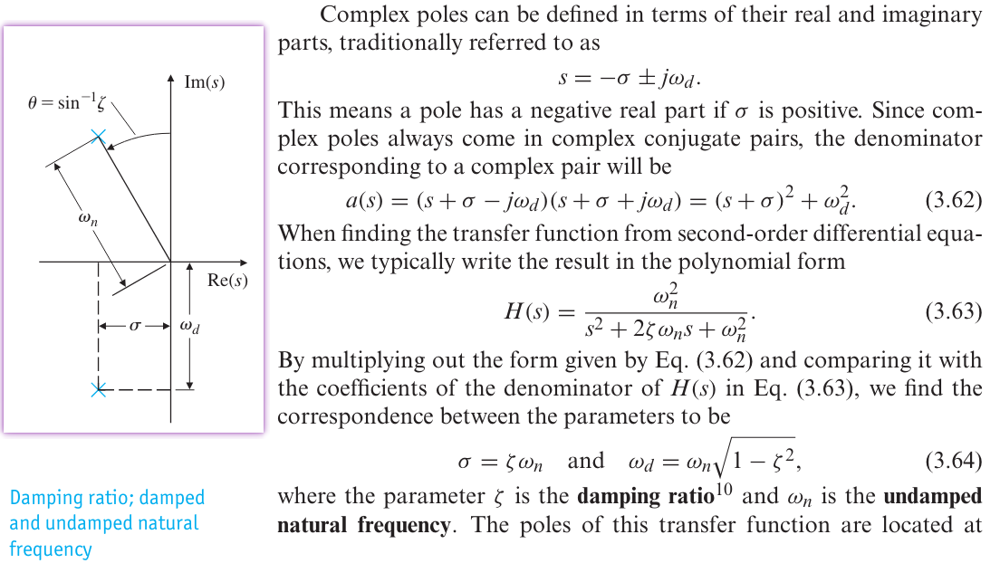

## overview

> $\omega_d$ called *damped natural frequency*

---

## closed loop frequency response

$$\begin{align}
A &= \frac{\frac{A_0}{(1+s/\omega_1)(1+s/\omega_2)}}{1+\beta \frac{A_0} {(1+s/\omega_1)(1+s/\omega_2)}} \\
&= \frac{A_0}{1+A_0 \beta}\frac{1}{\frac{s^2}{\omega_1\omega_2(1+A_0\beta)}+\frac{1/\omega_1+1/\omega_2}{1+A_0\beta}s+1} \\
&\simeq \frac{A_0}{1+A_0 \beta}\frac{1}{\frac{s^2}{\omega_u\omega_2}+\frac{1}{\omega_u}s+1} \\
&= \frac{A_0}{1+A_0 \beta}\frac{\omega_u\omega_2}{s^2+\omega_2s+\omega_u\omega_2}
\end{align}$$

That is $\omega_n = \sqrt{\omega_u\omega_2}$ and $\zeta = \frac{1}{2}\sqrt{\frac{\omega_2}{\omega_u}}$

where $\omega_u$ is the unity gain bandwidth

where $f_r$ is *resonant frequency*, $\zeta$ is *damping ratio*, $P_f$ *maximum peaking*,  $P_t$ is the peak of the first overshoot (step response)

## damping factor & phase margin

- phase margin is defined for *open loop* system

- damping factor ($\zeta$) is defined for *close loop* system

The roughly 90 to 100 times of damping factor ($\zeta$​) is phase margin
$$
\mathrm{PM} = 90\zeta \sim 100\zeta
$$
In order to have a good stable system, we want $\zeta > 0.5$ or phase margin more than $45^o$

We can analyze open loop system in a better perspective because it is simpler. So, we always use the loop gain analysis to find the phase margin and see whether the system is stable or not.

## additional Zero

$$\begin{align}
TF &= \frac{s +\omega_z}{s^2+2\zeta \omega_ns+\omega_n^2} \\
&= \frac{\omega _z}{\omega _n^2}\cdot \frac{1+s/\omega _z}{1+s^2/\omega_n^2+2\zeta s/\omega_n}
\end{align}$$

Let $s=j\omega$ and omit factor, 
$$
A_\text{dB}(\omega) = 10\log[1+(\frac{\omega}{\omega _z})^2] - 10\log[1+\frac{\omega^4}{\omega_n^4}+\frac{2\omega^2(2\zeta ^2 -1)}{\omega_n^2}]
$$
peaking frequency $\omega_\text{peak}$ can be obtained via $\frac{d A_\text{dB}(\omega)}{d\omega} = 0$
$$
\omega_\text{peak} = \omega_z \sqrt{\sqrt{(\frac{\omega_n}{\omega_z})^4 - 2(\frac{\omega_n}{\omega_z})^2(2\zeta ^2-1)+1} - 1}
$$

## Settling Time

### single-pole

$$
\tau \simeq \frac{1}{\beta \omega_\text{ugb}}
$$

### two poles

#### Rise Time

> Katsuhiko Ogata, Modern Control Engineering Fifth Edition

> For *underdamped* second order systems, the *0% to 100% rise time* is normally used

For $\text{PM}=70^o$

-  $\omega_2=3\omega_u$, that is $\omega_n = 1.7\omega_u$. 
-  $\zeta = 0.87$

Then
$$
t_r = \frac{3.1}{\omega_u}
$$

#### Settling Time

>   Gene F. Franklin, Feedback Control of Dynamic Systems, 8th Edition

As we know
$$
\zeta \omega_n=\frac{1}{2}\sqrt{\frac{\omega_2}{\omega_u}}\cdot \sqrt{\omega_u\omega_2}=\frac{1}{2}\omega_2
$$

Then
$$
t_s = \frac{9.2}{\omega_2}
$$

For $\text{PM}=70^o$, $\omega_2 = 3\omega_u$, that is
$$
t_s \simeq \frac{3}{\omega_u} \space\space \text{, for PM}=70^o
$$

For $\text{PM}=45^o$, $\omega_2 = \omega_u$, that is
$$
t_s \simeq \frac{9.2}{\omega_u} \space\space \text{, for PM}=45^o
$$

> Above equation is valid only for **underdamped**, $\zeta=\frac{1}{2}\sqrt{\frac{\omega_2}{\omega_u}}\lt 1$, that is $\omega_2\lt 4\omega_u$

## reference

*Gene F. Franklin, J. David Powell, and Abbas Emami-Naeini. 2018. Feedback Control of Dynamic Systems (8th Edition) (8th. ed.). Pearson.*

Katsuhiko Ogata, Modern Control Engineering, 5th edition
