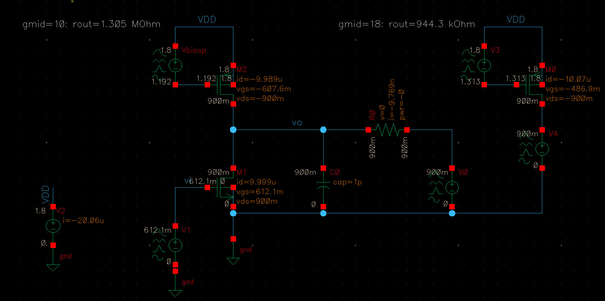

**Analog Designer's Toolbox (ADT)**

> small gm/ID for High ro

### reference

The Analog Designer's Toolbox (ADT) | Invited Talk by IEEE Santa Clara Valley Section CAS Society, [https://youtu.be/FT6kKC5OdE0](https://youtu.be/FT6kKC5OdE0)
