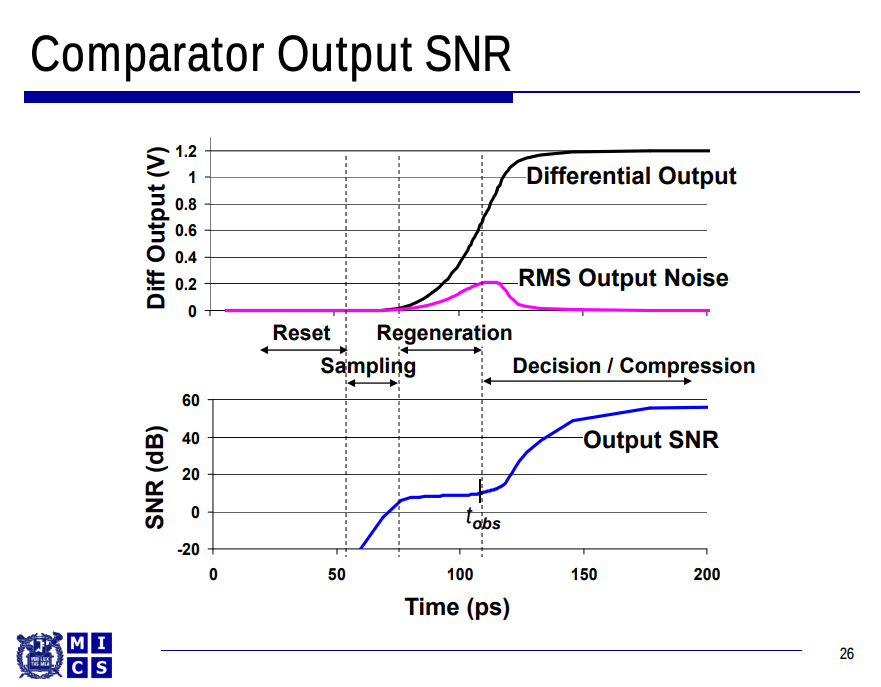

## Offset

## Noise

### transient noise method

### PSS method

$$
\overline{V^2_{n,in}}=\frac{\overline{V^2_{n,out}}}{A_v}
$$

## RX sensitivity and input referred noise

## reference

J. Silva, D. Brito, G. Rodrigues, T. Rabuske, A. C. Pinto and J. Fernandes, "Methods for Fast Characterization of Noise and Offset in Dynamic Comparators," 2021 19th IEEE International New Circuits and Systems Conference (NEWCAS), 2021, pp. 1-4, doi: 10.1109/NEWCAS50681.2021.9462744.

P. Lund, “Comparator Design for High-Speed ADCs,” Dissertation, 2022. URL: [https://www.diva-portal.org/smash/get/diva2:1688161/FULLTEXT01.pdf](https://www.diva-portal.org/smash/get/diva2:1688161/FULLTEXT01.pdf)

Art Schaldenbrand, Senior Product Manager, Keeping Things Quiet: A New Methodology for Dynamic Comparator Noise Analysis URL:[https://www.cadence.com/content/dam/cadence-www/global/en_US/videos/tools/custom-_ic_analog_rf_design/NoiseAnalyisposting201612Chalk%20Talk.pdf](https://www.cadence.com/content/dam/cadence-www/global/en_US/videos/tools/custom-_ic_analog_rf_design/NoiseAnalyisposting201612Chalk%20Talk.pdf)

Masaya Miyahara, Yusuke Asada, Daehwa Paik and Akira Matsuzawa, "A low-noise self-calibrating dynamic comparator for high-speed ADCs," 2008 IEEE Asian Solid-State Circuits Conference, 2008, pp. 269-272, doi: 10.1109/ASSCC.2008.4708780.

J. Kim, B. S. Leibowitz, J. Ren and C. J. Madden, "Simulation and Analysis of Random Decision Errors in Clocked Comparators," in IEEE Transactions on Circuits and Systems I: Regular Papers, vol. 56, no. 8, pp. 1844-1857, Aug. 2009, doi: 10.1109/TCSI.2009.2028449. URL:[https://people.engr.tamu.edu/spalermo/ecen689/simulation_analysis_clocked_comparators_kim_tcas1_2009.pdf](https://people.engr.tamu.edu/spalermo/ecen689/simulation_analysis_clocked_comparators_kim_tcas1_2009.pdf)

Jaeha Kim, Lecture 12. Aperture and Noise Analysis of Clocked Comparators URL:[https://ocw.snu.ac.kr/sites/default/files/NOTE/7038.pdf](https://ocw.snu.ac.kr/sites/default/files/NOTE/7038.pdf)

Shanthi Pavan, NOC:Introduction to Time - Varying Electrical Networks, IIT Madras [https://youtube.com/playlist?list=PLyqSpQzTE6M8qllAtp9TTODxNfaoxRLp9](https://youtube.com/playlist?list=PLyqSpQzTE6M8qllAtp9TTODxNfaoxRLp9)

Rabuske, Taimur & Fernandes, Jorge. (2014). Noise-aware simulation-based sizing and optimization of clocked comparators. Analog Integr. Circuits Signal Process.. 81. 723-728. 10.1007/s10470-014-0428-4.

Rabuske, Taimur & Fernandes, Jorge. (2017), Chapter 5 Noise-Aware Synthesis and Optimization of Voltage Comparators, "Charge-Sharing SAR ADCs for Low-Voltage Low-Power Applications"

Eric Chang, EE240B Discussion 9 [https://inst.eecs.berkeley.edu/~ee240b/sp18/discussions/dis9.pdf](https://inst.eecs.berkeley.edu/~ee240b/sp18/discussions/dis9.pdf)

Y. Luo, A. Jain, J. Wagner and M. Ortmanns, "Input Referred Comparator Noise in SAR ADCs," in IEEE Transactions on Circuits and Systems II: Express Briefs, vol. 66, no. 5, pp. 718-722, May 2019, doi: 10.1109/TCSII.2019.2909429.

E. Gillen, G. Panchanan, B. Lawton and D. O'Hare, "Comparison of transient and PNOISE simulation techniques for the design of a dynamic comparator," 2022 33rd Irish Signals and Systems Conference (ISSC), Cork, Ireland, 2022, pp. 1-5, doi: 10.1109/ISSC55427.2022.9826195.

Sam Palermo Lecture 6: RX Circuits  URL:[https://people.engr.tamu.edu/spalermo/ecen689/lecture6_ee689_rx_circuits.pdf](https://people.engr.tamu.edu/spalermo/ecen689/lecture6_ee689_rx_circuits.pdf)
