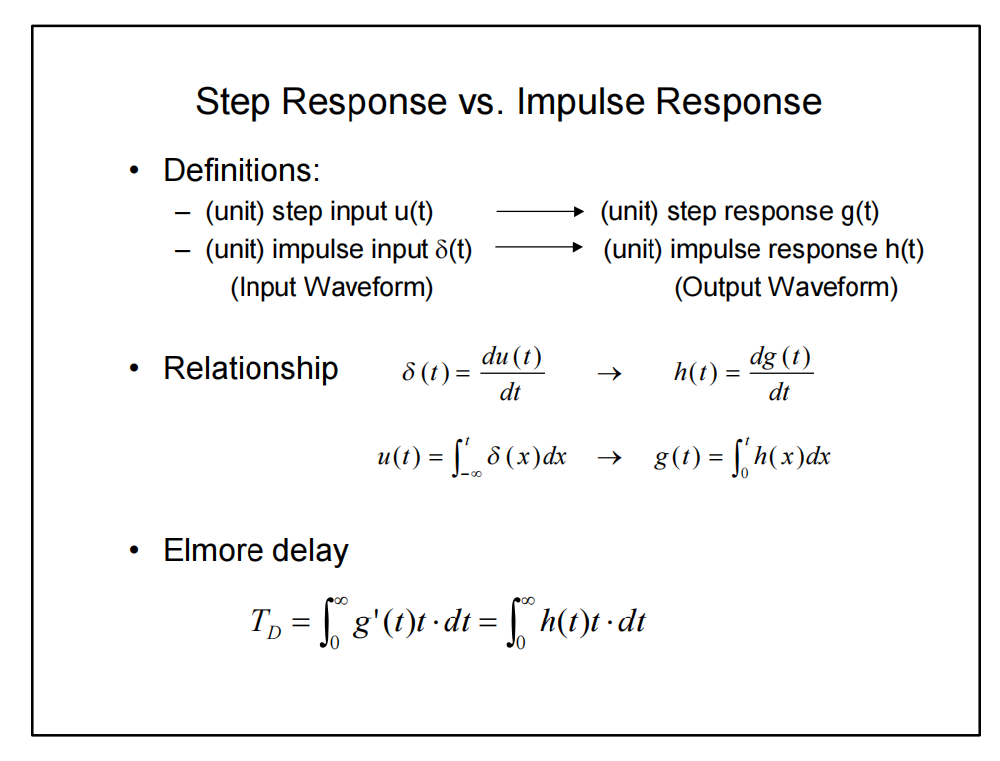

## Effective Switching resistance

> [https://www.eecis.udel.edu/~vsaxena/courses/ece445/s19/Lecture%20Notes/lec15_ece445.pdf](https://www.eecis.udel.edu/~vsaxena/courses/ece445/s19/Lecture%20Notes/lec15_ece445.pdf)



## wire delay

### The Elmore Delay

> Basic idea: use of **mean** of $v'(t)$ to approximate **median** of $v'(t)$

> Elmore delay approximates the **median** of $h(t)$ by the **mean** of $h(t)$

### Distributed RC-Line

### Lumped approximations

#### $rc$-models

If your simulator does not support a distributed $rc$-model, or if the computational complexity of these models slows down your simulation too much, you can construct a simple yet accurate model yourself by approximating the distributed $rc$ by a lumped RC network with a limited number of elements

> The accuracy of the model is determined by the number of stages. For instance, the error of the $\Pi -3$ model is less than 3%, which is generally sufficient.

#### Why use "$\Pi$ Model"

#### examples

## Wire Inductive Effect

- RC delay increases quadratically with length
- LC delay (speed of light flight time) increases linearly with length

> Inductance will only be important to the delay of low-resistance signals such as wide clock lines

### wave

Signal propagates over the wire as a **wave** (rather than **diffusing** as in $rc$ only models)

> Signal propagates by alternately transferring energy from capacitive to inductive modes

## reference

Akio Kitagawa, Analog layout design [https://mixsignal.files.wordpress.com/2013/03/analog-layout.pdf](https://mixsignal.files.wordpress.com/2013/03/analog-layout.pdf)

THE WIRE [http://bwrcs.eecs.berkeley.edu/Classes/icdesign/ee141_f01/Notes/chapter4.pdf](http://bwrcs.eecs.berkeley.edu/Classes/icdesign/ee141_f01/Notes/chapter4.pdf)

Anoop Veliyath, Design Engineer, Cadence Design Systems. Accurately Modeling Transmission Line Behavior with an LC Network-based Approach [[pdf](https://www.pspice.com/sites/default/files/Transmission_Line_Modeling.pdf)]

Mark Horowitz. Lecture 2: Wires and Wire Models [[pdf](https://web.stanford.edu/class/archive/ee/ee371/ee371.1066/lectures/Old/lect_02.pdf)]

Neil Weste and David Harris. 2010. CMOS VLSI Design: A Circuits and Systems Perspective (4th. ed.). Addison-Wesley Publishing Company, USA.

Cheng-Kok Koh. EE695K Modeling and Optimization of High Performance Interconnect [[lec3a_pdf](https://engineering.purdue.edu/~chengkok/ee695K/lec3a.pdf)]

Vishal Saxena. ECE 445 Intro to VLSI Design: Lectures for Spring 2019 [https://www.eecis.udel.edu/~vsaxena/courses/ece445/s19/ECE445.htm](https://www.eecis.udel.edu/~vsaxena/courses/ece445/s19/ECE445.htm)

