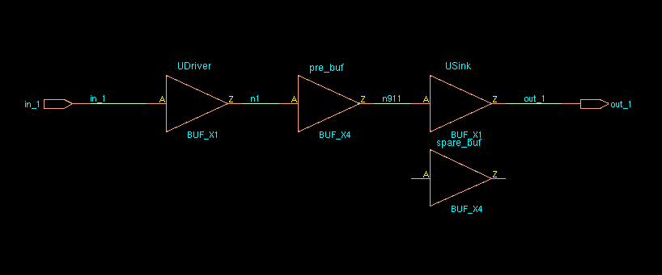
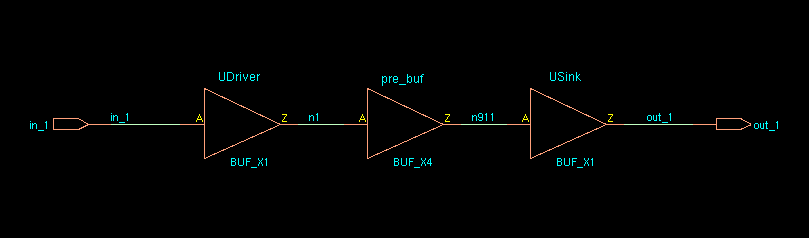
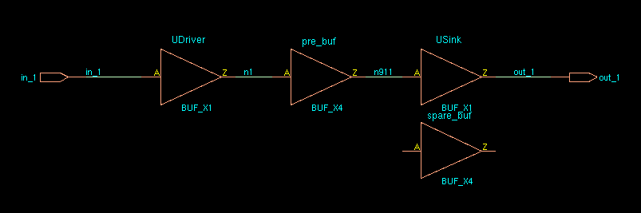
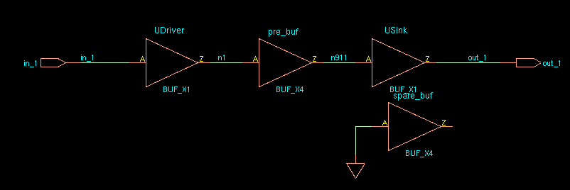

#### How does EDI System identify spare cells in a post-mask ECO flow?

Spare cells should have a unique string in their instance name to identify them. Then the command `specifySpareGate` or `ecoDesign -useSpareCells patternName` is run to identify the spare instances. For example, if all spare cells have \_spare\_ in their name then they are identified using:

```tcl
specifySpareGate -inst *_spare_*
```

OR

```tcl
ecoDesign -spareCells *_spare_* ...
```

**Note**: if you are making **manual ECO** changes to a netlist and converting a spare cell to a logical instance, **it's important to change the instance name**. Otherwise, the instance may be identified as a spare cell if a future ECO is performed because it still has the spare cell instance name.

#### Example

##### The cell to be swapped is unplaced



pre_buf: **unplaced**

spare_buf: **placed**

> innovus 49> dbGet top.insts.name
>
> **spare_buf** **pre_buf** UDriver USink
>
> innovus 50> dbGet top.insts.
>
> **0x7f7b03ef60e0** **0x7f7b03ef6150** 0x7f7b03ef6000 0x7f7b03ef6070

```tcl
specifySpareGate -inst spare_*
ecoSwapSpareCell pre_buf spare_buf
```



> innovus 55> dbGet top.insts.name
>
> **pre_buf** UDriver USink
>
> innovus 56> dbGet top.insts.
>
> **0x7f7b03ef6150** 0x7f7b03ef6000 0x7f7b03ef6070
>
> innovus 57> dbGet top.insts.Pstatus
>
> **placed** fixed fixed

**Note**: sparecell's pointer and name is swapped with the unplaced cell.

##### The cell to be swapped is placed



> innovus 62> dbGet top.insts.name
>
> **spare_buf** **pre_buf** UDriver USink
>
> innovus 63> dbGet top.insts.
>
> **0x7f7b03ef60e0** **0x7f7b03ef6150** 0x7f7b03ef6000 0x7f7b03ef6070
>
> innovus 64> dbGet top.insts.pStatus
>
> **placed** **placed** fixed fixed

```tcl
innovus 66> specifySpareGate -inst spare_*
Specifying instance [spare_buf] as spare gate.
Specified 1 instances as spare gate.
innovus 67> ecoSwapSpareCell pre_buf spare_buf
```



> innovus 68> dbGet top.insts.name
>
> **spare_buf pre_buf** UDriver USink
>
> innovus 69> dbGet top.insts.
>
> **0x7f7b03ef60e0 0x7f7b03ef6150** 0x7f7b03ef6000 0x7f7b03ef6070
>
> innovus 70> dbGet top.insts.pStatus
>
> placed placed fixed fixed

**Note**: sparecell's pointer and name is swapped with the placed cell.


##### Error in "Innovus Text Command Reference 21.12"

**ecoSwapSpareCell**

~~If the cell to be swapped is unplaced, it is mapped to the spare cell. `*instName*` is deleted, and its connection is transferred to the spare cell. If the cell to be swapped is placed, it is swapped with the spare cell and is renamed to `*instNameSuffix*` if the `-suffix` option is used. If a suffix is not specified, the `*instName*` cell is renamed to `*spareCellInstName*`. The `*instName*` cell's connections are transferred to `*spareCellInstName*`. The input of `*instName*` is `tielo`, based on the global connection definition.~~


**reference:**

[Answers to Top 10 Questions on Performing ECOs in EDI System](https://community.cadence.com/cadence_blogs_8/b/di/posts/answers-to-frequently-asked-questions-when-performing-ecos-in-edi-system)

[EE 582: Physical Design Automation of VLSI Circuits and Systems](https://eecs.wsu.edu/~daehyun/teaching/2014_EE582/assignments/a10/a10.html)

