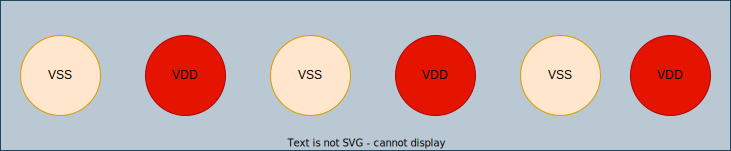
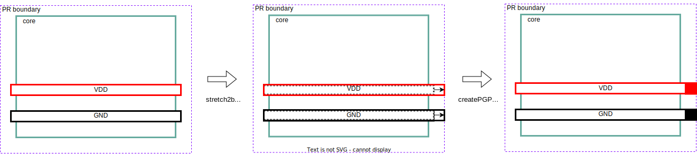
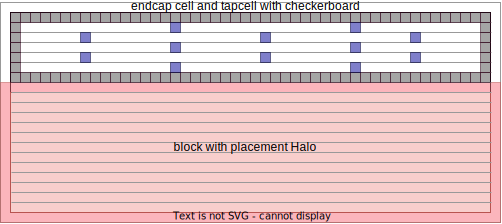
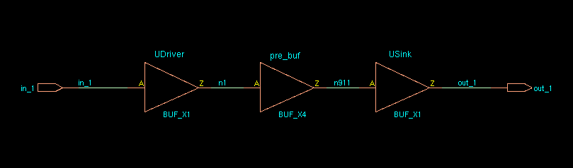
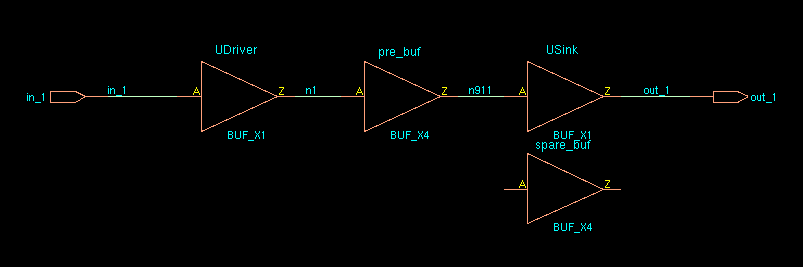
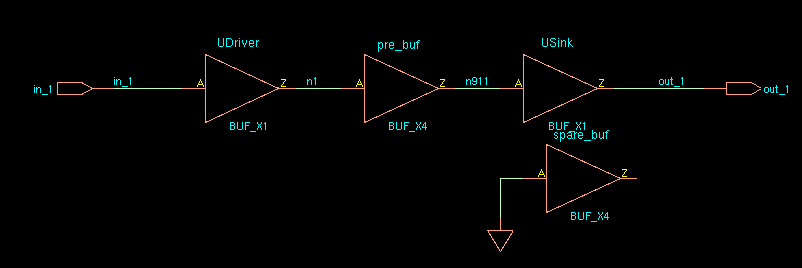

## create & assign bump

### power/ground bump

```tcl
create_bump –cell PAD90UBMBOP –loc_type cell_center –loc $x0 $y  
create_bump –cell PAD90UBMBOP –loc_type cell_center –loc $x1 $y 
...
create_bump –cell PAD90UBMBOP –loc_type cell_center –loc $xn $y 
deselectAll 
select_bump –bum_cell PAD90UBMBOP 
assignPGBumps –nets {vss vdd_dig} -selected –checkboard
```




### signal or power/ground bump

```tcl
set bump_name [create_bump –cell PAD150PITCH –loc $bump_x $bump_y –loc_type cell_center –return_bumps_name] 
# assign power/ground bump
assignPGBumps –bumps $bump_name –nets $pin_name 
# or assign to signal bump
assignSigToBump –bumps $bump_name –net $pin_name 
```


## Path Based Analysis

**aocv** : Re-timing the timing critical paths using the LOCV deratingfactors

**path_slew_propagation** : Re-timing the timing critical paths using the actual slews for thepath

**aocv_path_slew_propagation** : Combination of re-timing with aocv + path_slew_propagation

**waveform_propagation** : Re-timing with waveform effect taken into consideration during delayCal


## Fix DRC Violation

```tcl
clearDrc
set drc_marker_file calibre_drc_markers.err
loadViolationReport -type Calibre -filename $drc_marker_file


foreach marker_id [dbGet -p -e top.markers.userOriginator Calibre] {


editSelect -area [dbget $object.box] -layer M4

dbSet [dbGet -p top.nets.name $net ].wires.status routed

editTrim -selected
```


## check mode variants

```tcl
checkDesign

check_timing

checkPlace


setDesignMode

setFPlanMode

setEcoMode

setPlaceMode

setRouteMode

setExtractRCMode

setOptMode
```


## Common Commands




## Analysis Command




## Clock Concurrent Optimization Technology (CCOpt)




## Database Navigation




## Data Exchange




## Global Skew and Local Skew




## Technology File




## timeDesign vs. report_timing




## Parasitic Extraction




## Floorplan




## Innovus/Tempus Nonfunctional ECO




## Innovus ECO




## block level create Power Ground Pin method

```tcl
editStretch x ...
selectWire ... VDD
selectWire ... GND
createPGPin -selected -onDie
```




## Add endcap and tapcell

First place place hard macro and add placement halo, then execute the following
code to add endcap and tapcell.

```tcl
deleteFill -prefix ENDCAP
deleteFill -prefix WELL

setEndCapMode \
    -leftEdge BOUNDARY_RIGHTBWP16P90CPD \
    -rightEdge BOUNDARY_LEFTBWP16P90CPD \
    -leftBottomCorner BOUNDARY_NCORNERBWP16P90CPD \
    -leftTopCorner BOUNDARY_PCORNERBWP16P90CPD \
    -rightTopEdge FILL3BWP16P90CPD \
    -rightBottomEdge FILL3BWP16P90CPD \
    -topEdge "BOUNDARY_PROW2BWP16P90CPD BOUNDARY_PROW3BWP16P90CPD"
    -bottomEdge "BOUNDARY_NROW2BWP16P90CPD BOUNDARY_NROW3BWP16P90CPD" \
    -boundary_tap true

set_well_tap_mode \
    -rule 33
    -bottom_tap_cell BOUNDARY_NTAPBWP16P90CPD \
    -top_tap_cell BOUNDARY_PTAPBWP16P90CPD \
    -cell TAPCELLBWP16P90CPD

addEndCap
addWellTap -checkerBoard -cell TAPCELLBWP16P90CPD -cellInterval 160
```



First place place hard macro and add placement halo, then execute the following
code to add endcap and tapcell.

```tcl
deleteFill -prefix ENDCAP
deleteFill -prefix WELL

setEndCapMode \
    -leftEdge BOUNDARY_RIGHTBWP16P90CPD \
    -rightEdge BOUNDARY_LEFTBWP16P90CPD \
    -leftBottomCorner BOUNDARY_NCORNERBWP16P90CPD \
    -leftTopCorner BOUNDARY_PCORNERBWP16P90CPD \
    -rightTopEdge FILL3BWP16P90CPD \
    -rightBottomEdge FILL3BWP16P90CPD \
    -topEdge "BOUNDARY_PROW2BWP16P90CPD BOUNDARY_PROW3BWP16P90CPD"
    -bottomEdge "BOUNDARY_NROW2BWP16P90CPD BOUNDARY_NROW3BWP16P90CPD" \
    -boundary_tap true

set_well_tap_mode \
    -rule 33
    -bottom_tap_cell BOUNDARY_NTAPBWP16P90CPD \
    -top_tap_cell BOUNDARY_PTAPBWP16P90CPD \
    -cell TAPCELLBWP16P90CPD

addEndCap
addWellTap -checkerBoard -cell TAPCELLBWP16P90CPD -cellInterval 160
```


> [[https://github.com/StanfordAHA/PowerDomainDesign/blob/c280a35f01ad0617ff054b925c1d5c2652a0f4e1/scripts/layout_pe_tile_new.power.tcl#L94-L113](https://github.com/StanfordAHA/PowerDomainDesign/blob/c280a35f01ad0617ff054b925c1d5c2652a0f4e1/scripts/layout_pe_tile_new.power.tcl#L94-L113)]


## In-design Sign-off Metal Fill Flow

Before inserting sign-off metal fill, stream out a GDSII stream file of the current database. Specify the mapping file and units that match with the rule deck you specify while inserting metal fill. If necessary, include the detailed-cell (`-merge` option) Graphic Database System (GDS).

**PVS:**

```tcl
streamOut -merge $GDSFile -mode ALL -units $GDSUNITS -mapFile $GDSMAP -outputMacros pvs.fill.gds
run_pvs_metal_fill -ruleFile $DUMMYRULE -defMapFile $DEFMAP -gdsFile pvs.fill.gds -cell [dbgDesignName]
```

**Pegasus:**
```tcl
streamOut -merge $GDSFile -mode ALL -units $GDSUNITS -mapFile $GDSMAP -outputMacros pegasus.fill.gds
run_pegasus_metal_fill -ruleFile $DUMMYRULE -defMapFile $DEFMAP -gdsFile pegasus.fill.gds -cell [dbgDesignName]
```

> Just replace `run_pvs_metal_fill` with `run_pegasus_metal_fill`

**Note**: Innovus metal fill (e.g. `addMetalFill`, `addViaFill`, etc.) does not support 20nm and below node design rules. We strongly  recommend the Pegasus/PVS metal fill solution for 20nm and below. If you have sign-off metal fill rule deck for 28nm and above available, we recommend you to move to Pegasus/PVS solution too.

> 1. `trimMetalFillNearNet` does not check DRC rules. It only removes the metal fill with specified spacing
>
> 2. **Do not** perform ECO operations after dump in sign-off metal fill (by `run_pvs_metal_fill` or `run_pegasus_metal_fill`), especially, at 20nm and below nodes. 
>
> 3. If you perform an ECO action, the tool cannot get DRC clean because `trimMetalFill` does not support 20nm and below node design rules.
> 4. The sign-off metal fill typically does not cause DRC issues with regular wires. 


The `run_pvs_metal_fill` command does the following:

- Runs PVS with the fill rules to create a GDSII output file.
- Converts the GDSII to a DEF format file based on the GDSII to DEF layermap provided.
- **Loads the resulting DEF file into Innovus**.

Pegasus is similar to  PVS, shown as below,

The `run_pegasus_metal_fill` command does the following:

- Runs Pegasus with the fill rules to create a GDSII output file.
- Converts the GDSII to a DEF format file based on the GDSII to DEF layermap provided.
- Loads the resulting DEF file into Innovus.

**Reference:**

Innovus User Guide, Product Version 21.12, Last Updated in November 2021


## How does EDI System identify spare cells in a post-mask ECO flow?

### How does EDI System identify spare cells in a post-mask ECO flow?

Spare cells should have a unique string in their instance name to identify them. Then the command `specifySpareGate` or `ecoDesign -useSpareCells patternName` is run to identify the spare instances. For example, if all spare cells have \_spare\_ in their name then they are identified using:

```tcl
specifySpareGate -inst *_spare_*
```

OR

```tcl
ecoDesign -spareCells *_spare_* ...
```

**Note**: if you are making **manual ECO** changes to a netlist and converting a spare cell to a logical instance, **it's important to change the instance name**. Otherwise, the instance may be identified as a spare cell if a future ECO is performed because it still has the spare cell instance name.

### Example

#### The cell to be swapped is unplaced


pre_buf: **unplaced**

spare_buf: **placed**

> innovus 49> dbGet top.insts.name
>
> **spare_buf** **pre_buf** UDriver USink
>
> innovus 50> dbGet top.insts.
>
> **0x7f7b03ef60e0** **0x7f7b03ef6150** 0x7f7b03ef6000 0x7f7b03ef6070

```tcl
specifySpareGate -inst spare_*
ecoSwapSpareCell pre_buf spare_buf
```



> innovus 55> dbGet top.insts.name
>
> **pre_buf** UDriver USink
>
> innovus 56> dbGet top.insts.
>
> **0x7f7b03ef6150** 0x7f7b03ef6000 0x7f7b03ef6070
>
> innovus 57> dbGet top.insts.Pstatus
>
> **placed** fixed fixed

**Note**: sparecell's pointer and name is swapped with the unplaced cell.

#### The cell to be swapped is placed



> innovus 62> dbGet top.insts.name
>
> **spare_buf** **pre_buf** UDriver USink
>
> innovus 63> dbGet top.insts.
>
> **0x7f7b03ef60e0** **0x7f7b03ef6150** 0x7f7b03ef6000 0x7f7b03ef6070
>
> innovus 64> dbGet top.insts.pStatus
>
> **placed** **placed** fixed fixed

```tcl
innovus 66> specifySpareGate -inst spare_*
Specifying instance [spare_buf] as spare gate.
Specified 1 instances as spare gate.
innovus 67> ecoSwapSpareCell pre_buf spare_buf
```



> innovus 68> dbGet top.insts.name
>
> **spare_buf pre_buf** UDriver USink
>
> innovus 69> dbGet top.insts.
>
> **0x7f7b03ef60e0 0x7f7b03ef6150** 0x7f7b03ef6000 0x7f7b03ef6070
>
> innovus 70> dbGet top.insts.pStatus
>
> placed placed fixed fixed

**Note**: sparecell's pointer and name is swapped with the placed cell.


#### Error in "Innovus Text Command Reference 21.12"

**ecoSwapSpareCell**

~~If the cell to be swapped is unplaced, it is mapped to the spare cell. `*instName*` is deleted, and its connection is transferred to the spare cell. If the cell to be swapped is placed, it is swapped with the spare cell and is renamed to `*instNameSuffix*` if the `-suffix` option is used. If a suffix is not specified, the `*instName*` cell is renamed to `*spareCellInstName*`. The `*instName*` cell's connections are transferred to `*spareCellInstName*`. The input of `*instName*` is `tielo`, based on the global connection definition.~~


#### reference

[Answers to Top 10 Questions on Performing ECOs in EDI System](https://community.cadence.com/cadence_blogs_8/b/di/posts/answers-to-frequently-asked-questions-when-performing-ecos-in-edi-system)

[EE 582: Physical Design Automation of VLSI Circuits and Systems](https://eecs.wsu.edu/~daehyun/teaching/2014_EE582/assignments/a10/a10.html)

