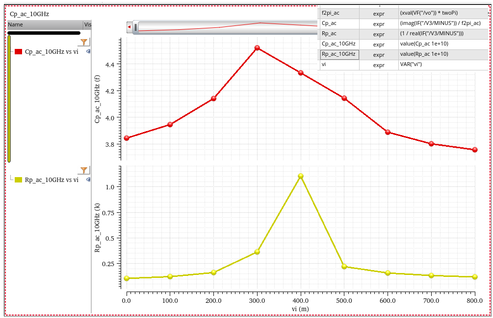

---

## MOS capacitances

- **oxide capacitance** (aka **gate-channel capacitance**) between the *gate* and the *channel* $C_1=WLC_{ox}$
  - divided between $C_{GS}$ and $C_{GD}$
- **depletion capacitance** between the *channel* and the *substrate* $C_2$
- **overlap capacitance**: direct overlap and fringing field
- **junction capacitance** between the *source/drain* areas and the *substrate*
  - The value of $C_{SB}$ and $C_{DB}$ is a function of the source and drain voltages with respect to the substrate

> The **gate-bulk capacitance** is usually neglected in the triode and saturation regions because the inversion layer acts as a "shield" between the gate and the bulk.

---

classification with **Intrinsic** and **Extrinsic** MOS capacitor

[[Circuit Insights - 11-CI: Fundamentals 4 Tsinghua Nan Sun](https://youtu.be/sAQqkdpvsZA?si=oTnYVNmPY7yMhBPt)]

> 

## FinFET Parasitic Fringing Capacitance

## Temperature Dependence of Junction Diode CV

where *TCJ* and *TCJSW* are positive

> https://cmosedu.com/cmos1/BSIM4_manual.pdf
>
> 
>
> 
>
> 

## varactor

### D=S=B varactor

###  Inversion-mode (I-MOS)

---

### Accumulation-mode (A-MOS)

> NMOS in NWELL, aka **NMOS in N-Well varactor**
>
> **Notice: S/D and NWELL are connected togethor** in layout

### PDK varactor

> nmoscap: NMOS in **N-Well** varactor

> - Base Band MOSCAP model (nmoscap) is built without effective series resistance (ESR) and effective series inductance (ESL) calibrations, which is for capacitance simulation only
> - LC-Tank MOSCAP model (moscap_rf) is for frequency-dependent Q factor and capacitance simulations

## MOS Device as Capacitor

---

## Voltage dependence

- capacitance of MOS gate varies **nonmonotonically** with $V_{GS}$

- "accumulation-mode" varactor varies **monotonically** with $V_{GS}$

## capacitance simulation

### VCO varactor

> Two methods: 1. pss + pac; 2. pss+psp

#### PSS + PAC

pss time domain

using the **0-harmonic**

#### PSS + PSP

using **Y11** of `psp`

#### comparison

> which are same

### inverter input

R-C, ***series*** equivalent circuit

### inverter output

R-C, ***parallel*** equivalent circuit

---

#### AC simulation

@vi = 0

sweep vi from 0 to 800mV (vdd)

---

#### SP simulation

> EEStream. Cadence - How to find device capacitance - DC simulation, SP simulation and Large-signal SP simulation [[https://www.youtube.com/watch?v=M3zP6eJnONk](https://www.youtube.com/watch?v=M3zP6eJnONk)]
>
> 

## reference

Aditya Varma Muppala. MOS Varactors | Oscillators 15 | MMIC 27 [[https://youtu.be/LYCLZPQvIz0?si=yoSBZSD2j_wEx0zZ](https://youtu.be/LYCLZPQvIz0?si=yoSBZSD2j_wEx0zZ)]

R. L. Bunch and S. Raman, "Large-signal analysis of MOS varactors in CMOS -G/sub m/ LC VCOs," in IEEE Journal of Solid-State Circuits, vol. 38, no. 8, pp. 1325-1332, Aug. 2003, doi: 10.1109/JSSC.2003.814416.

T. Soorapanth, C. P. Yue, D. K. Shaeffer, T. I. Lee and S. S. Wong, "Analysis and optimization of accumulation-mode varactor for RF ICs," 1998 Symposium on VLSI Circuits. Digest of Technical Papers (Cat. No.98CH36215), 1998, pp. 32-33, doi: 10.1109/VLSIC.1998.687993. URL: [http://www-smirc.stanford.edu/papers/VLSI98s-chet.pdf](http://www-smirc.stanford.edu/papers/VLSI98s-chet.pdf)

R. Jacob Baker, 6.1 MOSFET Capacitance Overview/Review, CMOS Circuit Design, Layout, and Simulation, Fourth Edition

B. Razavi, Design of Analog CMOS Integrated Circuits 2nd

Bing Sheu, TSMC. "Circuit Design using FinFETs" [[https://www.nishanchettri.com/isscc-slides/2013%20ISSCC/TUTORIALS/ISSCC2013Visuals-T4.pdf](https://www.nishanchettri.com/isscc-slides/2013%20ISSCC/TUTORIALS/ISSCC2013Visuals-T4.pdf)]

