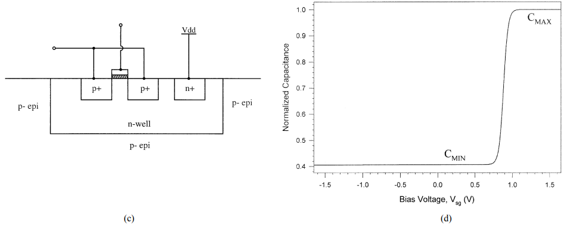
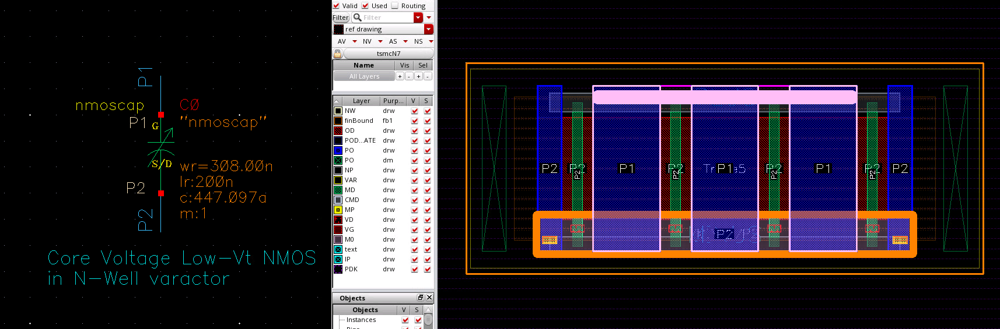

### D=S=B varactors

---

###  Inversion-mode (I-MOS)

---

### Accumulation-mode (A-MOS)

#### industrial varactor

> NMOS in **N-Well** varactor

### reference

R. L. Bunch and S. Raman, "Large-signal analysis of MOS varactors in CMOS -G/sub m/ LC VCOs," in IEEE Journal of Solid-State Circuits, vol. 38, no. 8, pp. 1325-1332, Aug. 2003, doi: 10.1109/JSSC.2003.814416.

T. Soorapanth, C. P. Yue, D. K. Shaeffer, T. I. Lee and S. S. Wong, "Analysis and optimization of accumulation-mode varactor for RF ICs," 1998 Symposium on VLSI Circuits. Digest of Technical Papers (Cat. No.98CH36215), 1998, pp. 32-33, doi: 10.1109/VLSIC.1998.687993. URL: [http://www-smirc.stanford.edu/papers/VLSI98s-chet.pdf](http://www-smirc.stanford.edu/papers/VLSI98s-chet.pdf)

R. Jacob Baker, 6.1 MOSFET Capacitance Overview/Review, CMOS Circuit Design, Layout, and Simulation, Fourth Edition
