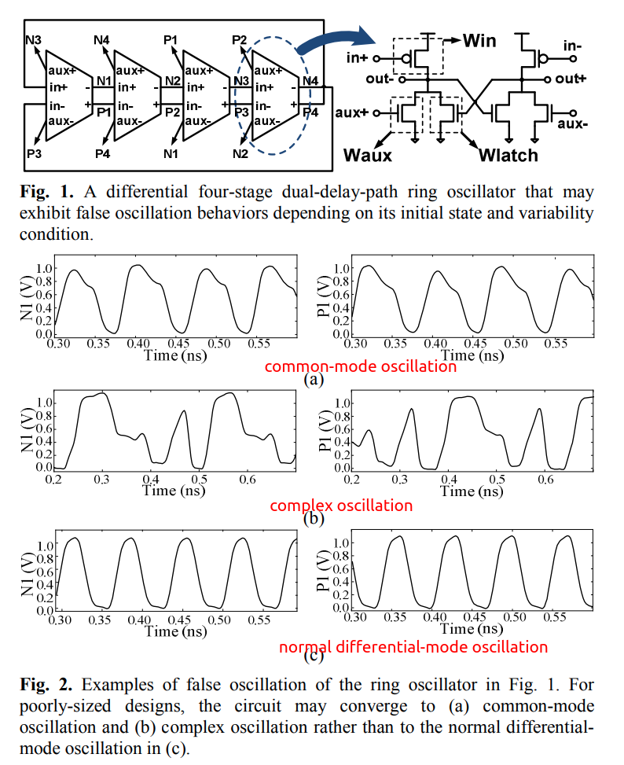

> A problem associated with the design of MPROs is the existence of different possible modes of oscillation. Each of these modes is characterized by a different frequency, phase shift and phase noise.
>


#### Linear delay-stage model (mode gain)

**mode gain** is based on the linear model, independent of process but depends on coupling structure (coupling configuration, size ratio).

The inverting buffer modeled as a linear transconductor. The input-output relationship of a single buffer scaled by $h_i$ and driving the input capacitance of a similar buffer can be expressed as
$$\begin{align}
h_ig_mv_{in}(t) + h_ig_oV_{out}(t)+h_iC_g\frac {dV_{out}(t)}{dt} &= 0 \\
a_nV_{in}(t)+V_{out}(t)+\tau \frac {V_{out}(t)}{dt} &= 0
\end{align}$$
where $g_m$ is the transconductance, $g_o$ is the output conductance, $C_g$ is the buffer input capacitance which also acts as the load capacitance for the driving
buffer, and $a_n = \frac {g_m}{g_o}$ is the **linear dc gain** of the buffer, and $\tau=\frac {C_g}{g_o}$ is a time constant.

Similarly, $V_1$, the output of the first stage in MPRO can be expressed
$$
\sum_{i=1}^{N}h_ig_mV_i(t)+\sum_{i=1}^{N}h_ig_oV_i(t)+\sum_{i=1}^{N}h_iC_g\frac {dV_it(t)}{dt} = 0
$$
Defining the fractional sizing factors and the total sizing factor as $x_i=\frac{h_i}{H}$ and $H=\sum_{i=1}^{N}h_i$
$$
a_n\sum_{i=1}^{N}x_iV_i(t) + V_1(t)+\tau\frac {dV_i(t)}{dt} = 0
$$
where $a_n = \frac {g_m}{g_o}$ and $\tau=\frac {C_g}{g_o}$ are same dc gain and time constant defined previously

Since the total phase shift around the loop should be multiples of $2\pi$, the oscillation waveform at the *i*th node can be expressed as
$$
V_i(t) = V_o \cos(\omega_nt-\Delta \varphi \cdot i)
$$
where $\omega_n$ is the oscillation frequency and $\Delta \varphi = \frac {2\pi n}{N}$, $N$ is the number of stages in the oscillator and $n$ can take values between $0$ and $N-1$

Plug $V_i(t)$ into differential equation, we get
$$
a_n\sum_{i=1}^{N}x_i\cos(\omega_n t-\frac{2\pi n}{N}i)+\cos(\omega_n t-\frac{2\pi n}{N}) - \omega_n \tau \sin(\omega_n t-\frac{2\pi n}{N}) = 0
$$
By equating the $cos(\omega_n t)$ and $sin(\omega_n t)$ terms of the above equation, we get expressions for **the oscillation frequency of the *n*th mode** and **the minimum dc gain required for this mode to exist**. we refer to this gain as the **mode gain**
$$\begin{align}
\omega_n\tau &= \frac {\sum_{i=1}^{N}x_i \cdot \sin(\frac{2\pi n}{N}(i-1))}{-\sum_{i=1}^{N}x_i \cdot \cos(\frac{2\pi n}{N}(i-1))} \\
a_n &= \frac {1}{-\sum_{i=1}^{N}x_i \cdot \cos(\frac{2\pi n}{N}(i-1))}
\end{align}$$
where $a_n$ should be greater than $0$ for a existent mode

In practice, the oscillator starts first from a linear mode of operation where all the buffers are indeed acting as linear transconductors. All oscillation modes that have mode gains $a_n$ lower than the actual dc gain of the inverter $a_o$ start to grow. As the oscillation amplitude grows, the effective gain of the inverter drops due to nonlinearity. Consequently, *modes with higher mode gain die out and only the mode that requires the minimum gain continues to oscillate and hence is the dominant mode*

A. A. Hafez and C. K. Yang, "Design and Optimization of Multipath Ring Oscillators," in IEEE Transactions on Circuits and Systems I: Regular Papers, vol. 58, no. 10, pp. 2332-2345, Oct. 2011, doi: 10.1109/TCSI.2011.2142810.

#### Simulation-based approach

**GCHECK** is an automated verification tool that validate whether a ring oscillator always converges to the desired mode of operation regardless of **the initial conditions** and **variability conditions**. This is the first tool ever reported to address the global convergence failures in presence of variability. It has been shown that the tool can successfully validate a number of coupled ring oscillator circuits with various global convergence failure modes (e.g. no oscillation, false oscillation, and even chaotic oscillation) with reasonable computational costs such as running 1000-point Monte-Carlo simulations for 7~60 initial conditions (maximum 4 hours).

- The verification is performed using a **predictive global optimization algorithm** that looks for a problematic initial state from a discretized state space
- despite the **finite number of initial state candidates** considered and **finite number of Monte-Carlo samples** to model variability, the proposed algorithm can verify the oscillator to a prescribed confidence level



> - The observation that the responses of a circuit with nearby initial conditions are strongly correlated with respect to common variability conditions enables us to explore a **discretized version** of the initial condition space instead of the continuous one.
> - the settling time increases as the initial state gets farther away from the equilibrium state allowed us to use the settling time as a guidance metric to find a problematic initial condition.


**Selecting the Next Initial Condition Candidate to Evaluate**

To determine whether the algorithm should continue or terminate the search for a new maximum, the algorithm estimates the probability of finding a new **initial condition with the longer settling time**, based on the information obtained with the previously-evaluated initial conditions.


**GCHECK EXAMPLE**

```bash
python gcheck_osc.py input.scs
```

output log:

```
Step 1/4: Simulating the setting-time distribution with the reference initial condition
...
Step 2/4: Simulating the setting-time distribution for randomly-selected initial probes
...
Step 3/4: Searching for Problematic Initial Conditions
...
Step 4/4: Reporting Verification Results and Statistics
...
```


T. Kim, D. -G. Song, S. Youn, J. Park, H. Park and J. Kim, "Verifying start-up failures in coupled ring oscillators in presence of variability using predictive global optimization," 2013 IEEE/ACM International Conference on Computer-Aided Design (ICCAD), 2013, pp. 486-493, doi: 10.1109/ICCAD.2013.6691161.

[GCHECK: Global Convergence Checker for Oscillators](https://mics.snu.ac.kr/wiki/GCHECK)
