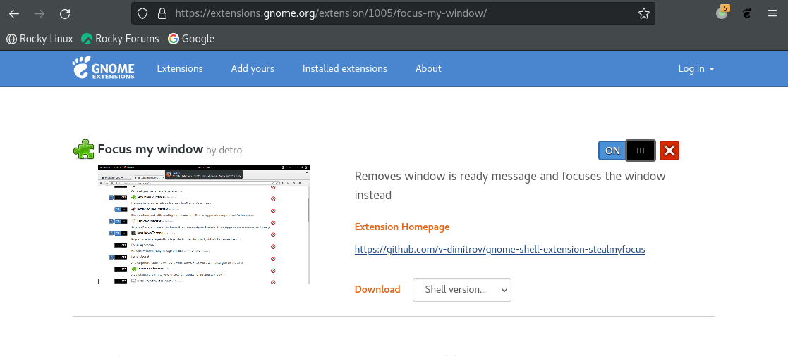

Using **Red Hat Enterprise Linux 8**, **Rocky Linux 8** and the **GNOME 3** window manager, the new Virtuoso Schematic/Layout/ADE windows and forms sometimes pop up under or below the **Library Manager** or on the desktop in the background instead of the foreground and cannot be seen. Sometimes, they are iconized; they do not come on the top in front, though it is the most recent window opened.

**solution**

>  Install **Focus my window** GNOME Shell extension

**reference**

Article (11612426) Title: New windows and forms appear behind the Library Manager in background or iconized instead of foreground on RHEL and SuSE Linux in GNOME, KDE Desktop, Metacity window manager
URL: [https://support.cadence.com/apex/ArticleAttachmentPortal?id=a1Od0000000nSXCEA2](https://support.cadence.com/apex/ArticleAttachmentPortal?id=a1Od0000000nSXCEA2)
