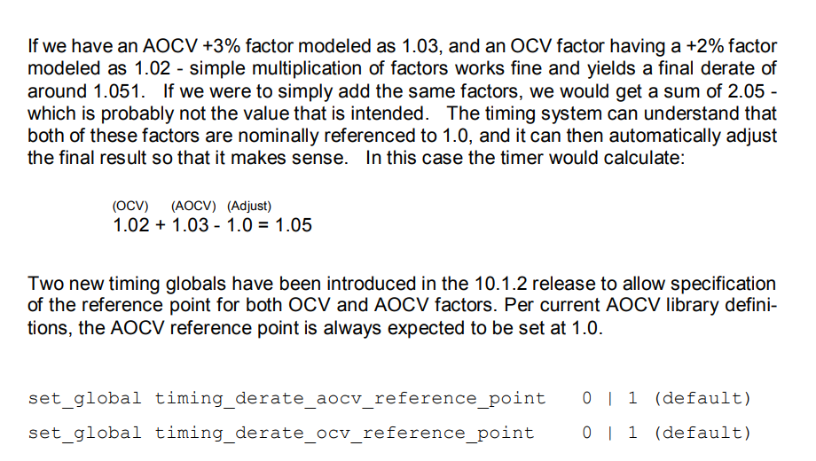

**timing_aocv_derate_mode**

```
timing_aocv_derate_mode{aocv_multiplicative | aocv_additive}
```

*Default:* `aocv_multiplicative`

Controls the AOCV derating mode.

When set to `aocv_multiplicative`, the derating factor will be calculated as AOCV derating * OCV derating, which is set using the `set_timing_derate` command.

When set to `aocv_additive`, the derating factor will be calculated as AOCV derating + OCV derating values.

When you use this global variable, the `report_timing` command shows the `total_derate` column in the timing report output, which allows you to view and cross-check the calculated total derate factor.

To set this global variable, use the `set_global` command.



### reference

Genus Attribute Reference 22.1

Innovus Text Command Reference 22.10

Article (20416394) Title: Analysis with Advanced On-chip Variation (AOCV) derating in EDI system and ETS
URL: https://support.cadence.com/apex/ArticleAttachmentPortal?id=a1Od000000050NxEAI
