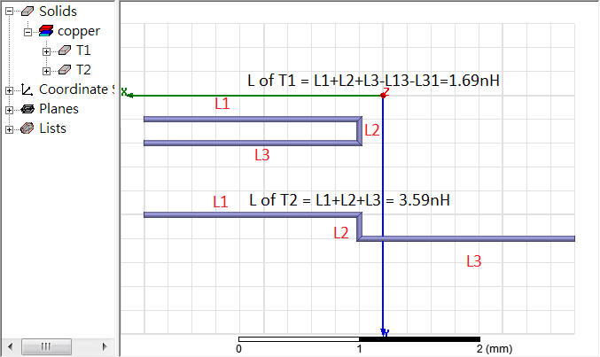

**Loop Inductance** is the sum of **partial self-inductance** and **partial-mutual inductance**

---

## Magnetic Vector Potential (磁矢势)

> Youjin Deng. 5-3 静磁场的基本规律 [[http://staff.ustc.edu.cn/~yjdeng/EM2022/pdf/5-2(2022).pdf](http://staff.ustc.edu.cn/~yjdeng/EM2022/pdf/5-2(2022).pdf)]

磁场不能用标量势描述

> 
>

---

## Partial Inductance

### self partial inductance

### mutual partial inductance

### Ex. two-wire

---

> [[https://www.oldfriend.url.tw/Q3D/ansys_ch_Partial_Loop_Inductance.html](https://www.oldfriend.url.tw/Q3D/ansys_ch_Partial_Loop_Inductance.html)]

##   Current Return Path

Current return paths are frequency dependent $Z = R +j\omega L$

- Low frequency
  - $R$ dominates - current use as many returns as possible to have parallel resistances
- High frequency
  - $j\omega L$​ dominates - current use the *closest possible return path* to form *the smallest possible loop inductance*
- Very high frequency
  - The current would be confined to the *nearest* possible return only at ultra-high frequencies (skin effect)
  

---

**skin effect** & **Dielectric loss**

---

***EMX simulation***

**setup:**

**frequency sweep:**

> Cadence October 2020, *Analysis of a Figure-Eight Inductor with EMX RAK*
>
> 

## proximity effect & skin effect 

- *Skin effect* concentrates current near the ***surface*** of a single conductor, while *proximity effect* concentrates current in ***specific regions*** of multiple conductors due to their interaction
- *Skin effect* is caused by the conductor's ***own*** magnetic field, while proximity effect is caused by the magnetic field of a ***nearby*** conductor

---

***proximity effect*** is a *redistribution of electric current* occurring in ***nearby parallel electrical conductors*** carrying *alternating current (AC)*, caused by ***magnetic effects*** (eddy currents)

---

***skin effect*** is the tendency of ***AC current*** flow near the surface (or "skin") of a conductor, rather than throughout its cross-section, due to the ***magnetic field generated by the current itself***

> ***Cause of skin effect***
>
> A main current $I$ flowing through a conductor induces a magnetic field $H$. If the current increases, as in this figure, the resulting increase in $H$ induces separate, circulating ***eddy currents*** $I_W$ which partially cancel the current flow in the center and reinforce it near the skin

---

***Eddy current***

By [Lenz's law](https://en.wikipedia.org/wiki/Lenz's_law), an eddy current creates a magnetic field that ***opposes*** the change in the magnetic field that created it, and thus eddy currents ***react back*** on the source of the magnetic field

## Electromagnetic coupling

**Electric field coupling** (also called **capacitive coupling**) occurs when energy is coupled from one circuit to another through an **electric field**

**Magnetic field coupling** (also called **inductive coupling**) occurs when energy is coupled from one circuit to another through a **magnetic field**

---

For instance

- magnetic coupling between multiple inductors
- capacitive coupling between multiple transmission lines

## Grounding

*TODO* &#128197;

> Chapter 11 Layout and grounding [[http://ieb-srv1.upc.es/gieb/tecniques/doc/EMC/pdfs/ScienceDirect_articles_27Jul2018_12-16-10.699/Chapter-11---Layout-and-grounding_2007_EMC-for-Product-Designers.pdf](http://ieb-srv1.upc.es/gieb/tecniques/doc/EMC/pdfs/ScienceDirect_articles_27Jul2018_12-16-10.699/Chapter-11---Layout-and-grounding_2007_EMC-for-Product-Designers.pdf)]

## Decoupling Capacitor

## RLC network

> [[https://web.stanford.edu/class/archive/ee/ee371/ee371.1066/handouts/markChapt.pdf](https://web.stanford.edu/class/archive/ee/ee371/ee371.1066/handouts/markChapt.pdf)]

## Transformer

任何封闭电路中感应电动势大小，等于穿过这一电路磁通量的变化率。
$$
\epsilon = -\frac{d\Phi_B}{dt}
$$
其中 $\epsilon$是电动势，单位为伏特

$\Phi_B$是通过电路的磁通量，单位为韦伯

电动势的方向（公式中的负号）由楞次定律决定

> **楞次定律**: 由于磁通量的改变而产生的感应电流，其方向为抗拒磁通量改变的方向。

> 在回路中产生感应电动势的原因是由于通过回路平面的磁通量的**变化**，而不是磁通量本身，即使通过回路的磁通量很大，但只要它不随时间变化，回路中依然不会产生感应电动势。

### 自感电动势

当电流$I$随时间变化时，在线圈中产生的自感电动势为
$$
\epsilon = -L\frac{dI}{dt}
$$

---

> **同名端**：当两个*电流*分别从两个线圈的对应端子流入 ，其所 产生的磁场相互加强时，则这两个对应端子称为同名端。

## reference

ISSCC2002. Special Topic Evening Discussion Sessions SE1: Inductance: Implications and Solutions for High-Speed Digital Circuits
[[vSE1_Blaauw](https://engineering.purdue.edu/oxidemems/conferences/isscc2002/DATA/vSE1_Blaauw.pdf)], [[vSE1_Gauthier](https://engineering.purdue.edu/oxidemems/conferences/isscc2002/DATA/vSE1_Gauthier.pdf)], [[vSE1_Morton](https://engineering.purdue.edu/oxidemems/conferences/isscc2002/DATA/vSE1_Morton.pdf), [[vSE1_Restle](https://engineering.purdue.edu/oxidemems/conferences/isscc2002/DATA/vSE1_Restle/01.html)]]

Y. Massoud and Y. Ismail, "Gasping the impact of on-chip inductance," in IEEE Circuits and Devices Magazine, vol. 17, no. 4, pp. 14-21, July 2001 [[https://sci-hub.se/10.1109/101.950046](https://sci-hub.se/10.1109/101.950046)]

Clayton R. Paul, Partial Inductance [[https://ewh.ieee.org/soc/emcs/acstrial/newsletters/summer10/PP_PartialInductance.pdf](https://ewh.ieee.org/soc/emcs/acstrial/newsletters/summer10/PP_PartialInductance.pdf)]

Cheung-Wei Lam. Common Misconceptions about Inductance & Current Return Path [[https://ewh.ieee.org/r6/scv/emc/archive/022010Lam.pdf](https://ewh.ieee.org/r6/scv/emc/archive/022010Lam.pdf)]

Randy Wolff. Signal Loop Inductance in [Pin] and [Package Model] [[https://ibis.org/summits/feb10/wolff.pdf](https://ibis.org/summits/feb10/wolff.pdf)]

ANSYS Q3D Getting Started LE05. Module 5: Q3D Inductance Matrix Reduction [[https://innovationspace.ansys.com/courses/wp-content/uploads/sites/5/2021/07/Q3D_GS_2020R1_EN_LE05_Ind_Matrix.pdf](https://innovationspace.ansys.com/courses/wp-content/uploads/sites/5/2021/07/Q3D_GS_2020R1_EN_LE05_Ind_Matrix.pdf)]

---

Paul, Clayton R. *Inductance: Loop and Partial*. Hoboken, N.J. : [Piscataway, N.J.]: Wiley ; IEEE, 2010.

Spartaco Caniggia. Signal Integrity and Radiated Emission of High‐Speed Digital Systems. Wiley 2008

Yuriy Shlepnev. How Interconnects Work: Characteristic Impedance and Reflections [[https://www.linkedin.com/pulse/how-interconnects-work-characteristic-impedance-yuriy-shlepnev/](https://www.linkedin.com/pulse/how-interconnects-work-characteristic-impedance-yuriy-shlepnev/)]

-. How Interconnects Work: Bandwidth for Modeling and Measurements [[https://www.linkedin.com/pulse/how-interconnects-work-bandwidth-modeling-yuriy-shlepnev/?trackingId=874kpm3XuNyV9D0eP6IioA%3D%3D](https://www.linkedin.com/pulse/how-interconnects-work-bandwidth-modeling-yuriy-shlepnev/?trackingId=874kpm3XuNyV9D0eP6IioA%3D%3D)]

Eric Bogatin. Pop Quiz: When is an Interconnect Not a Transmission Line?  [[https://www.signalintegrityjournal.com/blogs/4-eric-bogatin-signal-integrity-journal-technical-editor/post/265-pop-quiz-when-is-an-interconnect-not-a-transmission-line](https://www.signalintegrityjournal.com/blogs/4-eric-bogatin-signal-integrity-journal-technical-editor/post/265-pop-quiz-when-is-an-interconnect-not-a-transmission-line)]

TeledyneLeCroy/SignalIntegrity Python tools for signal integrity applications [[SignalIntegrityApp](https://github.com/TeledyneLeCroy/SignalIntegrity)]

A Look at Transmission-Line Losses [[http://blog.teledynelecroy.com/2018/06/a-look-at-transmission-line-losses.html](http://blog.teledynelecroy.com/2018/06/a-look-at-transmission-line-losses.html)]

How Much Transmission-Line Loss is Too Much? [[http://blog.teledynelecroy.com/2018/06/how-much-transmission-line-loss-is-too.html](http://blog.teledynelecroy.com/2018/06/how-much-transmission-line-loss-is-too.html)]

Raymond Y. Chen, Raymond Y. Chen. Fundamentals of S Fundamentals of S-Parameter Parameter Modeling for Power Distribution Modeling for Power Distribution System (PDS) and SSO Analysis System (PDS) and SSO Analysis [[https://ibis.org/summits/jun05/chen.pdf](https://ibis.org/summits/jun05/chen.pdf)]

