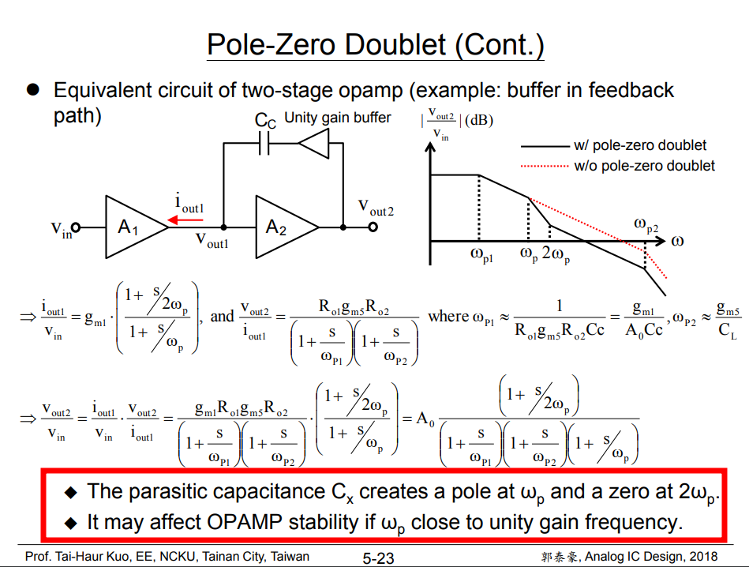

Mismatch between the pole and zero frequencies leads to the **“doublet problem”**. If the pole and the zero do not exactly coincide, we say that they constitute a **doublet**

> Problem 10.19 in Razavi 2nd book

Suppose the open-loop transfer function of a two-stage op amp is expressed as
$$
H_{open}(s)=\frac{A_0(1+\frac{s}{\omega_z})}{\left( 1+ \frac{s}{\omega_{p1}}\right)\left( 1+ \frac{s}{\omega_{p2}}\right)}
$$
deally, $\omega_z=\omega_2$ and the feedback circuit exhibits a first-order behavior, i.e., its step response contains a single time constant and no overshoot.

Then the transfer function of the amplifier in a *unity-gain feedback loop* is given by
$$\begin{align}
H_{closed}(s) &=\frac{A_0\left(1+\frac{s}{\omega_z}\right)}{\frac{s^2}{\omega_{p1}\omega_{p2}}+\left( \frac{1}{\omega_{p1}} + \frac{1}{\omega_{p2}}+\frac{A_0}{\omega_{z}}\right)s+A_0+1} \\
&=\frac{\frac{A_0}{A_0+1}(1+\frac{s}{\omega_z})}{\frac{s^2}{\omega_{p1}\omega_{p2}(A_0+1)}+\left( \frac{1}{\omega_{p1}} + \frac{1}{\omega_{p2}}+\frac{A_0}{\omega_{z}}\right)\frac{s}{A_0+1}+1}
\end{align}$$

---

The denominator part of $H_{closed}(s)$ is
$$
D(s) = \frac{s^2}{\omega_{p1}\omega_{p2}}+\left( \frac{1}{\omega_{p1}} + \frac{1}{\omega_{p2}}+\frac{A_0}{\omega_{z}}\right)s+A_0+1
$$

Assuming  two poles ($\omega_{pA} \ll\omega_{pB}$) of $H_{closed}(s)$ are widely spaced,
$$\begin{align}
D(s) &= \left( 1+ \frac{s}{\omega_{pA}}\right)\left( 1+ \frac{s}{\omega_{pB}}\right)\\
&\cong \frac{s^2}{\omega_{pA}\omega_{pB}}+\frac{s}{\omega_{pA}} + 1
\end{align}$$

Thus, the two poles of the closed-loop transfer function of system are
$$\begin{align}
\omega_{pA} &= \frac{A_0+1}{\frac{1}{\omega_{p1}} + \frac{1}{\omega_{p2}}+\frac{A_0}{\omega_{z}}} \\
&=  \frac{(A_0+1)\omega_{p1} \omega_{p2}}{\omega_{p1} + \omega_{p2} + \frac{A_0}{\omega_z}\omega_{p1} \omega_{p2}} \\
\omega_{pB} &= \omega_{p1} + \omega_{p2} + \frac{A_0}{\omega_z}\omega_{p1} \omega_{p2}
\end{align}$$

---

**Assuming** $\omega_z \simeq  \omega_{p2}$ and $\omega_{p2}\ll (1+A_0)\omega_{p1}$
$$
\omega_{pA} = \omega_{p2}
$$
and
$$
\omega_{pB} = (1+A_0)\omega_{p1}
$$
The closed-loop transfer function is
$$
H_{closed}(s) = \frac{\frac{A_0}{A_0+1}\left(1+\frac{s}{\omega_z}\right)}{\left(1+\frac{s}{(1+A_0)\omega_{p1}}\right)\left( 1+\frac{s}{\omega_{p2}} \right)}
$$

---

 The step response of the closed-loop amplifier

Consider the Laplace transform function of step response, $X(s)=\frac{1}{s}$
$$
Y(s)=\frac{1}{s}\times H_{closed}(s)
$$
Thus, the **small-signal step response** of the closed-loop amplifer is
$$
y(t)=\frac{A_0}{A_0+1}\left[1-e^{-(A_0+1)\omega_{p1}t}-\left(1-\frac{\omega_{p2}}{\omega_z}\right)e^{-\omega_{p2}t} \right]u(t)
$$
Since, $\omega_{p2}\ll (1+A_0)\omega_{p1}$. Therefore, rewrite the $y(t)$
$$
y(t)\cong \frac{A_0}{A_0+1}\left[1-\left(1-\frac{\omega_{p2}}{\omega_z}\right)e^{-\omega_{p2}t} \right]u(t)
$$
The step response contains an exponential term of the form $\left(1-\frac{\omega_{p2}}{\omega_z}\right)e^{-\omega_{p2}t}$. This is an important result, indicating that if the zero does not exactly cancel the pole, the step response exhibits an exponential with an amplitude proportional to $\left(1-\frac{\omega_{p2}}{\omega_z}\right)$, which depends on the mismatch between $\omega_z$ and $\omega_{p2}$ and a time constant $\tau$ of $\frac{1}{\omega_{p2}}$ or $\frac{1}{\omega_{z}}$

### perfect pole-zero cancellation

$$\begin{align}
y(t) &=\frac{A_0}{A_0+1}\left[1-e^{-(A_0+1)\omega_{p1}t}-\left(1-\frac{\omega_{p2}}{\omega_z}\right)e^{-\omega_{p2}t} \right]u(t) \\
&= \frac{A_0}{A_0+1}\left[1-e^{-(A_0+1)\omega_{p1}t}\right]u(t)
\end{align}$$

---

> The zero comes from the mirror node
>
> Thanks to unity gain buffer, zero is alleviated for $C_c$

### reference

Elad Alon, Lecture 10: Settling-Limited Amplifier Design Methodology, EE 240B – Spring 2018, Advanced Analog Integrated Circuits [https://inst.eecs.berkeley.edu/~ee240b/sp18/lectures/Lecture10_Settling_Design_2up.pdf](https://inst.eecs.berkeley.edu/~ee240b/sp18/lectures/Lecture10_Settling_Design_2up.pdf)

Eric Chang, Prof. Elad Alon EE240B HW3 [https://inst.eecs.berkeley.edu/~ee240b/sp18/homeworks/hw3.pdf](https://inst.eecs.berkeley.edu/~ee240b/sp18/homeworks/hw3.pdf) and [https://inst.eecs.berkeley.edu/~ee240b/sp18/homeworks/hw3_soln.pdf](https://inst.eecs.berkeley.edu/~ee240b/sp18/homeworks/hw3_soln.pdf)

Prof. Tai-Haur Kuo, Analog IC Design ( 類比積體電路設計 ), Operational Amplifiers [http://msic.ee.ncku.edu.tw/course/aic/201809/chapter5.pdf](http://msic.ee.ncku.edu.tw/course/aic/201809/chapter5.pdf)

B. Y. T. Kamath, R. G. Meyer and P. R. Gray, "Relationship between frequency response and settling time of operational amplifiers," in IEEE Journal of Solid-State Circuits, vol. 9, no. 6, pp. 347-352, Dec. 1974, doi: 10.1109/JSSC.1974.1050527.

B. Y. T. Kamath, R. G. Meyer and P. R. Gray, "Relationship between frequency response and settling time of operational amplifiers," in IEEE Journal of Solid-State Circuits, vol. 9, no. 6, pp. 347-352, Dec. 1974, doi: 10.1109/JSSC.1974.1050527.

P. R. Gray and R. G. Meyer, "MOS operational amplifier design-a tutorial overview," in IEEE Journal of Solid-State Circuits, vol. 17, no. 6, pp. 969-982, Dec. 1982, doi: 10.1109/JSSC.1982.1051851.

SERGIO FRANCO, Demystifying pole-zero doublets URL:[https://www.edn.com/demystifying-pole-zero-doublets/](https://www.edn.com/demystifying-pole-zero-doublets/)
