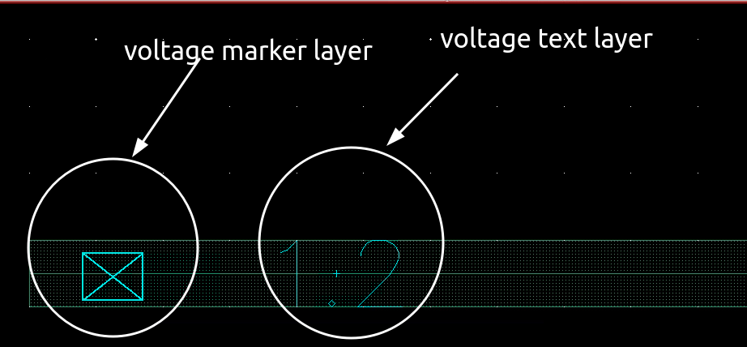

In T* DRC deck, it is based on the voltage recognition CAD layer and net connection to calculate the voltage difference between two neighboring nets by the following formula:

$$
\Delta V = \max(V_H(\text{net1})-V_L(\text{net2}), V_H(\text{net2})-V_L(\text{net1}))
$$

where
$$
V_H(\text{netx}) = \max(V(\text{netx}))
$$
and 
$$
V_L(\text{netx}) = \min(V(\text{netx}))
$$

> - The $\Delta V$ will be **0** if two nets are connected as same potential
> - If $V_L \gt V_H$ **on a net**, DRC will report warning on this net

## Voltage recognition CAD Layer

Two method

1. voltage text layer

   You place specific voltage text on specific drawing layer

2. voltage marker layer

   Each voltage marker layer represent different voltage for specific drawing layer

> *voltage text layer* has higher priority than *voltage marker layer* and is recommended

### voltage text layer

For example **M3**

| Process Layer | CAD Layer# | Voltage High | Voltage High Top (highest priority) | Voltage Low | Voltage Low Top (highest priority) |
| ------------- | ---------- | ------------ | ---------------------------------------- | ----------- | --------------------------------------- |
| M3            | 63         | 110          | 112                                      | 111         | 113                                     |

> where **63** is GDS number, **110 ~ 113** is data type

### voltage marker layer

Different data type represent different voltage, like

| DataType | 100  | 101  | 102  | ...  | 109  |
| -------- | ---- | ---- | ---- | ---- | ---- |
| Voltage  | 0.0  | 0.1  | 0.2  | 0.3  | 0.9  |

## Example

## reference

[Automate those voltage-dependent DRC checks! - siemens](https://blogs.sw.siemens.com/calibre/2015/08/18/automate-those-voltage-dependent-drc-checks/)
