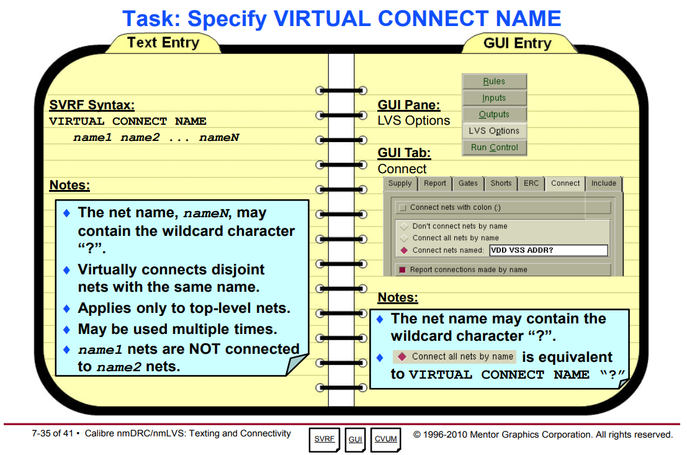

Normally, if the layout connectivity extractor finds disjoint, unconnected geometries with the same net name text attached, the extractor will view this as an open circuit.

- Virtual connection results in the extraction of a single net from two or more disjoint physical nets when the physical net segments share the same name.
- Virtual connectivity is triggered by the rule file **VIRTUAL CONNECT COLON** and **VIRTUAL CONNECT NAME** specification statements.
- Virtual connectivity can also be specified through the Calibre Interactive GUI.

### VIRTUAL CONNECT COLON

**Virtual Connect Colon** is used to virtually connect nets that *share a common prefix before a colon*, like VDD**:**1, VDD**:**2, and so forth.

If you specify *YES*, then the connectivity extractor first *strips off* all characters from the first
colon to the end of the label names.

Next, the extractor forms a virtual connection between any two labels that have the same name and that *originally contained a colon*.

Colons can appear anywhere in the name with the exception that a colon at the beginning of a name is treated as a regular character (that is, it has no special effect).

> *up to the first colon character* encountered
>
> The *colon* is **discarded** in the extracted net name

### VIRTUAL CONNECT NAME

**Virtual Connect Name** virtually connects nets that share the same name

Each name is a net name and can be optionally enclosed in quotes.

The connectivity extractor forms a virtual connection between any two labels having the same name such that the label name appears in a **Virtual Connect Name** specification statement in the rule file.

> `VIRTUAL CONNECT NAME ?` == Connect all nets by name

Note that if **Virtual Connect Colon YES** is also specified, then **Virtual Connect Name** operates on names
*after all colon suffixes have been stripped off*.

### reference

Calibre Fundamentals: Performing DRC/LVS Student Workbook

Calibre Verification User’s Manual Software Version 2019.3 Document Revision 7
