## Redundancy

Max tolerance of comparator offset is $\pm V_{FS}/4$

1. $b_j$ error is $\pm 1$
2. $b_{j+1}$ error is  $\pm 2$ , wherein $b_{j+1}$: $0\to 2$ or $1\to -1$  

i.e. complementary analog and digital errors cancel each other, $V_o +\Delta V_{o}$ should be in **over-/under-range comparators** ($-V_{FS}/2 \sim 3V_{FS}/2$)

For overlapped search ranges, a less than ***radix-2 (sub-binary)*** search is needed. Essentially, a sub-binary search takes ***more than $N$ steps*** to convert an analog input into a ***$N$-bit digital output***

**Binary search algorithm(4-bit 4-step):**

$$\begin{align}
D_\text{out} &= d_1 \cdot 2^3 + d_2 \cdot 2^2 + d_3 \cdot 2^1 + d_4 \cdot 2^0 \\
&= \frac{2d_1-1}{2} \cdot 2^3 + \frac{2d_2-1}{2} \cdot 2^2 + \frac{2d_3-1}{2} \cdot 2^1 + \frac{2d_4-1}{2} \cdot 2^0 +\frac{1}{2}\sum_{k=0}^3 2^k \\
&= D_1 \cdot 2^2 + D_2\cdot 2 + D_3 \cdot 1 + D_4 \cdot 0.5 + 2^3-0.5
\end{align}$$

where $d_k \in \{0, 1\}$ and $D_k=2d_k-1$, $D_k\in\{+1,-1\}$

---

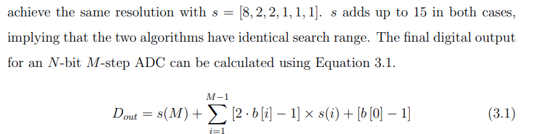

That is
$$
D_\text{out} = \sum_{i=1}^{M-1}b[i]\cdot 2s(i) +b[0]+S(M)-\sum_{i=1}^{M-1}s(i)-1
$$
which is valid in binary weighted search, obviously.

> note $s[?]$ is not cap weight in non-binary search 

###  max recoverable error

> Chang, Albert Hsu Ting. "Low-power high-performance SAR ADC with redundancy and digital background calibration." (2013). [[https://dspace.mit.edu/bitstream/handle/1721.1/82177/861702792-MIT.pdf](https://dspace.mit.edu/bitstream/handle/1721.1/82177/861702792-MIT.pdf)]
>
> Kuttner, Franz. "A 1.2V 10b 20MSample/s non-binary successive approximation ADC in 0.13/spl mu/m CMOS." *2002 IEEE International Solid-State Circuits Conference. Digest of Technical Papers (Cat. No.02CH37315)* 1 (2002): 176-177 vol.1. [[https://sci-hub.se/10.1109/ISSCC.2002.992993](https://sci-hub.se/10.1109/ISSCC.2002.992993)]
>
> T. Ogawa, H. Kobayashi, et. al., "SAR ADC Algorithm with Redundancy and Digital Error Correction." IEICE Trans. Fundam. Electron. Commun. Comput. Sci. 93-A (2010): 415-423. [[paper](https://sci-hub.se/https://doi.org/10.1587/transfun.E93.A.415), [slides](https://pdfs.semanticscholar.org/9745/3f1a69d43414c123965280cd6fc45274f296.pdf)]
>
> B. Murmann, “On the use of redundancy in successive approximation A/D converters,” International Conference on Sampling Theory and Applications (SampTA), Bremen, Germany, July 2013.  [[https://www.eurasip.org/Proceedings/Ext/SampTA2013/papers/p556-murmann.pdf](https://www.eurasip.org/Proceedings/Ext/SampTA2013/papers/p556-murmann.pdf)]
>
> Krämer, M. et al. (2015) *High-resolution SAR A/D converters with loop-embedded input buffer*. dissertation. Available at: [[http://purl.stanford.edu/fc450zc8031](http://purl.stanford.edu/fc450zc8031)].
>
> sarthak, "Visualising redundancy in a 1.5 bit pipeline ADC“ [[https://electronics.stackexchange.com/a/523489/233816](https://electronics.stackexchange.com/a/523489/233816)]

## Testing

Kent H. Lundberg "Analog-to-Digital Converter Testing"  [[https://www.mit.edu/~klund/A2Dtesting.pdf](https://www.mit.edu/~klund/A2Dtesting.pdf)]

Tai-Haur Kuo, Da-Huei Lee "Analog IC Design: ADC Measurement" [[http://msic.ee.ncku.edu.tw/course/aic/202309/ch13%20(20230111).pdf](http://msic.ee.ncku.edu.tw/course/aic/202309/ch13%20(20230111).pdf)] [[http://msic.ee.ncku.edu.tw/course/aic/aic.html](http://msic.ee.ncku.edu.tw/course/aic/aic.html)]

ESE 6680: Mixed Signal Design and Modeling "Lec 20: April 10, 2023 Data Converter Testing" [[https://www.seas.upenn.edu/~ese6680/spring2023/handouts/lec20.pdf](https://www.seas.upenn.edu/~ese6680/spring2023/handouts/lec20.pdf)]

Degang Chen. "Distortion Analysis" [[https://class.ece.iastate.edu/djchen/ee435/2017/Lecture25.pdf](https://class.ece.iastate.edu/djchen/ee435/2017/Lecture25.pdf)]

## ADC INL/DNL

*TODO* &#128197;

- `Endpoint` method
- `BestFit` method

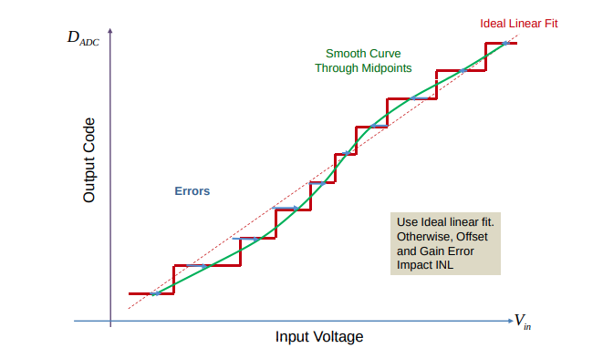

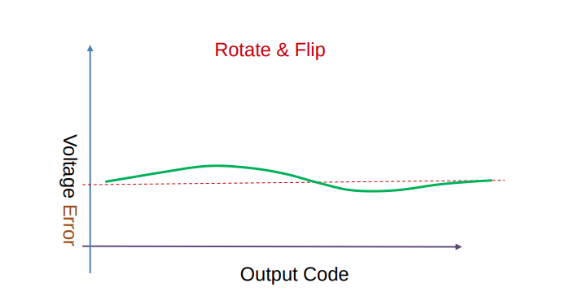

> INL/DNL Measurements for High-Speed Analog-to Digital Converters (ADCs) [[https://picture.iczhiku.com/resource/eetop/sYKTSqLfukeHSmMB.pdf](https://picture.iczhiku.com/resource/eetop/sYKTSqLfukeHSmMB.pdf)]

### Code Density Test

> Apply a linear ramp to ADC input

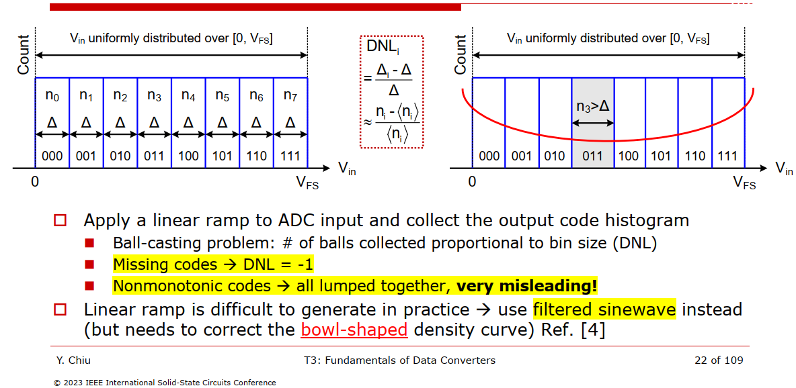

## Mid-Rise & Mid-Tread Quantizer

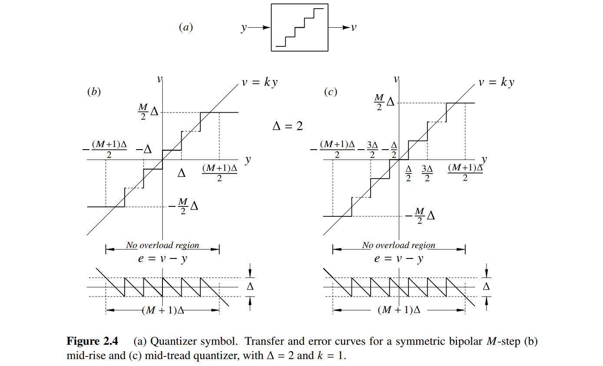

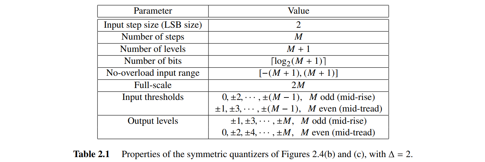

> The difference between the lowest and highest *levels* is called the **full-scale (FS)** of the quantizer  

## Bootstrapped Switch
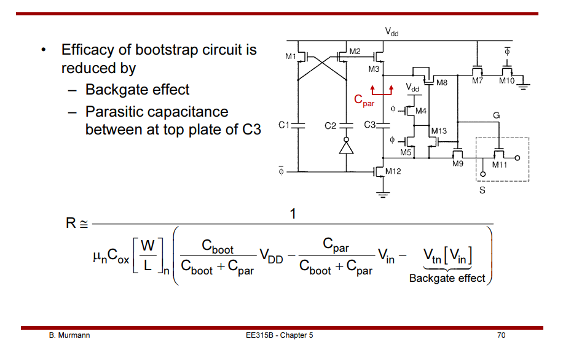

> A. Abo et al., "A 1.5-V, 10-bit, 14.3-MS/s CMOS Pipeline Analog-to Digital Converter," IEEE J. Solid-State Circuits, pp. 599, May 1999 [[https://sci-hub.se/10.1109/4.760369](https://sci-hub.se/10.1109/4.760369)]
>
> Dessouky and Kaiser, "Input switch configuration suitable for rail-to-rail operation of switched opamp circuits," Electronics Letters, Jan. 1999. [[https://sci-hub.se/10.1049/EL:19990028](https://sci-hub.se/10.1049/EL:19990028)]
>
> B. Razavi, "The Bootstrapped Switch [A Circuit for All Seasons]," in *IEEE Solid-State Circuits Magazine*, vol. 7, no. 3, pp. 12-15, Summer 2015 [[https://www.seas.ucla.edu/brweb/papers/Journals/BRSummer15Switch.pdf](https://www.seas.ucla.edu/brweb/papers/Journals/BRSummer15Switch.pdf)]
>
> B. Razavi, "The Design of a bootstrapped Sampling Circuit [The Analog Mind]," IEEE Solid-State Circuits Magazine, Volume. 13, Issue. 1, pp. 7-12, Summer 2021. [[http://www.seas.ucla.edu/brweb/papers/Journals/BR_SSCM_1_2021.pdf](http://www.seas.ucla.edu/brweb/papers/Journals/BR_SSCM_1_2021.pdf)]

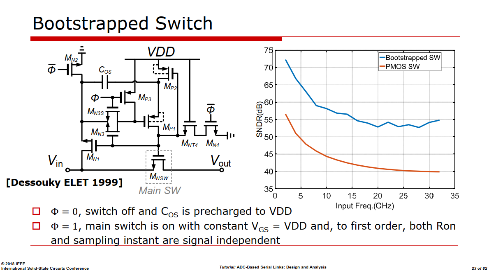

## Quantization Noise & its Spectrum

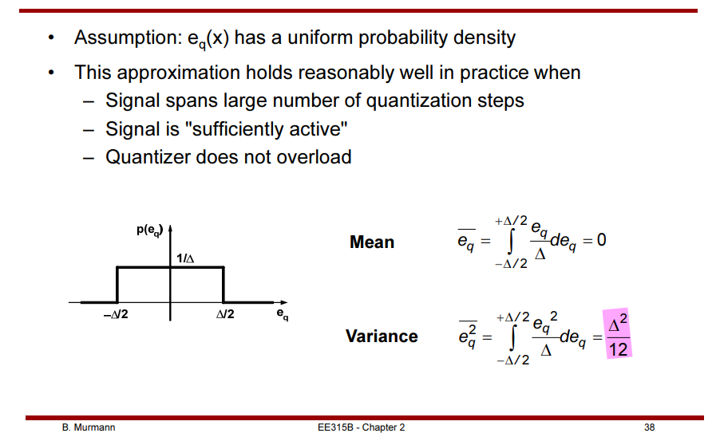

> Quantization noise is less with higher resolution as the input range is divided into a greater number of smaller ranges
>
> This error can be considered a quantization noise with **RMS**

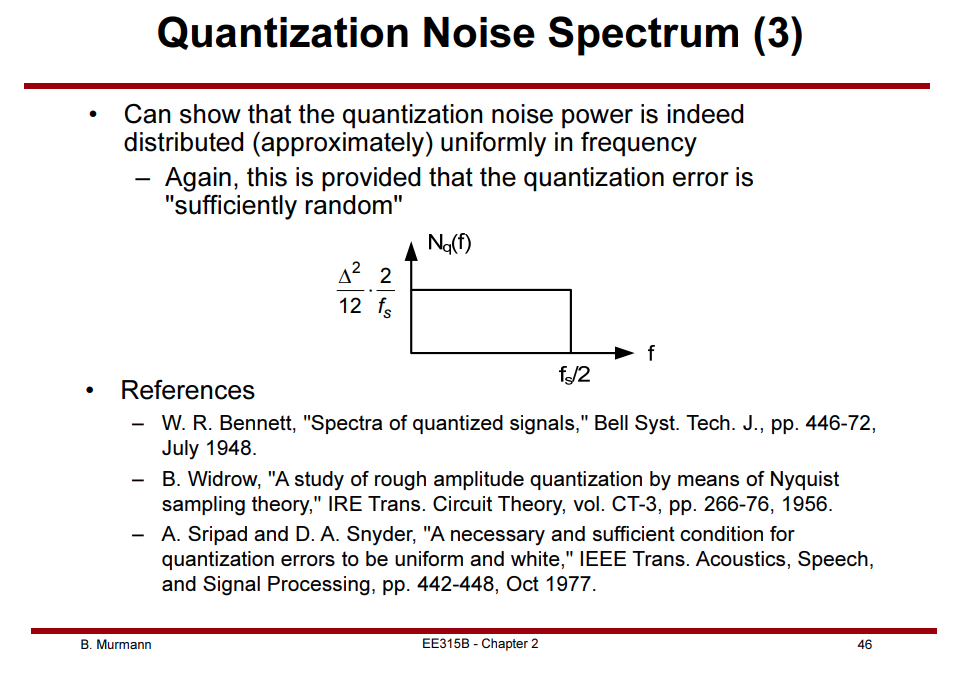

## ENOB & SQNR

The quantization noise power $P_Q$ for a uniform quantizer with step size $\Delta$ is given by
$$
P_Q = \frac{\Delta ^2}{12}
$$
For a full-scale sinusoidal input signal with an amplitude equal to $V_{FS}/2$, the input signal is given by $x(t) = \frac{V_{FS}}{2}\sin(\omega t)$

Then input signal power $P_s$ is
$$
P_s = \frac{V_{FS}^2}{8}
$$
Therefore, the **signal-to-quantization noise ratio (SQNR)** is given by
$$
\text{SQNR} = \frac{P_s}{P_Q} = \frac{V_{FS}^2/8}{\Delta^2/12}=\frac{V_{FS}^2/8}{V_{FS}^2/(12\times 2^{2N})} = \frac{3\times 2^{2N}}{2}
$$
where $N$ is the number of quantization bits

When represented in dBs
$$
\text{SQNR(dB)} = 10\log(\frac{P_s}{P_Q}) = 10\log(\frac{3\times 2^{2N}}{2})= 20N\log(2) + 10\log(\frac{3}{2})= 6.02N + 1.76
$$

## Quantization is NOT Noise

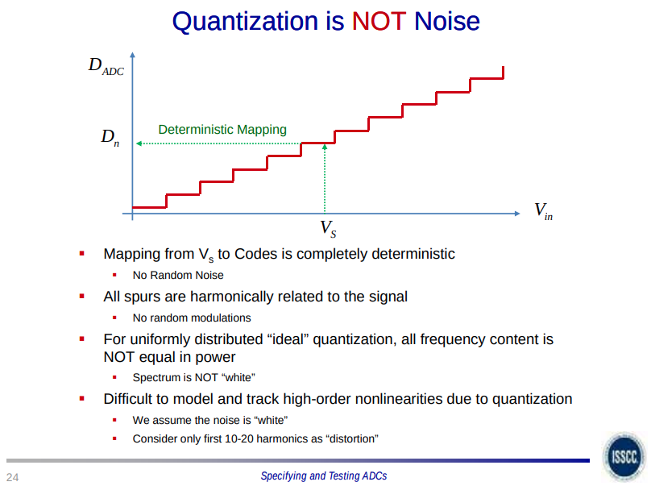

## DAC DNL

One difference between ADC and DAC is that *DAC DNL can be less than -1 LSB*

> In a DAC, **DNL < -1LSB** implies **non-monotonicity**

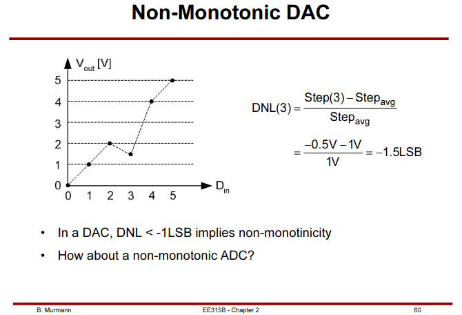

## DAC INL

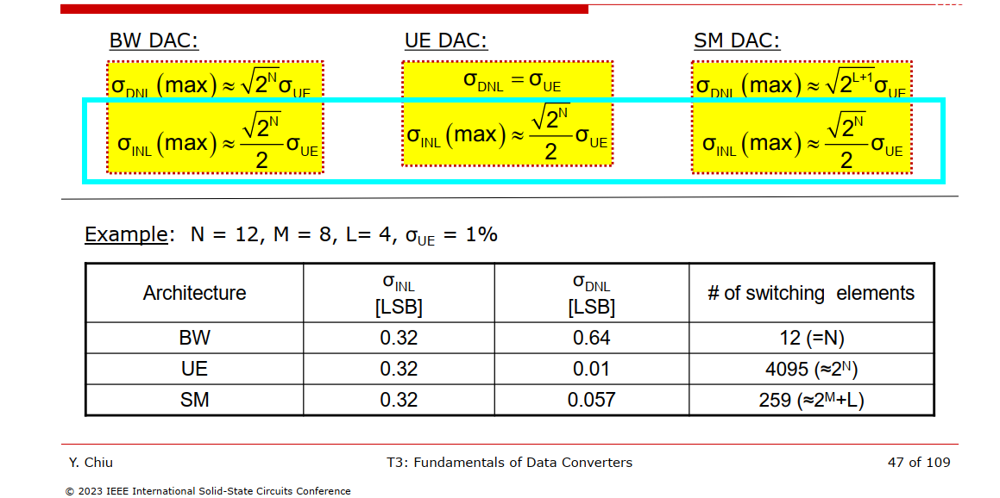

> The worst INL of three DAC Architecture is same

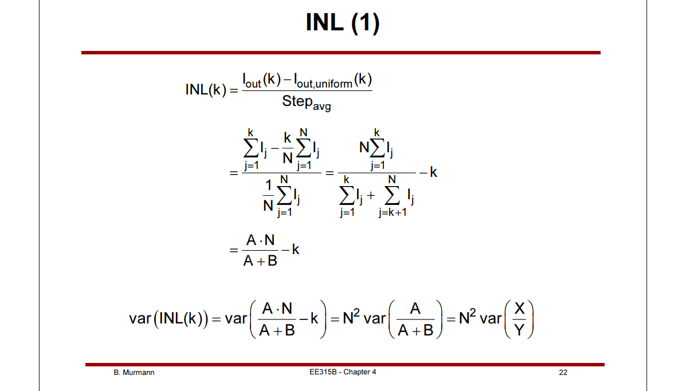

- $A = \sum_{j=1}^k I_j$, $B=\sum_{j=k+1}^N I_j$
- A and B are independent with $\sigma_A^2 = k\sigma_u^2$ and $\sigma_B^2=(N-k)\sigma_u^2$

Therefore
$$
\mathrm{Var}\left(\frac{X}{Y}\right)\simeq \frac{k^2}{N^2}\left(\frac{\sigma_i^2}{kI_u^2} + \frac{\sigma_i^2}{NI_u^2} -2\frac{\mathrm{cov}(X,Y)}{kNI_u^2}\right)
$$
and
$$\begin{align}
\mathrm{cov}(X,Y) &= E[XY] - E[X]E[Y] = E[A(A+B)] - kNI_u^2 \\
&= E[A^2]+E[A]E[B] - kNI_u^2= \sigma_A^2+E[A]^2 + k(N-k)I_u^2 - kNI_u^2\\
&= k\sigma_i^2 + k^2I_u^2+ k(N-k)I_u^2 - kNI_u^2 \\
&= k\sigma_i^2
\end{align}$$

Finally,
$$
\mathrm{Var}\left(\frac{X}{Y}\right)\simeq \frac{k^2}{N^2}\left(\frac{\sigma_i^2}{kI_u^2} + \frac{\sigma_i^2}{NI_u^2} -2\frac{k\sigma_i^2}{kNI_u^2}\right) = \frac{k^2}{N^2}\left(\frac{1}{k}- \frac{1}{N}\right)\sigma_u^2
$$
i.e.
$$
\mathrm{Var(INL(k))} = k^2\left(\frac{1}{k}- \frac{1}{N}\right)\sigma_u^2 = k\left(1- \frac{k}{N}\right)\sigma_u^2
$$

**Standard deviation of INL is maximum at mid-scale (k=N/2)**

>  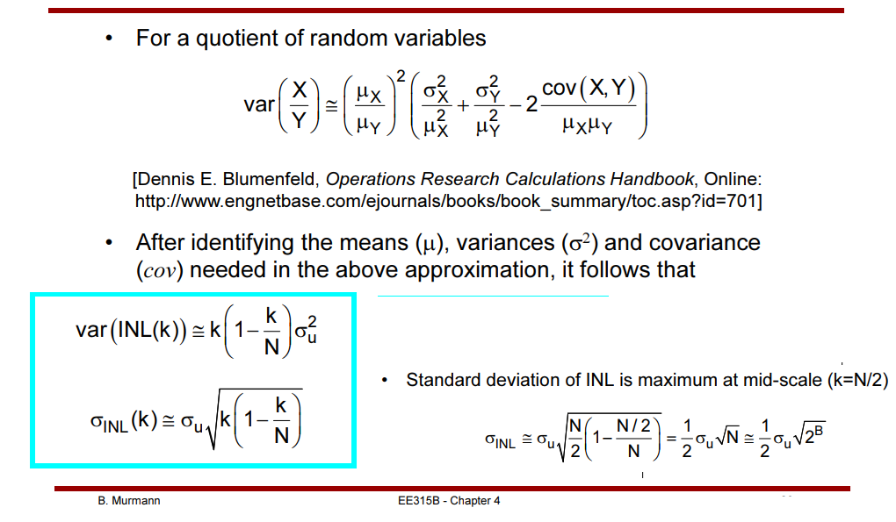

---

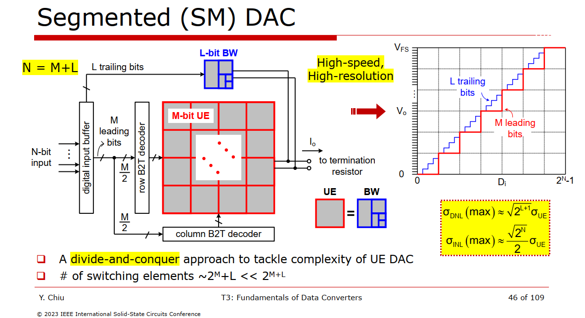

## Bottom plate sampling

> Sample signal at the *"grounded"* side of the capacitor to achieve ***signal independent sampling***

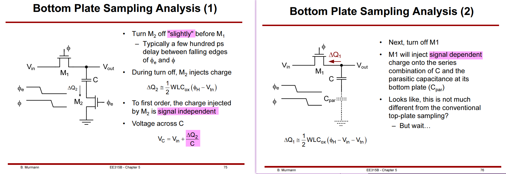

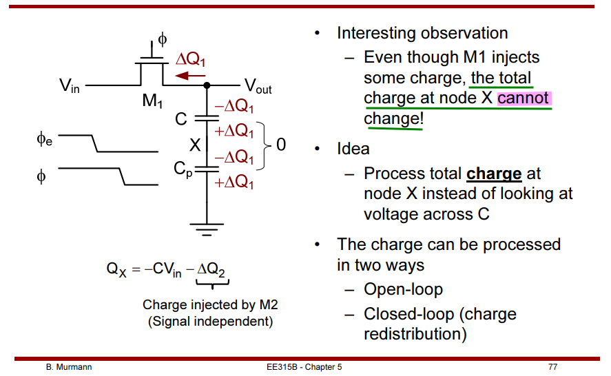

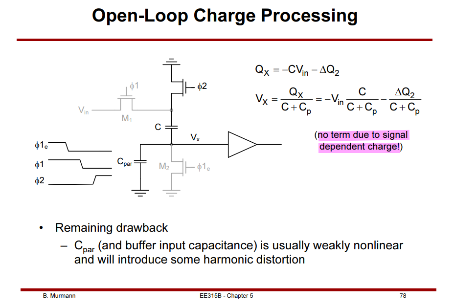

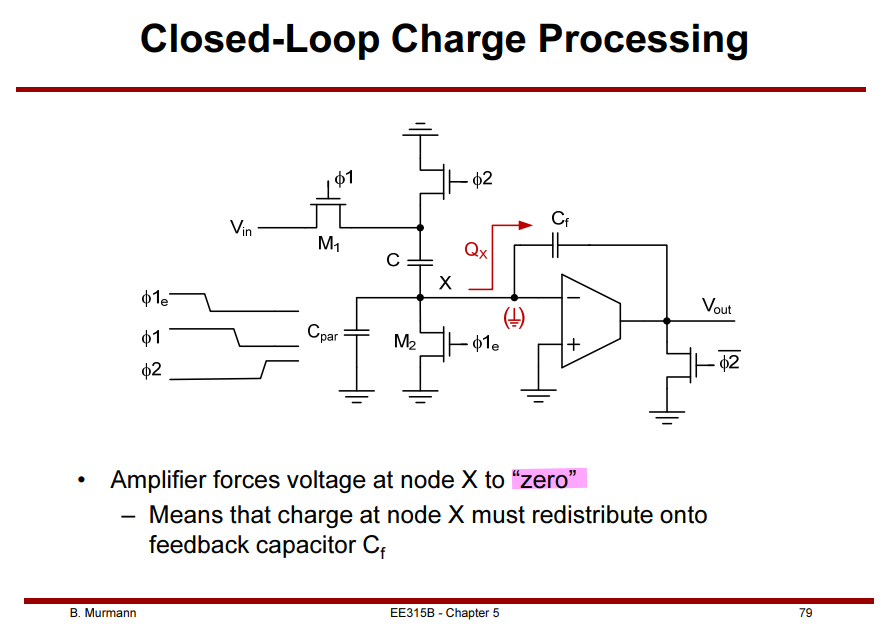

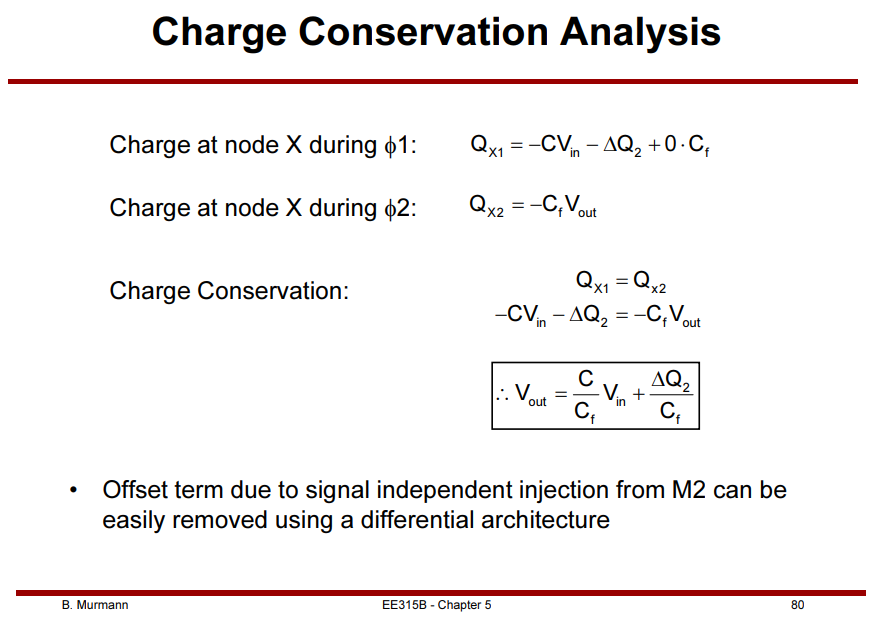

---

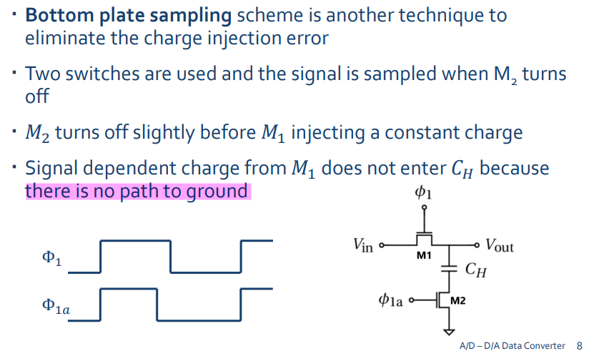

> [[https://indico.cern.ch/event/1064521/contributions/4475393/attachments/2355793/4078773/esi_sampling_and_converters2022.pdf](https://indico.cern.ch/event/1064521/contributions/4475393/attachments/2355793/4078773/esi_sampling_and_converters2022.pdf)]

> EE 435 Spring 2024 Analog VLSI Circuit Design - Switched-Capacitor Amplifiers Other Integrated Filters, [https://class.ece.iastate.edu/ee435/lectures/EE%20435%20Lect%2044%20Spring%202008.pdf](https://class.ece.iastate.edu/ee435/lectures/EE%20435%20Lect%2044%20Spring%202008.pdf)

## Hold Mode Feedthrough
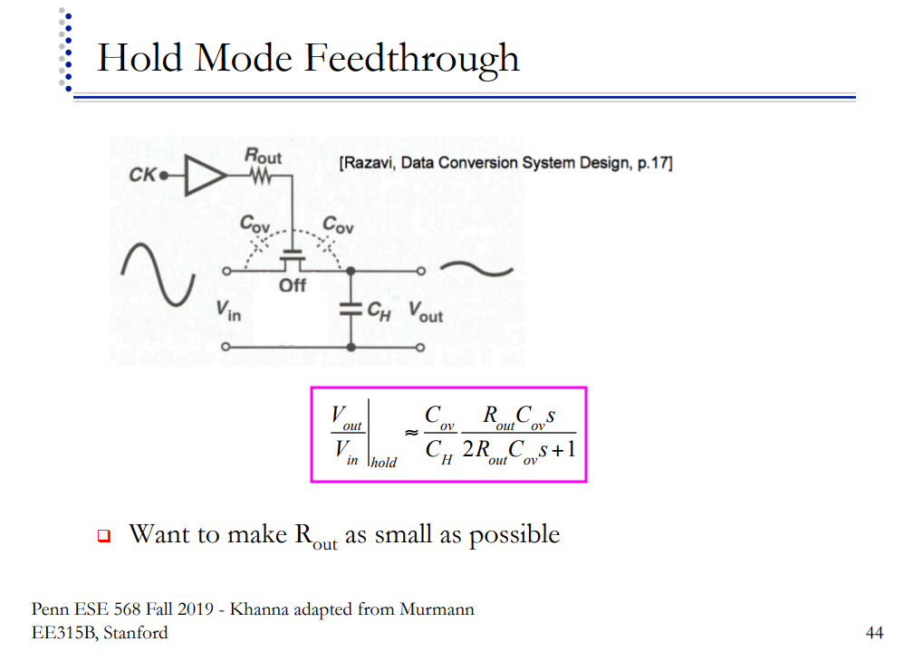

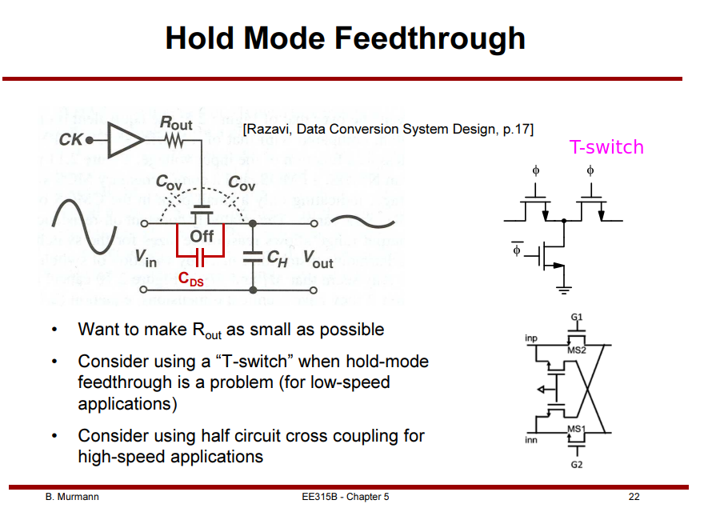

> P. Schvan et al., "A 24GS/s 6b ADC in 90nm CMOS," 2008 IEEE International Solid-State Circuits Conference - Digest of Technical Papers, San Francisco, CA, USA, 2008, pp. 544-634
>
> B. Sedighi, A. T. Huynh and E. Skafidas, "A CMOS track-and-hold circuit with beyond 30 GHz input bandwidth," 2012 19th IEEE International Conference on Electronics, Circuits, and Systems (ICECS 2012), Seville, Spain, 2012, pp. 113-116
>
> Tania Khanna, ESE 568: Mixed Signal Circuit Design and Modeling [[https://www.seas.upenn.edu/~ese5680/fall2019/handouts/lec11.pdf](https://www.seas.upenn.edu/~ese5680/fall2019/handouts/lec11.pdf)]

## Summing Interleaved Alias

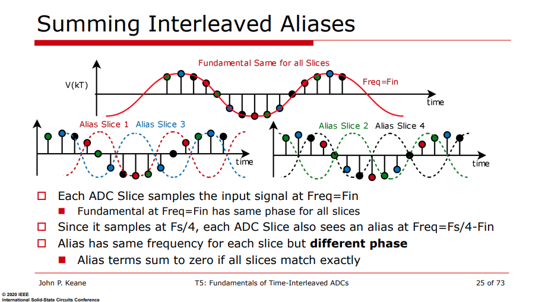

The sampling function - impulse train is
$$
s(t) = \sum_{n=-\infty}^{\infty}\left[ \delta(t-n4T_s) + \delta(t-n4T_s-T_s) + \delta(t-n4T_s-2T_s) + \delta(t-n4T_s-3T_s)\right]
$$

Its Fourier transform is
$$\begin{align}
S(f) &= \frac{2\pi}{4T}\sum_{k=-\infty}^{\infty}\left[\delta(f-k\frac{f_s}{4}) + e^{-j2\pi f\cdot T_s}\delta(f-k\frac{f_s}{4}) + e^{-j2\pi f\cdot 2T_s}\delta(f-k\frac{f_s}{4}) + e^{-j2\pi f\cdot 3T_s}\delta(f-k\frac{f_s}{4})  \right] \\
&= \frac{2\pi}{4T}\sum_{k=-\infty}^{\infty}\left(1+e^{-j2\pi\frac{f}{f_s}} + e^{-j4\pi\frac{f}{f_s}} + e^{-j6\pi\frac{f}{f_s}}  \right) \delta(f-k\frac{f_s}{4}) \\
&= \frac{2\pi}{4T}\sum_{k=-\infty}^{\infty}\left(1+e^{-jk\frac{\pi}{2}} + e^{-jk\pi} + e^{-jk\frac{3\pi}{2}}  \right) \delta(f-k\frac{f_s}{4})
\end{align}$$

We define $M[k] = 1+e^{-jk\frac{\pi}{2}} + e^{-jk\pi} + e^{-jk\frac{3\pi}{2}}$, which is periodic, i.e. $M[k]=M[k+4]$
$$
M[k]=\left\{ \begin{array}{cl}
4 & : \ k = 4m \\
0 & : \ k=4m+1 \\
0 & : \ k=4m+2 \\
0 & : \ k=4m+3 \\
\end{array} \right.
$$

That is
$$
S(f) = \frac{2\pi}{T}\sum_{k=-\infty}^{\infty} \delta(f-kf_s)
$$

Alias has same frequency for each slice but **different phase**: Alias terms sum to **zero** if all slices match exactly

> John P. Keane, ISSCC2020, T5: "Fundamentals of Time-Interleaved ADCs"

## Random Chopping in TI-ADC

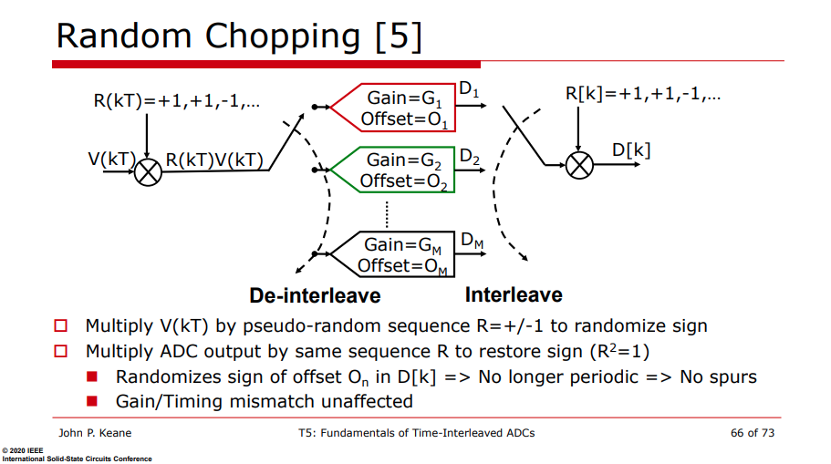

$$
D_n(kT) = (G_n R(kT) V(kT) + O_n)R(kT)= C_n V(kT) + R(kT)O_n
$$

## coherent sampling

- integer # of cycles  or Windowing  
  - avoid spectral leakage

- $f_\text{in}$ and $f_s$ are co-prime  
  - avoid periodic quantization errors, manifested as harmonic distortions

---

To avoid **spectral leakage** completely, the method of **coherent sampling** is recommended. Coherent sampling requires that the input- and clock-frequency generators are **phase locked**, and that the input frequency be chosen based on the following relationship:
$$
\frac{f_{\text{in}}}{f_{\text{s}}}=\frac{M_C}{N_R}
$$

where:

- $f_{\text{in}}$ = the desired input frequency
- $f_s$ = the clock frequency of the data converter under test
- $M_C$ = the number of cycles in the data window (to make all samples unique, choose odd or prime numbers)
- $N_R$ = the data record length (for an 8192-point FFT, the data record is 8192s long)

$$\begin{align}
f_{\text{in}} &=\frac{f_s}{N_R}\cdot M_C \\
&= f_{\text{res}}\cdot M_C
\end{align}$$

---

**irreducible ratio**

An **irreducible ratio** ensures identical code sequences not to be repeated multiple times. Unnecessary repetition of the same code is not desirable as it increases ADC test time.

> Given that $\frac{M_C}{N_R}$ is irreducible, and $N_R$ is a power of 2, an **odd number** for $M_C$ will always produce an **irreducible ratio**

Assuming there is a common factor $k$ between $M_C$ and $N_R$, i.e. $\frac{M_C}{N_R}=\frac{k M_C'}{k N_R'}$

The samples  ($n\in[1, N_R]$)

$$
y[n] = \sin\left( \omega_{\text{in}} \cdot t_n \right) = \sin\left( \omega_{\text{in}} \cdot n\frac{1}{f_s} \right)  = \sin\left( \omega_{\text{in}} \cdot n\frac{1}{f_{\text{in}}}\frac{M_C}{N_R} \right) = \sin\left( 2\pi n\frac{M_C}{N_R} \right)
$$

Then

$$
y[n+N_R'] = \sin\left( 2\pi (n+N_R')\frac{M_C}{N_R} \right) = \sin\left( 2\pi n \frac{M_C}{N_R} + 2\pi N_R'\frac{M_C}{N_R}\right) = \sin\left( 2\pi n \frac{M_C}{N_R} + 2\pi N_R'\frac{kM_C'}{kN_R'} \right) = \sin\left( 2\pi n \frac{M_C}{N_R}\right)
$$

So,  the samples is repeated $y[n] = y[n+N_R']$.  Usually, no additional information is gained by repeating with the same sampling points.

---

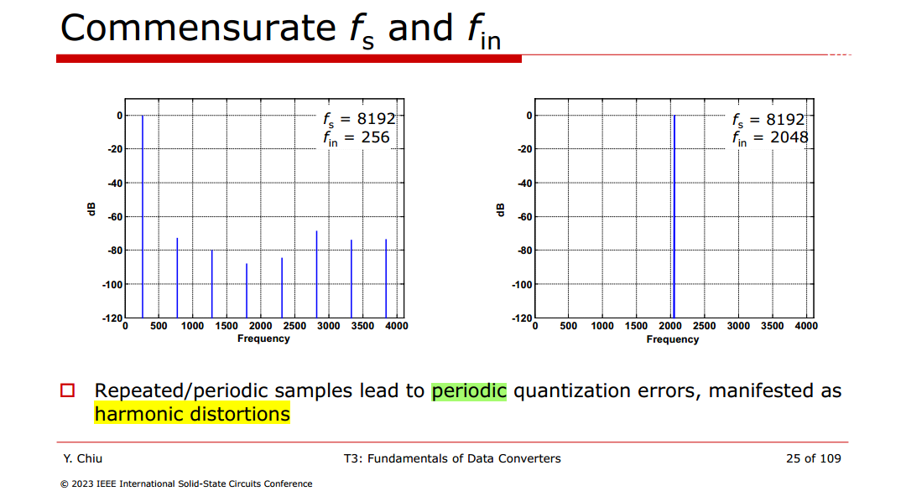

> samples of every input cycle are the same - *periodic*

## Thermometer to Binary encoder

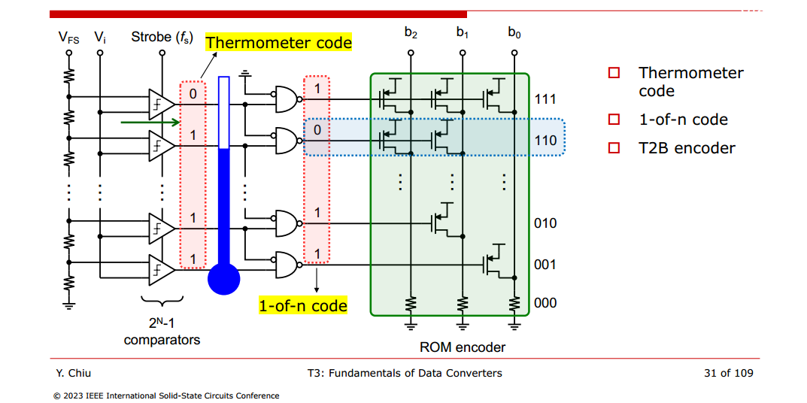

## Pipeline ADC

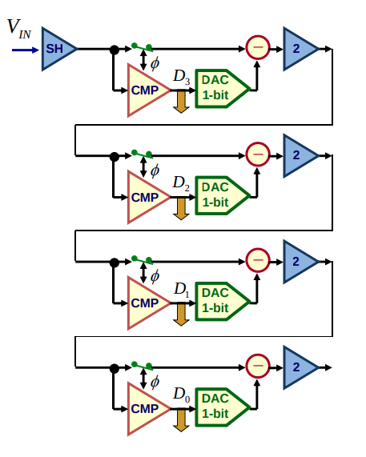

> CMP reference voltage is 0.5vref, DAC output is 0.5vref or 0

residual error
$$
V_{r,n} = (V_{r,n-1}-\frac{1}{2}b_{n})\cdot 2
$$
and $V_{r,-1}=V_i$
$$
V_{r,n-1} = 2^{n}V_i -\sum_{k=0}^{n-1}2^{n-k-1}b_k = 2^{n}\left(V_i - \sum_{k=0}^{n-1}\frac{b_k}{2^{k+1}}\right)
$$

here, $b_0$ is first stage and MSB

It divides the process into several comparison stages, the number of which is proportional to the number of bits

> Due to the pipeline structure of both analog and digital signal path, inter-stage **residue amplification** is needed which consumes considerable power and limits high speed operation

> Vishal Saxena, "Pipelined ADC Design - A Tutorial"[[https://www.eecis.udel.edu/~vsaxena/courses/ece517/s17/Lecture%20Notes/Pipelined%20ADC%20NonIdealities%20Slides%20v1_0.pdf](https://www.eecis.udel.edu/~vsaxena/courses/ece517/s17/Lecture%20Notes/Pipelined%20ADC%20NonIdealities%20Slides%20v1_0.pdf)] [[https://www.eecis.udel.edu/~vsaxena/courses/ece517/s17/Lecture%20Notes/Pipelined%20ADC%20Slides%20v1_2.pdf](https://www.eecis.udel.edu/~vsaxena/courses/ece517/s17/Lecture%20Notes/Pipelined%20ADC%20Slides%20v1_2.pdf)]
>
> Bibhu Datta Sahoo, Analog-to-Digital Converter Design From System Architecture to Transistor-level [[http://smdpc2sd.gov.in/downloads/IGF/IGF%201/Analog%20to%20Digital%20Converter%20Design.pdf](http://smdpc2sd.gov.in/downloads/IGF/IGF%201/Analog%20to%20Digital%20Converter%20Design.pdf)] 
>
> Bibhu Datta Sahoo, Associate Professor, IIT, Kharagpur, [[https://youtu.be/HiIWEBAYRJY?si=pjQnIdi03i5N7805](https://youtu.be/HiIWEBAYRJY?si=pjQnIdi03i5N7805)]

---

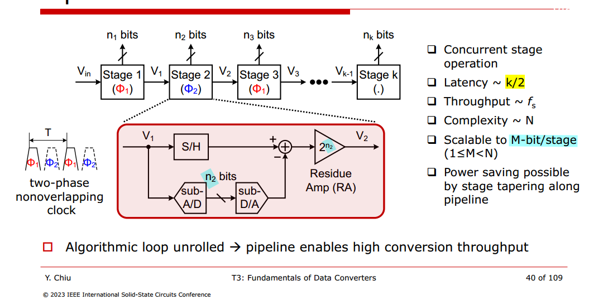

## R-2R & C-2C

*TODO* &#128197;

Conceptually, area goes up *linearly* with number of bit slices

 drawback of the R-2R DAC 

---

$N_b$ bit binary + $N_t$ bit thermometer DAC

$N_b$ bit binary can be simplified with Thevenin Equivalent
$$
V_B = \sum_{n=0}^{N_b-1} \frac{B_n}{2^{N_b-n}}
$$
with thermometer code

$$\begin{align}
V_o &= V_B\frac{\frac{2R}{2^{N_t}-1}}{\frac{2R}{2^{N_t}-1}+ 2R}+\sum_{n=0}^{2^{N_t}-2}T_n\frac{\frac{2R}{2^{N_t}-1}}{\frac{2R}{2^{N_t}-1}+ 2R} \\
&= \frac{V_B}{2^{N_t}} + \frac{\sum_{n=0}^{2^{N_t}-2}T_n}{2^{N_t}} \\
&= \sum_{n=0}^{N_b-1} \frac{B_n}{2^{N_t+N_b-n}} + \frac{\sum_{n=0}^{2^{N_t}-2}T_n}{2^{N_t}}
\end{align}$$

> B. Razavi, "The R-2R and C-2C Ladders [A Circuit for All Seasons]," in *IEEE Solid-State Circuits Magazine*, vol. 11, no. 3, pp. 10-15, Summer 2019 [[https://www.seas.ucla.edu/brweb/papers/Journals/BR_SSCM_3_2019.pdf](https://www.seas.ucla.edu/brweb/papers/Journals/BR_SSCM_3_2019.pdf)]

---

4bit binary R2R DAC with Ru=1kOhm

RVB equivalent R

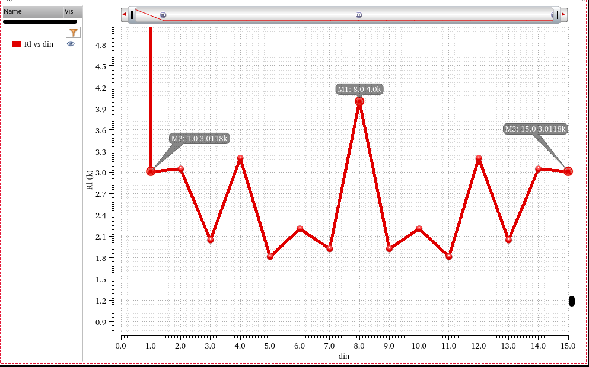

## Binary-Weighted (BW) DAC

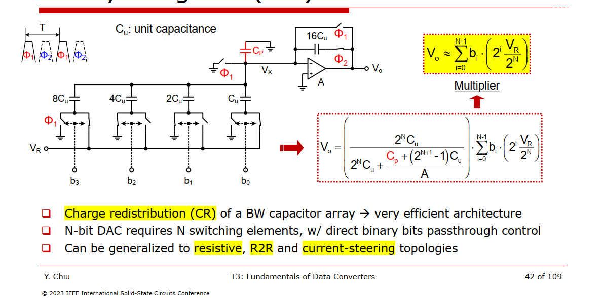

During $\Phi_1$, all capacitor are shorted, the net charge at $V_x$ is 0

During $\Phi_2$, the charge at bottom plate of CDAC
$$
Q_{DAC,btm} = \sum_{i=0}^{N-1}(b_i\cdot V_R - V_x)\cdot 2^{i}C_u = C_uV_R\sum_{i=0}^{N-1}b_i2^i - (2^N-1)C_uV_x
$$
the charge at the internal plate of integrator
$$
Q_{intg} = V_x C_p + (V_x - V_o)2^NC_u
$$
and we know $-V_x A = V_o$ and $Q_{DAC,btm} = Q_{intg}$
$$
C_uV_R\sum_{i=0}^{N-1}b_i2^i - (2^N-1)C_uV_x = V_x C_p + (V_x - V_o)2^NC_u
$$
i.e.
$$
C_uV_R\sum_{i=0}^{N-1}b_i2^i = (2^N-1)C_uV_x + V_x C_p + (V_x - V_o)2^NC_u
$$
therefore
$$
-V_o = \frac{2^N C_u}{\frac{(2^{N+1}-1)C_u+C_p}{A}+2^NC_u}\sum_{i=0}^{N-1}b_i\left(2^i\frac{V_R}{2^N}\right)\approx \sum_{i=0}^{N-1}b_i\left(2^i\frac{V_R}{2^N}\right)
$$

---

> *Midscale (MSB Transition)* often is the *largest DNL error*

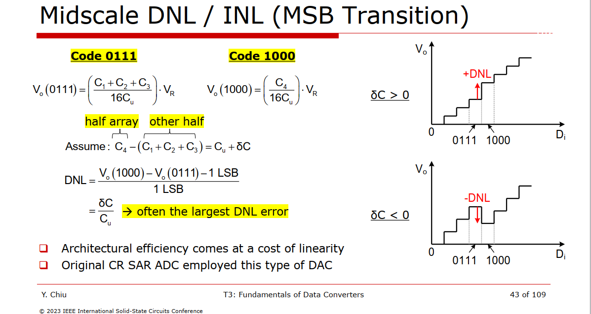

> $C_4$ and $C_1+C_2+C_3$ are independent (can't cancel out) and their variance is two largest ($16\sigma_u^2$, $15\sigma_u^2$, ), the total standard deviation is $\sqrt{16\sigma_u^2+15\sigma_u^2}=\sqrt{31}\sigma_u$

## reference

Aaron Buchwald, ISSCC2010 T1: "Specifying & Testing ADCs" [[https://www.nishanchettri.com/isscc-slides/2010%20ISSCC/Tutorials/T1.pdf](https://www.nishanchettri.com/isscc-slides/2010%20ISSCC/Tutorials/T1.pdf)]

John P. Keane, ISSCC2020, T5: "Fundamentals of Time-Interleaved ADCs" [[https://www.nishanchettri.com/isscc-slides/2020%20ISSCC/TUTORIALS/T5Visuals.pdf](https://www.nishanchettri.com/isscc-slides/2020%20ISSCC/TUTORIALS/T5Visuals.pdf)]

Yun Chiu, ISSCC2023 T3: "Fundamentals of Data Converters" [[https://www.nishanchettri.com/isscc-slides/2023%20ISSCC/TUTORIALS/T3.pdf](https://www.nishanchettri.com/isscc-slides/2023%20ISSCC/TUTORIALS/T3.pdf)]

Ahmed M. A. Ali 2016, "High Speed Data Converters" [[pdf](https://picture.iczhiku.com/resource/eetop/sYKhdRGJFFGyZbcB.pdf)]

---

M. Gu, Y. Tao, Y. Zhong, L. Jie and N. Sun, "Timing-Skew Calibration Techniques in Time-Interleaved ADCs," in IEEE Open Journal of the Solid-State Circuits Society [[https://ieeexplore.ieee.org/stamp/stamp.jsp?tp=&arnumber=10804623](https://ieeexplore.ieee.org/stamp/stamp.jsp?tp=&arnumber=10804623)]

everynanocounts. Memos on FFT With Windowing. URL: [https://a2d2ic.wordpress.com/2018/02/01/memos-on-fft-with-windowing/](https://a2d2ic.wordpress.com/2018/02/01/memos-on-fft-with-windowing/)

How to choose FFT depth for ADC performance analysis (SINAD, ENOB). URL:[https://dsp.stackexchange.com/a/38201](https://dsp.stackexchange.com/a/38201)

Computation of Effective Number of Bits, Signal to Noise Ratio, & Signal to Noise & Distortion Ratio Using FFT. URL:[https://cdn.teledynelecroy.com/files/appnotes/computation_of_effective_no_bits.pdf](https://cdn.teledynelecroy.com/files/appnotes/computation_of_effective_no_bits.pdf)

Kester, Walt. (2009). Understand SINAD, ENOB, SNR, THD, THD + N, and SFDR so You Don't Get Lost in the Noise Floor. URL:[https://www.analog.com/media/en/training-seminars/tutorials/MT-003.pdf](https://www.analog.com/media/en/training-seminars/tutorials/MT-003.pdf)

T. C. Hofner: Dynamic ADC testing part I. Defining and testing dynamic ADC parameters, Microwaves & RF, 2000, vol. 39, no. 11, pp. 75-84,162

T. C. Hofner: Dynamic ADC testing part 2. Measuring and evaluating dynamic line parameters, Microwaves & RF, 2000, vol. 39, no. 13, pp. 78-94

AN9675: A Tutorial in Coherent and Windowed Sampling with A/D Converters [https://www.renesas.com/us/en/document/apn/an9675-tutorial-coherent-and-windowed-sampling-ad-converters](https://www.renesas.com/us/en/document/apn/an9675-tutorial-coherent-and-windowed-sampling-ad-converters)

APPLICATION NOTE 3190: Coherent Sampling Calculator (CSC)  [https://www.stg-maximintegrated.com/en/design/technical-documents/app-notes/3/3190.html](https://www.stg-maximintegrated.com/en/design/technical-documents/app-notes/3/3190.html)

Coherent Sampling (Very Brief and Simple) [https://www.dsprelated.com/thread/469/coherent-sampling-very-brief-and-simple](https://www.dsprelated.com/thread/469/coherent-sampling-very-brief-and-simple)

Signal Chain Basics #160: Making sense of coherent and noncoherent sampling in data-converter testing [https://www.planetanalog.com/signal-chain-basics-160-making-sense-of-coherent-and-noncoherent-sampling-in-data-converter-testing/](https://www.planetanalog.com/signal-chain-basics-160-making-sense-of-coherent-and-noncoherent-sampling-in-data-converter-testing/)

Signal Chain Basics #104: Understanding noise in ADCs [https://www.planetanalog.com/signal-chain-basics-part-104-understanding-noise-in-adcs/](https://www.planetanalog.com/signal-chain-basics-part-104-understanding-noise-in-adcs/)

Signal Chain Basics #101: ENOB Degradation Analysis Over Frequency Due to Jitter [https://www.planetanalog.com/signal-chain-basics-part-101-enob-degradation-analysis-over-frequency-due-to-jitter/](https://www.planetanalog.com/signal-chain-basics-part-101-enob-degradation-analysis-over-frequency-due-to-jitter/)

Clock jitter analyzed in the time domain, Part 1, Texas Instruments Analog Applications Journal (slyt379), Aug 2010 [https://www.ti.com/lit/an/slyt379/slyt379.pdf](https://www.ti.com/lit/an/slyt379/slyt379.pdf)

Clock jitter analyzed in the time domain, Part 2  [https://www.ti.com/lit/slyt389](https://www.ti.com/lit/slyt389)

Measurement of Total Harmonic Distortion and Its Related Parameters using Multi-Instrument [[pdf](https://www.virtins.com/doc/Measurement-of-Total-Harmonic-Distortion-and-Its-Related-Parameters-using-Multi-Instrument.pdf)]

Application Note AN-4: Understanding Data Converters' Frequency Domain Specifications [[pdf](https://www.datel.com/data/ads/adc-an4.pdf)]

Belleman, J. (2008). From analog to digital. 10.5170/CERN-2008-003.131.  [[pdf](https://cds.cern.ch/record/1100535/files/p131.pdf)]

HandWiki. Coherent sampling [[link](https://handwiki.org/wiki/Coherent_sampling)]

Luis Chioye, TI.  Leverage coherent sampling and FFT windows when evaluating SAR ADCs (Part 1) [[link](https://e2e.ti.com/blogs_/archives/b/precisionhub/posts/leverage-coherent-sampling-and-fft-windows-when-evaluating-sar-adcs-part-1)]

Coherent Sampling vs. Window Sampling | Analog Devices [https://www.analog.com/en/technical-articles/coherent-sampling-vs-window-sampling.html](https://www.analog.com/en/technical-articles/coherent-sampling-vs-window-sampling.html)

Understanding Effective Number of Bits [https://robustcircuitdesign.com/signal-chain-explorer/understanding-effective-number-of-bits/](https://robustcircuitdesign.com/signal-chain-explorer/understanding-effective-number-of-bits/)

ADC Input Noise: The Good, The Bad, and The Ugly. Is No Noise Good Noise? [[https://www.analog.com/en/resources/analog-dialogue/articles/adc-input-noise.html](https://www.analog.com/en/resources/analog-dialogue/articles/adc-input-noise.html)]

Walt Kester, Taking the Mystery out of the Infamous Formula, "SNR = 6.02N + 1.76dB," and Why You Should Care [[https://www.analog.com/media/en/training-seminars/tutorials/MT-001.pdf](https://www.analog.com/media/en/training-seminars/tutorials/MT-001.pdf)]

Dan Boschen, "How to choose FFT depth for ADC performance analysis (SINAD, ENOB)", [[https://dsp.stackexchange.com/a/38201](https://dsp.stackexchange.com/a/38201)]

B. Razavi, **"A Tale of Two ADCs - Pipelined Versus SAR"** IEEE Solid-State Circuits Magazine, Volume. 7, Issue. 30, pp. 38-46, Summer 2015 [[https://www.seas.ucla.edu/brweb/papers/Journals/BRSummer15ADC.pdf)](https://www.seas.ucla.edu/brweb/papers/Journals/BRSummer15ADC.pdf))]

