## Multipliers

*TODO* &#128197;

## Adders

*TODO* &#128197;

## overlapped tuning range

*TODO* &#128197;

## Mueller-Muller PD

Mueller-Muller **type A** timing function

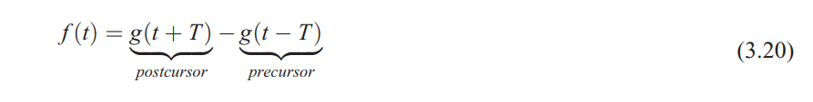

Mueller-Muller **type B** timing function

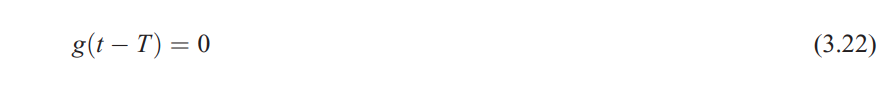

## Least-Mean-Square (LMS) 

> minimum mean square error (MMSE) 

This simplified version of LMS algorithm is identical to the *zero-forcing* algorithm which minimizes the ISI at data samples

###  Sign-Sign LMS (SS-LMS)

> T11: Basics of Equalization Techniques: Channels, Equalization, and Circuits, 2022 IEEE International Solid-State Circuits Conference
>
> V. Stojanovic et al., "Autonomous dual-mode (PAM2/4) serial link transceiver with adaptive equalization and data recovery," in IEEE Journal of Solid-State Circuits, vol. 40, no. 4, pp. 1012-1026, April 2005, doi: 10.1109/JSSC.2004.842863.
>
> Jinhyung Lee, Design of High-Speed Receiver for Video Interface with Adaptive Equalization; Phd thesis, August 2019. [thesis link](http://dcollection.snu.ac.kr/common/orgView/000000157003)
>
> Paulo S. R. Diniz, Adaptive Filtering: Algorithms and Practical Implementation, 5th edition
>
> E. -H. Chen et al., "Near-Optimal Equalizer and Timing Adaptation for I/O Links Using a BER-Based Metric," in IEEE Journal of Solid-State Circuits, vol. 43, no. 9, pp. 2144-2156, Sept. 2008

### DFE h0 Estimator

summer output
$$
r_k = a_kh_0+\left(\sum_{n=-\infty,n\neq0}^{+\infty}a_{k-n}h_n-\sum_{n=1}^{\text{ntap}}\hat{a}_{k-n}\hat{h}_n\right)
$$
error slicer analog output
$$
e_k=r_k-\hat{a}_k \hat{h}_0
$$
error slicer digital output
$$
\hat{e}_k=|e_k|
$$
It's NOT possible to implement $e_k$, which need to determine $\hat{a}_k=|r_k|$ in no time. One method to approach this problem is calculate $e_k^{a_k=1}=r_k-\hat{a}_k \hat{h}_0$ and $e_k^{a_k=-1}=r_k+\hat{a}_k \hat{h}_0$, then select the right one based on $\hat{a}_k$

The update  equation based on Sign-Sign-Least Mean square (SS-LMS) and loss function $L(\hat{h}_{\text{0~ntap}})=E(e_k^2)$
$$
\hat{h}_n(k+1) = \hat{h}_n(k)+\mu \cdot |e_k|\cdot \hat{a}_{k-n}
$$
Where $n \in [0,...,\text{ntap}]$. This way, we can obtain $\hat{h}_0$, $\hat{h}_1$, $\hat{h}_2$, ...

> $\hat{h}_0$ is used in AFE adaptation

We may encounter difficulty if the first tap of DFE is unrolled, its $e_k$ is modified as follow
$$
r_k = a_kh_0+\left(\sum_{n=-\infty,n\neq0}^{+\infty}a_{k-n}h_n-\sum_{n=2}^{\text{ntap}}\hat{a}_{k-n}\hat{h}_n\right)
$$
Where there is NO $\hat{h}_1$

To find $\hat{h}_1$, we shall use different pattern for even and odd error slicer

## Maximum Likelihood Sequence Estimator (MLSE)

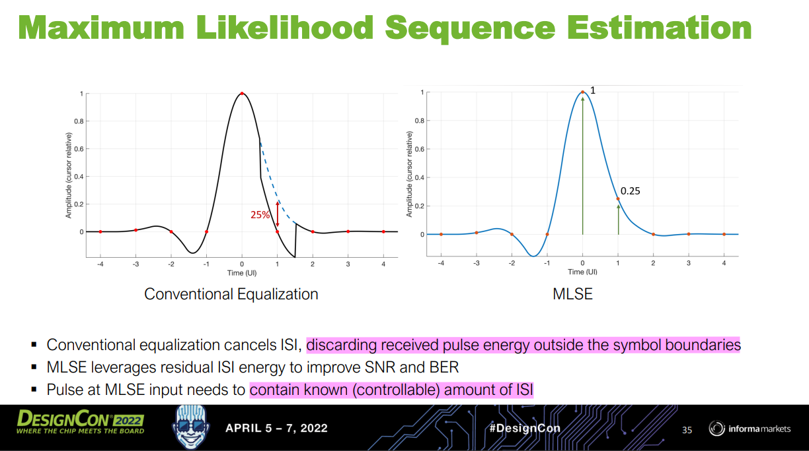

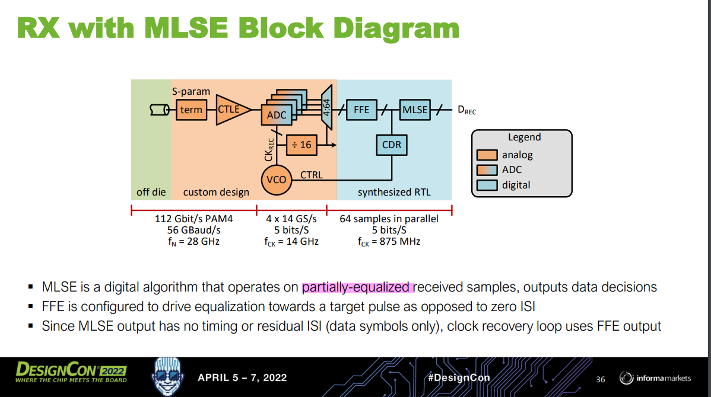

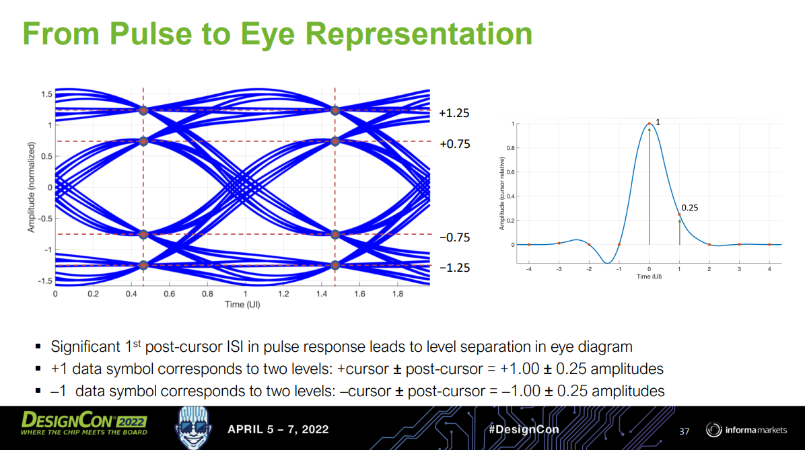

> [IBIS-AMI Modeling and Correlation Methodology for ADC-Based SerDes Beyond 100 Gb/s [https://static1.squarespace.com/static/5fb343ad64be791dab79a44f/t/63d807441bcd266de258b975/1675102025481/SLIDES_Track02_IBIS_AMI_Modeling_and_Correlation_Tyshchenko.pdf](https://static1.squarespace.com/static/5fb343ad64be791dab79a44f/t/63d807441bcd266de258b975/1675102025481/SLIDES_Track02_IBIS_AMI_Modeling_and_Correlation_Tyshchenko.pdf)]
>
> M. Emami Meybodi, H. Gomez, Y. -C. Lu, H. Shakiba and A. Sheikholeslami, "Design and Implementation of an On-Demand Maximum-Likelihood Sequence Estimation (MLSE)," in IEEE Open Journal of Circuits and Systems, vol. 3, pp. 97-108, 2022, doi: 10.1109/OJCAS.2022.3173686.
>
> Zaman, Arshad Kamruz (2019). A Maximum Likelihood Sequence Equalizing Architecture Using Viterbi Algorithm for ADC-Based Serial Link. Undergraduate Research Scholars Program. Available electronically from [[https://hdl.handle.net/1969.1/166485](https://hdl.handle.net/1969.1/166485)]

There are several variants of MLSD (Maximum Likelihood Sequence Detection), including:

- Viterbi Algorithm
- Decision Feedback Sequence Estimation (DFSE)
- Soft-Output MLSD

> [Evolution Of Equalization Techniques In High-Speed SerDes For Extended Reaches. [https://semiengineering.com/evolution-of-equalization-techniques-in-high-speed-serdes-for-extended-reaches/](https://semiengineering.com/evolution-of-equalization-techniques-in-high-speed-serdes-for-extended-reaches/)]

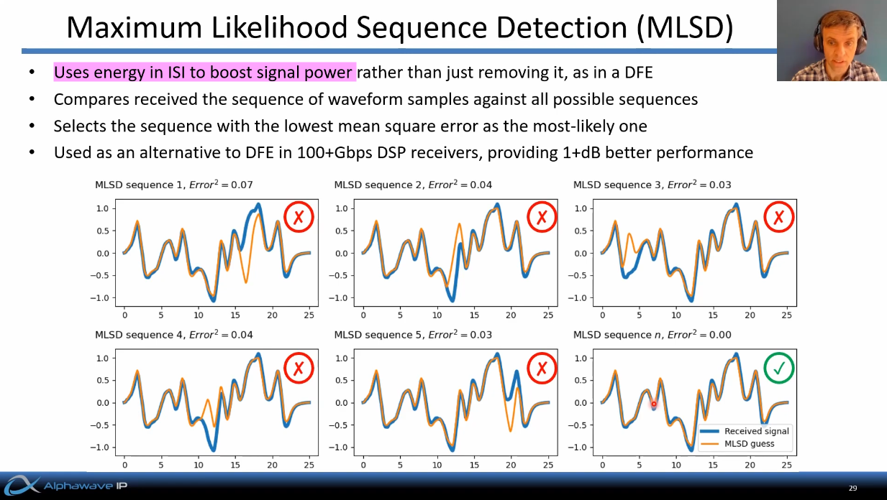

## Mueller-Muller CDR

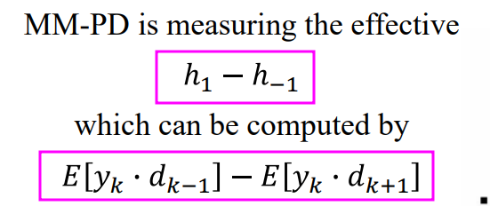

MMPD infers the channel response from baud-rate samples of the received data, the adaptation aligns the sampling clock such that pre-cursor is equal to the post-cursor in the *pulse response*

> Faisal A. Musa. "HIGH-SPEED BAUD-RATE CLOCK RECOVERY" [[https://www.eecg.utoronto.ca/~tcc/thesis-musa-final.pdf](https://www.eecg.utoronto.ca/~tcc/thesis-musa-final.pdf)]
>
> Faisal A. Musa."CLOCK RECOVERY IN HIGH-SPEED MULTILEVEL SERIAL LINKS" [[https://www.eecg.utoronto.ca/~tcc/faisal_iscas03.pdf](https://www.eecg.utoronto.ca/~tcc/faisal_iscas03.pdf)]
>
> Eduardo Fuentetaja. "Analysis of the M&M Clock Recovery Algorithm" [[https://edfuentetaja.github.io/sdr/m_m_analysis/](https://edfuentetaja.github.io/sdr/m_m_analysis/)]
>
> Liu, Tao & Li, Tiejun & Lv, Fangxu & Liang, Bin & Zheng, Xuqiang & Wang, Heming & Wu, Miaomiao & Lu, Dechao & Zhao, Feng. (2021). Analysis and Modeling of Mueller-Muller Clock and Data Recovery Circuits. Electronics. 10. 1888. 10.3390/electronics10161888. 
>
> Gu, Youzhi & Feng, Xinjie & Chi, Runze & Chen, Yongzhen & Wu, Jiangfeng. (2022). Analysis of Mueller-Muller Clock and Data Recovery Circuits with a Linearized Model. 10.21203/rs.3.rs-1817774/v1. 
>
> Baud-Rate CDRs [[https://ocw.snu.ac.kr/sites/default/files/NOTE/Lec%206%20-%20Clock%20and%20Data%20Recovery.pdf](https://ocw.snu.ac.kr/sites/default/files/NOTE/Lec%206%20-%20Clock%20and%20Data%20Recovery.pdf)]
>
> F. Spagna *et al*., "A 78mW 11.8Gb/s serial link transceiver with adaptive RX equalization and baud-rate CDR in 32nm CMOS," *2010 IEEE International Solid-State Circuits Conference - (ISSCC)*, San Francisco, CA, USA, 2010, pp. 366-367, doi: 10.1109/ISSCC.2010.5433823.
>
> K. Yadav, P. -H. Hsieh and A. C. Carusone, "Loop Dynamics Analysis of PAM-4 Mueller–Muller Clock and Data Recovery System," in *IEEE Open Journal of Circuits and Systems*, vol. 3, pp. 216-227, 2022
>
> Jaeduk Han, "Design and Automatic Generation of 60Gb/s Wireline Transceivers" [[https://www2.eecs.berkeley.edu/Pubs/TechRpts/2019/EECS-2019-143.pdf](https://www2.eecs.berkeley.edu/Pubs/TechRpts/2019/EECS-2019-143.pdf)]

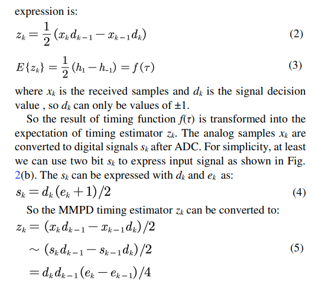

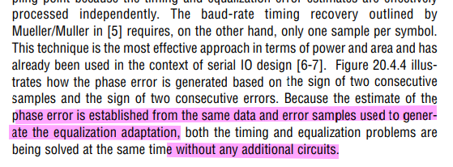

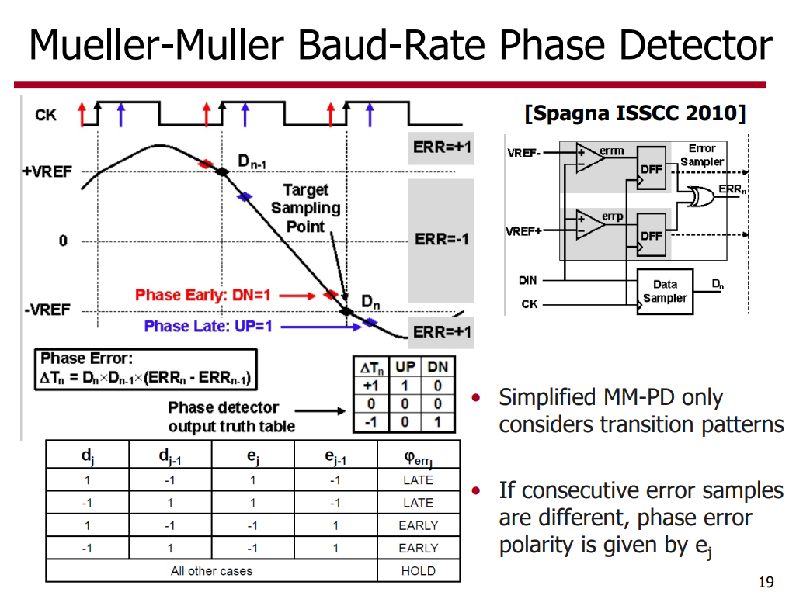

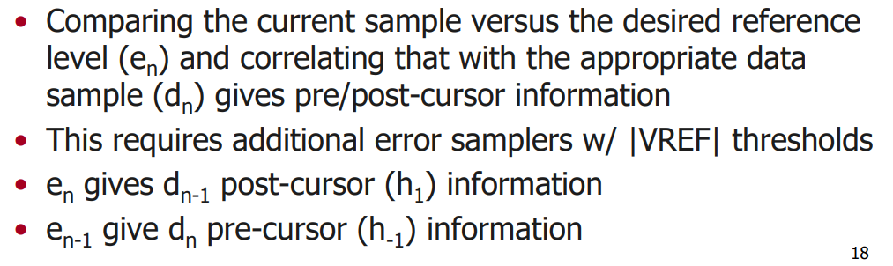

## SS-MM CDR

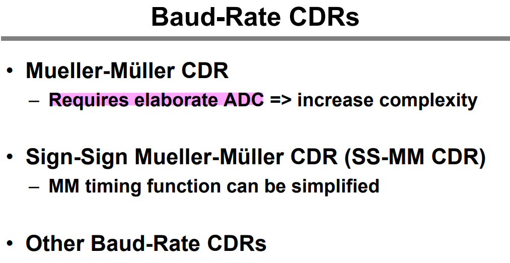

$h_1$ is **necessary**

- without DFE

  SS-MMPD locks at the point ($h_1=h_{-1}$​)

- With a 1-tap DFE

  1-tap adaptive DFE that forces the $h_1$ to be *zero*, the SS-MMPD locks wherever the $h_{-1}$​ is zero and drifts eventually.

  Consequently, it suffers from a severe *multiple-locking problem with an adaptive DFE*

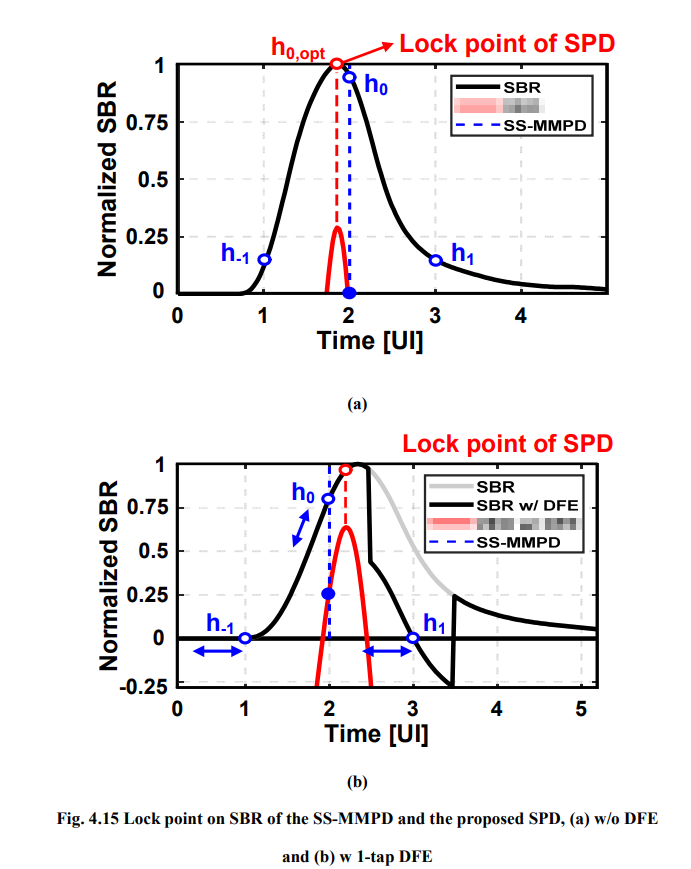

> Kwangho Lee, "Design of Receiver with Offset Cancellation of Adaptive Equalizer and Multi-Level Baud-Rate Phase Detector" [[https://s-space.snu.ac.kr/bitstream/10371/177584/1/000000167211.pdf](https://s-space.snu.ac.kr/bitstream/10371/177584/1/000000167211.pdf)]

### Pattern filter

| pattern | main cursor               |
| ------- | ------------------------- |
| 0**1**1 | $s_{011}=-h_1+h_0+h_{-1}$ |
| 1**1**0 | $s_{110}=h_1+h_0-h_{-1}$  |
| 1**0**0 | $s_{100}=h_1-h_0-h_{-1}$  |
| 0**0**1 | $s_{001}=-h_1-h_0+h_{-1}$ |

During adapting,  we make

- $s_{011}$ & $s_{110}$ are approaching to each other
- $s_{100}$ & $s_{001}$ are approaching to each other

Then, $h_{-1}$ and $h_1$ are same, which is desired

## Bang-Bang CDR

> alexander PD or !!PD

The alexander PD locks that edge clock (clkedge) is located at zero crossings of the data. The $h_{-0.5}$ and $h_{0.5}$ are **equal** at the *lock point,* where the  $h_{-0.5}$ and $h_{0.5}$ are the cursors located at -0.5 UI and 0.5 UI. 

> Kwangho Lee, "Design of Receiver with Offset Cancellation of Adaptive Equalizer and Multi-Level Baud-Rate Phase Detector" [[https://s-space.snu.ac.kr/bitstream/10371/177584/1/000000167211.pdf](https://s-space.snu.ac.kr/bitstream/10371/177584/1/000000167211.pdf)]
>
> Shahramian, Shayan, "Adaptive Decision Feedback Equalization With Continuous-time Infinite Impulse Response Filters" [[https://tspace.library.utoronto.ca/bitstream/1807/77861/3/Shahramian_Shayan_201606_PhD_thesis.pdf](https://tspace.library.utoronto.ca/bitstream/1807/77861/3/Shahramian_Shayan_201606_PhD_thesis.pdf)]
>
> MENIN, DAVIDE, "Modelling and Design of High-Speed Wireline Transceivers with Fully-Adaptive Equalization" [[https://air.uniud.it/retrieve/e27ce0ca-15f7-055e-e053-6605fe0a7873/Modelling%20and%20Design%20of%20High-Speed%20Wireline%20Transceivers%20with%20Fully-Adaptive%20Equalization.pdf](https://air.uniud.it/retrieve/e27ce0ca-15f7-055e-e053-6605fe0a7873/Modelling%20and%20Design%20of%20High-Speed%20Wireline%20Transceivers%20with%20Fully-Adaptive%20Equalization.pdf)]

## reference

Stojanovic, Vladimir & Ho, A. & Garlepp, B. & Chen, Fred & Wei, J. & Alon, Elad & Werner, C. & Zerbe, J. & Horowitz, M.A.. (2004). Adaptive equalization and data recovery in a dual-mode (PAM2/4) serial link transceiver. IEEE Symposium on VLSI Circuits, Digest of Technical Papers. 348 - 351. 10.1109/VLSIC.2004.1346611. 

A. A. Bazargani, H. Shakiba and D. A. Johns, "MMSE Equalizer Design Optimization for Wireline SerDes Applications," in *IEEE Transactions on Circuits and Systems I: Regular Papers*, doi: 10.1109/TCSI.2023.3328807.

Masum Hossain, ISSCC2023 T11: "Digital Equalization and Timing Recovery Techniques for ADC-DSP-based Highspeed Links" [[https://www.nishanchettri.com/isscc-slides/2023%20ISSCC/TUTORIALS/T11.pdf](https://www.nishanchettri.com/isscc-slides/2023%20ISSCC/TUTORIALS/T11.pdf)]

—, "LOW POWER DIGITAL EQUALIZATION FOR HIGH SPEED SERDES" [[https://www.ieeetoronto.ca/wp-content/uploads/2020/06/SSCS_invited_talk.pdf](https://www.ieeetoronto.ca/wp-content/uploads/2020/06/SSCS_invited_talk.pdf)]

A. Sharif-Bakhtiar, A. Chan Carusone, "A Methodology for Accurate DFE Characterization," *IEEE RFIC Symposium*, Philadelphia, Pennsylvania, June 2018. [[PDF](http://www.eecg.utoronto.ca/~tcc/Sharif-Bakhtiar_RFIC18.pdf)] [[Slides – PDF](http://www.eecg.utoronto.ca/~tcc/Sharif-Bakhtiar_RFIC18_slides.pdf)]

Tony Chan Carusone. High Speed Communications Part 11 – SerDes DSP Interactions [[https://youtu.be/YIAwLskuVPc?si=MYIbXLwFqQj0EElU](https://youtu.be/YIAwLskuVPc?si=MYIbXLwFqQj0EElU)]

Alphawave IP CEO. How DSP is Killing the Analog in SerDes [[https://youtu.be/OY2Dn4EDPiA?si=czIYfFrHpY4F-lKK](https://youtu.be/OY2Dn4EDPiA?si=czIYfFrHpY4F-lKK)]
