## Figures of Merit (FoMs)

> B. Murmann, "ADC Performance Survey 1997-2022," [Online]. Available: [[https://github.com/bmurmann/ADC-survey](https://github.com/bmurmann/ADC-survey)]
>
> Carsten Wulff, "Advanced Integrated Circuits 2025" [[http://analogicus.com/aic2025/2025/02/20/Lecture-6-Oversampling-and-Sigma-Delta-ADCs.html#high-resolution-fom](http://analogicus.com/aic2025/2025/02/20/Lecture-6-Oversampling-and-Sigma-Delta-ADCs.html#high-resolution-fom)]

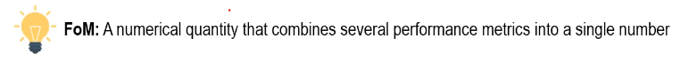

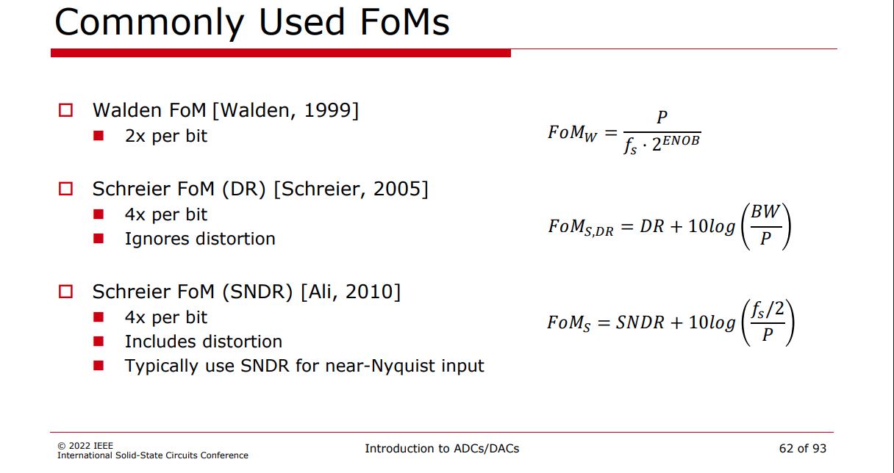

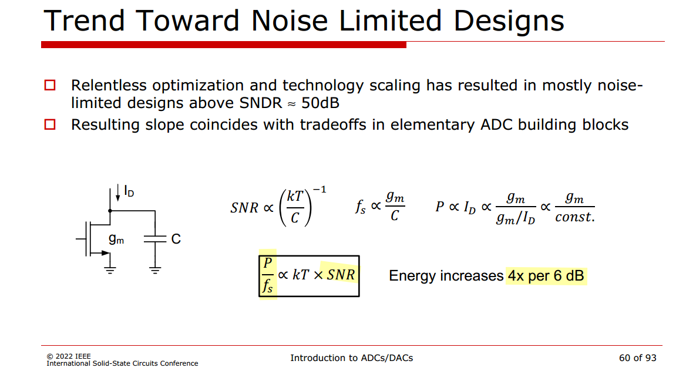

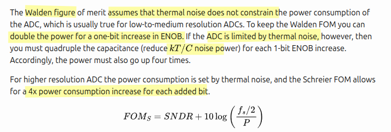

For Scherier FoM (DR, SNDR)

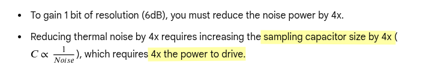

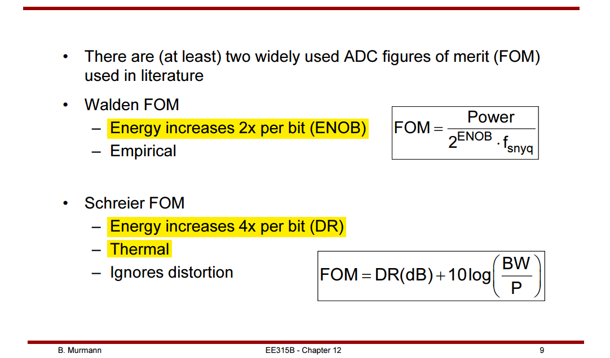

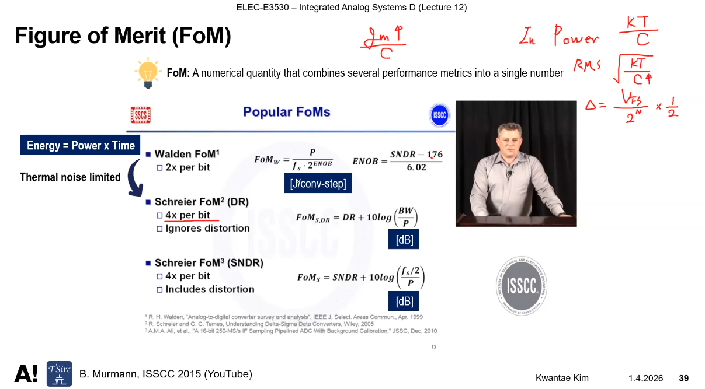


## Offset and Gain Error

> Kwantae Kim, Integrated Analog Systems D - Lecture 10 (ADC) [[https://youtu.be/IEdbLNJb9wQ](https://youtu.be/IEdbLNJb9wQ)]

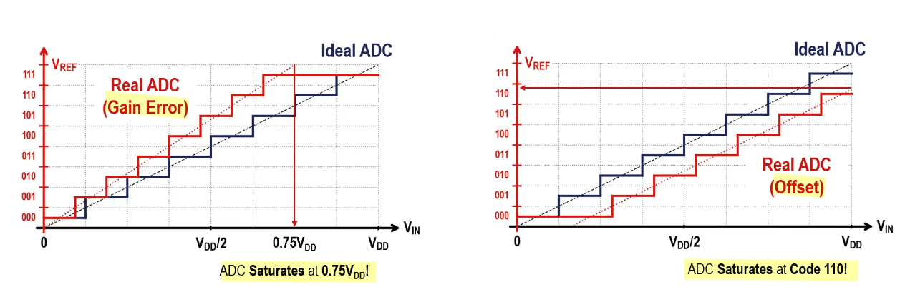

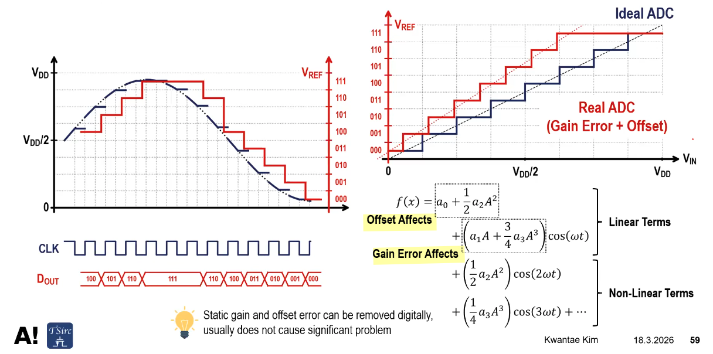

> 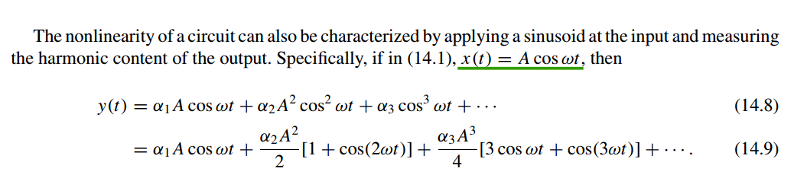

---

---


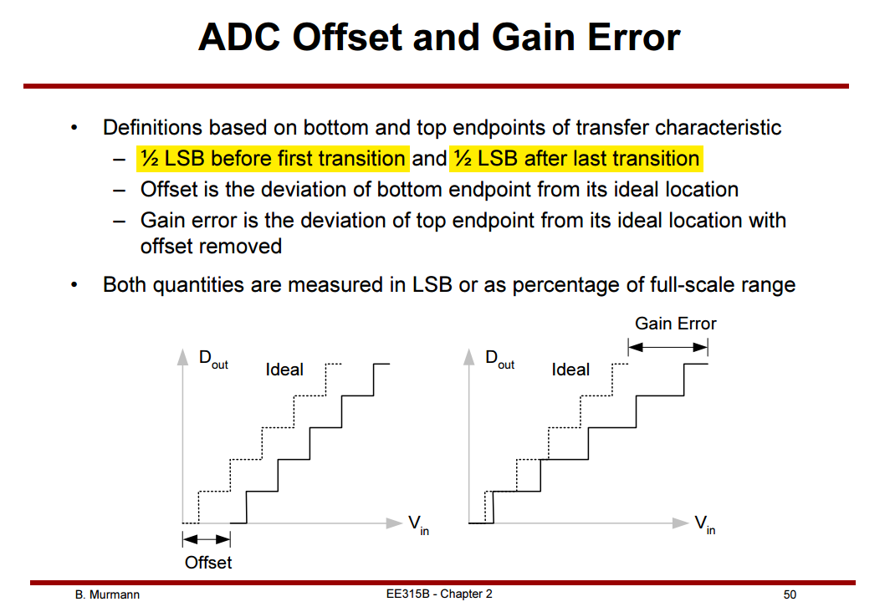

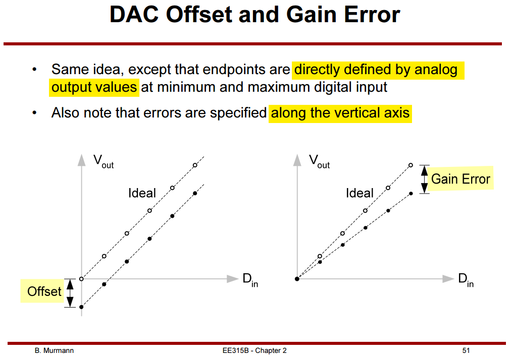


## Testing

> Kent H. Lundberg "Analog-to-Digital Converter Testing"  [[https://www.mit.edu/~klund/A2Dtesting.pdf](https://www.mit.edu/~klund/A2Dtesting.pdf)]
>
> Tai-Haur Kuo, Da-Huei Lee "Analog IC Design: ADC Measurement" [[http://msic.ee.ncku.edu.tw/course/aic/202309/ch13%20(20230111).pdf](http://msic.ee.ncku.edu.tw/course/aic/202309/ch13%20(20230111).pdf)] [[http://msic.ee.ncku.edu.tw/course/aic/aic.html](http://msic.ee.ncku.edu.tw/course/aic/aic.html)]
>
> ESE 6680: Mixed Signal Design and Modeling "Lec 20: April 10, 2023 Data Converter Testing" [[https://www.seas.upenn.edu/~ese6680/spring2023/handouts/lec20.pdf](https://www.seas.upenn.edu/~ese6680/spring2023/handouts/lec20.pdf)]
>
> Degang Chen. "Distortion Analysis" [[https://class.ece.iastate.edu/djchen/ee435/2017/Lecture25.pdf](https://class.ece.iastate.edu/djchen/ee435/2017/Lecture25.pdf)]

*TODO* &#128197;


## ADCToolbox

> L. Jie and Z. Zhang. ADCToolbox [[https://github.com/Arcadia-1/ADCToolbox](https://github.com/Arcadia-1/ADCToolbox)]


***SNR vs NSD*** — full-scale noise spread over the Nyquist band

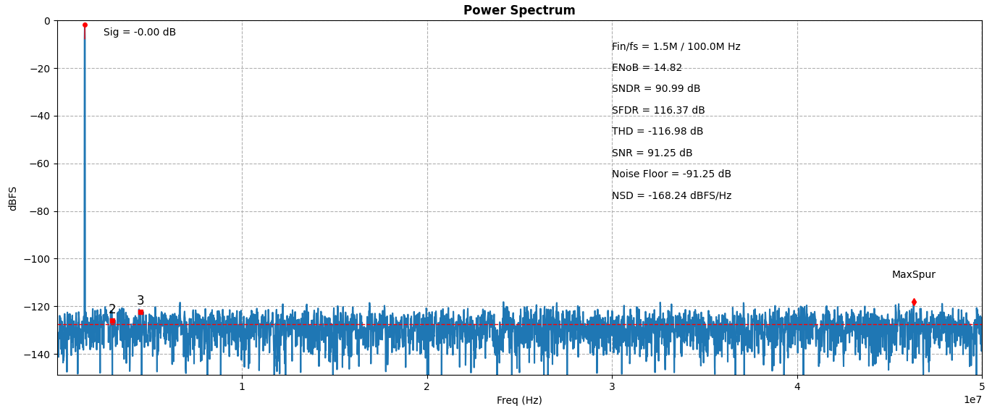

```python
## https://github.com/Arcadia-1/ADCToolbox/blob/main/python/src/adctoolbox/examples/02_spectrum/exp_s01_analyze_spectrum_simplest.py

import numpy as np
import matplotlib.pyplot as plt
from adctoolbox import analyze_spectrum, amplitudes_to_snr, snr_to_nsd

N_fft = 2**13
Fs = 100e6
Fin = 123/N_fft * Fs  # Coherent frequency
t = np.arange(N_fft) / Fs
A = 0.5
noise_rms = 10e-6
signal = 0.5 * np.sin(2*np.pi*Fin*t) + np.random.randn(N_fft) * noise_rms

# --- My own manual cross-check (not in exp_s01_analyze_spectrum_simplest.py) ---
# Hand-derived from first principles to sanity-check the amplitudes_to_snr /
# snr_to_nsd helpers below:
#   SNR = 10*log10( signal_power / noise_power ) = 10*log10( (A^2/2) / noise_rms^2 )
#   NSD = -SNR - 10*log10(Fs/2)  (full-scale noise spread over the Nyquist band)
snr_theroretical = 10*np.log10(A**2/2/noise_rms**2)
print(f"Theoretical SNR: {snr_theroretical:.2f} dB")
nsd_theoretical = -snr_theroretical - 10*np.log10(Fs/2)
print(f"Theoretical NSD: {nsd_theoretical:.2f} dBFS/Hz")
# --- end of my addition ---

snr_ref = amplitudes_to_snr(sig_amplitude=A, noise_amplitude=noise_rms)
nsd_ref = snr_to_nsd(snr_ref, fs=Fs, osr=1)

result = analyze_spectrum(signal, fs=Fs)

print(f"\n[setting] Noise RMS=[{noise_rms*1e6:.2f} uVrms], Theoretical SNR=[{snr_ref:.2f} dB], Theoretical NSD=[{nsd_ref:.2f} dBFS/Hz]")
print(f"[results] ENoB=[{result['enob']:.2f} b], SNDR=[{result['sndr_dbc']:.2f} dB], SFDR=[{result['sfdr_dbc']:.2f} dB], SNR=[{result['snr_dbc']:.2f} dB], NSD=[{result['nsd_dbfs_hz']:.2f} dBFS/Hz]\n")

plt.show()

# Theoretical SNR: 90.97 dB
# Theoretical NSD: -167.96 dBFS/Hz

# [setting] Noise RMS=[10.00 uVrms], Theoretical SNR=[90.97 dB], Theoretical NSD=[-167.96 dBFS/Hz]
# [results] ENoB=[14.82 b], SNDR=[90.99 dB], SFDR=[116.37 dB], SNR=[91.25 dB], NSD=[-168.24 dBFS/Hz]
```


## reference

Aaron Buchwald, ISSCC2010 T1: "Specifying & Testing ADCs"

Ahmed M. A. Ali. ISSCC2021 T5: Calibration Techniques in ADCs

Boris Murmann, ISSCC2022 SC1: Introduction to ADCs/DACs: Metrics, Topologies, Trade Space, and Applications

—， ISSCC2012 SC3: Introduction to ADCs/DACs: Metrics, Topologies, Trade Space, and Applications

—， A/D Converter Figures of Merit and Performance Trends
