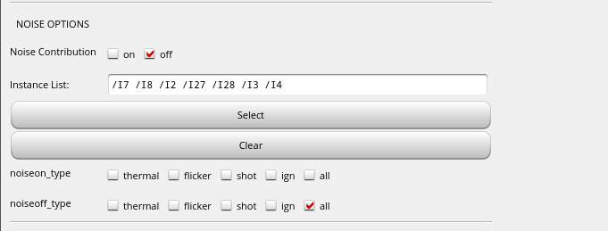
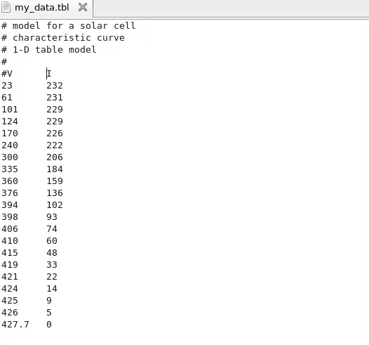
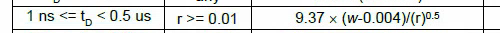

## Hide Color


## Layout XL pointing to new schematic

Connectivity(Menu in Layout View) ---> Update ---> Connectivity Reference


## noiseon & noiseoff

Options -> Analog...




> only work in presimu simulation (*excluding lpe.spi)*


## vsource with noisefile

1. both rise/fall edge are added the noisefile
2. noise between rise and fall edge are partially correlated


***Pnoise sampled(jitter) with Sampled Phase***


vsource output is applied with noise *all the time*


## Loockup Table vs Equations Model in Verilog-A

> Solar Cell Verilog Model for Cadence [[https://miscircuitos.com/solar-cell-verilog-model-for-cadence/](https://miscircuitos.com/solar-cell-verilog-model-for-cadence/)]
>
> How to Create a new Cell in Cadence with a Loockup Table Model in Verilog-A [[https://miscircuitos.com/how-to-create-a-model-in-verilog-a-with-a-lockup-table/](https://miscircuitos.com/how-to-create-a-model-in-verilog-a-with-a-lockup-table/)]


---


**with Equation**


```verilog
/////////////////////////////////////////////////////////////////////////////
//
// Engineer: Alberto Lopez
//
// Description: Verilog model of the solar cell IXYS
//
// Change history: 1/7/2018
//
/////////////////////////////////////////////////////////////////////////////
`include "constants.vams"
`include "disciplines.vams"

module SolarCell( EN, Vsolar, GND);

input EN;
electrical EN;

output Vsolar;
electrical Vsolar;
output GND;
electrical GND;

parameter real vdd = 1.2;
parameter real vthreshold = 0.6;
parameter real fc = 10M;
parameter real light = 6;

//Curve parameters
real gm;
real A;
real factor;
real Vop;
real vcp;

integer light_i;
integer en;
analog begin

    @(initial_step)    begin 
        en = 0;
        A = 1;    
        Vop = 1;
        factor = 10;
    end
//Enable digitalization
    @(cross(V(EN)-vthreshold,1)) begin
        if(V(EN)&gt;=vthreshold) en = 1;
        else en = 0;
    end
        
    case(light):
            0: begin A = 0; Vop = 0; end
            1: begin A = -1.2; Vop = 1.71; end
            2: begin A = -0.8; Vop = 1.64; end
            3: begin A = -0.4; Vop = 1.50; end
            4: begin A = 0.1; Vop = 1.43; end
            5: begin A = 0.7; Vop = 1.36; end
            6: begin A = 1.1; Vop = 1.22; end
            default: begin A = -1.2; Vop = 1.71; end
        endcase

    //gm = A + atan(factor*(Vop-V(Vsolar))); //Transconductance

    vcp=laplace_nd(V(Vsolar,GND),{1},{1,1/(6.28*fc)});

    I(Vsolar,GND) &lt;+  (A + atan(factor*(vcp -Vop)))/1000;

end //analog
endmodule
```


---


**with lookup table**



```verilog
///////////////////////////////////////////////////////////////////////////
// Engineer: Alberto Lopez
//
// Description: Verilog model of the solar cell photodiode
//
// Change history: 11/Sept/2019
//
/////////////////////////////////////////////////////////////////////////////
`include "constants.vams"
`include "disciplines.vams"
 
module SolarCell_Table( EN, Vsolar, GND);
 
input EN;
electrical EN;
 
output Vsolar;
electrical Vsolar;
output GND;
electrical GND;

 
//Curve parameters
parameter real light =1;
parameter real vthreshold = 0.6;

real Vcp;
real iout, itemp;
real i1,i2, i3, i4, i5;
integer en;
analog begin
 
    @(initial_step)    begin 
        en = 0;
    end

//Enable function
    @(cross(V(EN) -vthreshold,1)) begin
        if(V(EN)>=vthreshold) en = 1;
        else en = 0;
    end

    Vcp = V(Vsolar,GND)*1000;

    i1 =  -$table_model (Vcp, "ph4_1.tbl", "1C")/1000000;
    i2 =  -$table_model (Vcp, "ph4_2.tbl", "1C")/1000000;
    i3 =  -$table_model (Vcp, "ph4_3.tbl", "1C")/1000000;
    i4 =  -$table_model (Vcp, "ph4_4.tbl", "1C")/1000000;
    i5 =  -$table_model (Vcp, "ph4_5.tbl", "1C")/1000000;

//    if(itemp <0 ) iout = itemp;
//    else iout = 0;
    case (light)
        1: iout = i1;
        2: iout = i2;
        3: iout = i3;
        4: iout = i4;
        5: iout = i5;
        default: iout = 0;
    endcase
    
    if(en== 0) iout = 0;

    I(Vsolar,GND) <+  iout;
 
end //analog
endmodule
```


## PEX LAYER_MAP

```
// *LAYER_MAP
// *1 POLY
// *2 CONT
// *3 M1
...
*RES
8 ENL:30 ENL:34 0.525075 // $lvl=3
9 ENL ENL:30 0.07 // $lvl=3
```

[[https://picture.iczhiku.com/resource/eetop/wYItYWLPleWrpvNV.pdf](https://picture.iczhiku.com/resource/eetop/wYItYWLPleWrpvNV.pdf)]


## nodeset & initial condition


 - A nodeset steers the convergence in a particular direction - useful to speed up DC convergence

 - An initial condition is useful when you want to force the circuit to start a transient in a particular condition


[[https://community.cadence.com/cadence_technology_forums/f/rf-design/29843/ade--difference-between-node-set-and-initial-condition/1335460](https://community.cadence.com/cadence_technology_forums/f/rf-design/29843/ade--difference-between-node-set-and-initial-condition/1335460)]

## Remove prefix from multiple files in Linux console

Bash

```
for file in prefix*; do mv "$file" "${file#prefix}"; done;
```

The for loop iterates over all files with the prefix. The do removes from all those files iterated over the prefix.

Here is an example to remove "bla_" form the following files:

```
bla_1.txt
bla_2.txt
bla_3.txt
blub.txt
```

Command

```
for file in bla_*; do mv "$file" "${file#bla_}";done;
```

Result in file system:

```
1.txt
2.txt
3.txt
blub.txt
```


> [[https://gist.github.com/guisehn/5438bbc22138435665c6e996493fe02b](https://gist.github.com/guisehn/5438bbc22138435665c6e996493fe02b)]


## remove .cdslck

```sh
 #!/bin/sh
tree -if | grep 'cdslck' > txt
var=`cat txt`
for i in $var; do
	rm -i $i
done
rm -i txt
```

> [[https://wikis.ece.iastate.edu/vlsi/index.php?title=Tips_%26_Tricks#Locked_Files_in_Cadence](https://wikis.ece.iastate.edu/vlsi/index.php?title=Tips_%26_Tricks#Locked_Files_in_Cadence)]


## Custom Bindkey

### schBindKeys.il

> schematic

```
alias bk hiSetBindKey
when ( isCallable('schGetEnv')
bk("Schematics" "Ctrl<Key>x" "schHiCreateInst(\"basic\" \"nonConn\" \"symbol\")")
bk("Schematics" "Ctrl<Key>v" "schHiCreateInst(\"analogLib\" \"vdc\" \"symbol\")")
bk("Schematics" "Ctrl<Key>g" "schHiCreateInst(\"analogLib\" \"gnd\" \"symbol\")")
bk("Schematics" "Shift<Key>9" "geDeleteNetProbe()")
bk("Schematics" "<Key>0" "geDeleteAllProbe(getCurrentWindow()t)")
)
unalias bk
```

### leBindKeys.il

> layout

```
alias bk hiSetBindKey
when ( isCallable('leGetEnv)
    bk("Layout" "<Key>1" "leSetEntryLayer(\"M0PO\") leSetAllLayerVisible(nil) leSetEntryLayer(\"M0OD\") leSetEntryLayer(\"VIA0\") leSetEntryLayer(list(\"M1\" \"pin\")) leSetEntryLayer(\"M1\") hiRedraw()" )
    ; M1-VIA1-M2
    bk("Layout" "<Key>2" "leSetEntryLayer(\"M1\") leSetAllLayerVisible(nil) leSetEntryLayer(\"VIA1\") leSetEntryLayer(list(\"M2\" \"pin\")) leSetEntryLayer(\"M2\") hiRedraw()" )
    ; M2-VIA2-M3
    bk("Layout" "<Key>3" "leSetEntryLayer(\"M2\") leSetAllLayerVisible(nil) leSetEntryLayer(\"VIA2\") leSetEntryLayer(list(\"M3\" \"pin\")) leSetEntryLayer(\"M3\") hiRedraw()" )
    ; M3-VIA3-M4
    bk("Layout" "<Key>4" "leSetEntryLayer(\"M3\") leSetAllLayerVisible(nil) leSetEntryLayer(\"VIA3\") leSetEntryLayer(list(\"M4\" \"pin\")) leSetEntryLayer(\"M4\") hiRedraw()" )
    ; M4-VIA4-M5
	; select M4 layer, turn off other layer visibilty, select VIA4 M5_pin M5 and turn on them
    bk("Layout" "<Key>5" "leSetEntryLayer(\"M4\") leSetAllLayerVisible(nil) leSetEntryLayer(\"VIA4\") leSetEntryLayer(list(\"M5\" \"pin\")) leSetEntryLayer(\"M5\") hiRedraw()" )
    ; all visiable
    bk("Layout" "<Key>0" "leSetAllLayerVisible(t) hiRedraw()" )
)
unalias bk
```


## Design Variable in vpwlf

`PWL File as Design Var?` parameter in *vpwlf* cell is convenient for sweep simulation or corner simulation, wherein there are multiple pwl files .


The file path should be surrounded with **double-quotes** to be protected from evaluation.


## save option

**none**:

​	Does not save any data (currently does save one node chosen at random)

**selected**:

​	Saves only signals specified with save statements. The default setting.

**lvlpub**:

 	Saves all signals that are normally useful up to nestlvl deep in the subcircuit hierarchy. This option is equivalent to allpub for subcircuits.

**lvl**:

​	Saves all signals up to nestlvl deep in the subcircuit hierarchy. This option is relevant for subcircuits.

**allpub**:

​	Saves only signals that are normally useful.

**all**:

​	 Saves all signals.

> Signals that are "normally useful" include the shared node voltages and currents through voltage sources and iprobes, and exclude the internal nodes on devices (the internal collector, base, emitter on a BJT, the internal drain, source on a FET, and so on). It also excludes currents through inductors, controlled sources, transmission lines, transformers, etc.
>
> If you use **lvl** or **all** instead of **lvlpub** or **allpub**, you will also get internal node voltages and currents through other components that happen to compute current.
>
> Thus, using **\*pub** excludes internal nodes on devices (the internal collector, base, emitter on a BJT, the internal drain and source on a FET, etc). It also excludes the currents through inductors, controlled sources, transmission lines, transformers, etc.


> **nestlvl**
>
> This variable is used to save groups of signals as results and when signals are saved in subcircuits. The nestlvl parameter also specifies how many levels deep into the subcircuit hierarchy you want to save signals.


## virtuoso "dlopen failed to open 'libdl.so'"

```bash
$ sudo yum install glibc-devel  
```

```
Last metadata expiration check: 0:01:02 ago on Sat 24 Sep 2022 12:13:54 AM CST.                                                         
Dependencies resolved.
=========================================================================================================================================
 Package                            Architecture              Version                                    Repository                 Size
=========================================================================================================================================
Installing:
 glibc-devel                        x86_64                    2.28-189.5.el8_6                           baseos                     78 k
Installing dependencies:
 glibc-headers                      x86_64                    2.28-189.5.el8_6                           baseos                    482 k
 kernel-headers                     x86_64                    4.18.0-372.26.1.el8_6                      baseos                    9.4 M
 libxcrypt-devel                    x86_64                    4.1.1-6.el8                                baseos                     24 k

Transaction Summary
=========================================================================================================================================
Install  4 Packages
```


## SpiceIn foundary's standard cell's spice netlist

use **SpiceIn** GUI feature to map MOS parameter correctly in generated schematic

### Input


> The mos's total width (parameter name "w") value will update during **SpiceIn** trigger CDF callback automatically

### Output


### Device Map


> **User Prop Mapping** is significant setup, both *xxx.spi* and *Edit CDF* provide the essential information.
>
> The map syntax is *spice_para0 cdf_para0 spice_para1 cdf_para01 ... spice_paraN cdf_paraN*


### reference

Article (20488179) Title: How to use SpiceIn GUI feature to map MOS parameter correctly in generated schematic
URL: [https://support.cadence.com/apex/ArticleAttachmentPortal?id=a1O3w000009bdPWEAY](https://support.cadence.com/apex/ArticleAttachmentPortal?id=a1O3w000009bdPWEAY)

Article (11724692) Title: SpiceIn maps the netlist parameter to the CDF parameter incorrectly on the generated schematic devices  (e.g. w to wf)
URL: [https://support.cadence.com/apex/ArticleAttachmentPortal?id=a1Od0000000nZ2CEAU](https://support.cadence.com/apex/ArticleAttachmentPortal?id=a1Od0000000nZ2CEAU)


## Model Library Setup

In order to set up model files automatically in the *Model Library Setup* form for Spectre or AMS simulator in ADE Explorer or ADE Assembler

Add the following line in your  `.cdsinit`

```skill
envSetVal( "spectre.envOpts" "modelFiles" 'string "<path_to model_file>/myModels.scs")
```

or

```
envSetVal("spectre.envOpts" "modelFiles" 'string "moreModels;ff mymodels;tt")
```


## DSPF for each corner

Create a new file with an extension **scs** like *myDSPF_Files.scs*

```
* DSPF files to use with Corner Definitions
* This is an example file showing how to define different dspf files for different corners
* using model files for individual components as the
* building blocks.
simulator lang=spectre
library dspf_files_corners

section rctyp_25
dspf_include "DSPF_RC_TYPNOM25.spf"
endsection rctyp_25

section rctyp_125
dspf_include "DSPF_RC_TYP125.spf"
endsection rctyp_125

section rcworst_25
dspf_include "DSPF_RC_WORSE25.spf"
end section rcworst_25

section rcworst_125
dspf_include "DSPF_RC_WORSE125.spf"
end section rcworst_125

endlibrary dspf_files_corners
```

Add the file created above ‘*myDSPF_File.scs*’  in ‘*Add/Edit Model Files*’ of Corners setup form


## split pins in dspf_emir

### dspf extract using starrc

multiple label and rectangle  in vssa net


- general dspf

  `SHORT_PINS: YES`

  

  > other pin are short together

- dspf for emir analysis


> It seems that dspf_emir **don't** contain the *rectangle pin* information.
>
> only **label** is necessary
>
> 
>
> 


| setup            |                 |                   | spectre result |
| ---------------- | --------------- | ----------------- | -------------- |
| **netlist type** | **dspf option** | **emir analysis** |                |
| dspf             | /               | disable           | &check;        |
| dspf_emir        | /               | disable           | &cross;        |
| dspf_emir        | shortPins="yes" | disable           | &check;        |
| dspf_emir        | shortPins="no"  | disable           | &cross;        |
| dspf_emir        | /               | enable            | &check;        |
| dspf_emir        | shortPins="yes" | enable            | &check;        |
| dspf_emir        | shortPins=”no”  | enable            | &check;        |

> **shortPins="yes"** is preferred default option for dspf_emir, which has **split pins**


### DSPF Syntax

- <pin_def>::=***|P <pin_element>?**
  	<pin_element> describes pins in the net. Multiple pin descriptions can be listed in one line.

- <pin_element>::=(<pinName> <pinType> <pinCap> {<coord>}?)
  	<pinName> represents the name of the pin.
  	<pinType> represents the type of the pin. It can be any of the following: I (Input), O (Output),

  ​	    B (Bidirectional), X (don’t care), S (Switch), and J (Jumper).
  ​	<pinCap> represents the capacitance value associated with the pin.
  ​	<coord> is optional. It represents the location of the pin. Multiple pin locations are allowed


#### split pins

```
*|P (avss_1 O 0 207.7555 59.9170)
*|P (avss_10 O 0 181.1610 151.1130)
*|P (avss_11 O 0 186.6330 151.1130)
*|P (avss_12 O 0 192.1050 151.1130)
*|P (avss_13 O 0 197.5770 151.1130)
```


### reference

Article (20467964) Title: Difference in result on running Spectre APS with EMIR and without EMIR analysis
URL: [https://support.cadence.com/apex/ArticleAttachmentPortal?id=a1O0V00000679GRUAY](https://support.cadence.com/apex/ArticleAttachmentPortal?id=a1O0V00000679GRUAY)

StarRC User Guide and Command Reference Version O-2018.06, June 2018


## DSPF Options

### Case Sensitivity

| **netlist format** | **default option** |
| ------------------ | ------------------ |
| Spectre netlist    | *case sensitive*   |
| dspf format        | *case insensitive* |

> For a **dspf format**, it will be treated as a *spice netlist format*, which is *by default case insensitive*


Pay attention to *VerilogIn* block, which may contain upper case / lower case net name, e.g NET1 and net1.

The extracted DSPF using extraction tool also contain NET1 and net1, which **shall not** be shorted together.


### Port Order

> If you use `.dspf_include`, the following rules apply:
>
> - The subcircuit description is taken from the DSPF file even if the same subcircuit description is available in the schematic netlist.
> - Depending on the `port_order` option, the port order of the subcircuit definition is taken from the pre-layout schematic netlist or from the DSPF file subcircuit definition, as shown below.
>   - `port_order=sch` – (Default). The port order is taken from schematic subcircuit definition. The same port number and names are required. If the schematic subcircuit definition is not available, a warning is issued in the log file, and DSPF port order is used.
>   - `port_order=spf` – The port order is taken from the DSPF subcircuit definition.


**SPICE_SUBCKT_FILE** of StarRC

The StarRC tool reads the files specified by the *SPICE_SUBCKT_FILE* command to obtain
**port ordering information**. The files control the port ordering of the top cell as well. The port
order and the port list members read from the **.subckt** for a skip cell are preserved in the
output netlist.

> The file usually is the *cdl netlist* of extracted cell, this way, port order is not problem

**CDF termOrder**


#### DSPF same order

**DSPF**


**input.scs**


#### different order

manual change DSPF's pin order shown as below


#### port_order=sch

*dspf port is mapping to schematic by name*, and the simulation result is right


##### port_order=spf

dspf pin order is retained, and **no mapping** between spectre netlist and dspf.

The simulation result is wrong


>  bus_delim="_ <>"
>
>  The way this works is that the first part of *bus_delim* is the "schematic" delimiter (i.e. what's in the spectre netlist), and the other part is the DSPF delimiter

### reference

Article (20502176) Title: How does Spectre understand case-sensitive net names when using various post-layout netlists such as dspf, av_extracted view, or smart view?
URL: [https://support.cadence.com/apex/ArticleAttachmentPortal?id=a1O3w000009fthoEAA](https://support.cadence.com/apex/ArticleAttachmentPortal?id=a1O3w000009fthoEAA)

spf in cadence [https://community.cadence.com/cadence_technology_forums/f/custom-ic-design/31326/spf-in-cadence/1342278#1342278](https://community.cadence.com/cadence_technology_forums/f/custom-ic-design/31326/spf-in-cadence/1342278#1342278)

Spectre Tech Tips: Using DSPF Post-Layout Netlists in Spectre Circuit Simulator - Analog/Custom Design - Cadence Blogs - Cadence Community [https://shar.es/afO6e1 ](https://shar.es/afO6e1 )

StarRC™ User Guide and Command Reference Version O-2018.06, June 2018


## Virtual Connectivity

Normally, if the layout connectivity extractor finds disjoint, unconnected geometries with the same net name text attached, the extractor will view this as an open circuit.

- Virtual connection results in the extraction of a single net from two or more disjoint physical nets when the physical net segments share the same name.
- Virtual connectivity is triggered by the rule file **VIRTUAL CONNECT COLON** and **VIRTUAL CONNECT NAME** specification statements.
- Virtual connectivity can also be specified through the Calibre Interactive GUI.


> *Virtual connectivity* is of primary interest in **LVS** applications
>
> `connect all nets by name`: `VIRTUAL CONNECT NAME "?"`


### VIRTUAL CONNECT COLON

**Virtual Connect Colon** is used to virtually connect nets that *share a common prefix before a colon*, like VDD**:**1, VDD**:**2, and so forth.

If you specify *YES*, then the connectivity extractor first *strips off* all characters from the first
colon to the end of the label names.

Next, the extractor forms a virtual connection between any two labels that have the same name and that *originally contained a colon*.

Colons can appear anywhere in the name with the exception that a colon at the beginning of a name is treated as a regular character (that is, it has no special effect).


> *up to the first colon character* encountered
>
> The *colon* is **discarded** in the extracted net name


### VIRTUAL CONNECT NAME

**Virtual Connect Name** virtually connects nets that share the same name

Each name is a net name and can be optionally enclosed in quotes.

The connectivity extractor forms a virtual connection between ***any two labels having the same name*** such that the label name appears in a **Virtual Connect Name** specification statement in the rule file.


> `VIRTUAL CONNECT NAME ?` == Connect all nets by name


Note that if **Virtual Connect Colon YES** is also specified, then **Virtual Connect Name** operates on names
*after all colon suffixes have been stripped off*.


---


---


> Calibre Fundamentals: Performing DRC/LVS Student Workbook
>
> Calibre Verification User’s Manual Software Version 2019.3 Document Revision 7
>
> Y.Liu. PDK Training - Calibre user guide [[https://picture.iczhiku.com/resource/eetop/SyKTloquGiZeHMbx.pdf](https://picture.iczhiku.com/resource/eetop/SyKTloquGiZeHMbx.pdf)]


## Calibre Runsets

Calibre Interactive stores a list of your most recently opened runsets in your *home directory* as `.cgidrcdb` or `.cgilvsdb` for Calibre Interactive DRC or LVS, respectively. 

When invoked, the Calibre DRC and LVS windows automatically load the runset used when the last session was closed. 

> Runsets are ASCII files that set up Calibre Interactive for a Calibre run. They contain only information that differs from the default configuration of Calibre Interactive. There is a one-to-one correspondence between entry lines in the runset file and fields and button items in the Calibre Interactive user interface. Here is as example of a DRC runset:
>
> ```
> *drcRulesFile: rule_file
> *drcRulesFileLastLoad: 1009224452
> *drcLayoutPaths: ./lab3.gds
> *drcLayoutPrimary: lab3
> *drcResultsFile: ./lab3.db
> *drcSummaryFile: drc_report
> *drcRunTurbo: 0
> *drcRunRemoteOn: Cluster
> *drcRemoteLICENSEFILEName: MGLS_LICENSE_FILE
> *drcRemoteLICENSEFILEValue: /scratch1/mgls/mgclicenses
> *drcDontWaitForLicense: 0
> ```


---

The runset filename opened at startup (if no runset is specified on the command line) can also be specified by setting the `MGC_CALIBRE_DRC_RUNSET_FILE` environment variable for DRC, and the `MGC_CALIBRE_LVS_RUNSET_FILE` environment variable for LVS. If these environment variables are set, they take precedence over all other runset opening behavior options. 

```
setenv RUNSET_DIR ../calibre
setenv MGC_CALIBRE_DRC_RUNSET_FILE $RUNSET_DIR/tsmc180nm_drc_runset
setenv MGC_CALIBRE_LVS_RUNSET_FILE $RUNSET_DIR/tsmc180nm_lvs_runset
setenv MGC_CALIBRE_PEX_RUNSET_FILE $RUNSET_DIR/tsmc180nm_pex_runset
setenv CALIBRE_DISABLE_RHEL5_WARNING 1
```


### reference

tsmc_template. [https://github.com/lnis-uofu/tsmc_template/tree/main](https://github.com/lnis-uofu/tsmc_template/tree/main)

Calibre Verification User’s Manual


## DC sweep & parametric sweep

> `swpuseprevic`


## variables with statistical distribution

`Specifying Parameter Distributions Using Statistics Blocks`

- `process`:  generate random number once per MC run
- `mismatch` :  generate a random number per instance


### reference

Article (20498356) Title: How to vary design variables with statistical distribution to be used with Monte Carlo analysis
URL: [https://support.cadence.com/apex/ArticleAttachmentPortal?id=a1O3w000009ErHHEA0](https://support.cadence.com/apex/ArticleAttachmentPortal?id=a1O3w000009ErHHEA0)

Spectre Circuit Simulator Reference


## DC operating points during TRANSIENT


> [Andrew Beckett](https://community.cadence.com/members/andrew-beckett)[over 11 years ago](https://community.cadence.com/cadence_technology_forums/f/rf-design/25702/finding-dc-operating-points-at-certain-timepoints-during-transient-analysis/1321796#1321796)
>
> Two approaches:
>
> 1. On the transient options form, there's a field called "infotimes" - specify the times at which you want it to output the dc operating point data. You can then annotate the "transient operating points" from any of these times after the simulation, or access them via the results browser.
> 2. Or you could get the operating point data to be continuously saved during the transient for selected devices - if so, create a file called (say) "save.scs" (make sure it has a ".scs" suffix), and put:
>    save M1:oppoint
>    or
>     save M*:oppoint sigtype=dev
>    in this file, and then reference the file via Setup->Model Libraries or as a "definition file" on Setup->Simulation Files.
>    With this approach you can then find the operating point data for the selected devices in the results browser and plot it versus time (be cautious of saving too much though because this can generate a lot of data if you're not careful)
>
> Regards,
>
> Andrew.


###  transient options form

#### setup


#### access 1

**right-click** $\to$ **Annotate**  $\to$ **Transient Operating Points**


#### access 2

**tranOpTimed**


### save.scs

```
save M0:oppoint
```


## How to Save Node in DSPF?


### DSPF Semantics

`*|DIVIDER <divider>`

`<divider>` represents the hierarchical pathname divider. The default hierarchical character is forward slash (**/**).


`*|DELIMITER <delimiter>`

- `<delimiter>` represents the delimiter character used to concatenate an instance name and pin name to form an instance pin name. 
- It is also represents the delimiter character used to concatenate a net name and subnode number to form a subnode name. The default character is colon (**:**)


`*|BUSBIT <left_busbit_char><right_busbit_char>`

`<left_busbit_char>` and `<right_busbit_char>` are used at the end of an identifier of an array to select a single object of the array.

Objects which may be indexed include *nets, primary pins, and instance pins*


`*|NET <netName> <netCap>`

- `<netName>` represents the name of a net. It can be a user-provided net name, the name of the driving pin, or the name of the driving instance pin.
- `<netCap>` represents the **total** capacitance value in farads associated with the net. This may be comprised of capacitances to ground and capacitances to nearby wires.


`*|P <pinName> <pinType> <pinCap> {<coord>}`

- `<pinName>` represents the name of the pin.
- `<pinType>` represents the type of the pin. It can be any of the following: *I (Input), O (Output),
  B (Bidirectional), X (don’t care), S (Switch), and J (Jumper)*.
- `<pinCap>` represents the capacitance value associated with the pin.
- `<coord>` is optional. It represents the location of the pin. Multiple pin locations are allowed.


`*|S <subNodeName> {<coord>}`

subnodes in the net

- `<subNodeName>` represents the name of the subnode. A subnode name is obtained by concatenating the net name and a subnode number using the delimiter specified in the DELIMITER statement. The default delimiter is colon (:).
- `<coord>` represents the location of the subnode.


`*|I <instPinName> <instName> <pinName> <pinType><pinCap> {<coord>?}`

describes instance pins in the net

- `<instPinName>` represents the name of the instance pin. An instance pin name is obtained by concatenating the `<instName>` and the `<pinName>` with a delimiting character which is specified by the DELIMITER statement
- `<instName>` represents the name of the instance


`*|DeviceFingerDelim "@"`

MOS finger delimiter

For example, `M8`'s finger is 4, then split into 4 Devices in DSPF

>  `MM8`, `MM8@2`, `MM8@3`, `MM8@4`

its drain terminal will be

> `MM8:d`, `MM8@2:d`, `MM8@3:d`, `MM8@4:d`


#### DSPF Syntax

DSPF has two sections: 

- a **net section** 

  The net section consists of a series of net description blocks. Each net description block corresponds to a net in the physical design. A net description block begins with a net statement followed by pins, instance pins, subnodes, and parasitic resistor/capacitor (`R`/`C`) components that characterize the electrical behavior of the net. 

- an **instance section** 

  The instance section consists of a series of SPICE instance statements. SPICE instance statements begin with an `X`.

Each file consists of hierarchical cells and interconnects only.


The DSPF format is as generic and as much like SPICE as possible. While native SPICE statements describe the R/C sections, some non-native SPICE statements complete the net descriptions. These non-native SPICE statements start with the notation "*|" to differentiate them from native SPICE statements. For native SPICE statements, a continuation line begins with the conventional "+" sign in the first column.

The native SPICE statements used by the DSPF format are listed below:

- `.SUBCKT` represents a subcircuit statement.
- `.ENDS` represents the end of a subcircuit statement.
- `R` represents a resistor element.
- `C` represents a capacitor element.
- `E` represents a voltage-controlled voltage sources element.
- `X` represents an instance of a cell; 
- `*` represents a comment line unless it is `*|` or `*+`.
- `.END` is an optional statement that represents the end of a simulation session


### spectre netlist

`hier_delimiter="."`

Used to set hierarchical delimiter. Length of `hier_delimiter` should not be longer than 1, except the leader escape character


`spfbusdelim = busdelim_schematic [busdelim_parasitic]`

This option maps the bus delimiter between schematic netlist and parasitic file (i.e. DSPF, SPEF, or DPF). The option defines the bus delimiter in the schematic netlist, and optionally the bus delimiter in the parasitic file. By default, the bus delimiter of the parasitic file is taken from the parasitic file header (i.e. *|BUSBIT [], *|BUS_BIT [], or *|BUS_DELIMITER []). If the bus delimiter is not defined in the parasitic file header, you need to specify it by using the spfbusdelim option in schematic netlist.

> Exampel
>
> - spfbusdelim=<> - A<1> in the schematic netlist is mapped to A_1 in the DSPF file, if the bus delimiter header in the DSPF file is "_".
> - spfbusdelim=@ [] - A@1 in the schematic netlist is mapped to to A[1] in the DSPF file (the bus delimiter in DSPF header will be ignored).


### How to Save Net voltage in DSPF

> !!! follow the name  of net section in DSPF - prepend to top-level devices in the schematic with `X`


Assume node n1...n4  are named as below in DSPF file (prefix `X`)

> - n1
>
>   XXosc/zip:1
>
> - n2
>
>   XXosc/zip:2
>
> - n3
>
>   XXosc/zip:3
>
> - n4
>
>   XXosc/zip:4


To save these nodes, you can add follow code in *Definition Files*

*saveopt.scs*

```
save Xwrapper.Xvco.XXosc\/zip\:1
save Xwrapper.Xvco.XXosc\/zip\:2
save Xwrapper.Xvco.XXosc\/zip\:3
save Xwrapper.Xvco.XXosc\/zip\:4
```

> - Escape character `\` is used for hierarchical pathname divider `/` and subnode `:`
>
> - By the way, `.` is hierarchical delimiter of Spectre
>
> - Calibre always prepend one **X** to instance name of schematic in generated DSPF file
>
> - The DSPF design is *flatten*,  the DIVIDER character indicate the hierarchy


```
save Xwrapper.Xvco.XXosc\/zip
```

The above save voltage, however I'm NOT sure which node it save.

To avoid this unsure problem, the MOS terminal may be better choice to save.

But keep in mind

- OD resistance is lumped in the FEOL model
- M0OD and above layer resistances are extracted by RC tool


### How to Save Current in DSPF

> !!! follow the name of instance section of DSPF - prepend to top-level devices in the schematic with `XX`


MOS in schematic: `Xsupply.M4`

MOS related information in DSPF (prefix `XX` in instance section):

```
...
// net section
*|I XXsupply/MM4:d XXsupply/MM4 d B 0.0 

...
//instance section
XXXsupply/MM4 XXsupply/MM4:d XXsupply/MM4:g XXsupply/MM4:s XXsupply/MM4:b pch_svt_mac
+ L=... W=... nfin=...
+ ...
```

To save drain current:

```
save Xvco.XXXsupply\/MM4:d
```


> `<instName>` in `*|I <instPinName> <instName> <pinName> <pinType><pinCap> {<coord>?}` which has prefix `X` corresponding to schematic is **NOT ** the instance name in DSPF. The instance name is in **instance section** and has prefix `XX`


> !!! Only work for MOS terminal current. Fail to apply to block pin

### Thinking about voltage and current save

- MOS device always prepend with `M`
- To save **net voltage**, take account of the prefix `X` of  top-level device
- To save **MOS terminal**, take account of the prefix `XX` of  top-level device


> Post-layout netlists are created by layout extraction tools - Mentor Calibre


### Differences Between DSPF and Schematic Names


> - MOS Terminal Mismatch ( ‘s’ vs ‘1’)
>   - Schematic: number '1' ,'2', '3','4'
>   - DSPF: 'd', 'g', 's','b'


###  .simrc file

If DSPF files show such differences, you can set options in the **.simrc** file to **update
the save statement in the netlist** so that the device names match with those in the DSPF
file

Additionally, `dspf_include` reads all the DSPF lines starting with **\* (*|NET, *|I, \*|P,\*|S)**, while `include`
considers all related lines as comments.


Only verified to DSPF output of Mentor Calibre

```
; ensure that the netlist is recreated each time
nlReNetlistAll=t

dspfFileEnvOptions = '(
        nil
        spfFileNameMappingFormat "cdl“
        spfFileTermDelimiter “:”
        spfFileHierDelimiter “/”
        spfFileFingerDelimiter “@”
        spfFileNetMapping “mixed”
        spfFileTerminalMapping “lower”
        spfFileAddPrefixToDevice t
        spfFileAddContextSensitivePrefix t
        spfFileDeviceDefaultPrefix “X”
        spfFileDevicePrefixForTermCurrent “X”
        spfFileDevicePrefixForOppoints “X“
        
)
```

> `spfFileDevicePrefixForTermCurrent` and `spfFileDevicePrefixForOppoints` are applicable to MOS devices only.


>  Both  `@` and `__` have been observed  as Finger Delimiter in single DSPF . wired...

### signal name saved using wildcard operator

How to find the signal name saved using wildcard operator with save statement in spectre?

#### method 1

From ADE L or ADE XL Test Editor, you can use menu *Simulation → Options → Analog→ Miscellaneous → Addition arguments field:`dump_wildcard_info=yes`*

#### method 2

add below in netlist file or *Simulation Files → Definition Files:`saveopt.scs`*

*saveopt.scs*

```
wcOption options dump_wildcard_info=yes
```

#### saved file

After running simulation, saved wildcard summary is save into file `<netlist_file_name>.wildcard.out*`

```
Wildcard match summary:

save * nodes: 68
    0
    vdd!
    I0.net10
    I0.net15
    I0.I8.net30
```


### Save and Plot terminal voltage in ADE Explorer and Assembler

**.cdsinit**

```
envSetVal("auCore.selection" "terminalSelectionType" 'cyclic "current")
```

Available options are **current**, **voltage**, **both** or **prompt** and the default is current which matches the default behavior in previous releases.

- The schematic will have an **ellipse** annotation where a current probe has been saved, 
- a **V** annotation for a voltage probe,
- and both annotations for both.


> NOTE: Starting with IC 6.1.8 ISR5, you can now set this from Options->Plotting/Printing


### Interpreting _noxref Entries

> You enable gate recognition in the Calibre nmLVS-H tool. Normally, the **\_noxref** names are internal to the gate


### Saving net with hierarchy delimiter and colon (:) in net name gives WARNING (SPECTRE-8282) during simulation

#### Problem


I am running simulation using an spf/spef file which has a net name definition as shown in the below example:

```
// input.scs
simulator lang=spice
.subckt pi_rc a z
r1 a x1a 1k
r2 x1a x1/x1:DRN 1k
cb x1/x1:DRN z 200f
.ends

xpi1 in 0 pi_rc
vdd in 0 pwl (0 0 1n 0 1.1n 10)

simulator lang=spectre
myopt options hier_ambiguity=lower
tran tran stop=2u

save xpi1.x1\/x1:DRN

```

The net name is x1/x1:DRN. During the simulation, the following warning is reported:

Warning from spectre during initial setup.

```
  WARNING (SPECTRE-8282): `xpi1.x1/x1' is not a device or subcircuit instance name.
  WARNING (SPECTRE-8287): Ignoring invalid item `xpi1.x1/x1:DRN' in save statement.
```

How can I save this net for plotting and measurements?


#### Solution


**The colon (:) in the save statement specifies terminal current**. So, the save statement used above is for terminal current and, hence, the warning messages are reported.

```
save xpi1.x1\/x1:DRN
```

You need to modify the save statement as below:

```
save xpi1.x1\/x1\:DRN
```

Now, run the simulation and the issue will be resolved.


### DSPF r vs rcc

**rcc**


**c**


only **c** dspf give the **lumped capacitance**


## EMIR via Voltus-Fi

### general terminology

#### DC related

**Imax** in T\*'s DRC document is the maximum allowed **DC current**, which depends on *Length and Width* only

**Iavg** is the average value of the current, which is the effective *DC current*. Therefore, **Iavg rules** are **identical** to **Imax** rules
$$
I_{\text{avg}}=\frac{\int_0^\tau I(t)dt}{\tau}
$$
Similarly, **Iabsavg rules** are **identical** to **Imax** rules, too
$$
I_{\text{AbsAvg}}=\frac{\int_0^\tau |I(t)|dt}{\tau}
$$

#### rms

**Irms** is the root-mean-square of the current through a metal line, which depends **w(in um)**, the *drawn width* of the metal line and $\Delta T$, the temperature rise due to Joule heating.
$$
I_{\text{rms}}=\left[\frac{\int_0^\tau I(t)^2dt}{\tau} \right]^{1/2}
$$

#### peak current

**Ipeak** in T\*'s DRC document is the current at which a metal line undergoes excessive Joule heating and can begin to melt. **Ipeak** is corresponding to `EM Current Analysis: max` in Voltus-Fi Analysis Setup
$$
I_{\text{peak}}=\max(|I(t)|)
$$
The limit for the peak current is
$$
I_{\text{peak,limit}}=\frac{I_{\text{peak\_DC}}}{\sqrt{r
} }
$$
where **r** is the duty ratio

The relationship between **Ipeak** and **Ipeak_DC** is merged in DRC document so that there is only **Ipeak** equation in document

> $I_{\text{peak,limit}}$ depends on $t_D$, r, width and length

$$
r=\frac{t_D}{\tau}
$$

where $t_D$ is equivalent duration
$$
t_D =\frac{\int_0^\tau |I(t)|dt}{I_{\text{peak}}}
$$
or
$$
r=\frac{I_{\text{AbsAvg}}}{I_{\text{peak}}}
$$


where the drawn width is 1um, r is 0.1


$$
9.37*(1-0.004)/\sqrt0.1 = 29.512
$$

#### acpeak/pwc

It's same with **max** EM Current Analysis in Voltus-Fi

#### dynamicACPeak


This option affect how duty ratio r is computed in `max` and `acpeak/pwc` EM current Analysis

When the `dynamicACPeak` variable is set to **true** or **multiPeak**
$$
r=\frac{T_d}{T_{\text{total}}}
$$

​	where $T_{\text{total}} = \text{EMIR time window}$

​	$T_d$ = the time duration in microsecond of the total "On Time" period based on `IPWC`

> Pulse-Wise Constant EM current calculation (IPWC)


where **Tau** is $T_d$ in above formula

> !!! It seems that t\*'s PDK don't support `dynamicACPeak=true`

### IR drop filter layers

EM techfile (qrcTechFile) may take  diffusion contact (*n_odtap*, *p_odtap* in DSPF file) into account
during IR drop analysis.
And these segment often dominate IR drop, but we as IC designer can NOT improve them.
In general, the IR drop to M1 layer is enough and feasible.


### Regular analysis statements in emir configuration

```
net name=[I0.vdd I0.vss] analysis=[vmax vavg]
net name=[I0.*] analysis =[imax ivavg irms]
```


### emirreport command

Creating reports for specific nets after simulation using `emirreport`

Create a new config file as shown below:

```
** test.conf**
net name=[I1.VDD I1.VSS] analysis=[iavg]
net name=[I1.VBIAS] analysis=[imax]
```

Run `emirreport` on the command line using the **emirdatabase** (emir\*.bin) and **test.conf** created above in

```
% emirreport -64 -c test.conf -db <emirdatabase> -outdir newreport
```


### database

#### simulation result

- `input.emir0_bin`: The first EMIR Analysis which is DC or Transient, which depends on *Analyses* order


> - `input_tran.emir0_bin`: EMIR Analysis in Transient simulation
>
> - `input_dcOp.emir0_bin`: EMIR Analysis in DC simulation

For example


Two results are generated `input.emir0_bin` and `input_dcOp.emir0_bin` and their reports respectly


### Fix Electromigration

| Type    | wider wire | downsize drivers | decrease fanout |
| ------- | ---------- | ---------------- | --------------- |
| RJ JMAX |            | &check;          | &check;         |
| JAVG    |            |                  |                 |
| JABSAVG |            |                  |                 |
| JACPEAK |            |                  |                 |
| JACRMS  | &check;    | &check;          | &check;         |

> - Iavg
>
>   The average value of the current, which is the effective DC current
>
> - Irms
>
>   Irms rule relates to the heat or Joule-heating of metal lines
>
> - Ipeak
>
>   The main goal of the Ipeak limits is to ensure that no thermal breakdown could occur on single overshoot events. If the signal may not have a high current density but if it has a very large peak current density, then, local melting will happen and cause failures


### QA

1. Q. Why “length” column in EM results form doesn’t show extracted length, it shows “NA”.

   A. Voltus-Fi reports the “length” column only when length rules are present in the emDataFile.

2. Seeing different port currents with and without emir simulations for same dspf included in EMIR Direct method using dspf_include.

   Split Pins (*|P) in DSPF are only shorted in the EMIR flow not in the regular spectre flow.
   Islands patching is only performed in EMIR only

3. Setting temperature for EM analysis

   By Default, Voltus-FI and VPS pick up the current density limit for **temperature at which simulation has been performed**.

   > By the way, `Design Variables` - *temperature*  will override the temperature in *Setup toolbar* which is gray in ADE Explorer

   

4. AC Peak EM analysis - Voltus-Fi

   The available options within the EM current analysis section in the EMIR Analysis Setup form are:

   `max / avg / avgabs / rms.`

   In order to enable the *AC Peak based information* when loading the EM results, **both max and avg** should be selected when setting up the EMIR Analysis Setup.

   With this configuration, the AC Peak option becomes available and can be used.

5. How to print average, rms, and peak current of **device tap** in Spectre/Voltus FI EMIR analysis

   The following option enables you to save the average, rms, and peak tap currents in the **emir0bin** file and report it in the **input.rpt_tapi** file.

   ```
   solver report_tapi=true
   ```

   Add this option in **emir.conf** to enable the reporting of tap current after the Spectre EMIR simulation. The input.rpt_tapi file will be saved in the psf/raw directory.

   **Note:** This feature is supported in SPECTRE20.1 ISR14 and later versions.

6. emir.conf file

   `emir.conf` file is generated automaticaly after configure *EM/IR Analysis* in ADE, which is in *netlist* directory.

   

7. Setting default path for EM rules file in APS EMIR analysis

   - set the following environment variable in your terminal

     ```
     setenv EMDATAFILE < path to EM rules file>
     ```

   - or set in `.cdsinit `

     ```
     setShellEnvVar("EMDATAFILE=<path to EM rules file>")
     ```

8. Print node names and length associated with parasitic resistors in EM report file

   > `export CDS_MMSIM_VOLTUSFI_ROOT=$CDSHOME`

   - Printing the parasitic resistor length in the EM report

     ```
     emirutil reportLength=true
     ```

   - Printing nodes that are associated with the parasitic resistor

     ```
      emirutil reportNodeName=true
     ```

     Once these are enabled, you will have the **Length**, **Node_1**, and **Node_2** columns printed in the EM report file, as shown below:

     

9. Is it possible to run RMS IR Drop analysis using Voltus-Fi?

   Typically, in a simulation, Power/Ground nets are always biased with a **constant DC source**. Hence, at present, Voltus-Fi only supports **Average and Maximum (Peak) IR Drop** analysis.

   For a net to have data for IR analysis(vmax/vavg), the net/node must be connected to a **DC vsource or a vsource which is constant within the emir time window**.

10. Can we change the time window of EM computation after the simulation completed ?

    It is not possible to modify the EM time window without re-running the full simulation.

    However you can specify several time window in the emir conf file
    for instance for 2 time window [0 to 10n] and [10n 20n]

    ```
    time window=[0 10n 10n 20n]
    ```

    In that case it will create 2 **emir_bin** files and then 2 different em report files according to the 2 different time windows.

11. How to print segment_W values being used to compute EM limits

    You can use the following option to print `segment_W` to the report:

    ```
    emirutil reportSegmentWidth=[true]
    ```

    This would print a `Segment_w` column in the report containing the segment width values used for computing the limit:

    | Pass/Fail % | Resistor | layer | Current     | Width | PathLength | I limit | X1    | Y1     | X2    | Y2     | J/JMAX      | Res    | ViaArea | No of needed vias | width/#via | J limit   | Segment_w |
    | ----------- | -------- | ----- | ----------- | ----- | ---------- | ------- | ----- | ------ | ----- | ------ | ----------- | ------ | ------- | ----------------- | ---------- | --------- | --------- |
    |             |          |       | (mA)        | (um)  | (um)       |         | (um)  | (um)   | (um)  | (um)   |             |        | (nm^2)  |                   | (um/#)     | (A/um)    |           |
    | pass-100.0  | Rj3292   | Met1  | 9.02376e-12 | 0.1   | 42.72      | 1.10067 | 0.350 | 11.568 | 0.350 | 11.376 | 8.19843e-12 | 0.7382 | NA      | NA                | 0.0001     | 0.0110067 | 0.1       |

12. pathLength vs Length in EM report file

    - Length:  parasitic resistor length, which is set by ` emirutil reportLength=true`

    - pathlength: Blech length is also known as "Short length" or "Path length", and can be explained as : The **longest and continuous centerline path from edge to edge** among the connected wire shapes on the **same metal layer**.

      - For all resistors falling on this shape, **same pathLength** is reported.
      - After the longest path in shape has been determined the tool applies the same blech length to all the resistor falling on that shape.
      - This resistor length is **NOT** used in EM analysis because EM rules consider Blech length of the resistor.

      

      > where W is the wire width and L is the Blech length.

      - By default the tool will **sum all branches of a given metal layer**. In other words the path length that will be used to look up the EM density limit is :

        Bl = $l(R1) + $l(R2) + $l(R3) + $l(R4) + $l(R5) + $l(R6) + $l(R7) + $l(R8)

        

13. How to enable EMIR analysis in PSS simualtion ?

    To enable EMIR in PSS, you have to enable DC and/or Tran simulation simultaneously. Two or more binary results file should be generated and select the file based file name or configure text file in `psf` directory.

    (given ICADVM 18.1 ISR11, Spectre 19.1 ISR6)

## StarRC

### NETLIST_CONNECT_OPENS


---

***Connector resistors***  - *non-physical resistors* (well or substrate layer, that is not extracted for resistance)


> Maxim Ershov, Diakopto. Bizarre results for P2P resistance and current density (100x off) in on-chip ESD network simulations – why? [[https://diakopto.marsdm.com/wp-content/uploads/Bizarre_results_for_P2P_resistance_and_current_density.pdf](https://diakopto.marsdm.com/wp-content/uploads/Bizarre_results_for_P2P_resistance_and_current_density.pdf)]


### TRANSLATE_RETAIN_BULK_LAYERS


## reference

AC Peak Analysis Using IPWC Rapid Adoption Kit (RAK)  Product Version: IC6.1.8 ISR10, SPECTRE19.1 ISR5 April 2020

Posser, Gracieli & Sapatnekar, Sachin & Reis, Ricardo. (2017). Electromigration Inside Logic Cells. 10.1007/978-3-319-48899-8.

A. B. Kahng, S. Nath and T. S. Rosing, "On potential design impacts of electromigration awareness," 2013 18th Asia and South Pacific Design Automation Conference (ASP-DAC), 2013, pp. 527-532, doi: 10.1109/ASPDAC.2013.6509650.

Kumar, Neeraj and Mohammad S. Hashmi. “Study, analysis and modeling of electromigration in SRAMs.” (2014).

N. S. Nagaraj, F. Cano, H. Haznedar and D. Young, "A practical approach to static signal electromigration analysis," Proceedings 1998 Design and Automation Conference. 35th DAC. (Cat. No.98CH36175), 1998, pp. 572-577, doi: 10.1109/DAC.1998.724536.

Blaauw, David & Oh, Chanhee & Zolotov, Vladimir & Dasgupta, Aurobindo. (2003). Static electromigration analysis for on-chip signal interconnects. Computer-Aided Design of Integrated Circuits and Systems, IEEE Transactions on. 22. 39 - 48. 10.1109/TCAD.2002.805728.
