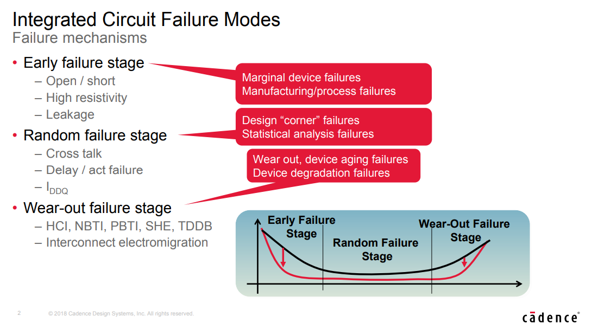

## Terminology

The most accurate method to calculate the degradation of transistors is the SPICE-level simulation of the whole netlist with application programming interface (API) and industry-standard stress process models

​	 **MOSRA**: MOSFET reliability analysis Synopsys

​	**RelXpert**: Cadence

​	**TMI**: TSMC Model Interface, TSMC

​	**OMI**: Open Model Interface,  Si2 standard,

> The Silicon Integration Initiative (Si2) Compact Model Coalition has released the *Open Model Interface*, an Si2 standard, C-language application programming interface that supports SPICE compact model extensions.OMI allows circuit designers to simulate and analyze such important physical effects as *self-heating* and *aging*, and perform extended design optimizations. It is based on TMI2, the TSMC Model Interface, which was donated to Si2 by TSMC in 2014. 

- **TDDB**: Time-Dependent Dielectric Breakdown
- **HCI**: Hot Carrier injection
- **BTI**: Bias Temperature Instability
  - **NBTI**: Negative Bias Temperature Instability
  - **PBTI**: Positive Bias Temperature Instability
- **SHE**: Self-Heating Effect

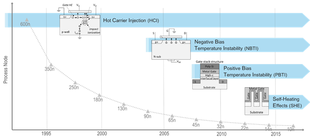

## Aging & SHE in FinFET

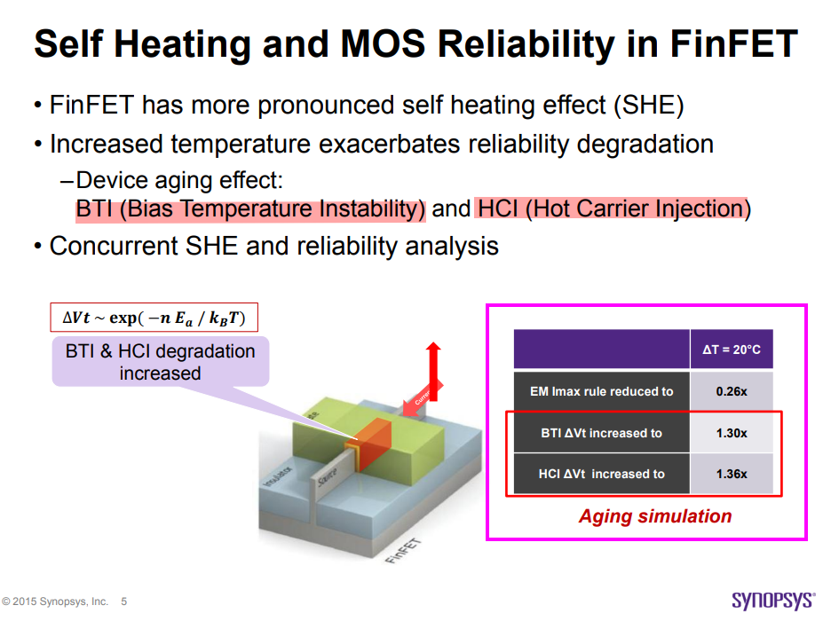

## SHE

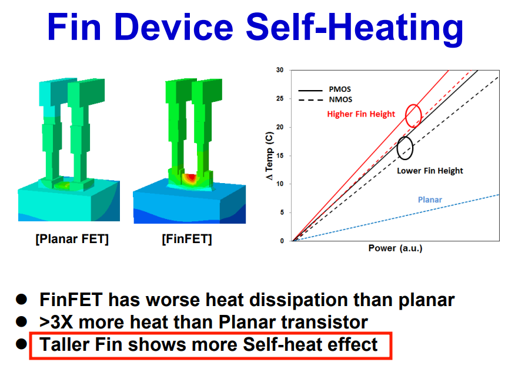

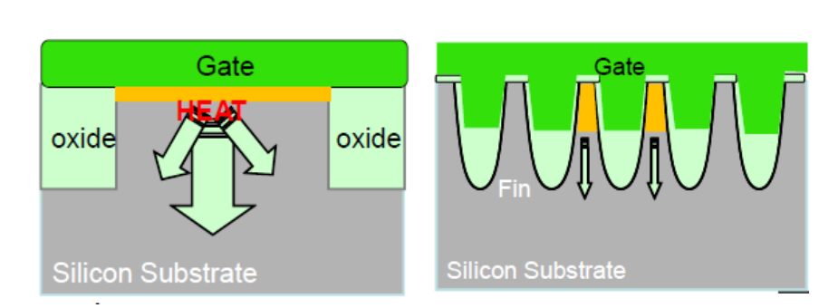

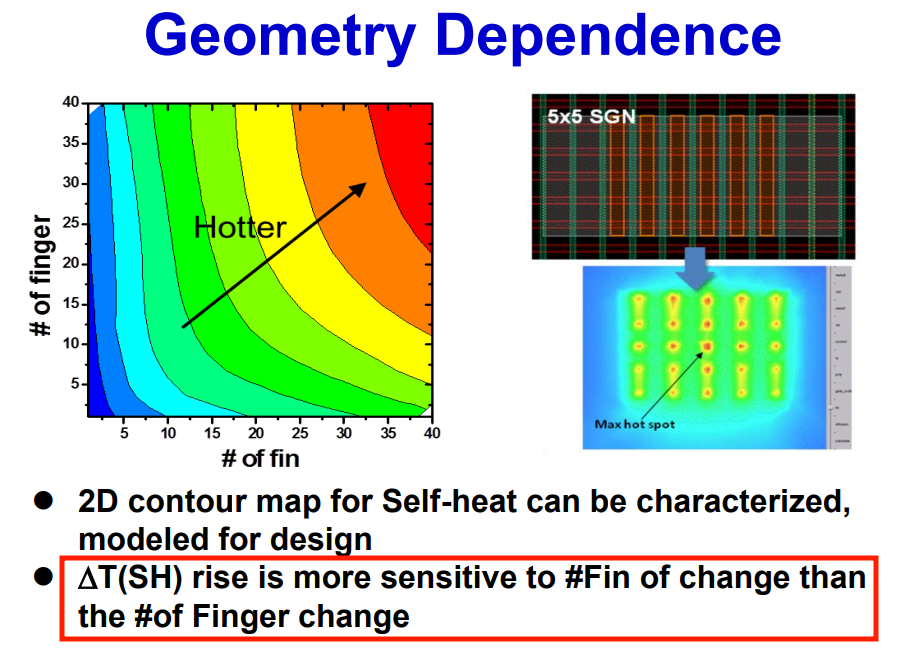

### Self-Heating & EM

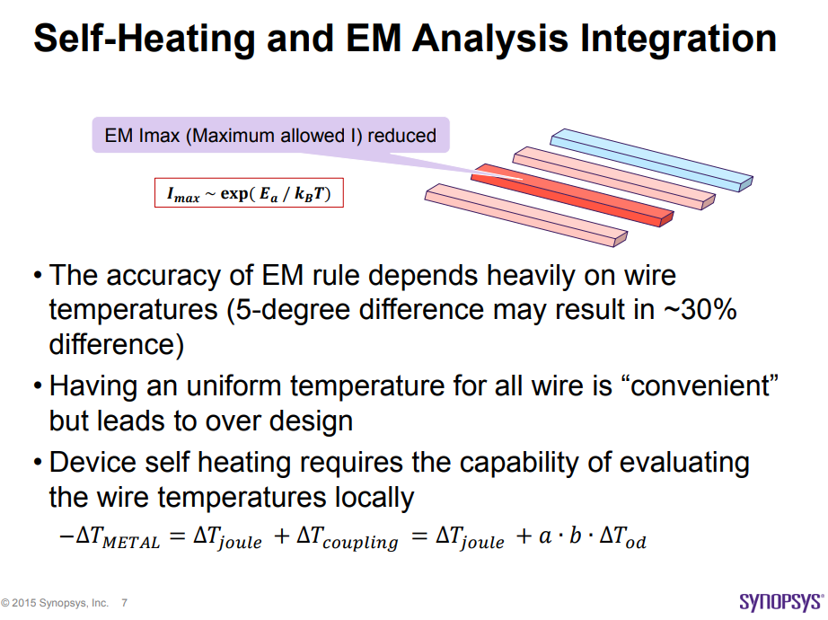

### Heat Sink (HS)

1. guard ring

   closer OD help reduce dT

2. extended gate

3. source/drain metal stack

## Bias Temperature Instability (BTI)

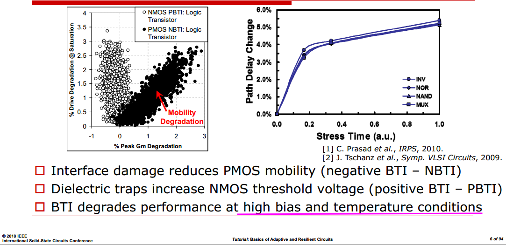

---

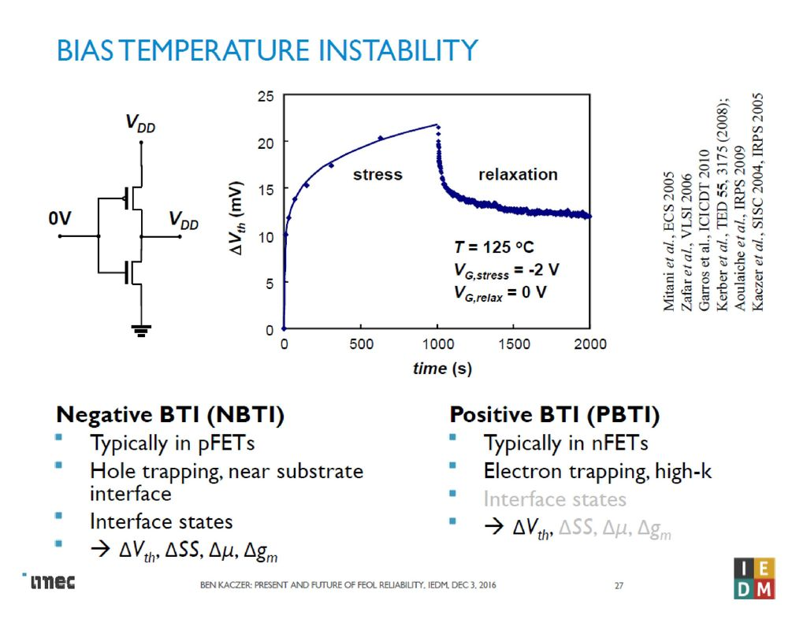

BTI occurs *predominantly in PMOS (or p-type or p channel)* transistors and causes an increase in the
transistor's *absolute threshold voltage*.

Stress in the case of NBTI means that the PMOS transistor is **in inversion**; that means that its **gate to body** potential is substantially below 0 V for analogue circuits or at *VGB = −VDD* for digital circuits

*Higher voltages* and *higher temperatures* both have an exponential impact onto the degradation, induced by NBTI.

NBTI will be accelaerated with thinner gate oxide, at a high temperature and at a high electric field across the oxide region.

During recovery phase where the gate voltage of pMOS is high and stress is removed, the H atoms in the gate oxiede diffuse back to Si-SiO2 interface and the recombination of Si-H bonds reduces the threshold voltage of pMOS.

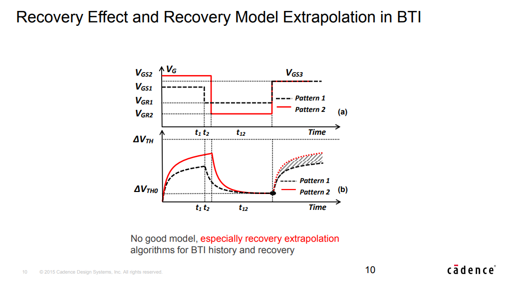

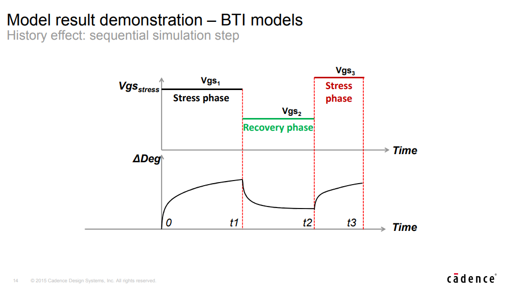

> The net result is an increase in the magnitude of the device **threshold voltage |Vt|**, and a degradation of the channel **carrier mobility**.
>
> **Caution**: The aging model provided by fab may **NOT** contain recovry effect

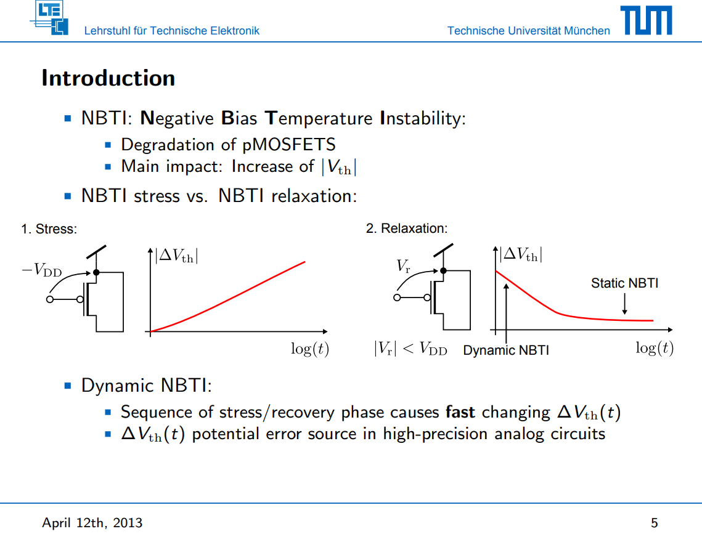

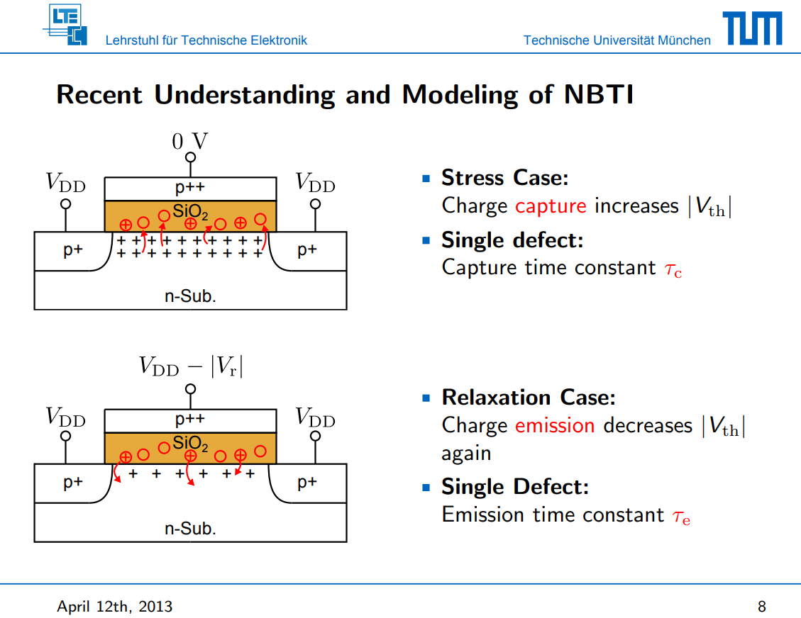

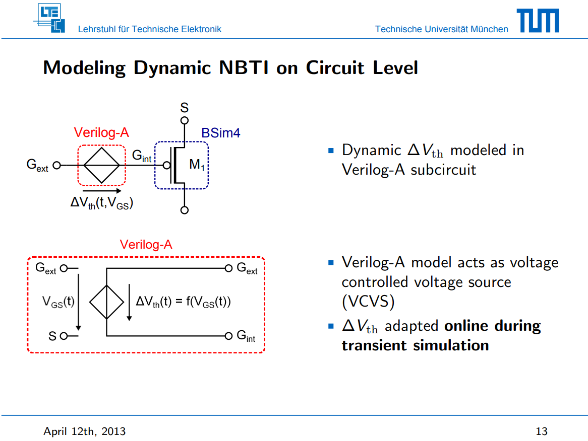

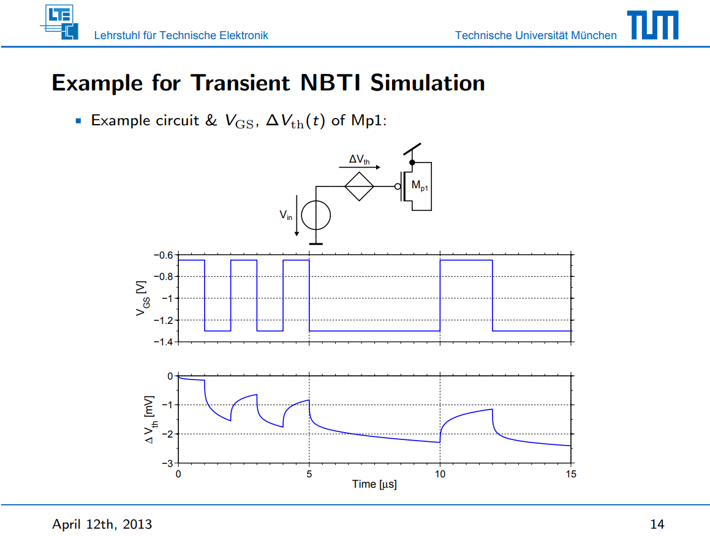

## HCI

Short-channel MOSFETs may exprience **high lateral electric fields** if the drain-source voltage is large. while the average velocity of carriers saturate at high fields, the instantaneous velocity and hence the kinetic energy of the carriers continue to increase, especially as they accelerate toward the drain. These are called **hot** carriers.

In nanometer technologies, hot carrier effects have **subsided**. This is because the energy required to create an electron-hole pair, $E_g \simeq 1.12 eV$, is simply not available if the supply voltage is around 1V.

$$
F_E= E \cdot q
$$

$$\begin{align}
E_k &= F_E \cdot s \\
&= E \cdot q \cdot s
\end{align}$$

Electrons and holes gaining high **kinetic energies** in the electric field (**hot carriers**) may be injected into the gate oxide and cause *permanent* changes in the oxide-interface charge distribution, degrading the current-voltage characteristics of the MOSFET.

The channel hot-electron (CHE) effect is caused by electons flowing in the channel region, from the source to the drain. This effect is more pronounced at large drain-to-source voltage, at which the lateral electric field in the drain end of the channel accelerates the electrons.

> Four different hot carrier injectoin mechanisms can be distinguished:
> - channel hot electron (CHE) injection
> - drain avalanche hot carrier (DAHC) injection
> - secondary generated hot electron (SGHE) injection
> - substrate hot electron (SHE) injection

HCI is more of a **drain-localized** mechanism, and is primarily a **carrier mobility** degradation (and *a Vt degradation if the device is operated bi-directionally*).

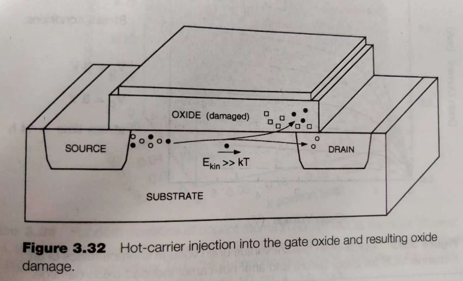

> For smaller transistor dimensions, *CHE* dominates the hot carrier degradation effect

The hot-carrier induced damage in nMOS transistors has been found to result in either trapping of carriers on defect sites in the oxide or the creation of interface states at the silicon-oxide interface, or both.

The damage caused by hot-carrier injection affects the transistor characteristics by causing a degradation in transconductance, a shift in the threshold voltage, and a general decrease in the drain current capability.

> HCI seems to have just a **weak** temperature dependency.
> Unlike BTI, it seems to be no or just little recovery.
> As holes are much "cooler" (i.e. heavier) than electrons, the channel hot carrier effect in nMOS devices is shown to be more significant than in pMOS devices.

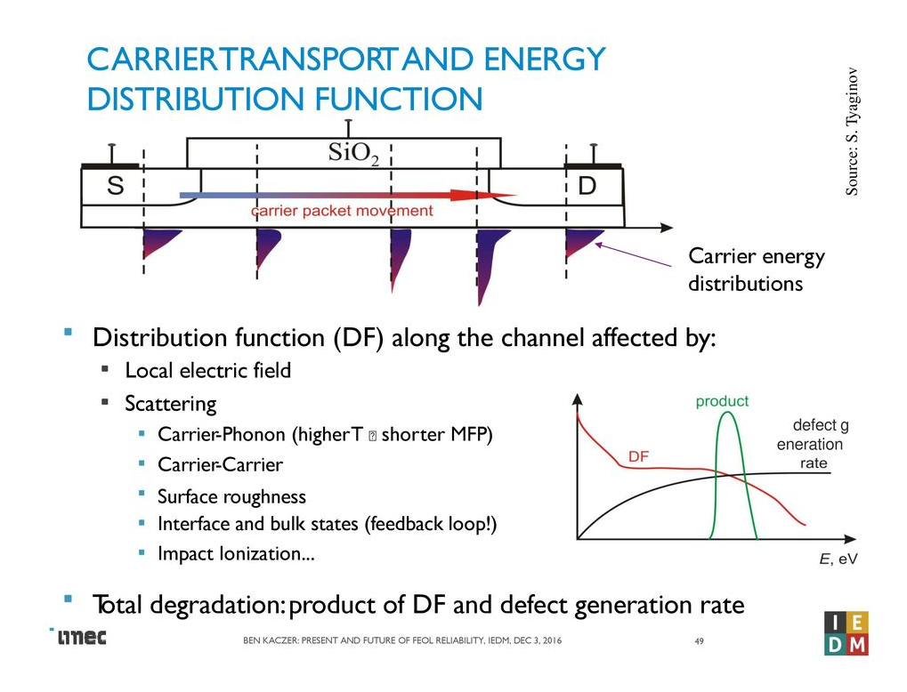

### Degradation saturation effect

HCI model can reproduce the saturation effect if stress time is long enough

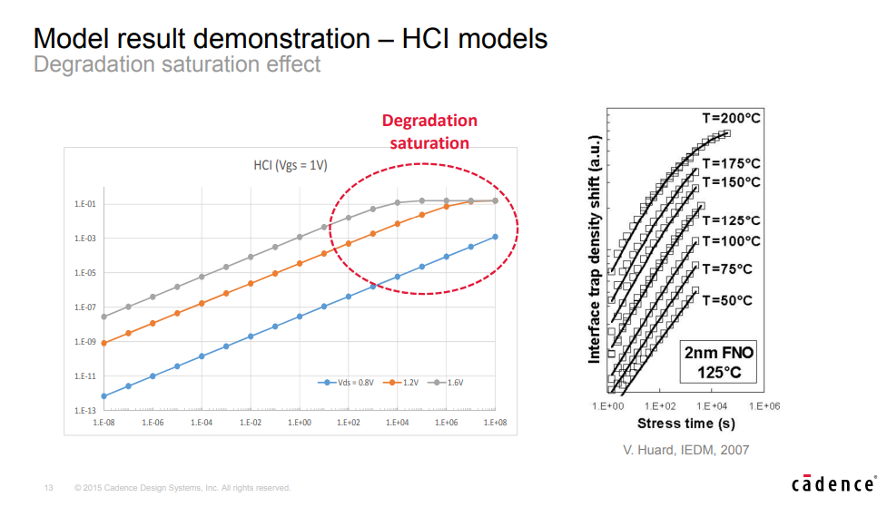

## TDDB

TDDB effect is also related to oxide traps. In general, TDDB refers to the loss of isolating properties of a dielectric layer. If this dielectric layer is the gate oxide, TDDB will initially lead to an increase in the gate tunnelling current.

This soft breakdown can already lead to a parametric degradation. After a long accumulation period, TDDB leads to a catastrophic reduction of the channel to gate insulation and thus a functional failure of the transistor.

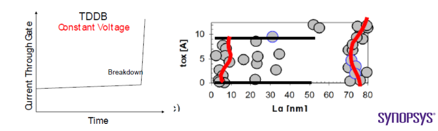

> Scaling drive more concerns in TDDB

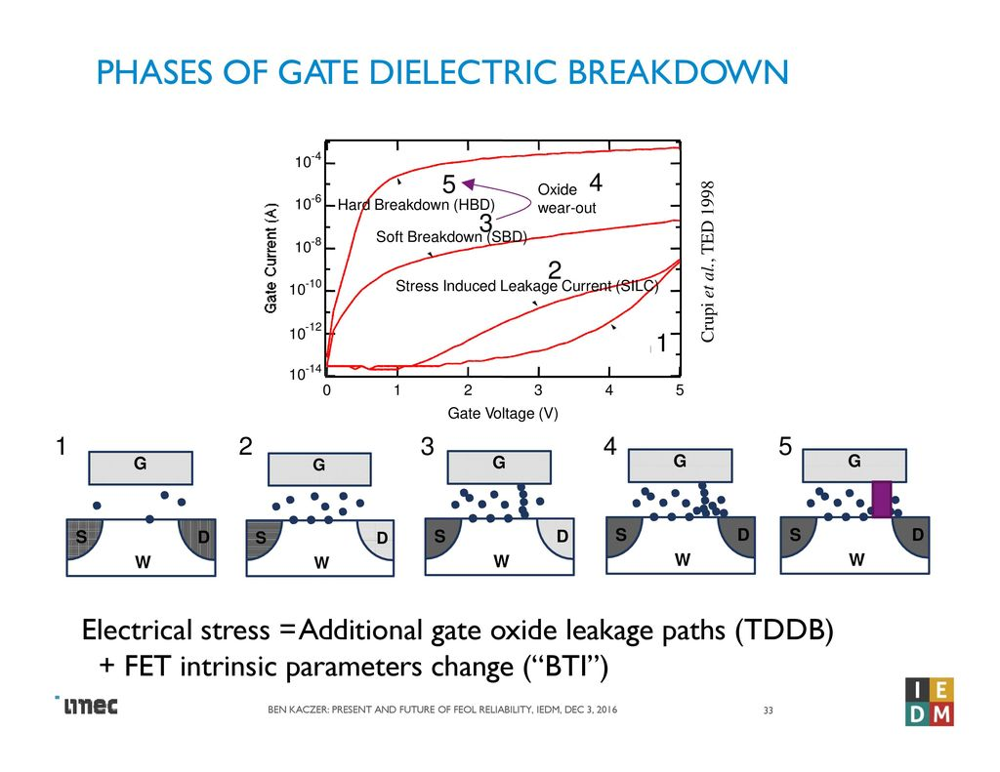

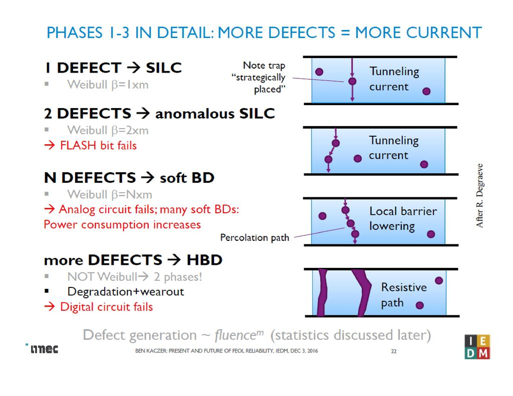

## waveform-dependent nature  

The figure below illustrates the waveform-dependent nature of these mechanisms – as described earlier, BTI and HCI depend upon the region of active device operation. The slew rate of the circuit inputs and output will have a significant impact upon these mechanisms, especially HCI.

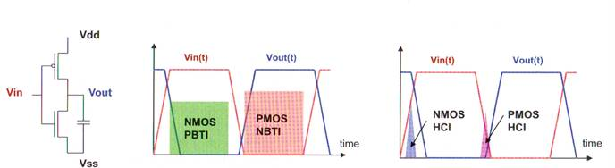

-  **Negative bias temperature instability (NBTI)**. This is caused by *constant electric fields* degrading the dielectric, which in turn causes the threshold voltage of the transistor to degrade. That leads to lower switching speeds. This effect depends on the activity level of the circuits, with heavier impact on parts of the design that *don’t switch as often*, such as gated clocks, control logic, and reset, programming and test circuitry.
- **Hot carrier injection (HCI)**. This is caused by *fast-moving* electrons inserting themselves into the gate and degrading performance. It primarily occurs on higher-voltage modes and fast switching signals.

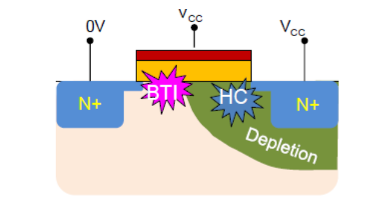

- *longer* channel length help both BTI and HCI
- *larger* $V_{ds}$ help BTI, but hurt HCI
- *lower* temperature help BTI of core device, but hurt that of IO device for 7nm FinFET

## MOSRA

MOSRA is a 2-step simulation: 1) Age computation, 2) Post-age analysis

## TMI

BTI recovery effect **NOT** included for N7

## Stochastic Nature of Reliability Mechanisms

> A fraction of devices will fail

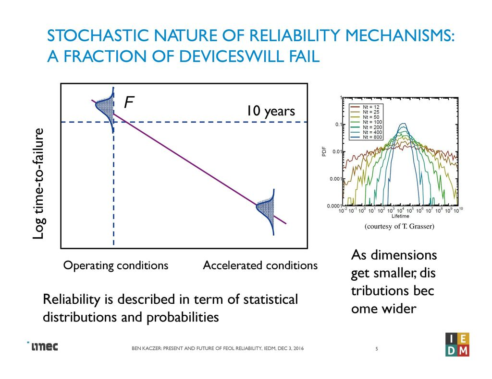

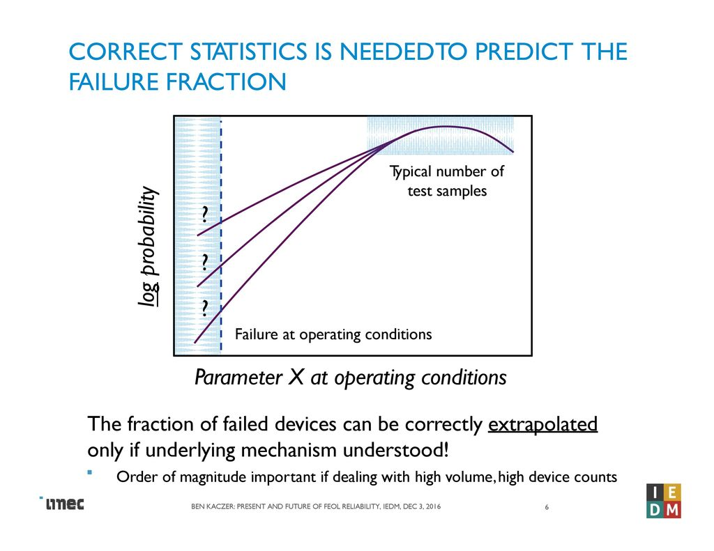

## Circuit Simulations

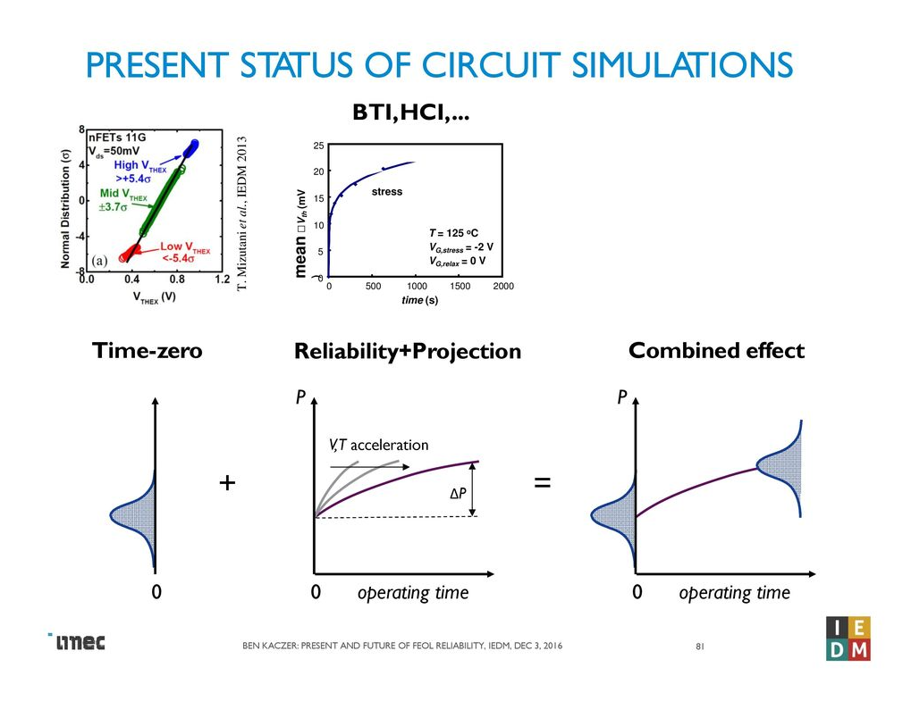

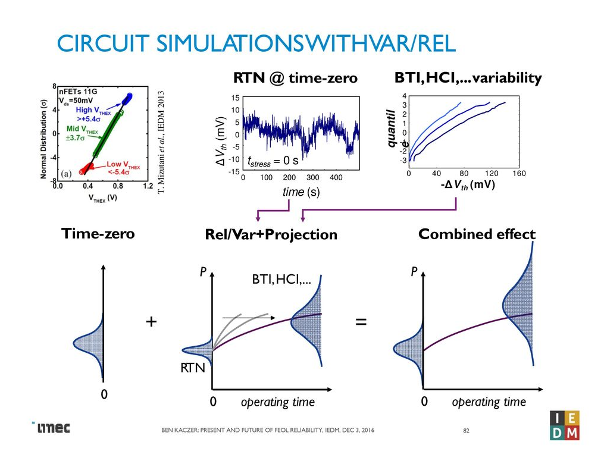

## Heat transfer, thermal resistance

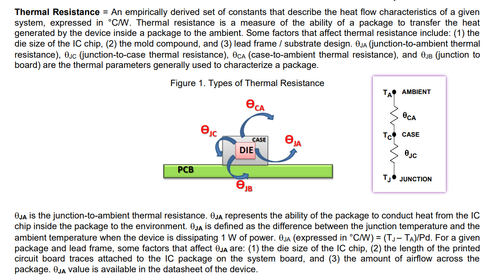

---

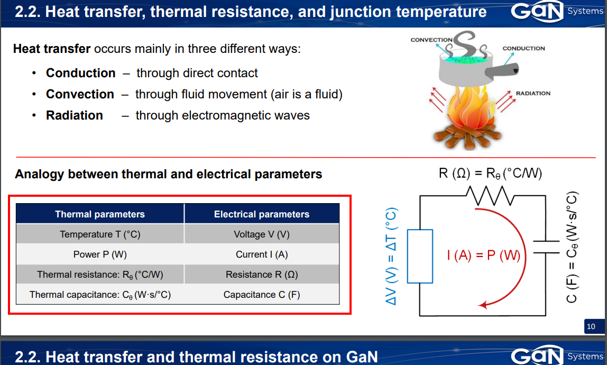

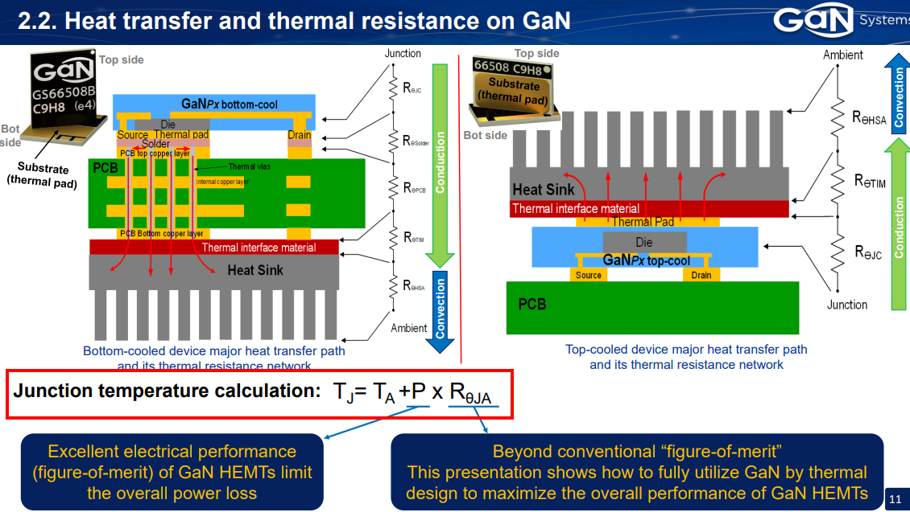

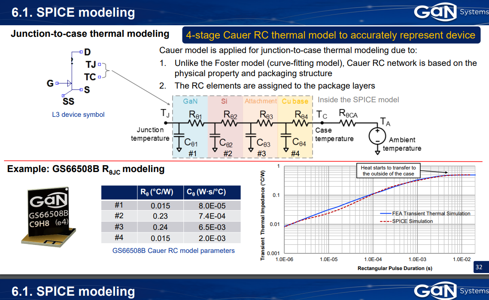

## reference

Spectre Tech Tips: Device Aging? Yes, even Silicon wears out - Analog/Custom Design (Analog/Custom design) - Cadence Blogs - Cadence Community [https://shar.es/afd31p](https://shar.es/afd31p)

S. Liao, C. Huang, and A. C. J. X. T. Guo, "New Generation Reliability Model," Dec 2016. [Online]. Available: [http://www.mos-ak.org/berkeley_2016/publications/T11_Xie_MOS-AK_Berkeley_2016.pdf](http://www.mos-ak.org/berkeley_2016/publications/T11_Xie_MOS-AK_Berkeley_2016.pdf). [Accessed Aug 2018]

Tianlei Guo, Jushan Xie, "A Complete Reliability Solution: Reliability Modeling, Applications, and Integration in Analog Design Environment" [[https://mos-ak.org/beijing_2018/presentations/Tianlei_Guo_MOS-AK_Beijing_2018.pdf](https://mos-ak.org/beijing_2018/presentations/Tianlei_Guo_MOS-AK_Beijing_2018.pdf)]

FinFET Reliability Analysis with Device Self-Heating via @DanielNenni [https://semiwiki.com/eda/synopsys/5085-finfet-reliability-analysis-with-device-self-heating/](https://semiwiki.com/eda/synopsys/5085-finfet-reliability-analysis-with-device-self-heating/)

Chris Changze Liu 刘长泽,Hisilicon, Huawei, "Reliability Challenges in Advanced Technology Node" [https://www.tek.com.cn/sites/default/files/2018-09/reliability-challenges-in-advanced-technology-node.pdf](https://www.tek.com.cn/sites/default/files/2018-09/reliability-challenges-in-advanced-technology-node.pdf)

Ben Kaczer, imec. FEOL reliability: from essentials to advanced and emerging devices and circuits. 2016 IRPS Tutorial

Ben Kaczer, imec. Present and Future of FEOL Reliability—from Dielectric Trap Properties to Reliable Circuit Operation. 2016 IEDM 2016 [[link](https://slideplayer.com/slide/12992784/)]

Kang, Sung-Mo Steve, Yusuf Leblebici and Chulwoo Kim. “CMOS Digital Integrated Circuits: Analysis & Design, 4th Edition.” (2014).

Behzad Razavi. "Design of Analog CMOS Integrated Circuits" (2016)

Basel Halak. Ageing of Integrated Circuits : Causes, Effects and Mitigation Techniques. Cham, Switzerland: Springer, 2020. ‌

Elie Maricau, and Georges Gielen. Analog IC Reliability in Nanometer CMOS. Springer Science & Business Media, 2013. ‌

Transistor Aging Intensifies At 10/7nm And Below [https://semiengineering.com/transistor-aging-intensifies-10nm/](https://semiengineering.com/transistor-aging-intensifies-10nm/)

Modeling Effects of Dynamic BTI Degradation on Analog and Mixed-Signal CMOS Circuits. MOS-AK/GSA Workshop, April 11-12, 2013, Munich [https://www.mos-ak.org/munich_2013/presentations/05_Leonhard_Heiss_MOS-AK_Munich_2013.pdf](https://www.mos-ak.org/munich_2013/presentations/05_Leonhard_Heiss_MOS-AK_Munich_2013.pdf)

Challenges and Solutions in Modeling and Simulation of Device Self-heating, Reliability Aging and Statistical Variability Effects [https://www.mos-ak.org/beijing_2018/presentations/Dehuang_Wu_MOS-AK_Beijing_2018.pdf](https://www.mos-ak.org/beijing_2018/presentations/Dehuang_Wu_MOS-AK_Beijing_2018.pdf)

New Generation Reliability Model [https://www.mos-ak.org/berkeley_2016/publications/T11_Xie_MOS-AK_Berkeley_2016.pdf](https://www.mos-ak.org/berkeley_2016/publications/T11_Xie_MOS-AK_Berkeley_2016.pdf)

FinFET SPICE Modeling: Synopsys Solutions to Simulation Challenges of Advanced Technology Nodes [https://www.mos-ak.org/washington_dc_2015/presentations/T03_Joddy_Wang_MOS-AK_Washington_DC_2015.pdf](https://www.mos-ak.org/washington_dc_2015/presentations/T03_Joddy_Wang_MOS-AK_Washington_DC_2015.pdf)

A. Zhang et al., "Reliability variability simulation methodology for IC design: An EDA perspective," 2015 IEEE International Electron Devices Meeting (IEDM), Washington, DC, USA, 2015, pp. 11.5.1-11.5.4, doi: 10.1109/IEDM.2015.7409677.

W. -K. Lee et al., "Unifying self-heating and aging simulations with TMI2," 2014 International Conference on Simulation of Semiconductor Processes and Devices (SISPAD), Yokohama, Japan, 2014, pp. 333-336, doi: 10.1109/SISPAD.2014.6931631.

Aging and Self-Heating in FinFETs - Breakfast Bytes - Cadence Blogs - Cadence Community [https://community.cadence.com/cadence_blogs_8/b/breakfast-bytes/posts/aging-and-self-heating](https://community.cadence.com/cadence_blogs_8/b/breakfast-bytes/posts/aging-and-self-heating)

Article (20482350) Title: Measure the Impact of Aging in Spectre Technology
URL: https://support.cadence.com/apex/ArticleAttachmentPortal?id=a1O0V000009ESBFUA4

Karimi, Naghmeh, Thorben Moos and Amir Moradi. “Exploring the Effect of Device Aging on Static Power Analysis Attacks.” IACR Trans. Cryptogr. Hardw. Embed. Syst. 2019 (2019): 233-256.[[link](https://pdfs.semanticscholar.org/b0f8/720a2b51a479f4a711bec4b47fdd50f29e2d.pdf)]

Self-Heating Issues Spread [https://semiengineering.com/self-heating-issues-spread/](https://semiengineering.com/self-heating-issues-spread/)

Y. Zhao and Y. Qu, "Impact of Self-Heating Effect on Transistor Characterization and Reliability Issues in Sub-10 nm Technology Nodes," in IEEE Journal of the Electron Devices Society, vol. 7, pp. 829-836, 2019, doi: 10.1109/JEDS.2019.2911085.
