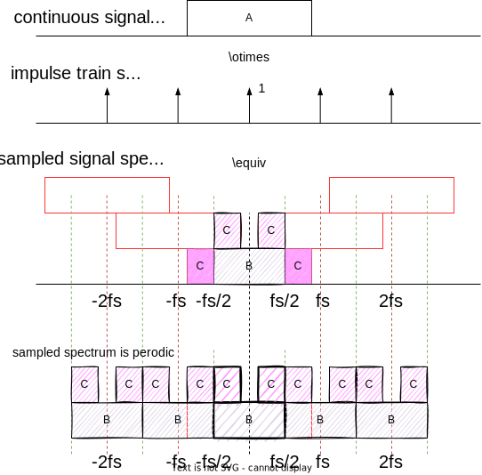
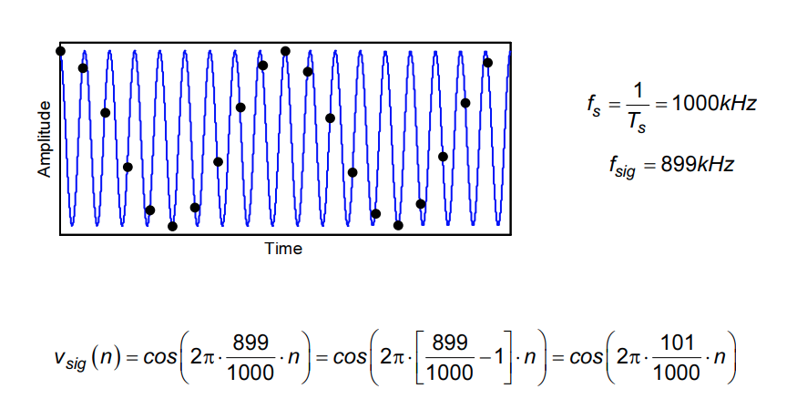
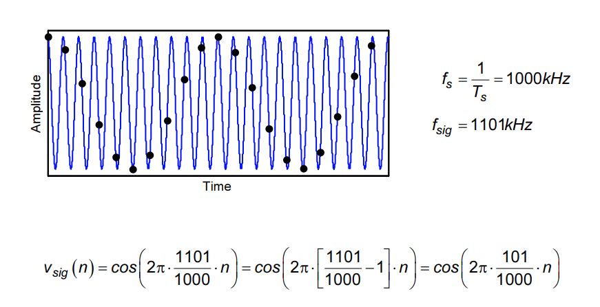
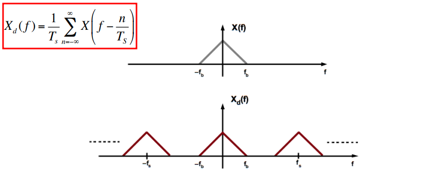
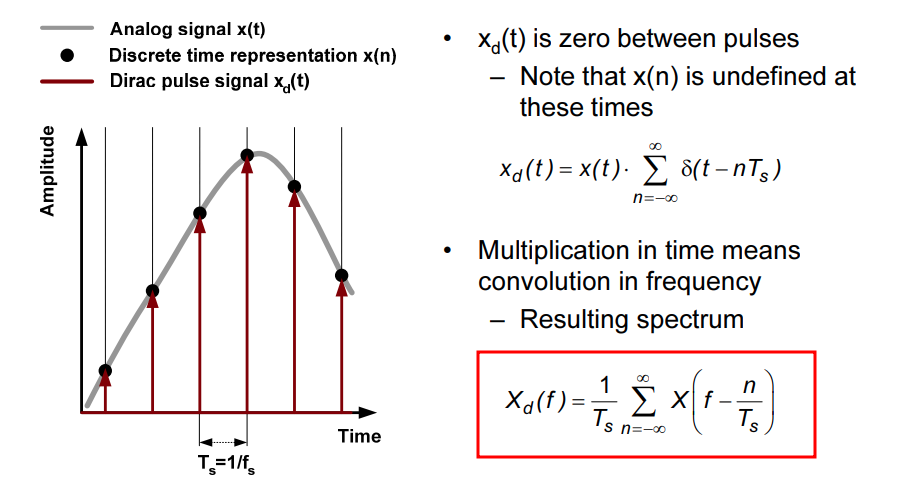

## Noise Aliasing

Where impulse train or "shah" function is defined as
$$
\amalg(t) = T\sum_{i=-\infty}^{\infty}\delta(x-iT)
$$
where $T$ defines the period, or sampling rate. Its Fourier transform is $2\pi \delta(\omega-i\frac{2\pi}{T})$

**Multiplication Property** of Fourier Transform
$$
x_1(t)x_2(t)\overset{FT}{\longrightarrow}\frac{1}{2\pi}X_1(\omega)*X_2(\omega)
$$

Due to $A = B+2C$, the noise in the discrete time integrated from DC to $f_s/2$ equals that of continuous time in all frequency range.

> The DFT spectrum is periodic with period **N**
>
> The DTFT spectrum is periodic  with period $2\pi$
>
> As a conclusion, the spectrum beyond $f_s/2$ is **redundant** and don't provide information

## Aliasing

The frequencies $f_{\text{sig}}$ and $N· f_s ±f_{\text{sig}}$ (N integer), are **indistinguishable** in the **discrete time domain**.

> In order to prevent aliasing, we need $f_{\text{sig,max}}\lt \frac{f_s}{2}$. The sampling rate $f_s=2\cdot f_{\text{sig,max}}$ is called the **Nyquist Rate**.
>
> Two solution possibilities
>
> 1.  Sample fast enough to cover all spectral components, including "parasitic" ones outside band of interest
> 2. Limit $f_{\text{sig,max}}$ through filtering - Filter out "parasitic" ones 

Given below sequence
$$
X[n] =A e^{j\omega _0 T_s n}
$$
1. signal frequency  $\omega _0 = \frac{1}{2T_s}+\Delta f$
   $$\begin{align}
   x[n] &= Ae^{j\left( \frac{1}{2T_s}+\Delta f \right)2\pi T_sn} \\
   &= Ae^{j(\Delta f\cdot 2\pi T_s +\pi)n}
   \end{align}$$

2. signal frequency $\omega _0 =-\frac{1}{2T_s}+\Delta f$
$$\begin{align}
x'[n] &= Ae^{j\left( -\frac{1}{2T_s}+\Delta f \right)2\pi T_sn} \\
&= Ae^{j(\Delta f\cdot 2\pi T_s -\pi)n} \\
&= Ae^{j(\Delta f\cdot 2\pi T_s -\pi)n}\cdot e^{j2\pi n} \\
&= Ae^{j(\Delta f\cdot 2\pi T_s +\pi)n}
\end{align}$$

 $x[n] = x'[n]$ is obtained.

With sampling frequency $\frac{1}{T_s}$, continuous signal of $\frac{1}{2T_s}+\Delta f$ and  $-\frac{1}{2T_s}+\Delta f$ can not be distinguished

> Generally, The frequencies $f_{\text{sig}}$ and $N· f_s ±f_{\text{sig}}$ (N integer), are **indistinguishable** in the **discrete time domain**.

### Aliasing Example

Given $f_s = 1000$ KHz

1. $f_{\text{sig}}=101$ KHz

   

2. $f_{\text{sig}}=899$ KHz

   

3. $f_{\text{sig}}=1101$ KHz

   

### Classes of Sampling 

- Nyquist-rate sampling

  $f_s \gt 2 \cdot f_{\text{sig,max}}$

- Oversampling

  $f_s \gg  2\cdot f_{\text{sig,max}}$

- Undersampling, subsampling

  $f_s \lt 2\cdot f_{\text{sig,max}}$

## Dirac Pulses and spectrum

Spectrum of $x_d(t)$ contains **scaled replicas** of $X(f)$ at **integer multiples** of the sampling frequency $f_s$

## reference

David Herres, The difference between signal under-sampling, aliasing, and folding URL: [https://www.testandmeasurementtips.com/the-difference-between-signal-under-sampling-aliasing-and-folding-faq/](https://www.testandmeasurementtips.com/the-difference-between-signal-under-sampling-aliasing-and-folding-faq/)

Pharr, Matt; Humphreys, Greg. (28 June 2010). Physically Based Rendering: From Theory to Implementation. Morgan Kaufmann. ISBN 978-0-12-375079-2. [Chapter 7 (Sampling and reconstruction)](https://web.archive.org/web/20131016055332/http://graphics.stanford.edu/~mmp/chapters/pbrt_chapter7.pdf)

Kundert, Ken. (2006). Simulating Switched-Capacitor Filters with SpectreRF.

Pavan, Schreier and Temes, "Understanding Delta-Sigma Data Converters, Second Edition" ISBN 978-1-119-25827-8

Boris Murmann, EE315B VLSI Data Conversion Circuits, Autumn 2013

Tania Khanna, ESE568 Fall 2019, Mixed Signal Circuit Design and Modeling URL: [https://www.seas.upenn.edu/~ese568/fall2019/](https://www.seas.upenn.edu/~ese568/fall2019/)

Matt Pharr, Wenzel Jakob, and Greg Humphreys. 2016. Physically Based Rendering: From Theory to Implementation (3rd. ed.). Morgan Kaufmann Publishers Inc., San Francisco, CA, USA.
