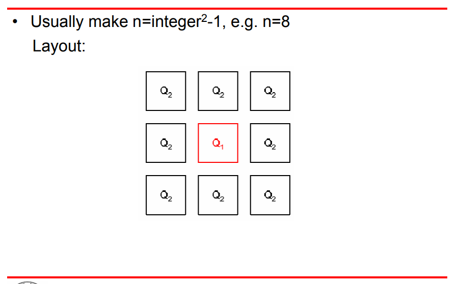

### temperature coefficient

The parameter that shows the dependence of the reference voltage on temperature variation is called the temperature coefficient and is defined as:
$$
TC_F=\frac{1}{V_{\text{REF}}}\left[ \frac{V_{\text{max}}-V_{\text{min}}}{T_{\text{max}}-T_{\text{min}}} \right]\times10^6\;ppm/^oC
$$

### Choice of n

### reference

ECEN 607 (ESS) Bandgap Reference: Basics URL:[https://people.engr.tamu.edu/s-sanchez/607%20Lect%204%20Bandgap-2009.pdf](https://people.engr.tamu.edu/s-sanchez/607%20Lect%204%20Bandgap-2009.pdf)
