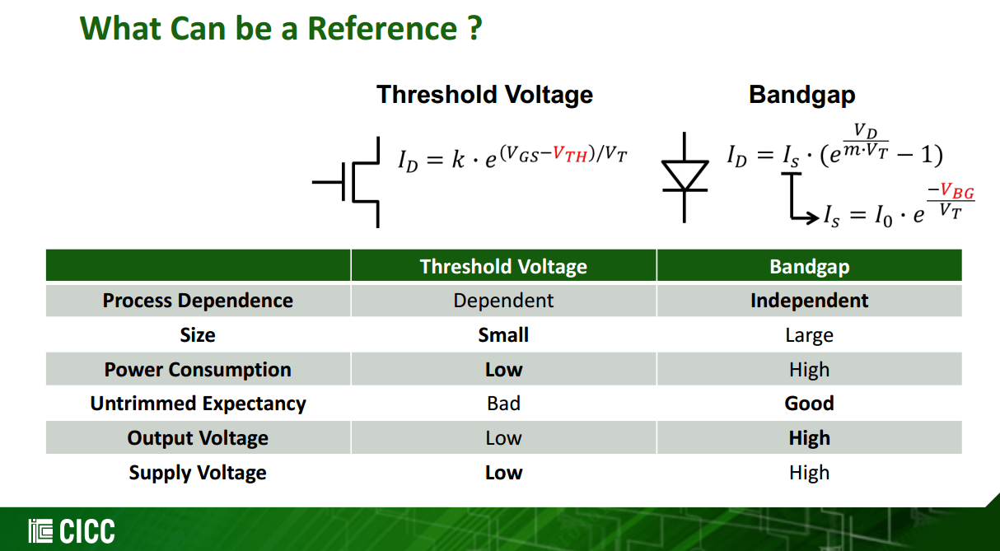

---

## MOS VT vs. Temperature

> [[https://ewh.ieee.org/r5/denver/sscs/Presentations/2004_12_Loke.pdf](https://ewh.ieee.org/r5/denver/sscs/Presentations/2004_12_Loke.pdf)]

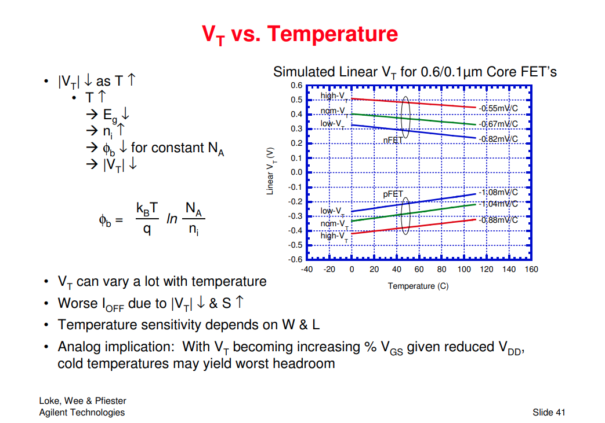

## Subthreshold Conduction

By square-law, the Eq $g_m = \sqrt{2\mu C_{ox}\frac{W}{L}I_D}$, it is possible to obtain a *higer* transconductance by increasing $W$ while maintaining $I_D$ constant. However, if $W$ increases while $I_D$ remains constant, then $V_{GS} \to V_{TH}$ and device enters the subthreshold region.
$$
I_D = I_0\exp \frac{V_{GS}}{\xi V_T}
$$

where $I_0$ is proportional to $W/L$, $\xi \gt 1$ is a nonideality factor, and $V_T = kT/q$

As a result, the transconductance in subthreshold region is
$$
g_m = \frac{I_D}{\xi V_T}
$$

which is $g_m \propto I_D$

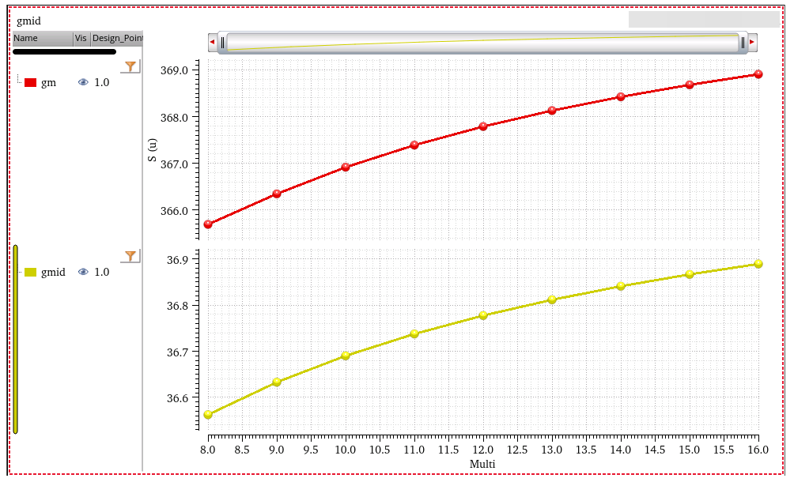

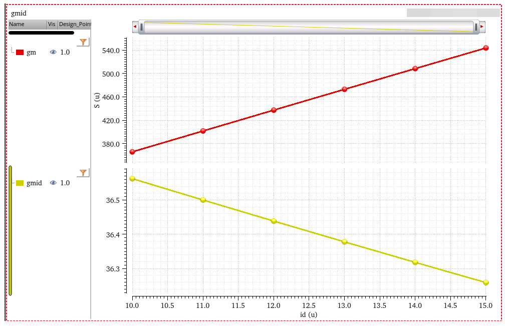

### PTAT with subthreshold MOS

MOS working in the **weak inversion region** (**"subthreshold conduction"**) have the similar characteristics to BJTs and diodes, since the effect of diffusion current becomes more significant than that of drift current

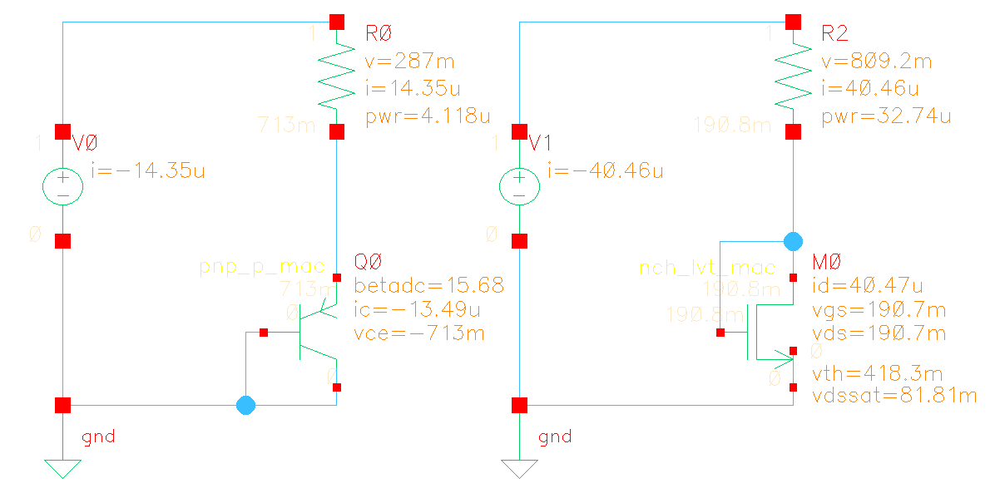

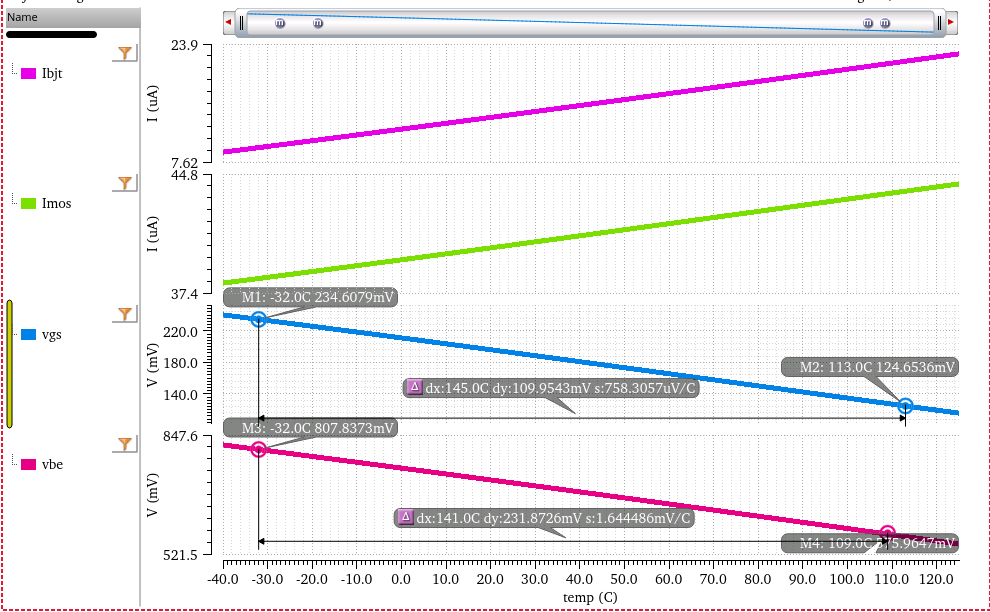

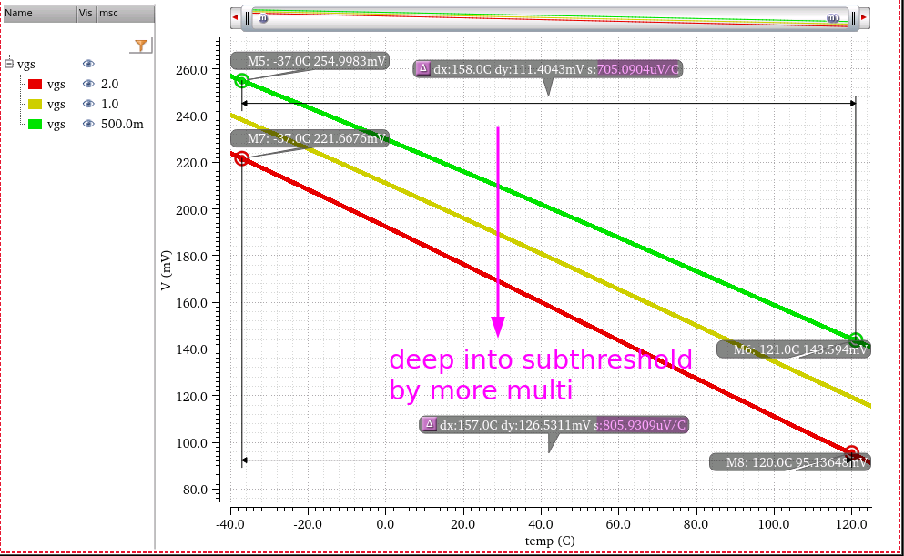

> Hongprasit, Saweth, Worawat Sa-ngiamvibool and Apinan Aurasopon. "Design of Bandgap Core and Startup Circuits for All CMOS Bandgap Voltage Reference." *Przegląd Elektrotechniczny* (2012): 277-280.

## Curvature Compensation

### VBE

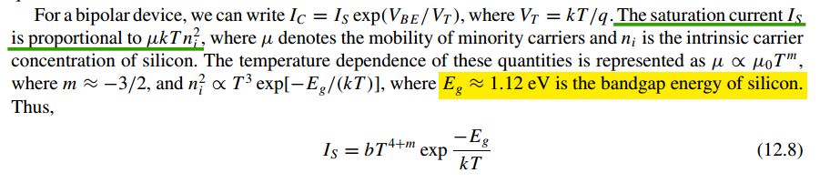

> In advanced node, N4P, $V_{BE}$ is about -1.45mV/K

Assuming $I_C$ is ***constant***

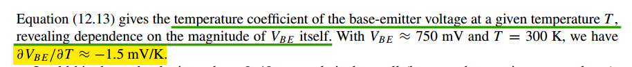

> 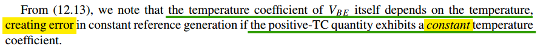

Assuming $I_C$ is ***PTAT***, $I_C = (V_T \ln n) / R_3$

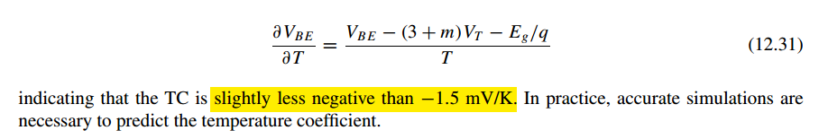

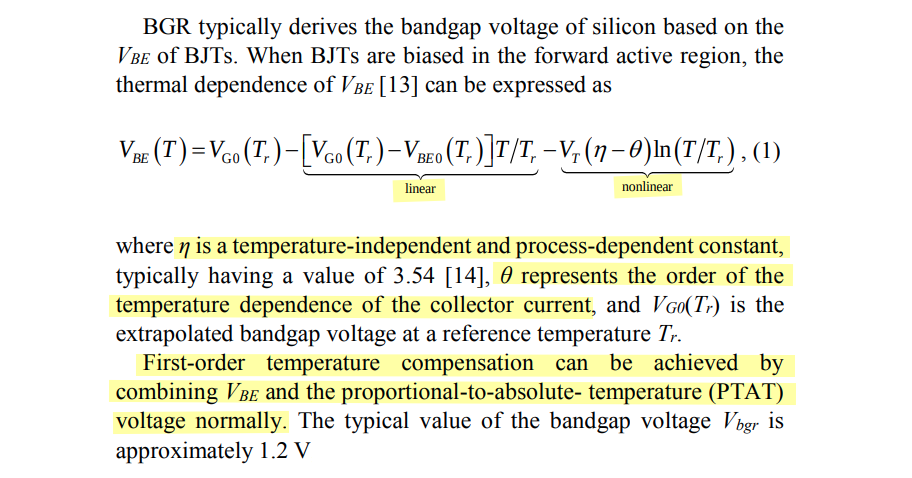

The **first-order *linear*** temperature dependence term of $V_{BE}$ can be eliminated with **IPTAT**.  $V_T(\eta - \theta)\ln)T/T_r$ is the high-order nonlinear temperature-dependent term of $V_{BE}$, which requires **high-order curvature compensation**

> G. Zhu, Y. Yang and Q. Zhang, "A 4.6-ppm/°C High-Order Curvature Compensated Bandgap Reference for BMIC," in *IEEE Transactions on Circuits and Systems II: Express Briefs*, vol. 66, no. 9, pp. 1492-1496, Sept. 2019 [[https://sci-hub.se/10.1109/TCSII.2018.2889808](https://sci-hub.se/10.1109/TCSII.2018.2889808)]
>
> X. Fu, D. M. Colombo, Y. Yin and K. El-Sankary, "Low Noise, High PSRR, High-Order Piecewise Curvature Compensated CMOS Bandgap Reference," in *IEEE Access*, vol. 10, pp. 110970-110982, 2022 [[https://ieeexplore.ieee.org/stamp/stamp.jsp?arnumber=9923910](https://ieeexplore.ieee.org/stamp/stamp.jsp?arnumber=9923910)]

---

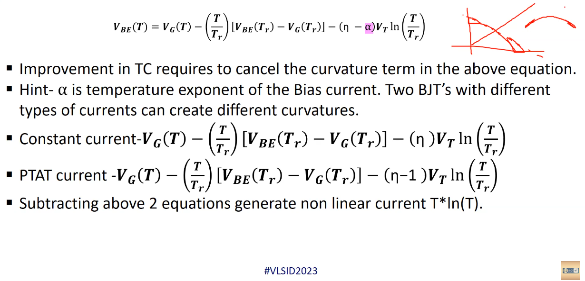

---

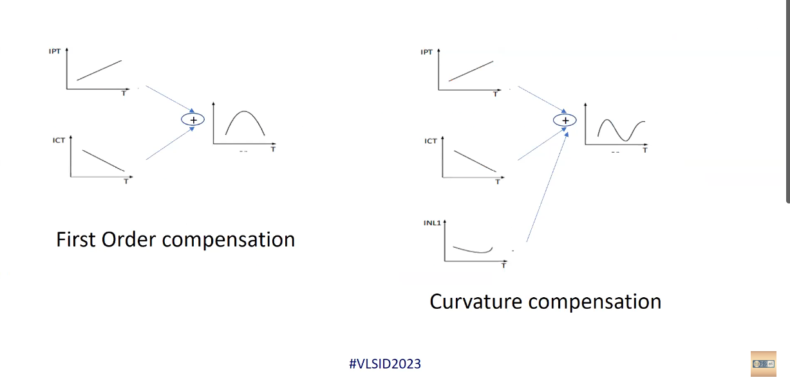

> Tutorials | 08012023 | 1.2.1 Bandgap Voltage Regular [[https://youtu.be/dz067SOX0XQ&t=6362](https://youtu.be/dz067SOX0XQ&t=6362)]

## temperature coefficient

The parameter that shows the dependence of the reference voltage on temperature variation is called the temperature coefficient and is defined as:
$$
TC_F=\frac{1}{V_{\text{REF}}}\left[ \frac{V_{\text{max}}-V_{\text{min}}}{T_{\text{max}}-T_{\text{min}}} \right]\times10^6\;ppm/^oC
$$

## Choice of n

## classic bandgap reference

(a) 

$$
V_{bg} = \frac{\Delta V_{be}}{R_1} (R_1+R_2) + V_{be2} = \frac{\Delta V_{be}}{R_1} R_2 + V_{be1}
$$

(b)

$$
V_{bg} = \left(\frac{\Delta V_{be}}{R_1} + \frac{V_{be1}}{R_2}\right)R_3 = \left(\frac{\Delta V_{be}}{R_1} R_2 + V_{be1}\right)\frac{R_3}{R_2}
$$

## OTA offset effect

$$\begin{align}
V_{be1} &= \frac{kT}{q}\ln(\frac{I_{e1}}{I_{ss}}) \\
V_{be2} &= \frac{kT}{q}\ln(\frac{I_{e2}}{nI_{ss}})
\end{align}$$

Here, we assume $I_e = I_c$

Hence,

$$\begin{align}
\Delta V_{be} &= \frac{kT}{q}\ln(n\frac{I_{e1}}{I_{e2}}) \\
&= \frac{kT}{q}\ln(n) + \frac{kT}{q}\ln(\frac{I_{e1}}{I_{e2}}) \\
&= \Delta V_{be,0} + \frac{kT}{q}\ln(\frac{I_{e1}}{I_{e2}})
\end{align}$$

Therefore,

$$\begin{align}
V_{bg} &= \frac{\Delta V_{be}+V_{os}}{R_2}(R_1+R_2) + V_{be2} \\
&= \alpha \Delta V_{be,0} + \alpha \frac{kT}{q}\ln(\frac{I_{e1}}{I_{e2}}) + \alpha V_{os} + \frac{kT}{q}\ln(\frac{I_{e2}}{nI_{ss}}) \\
&= \alpha \Delta V_{be,0} + \alpha \frac{kT}{q}\ln(\frac{I_{e1}}{I_{e2}}) + \alpha V_{os} + \frac{kT}{q}\ln(\frac{I_{e2,0}}{nI_{ss}})+\frac{kT}{q}\ln(\frac{I_{e2}}{I_{e2,0}})
\end{align}$$

We omit the last part
$$\begin{align}
V_{bg} &\approx \alpha \Delta V_{be,0} + \alpha \frac{kT}{q}\ln(\frac{I_{e1}}{I_{e2}}) + \alpha V_{os} + \frac{kT}{q}\ln(\frac{I_{e2,0}}{nI_{ss}}) \\
&= \alpha \Delta V_{be,0} + V_{be2,0} + \alpha \left(V_{os} + \frac{kT}{q}\ln(\frac{I_{e1}}{I_{e2}})\right) \\
&= V_{bg,0} + \alpha \left(V_{os} + \frac{kT}{q}\ln(\frac{I_{e1}}{I_{e2}})\right)
\end{align}$$

i.e. the bg variation due to OTA offset
$$
\Delta V_{bg} \approx \alpha \left(V_{os} + \frac{kT}{q}\ln(\frac{I_{e1}}{I_{e2}})\right)
$$

- $V_{os} \gt 0$

    ​	$I_{e1} \gt I_{e2}$: $\Delta V_{bg} \gt \alpha V_{os}$

- $V_{os} \lt 0$

    ​	$I_{e1} \lt I_{e2}$: $\Delta V_{bg} \lt \alpha V_{os}$

## OTA with chopper

> $I_{e1}$, $I_{e2}$

$$\begin{align}
V_{ip} &= V_{im} + V_{os} \\
\frac{V_{bg}-V_{ip}}{R_2} &= I_{e2} \\
\frac{V_{bg}-V_{im}}{R_2} &= I_{e1} \\
V_{ip} &= I_{e2}R_1 + V_T\frac{I_{e2}}{nI_S} \\
V_{im} &= V_T\frac{I_{e1}}{I_S}
\end{align}$$
where $V_T = \frac{kT}{q}$

we obtain
$$
I_{e1} = \frac{V_T\ln n}{R_1} + V_{os}\left(\frac{1}{R_1} + \frac{1}{R_2} \right) - \frac{1}{R_1}\cdot V_T\ln\left(1- \frac{V_{os}}{R_2I_{e1}} \right)
$$

we omit the last part
$$\begin{align}
I_{e1} &= I_{e0} + V_{os}\left(\frac{1}{R_1} + \frac{1}{R_2} \right) \\
I_{e2} &= I_{e1} - \frac{V_{os}}{R_2} = I_{e0} + \frac{V_{os}}{R_1}
\end{align}$$
where $I_{e0} = \frac{\Delta V_{be}}{R_1}$, $\Delta V_{be}=V_T\ln n$

> That is, both $I_{e1}$ and $I_{e2}$ are proportional to $V_{os}$

$I_{e1}$ and $I_{e2}$ can be expressed as
$$\begin{align}
I_{e1} &= I_{e0} + V_{os}\left(\frac{1}{R_1} + \frac{1}{2R_2} \right) + \frac{V_{os}}{2R_2} \\
I_{e2} &= I_{e0} + V_{os}\left(\frac{1}{R_1} + \frac{1}{2R_2} \right) - \frac{V_{os}}{2R_2}
\end{align}$$
i.e., $\Delta I_{e,cm} = V_{os}\left(\frac{1}{R_1} + \frac{1}{2R_2} \right)$ and $\Delta I_{e,dif} =\frac{V_{os}}{2R_2}$

bandgap output voltage is

$$\begin{align}
V_{bg} &= V_T \ln \frac{I_{e1}}{I_s} + I_{e1}R_2 \\
&= V_T \ln \frac{I_{e0} + V_{os}\left(\frac{1}{R_1} + \frac{1}{R_2} \right)}{I_s} + I_{e1}R_2 \\
&= V_T \ln \frac{I_{e0} + V_{os}\left(\frac{1}{R_1} + \frac{1}{R_2} \right)}{I_s} + I_{e0}R_2 + V_{os}\frac{R_1+R_2}{R_1} \\
&= I_{e0}R_2 + V_T \ln \frac{I_{e0}}{I_s} + V_T\ln\left(1+\frac{V_{os}\left(\frac{1}{R_1} + \frac{1}{R_2} \right)}{I_{e0}}  \right) + V_{os}\frac{R_1+R_2}{R_1} \\
&= V_{bg0} +  V_T\ln\left(1+\frac{V_{os}\left(\frac{1}{R_1} + \frac{1}{R_2} \right)}{I_{e0}}  \right) + V_{os}\frac{R_1+R_2}{R_1}
\end{align}$$

Therefore, the averaged output of bandgap

$$
V_{bg,avg} = V_{bg0} +\frac{1}{2}V_T\ln\left(1-\frac{V_{os}^2\left(\frac{1}{R_1} + \frac{1}{R_2} \right)^2}{I_{e0}^2}  \right) \lt V_{bg0}
$$

$V_{bg,avg} \lt V_{bg0}$ due to nonlinearity of BJT

## reference

ECEN 607 (ESS) Bandgap Reference: Basics URL:[https://people.engr.tamu.edu/s-sanchez/607%20Lect%204%20Bandgap-2009.pdf](https://people.engr.tamu.edu/s-sanchez/607%20Lect%204%20Bandgap-2009.pdf)

CICC 2023 Session 12: Forum: Recent Progress in LDOs and Voltage, Current, and Timing References

- Jae-Yoon Sim,  POSTECH. 12-2: Design of Ultra-low-power Bandgap Reference Circuits
- Inhee Lee, University of Pittsburgh. 12-3: Sub-μW Non-Bandgap Voltage References

