## Curvature compensation

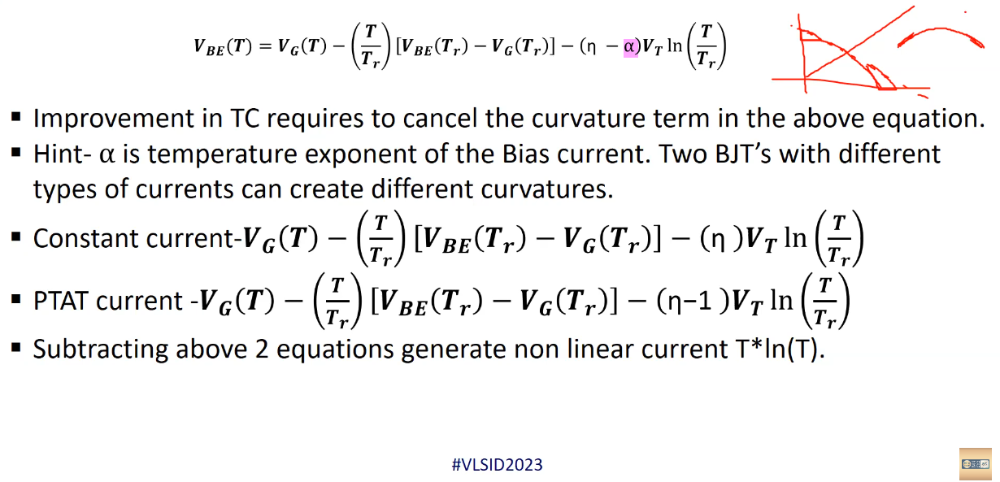

> Tutorials | 08012023 | 1.2.1 Bandgap Voltage Regular |, [[https://youtu.be/dz067SOX0XQ?si=PlYczw9UdneAX6Na](https://youtu.be/dz067SOX0XQ?si=PlYczw9UdneAX6Na)]

## Subthreshold Conduction

By square-law, the Eq $g_m = \sqrt{2\mu C_{ox}\frac{W}{L}I_D}$, it is possible to obtain a *higer* transconductance by increasing $W$ while maintaining $I_D$ constant. However, if $W$ increases while $I_D$ remains constant, then $V_{GS} \to V_{TH}$ and device enters the subthreshold region.
$$
I_D = I_0\exp \frac{V_{GS}}{\xi V_T}
$$

where $I_0$ is proportional to $W/L$, $\xi \gt 1$ is a nonideality factor, and $V_T = kT/q$

As a result, the transconductance in subthreshold region is
$$
g_m = \frac{I_D}{\xi V_T}
$$

which is $g_m \propto I_D$

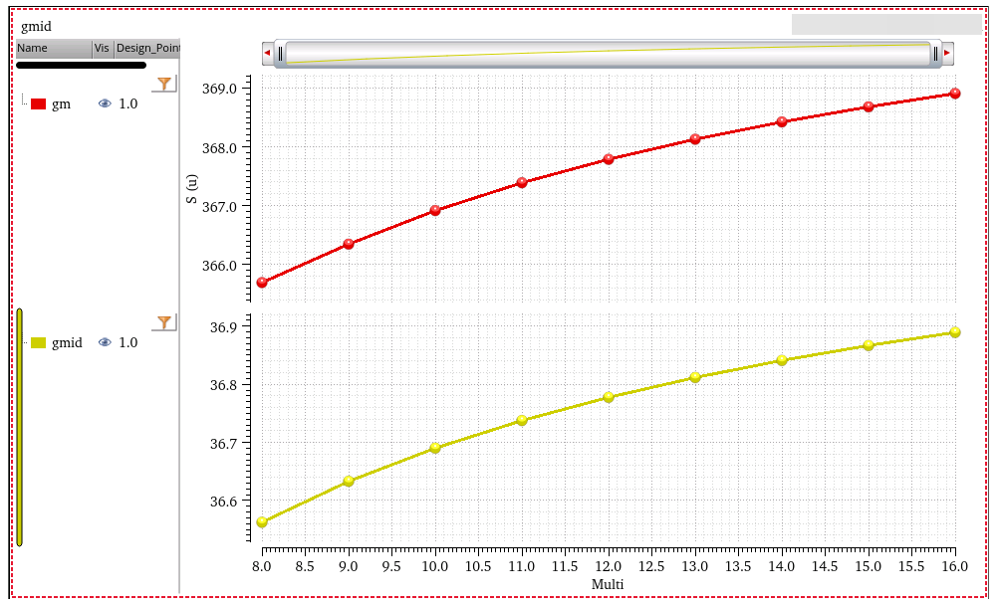

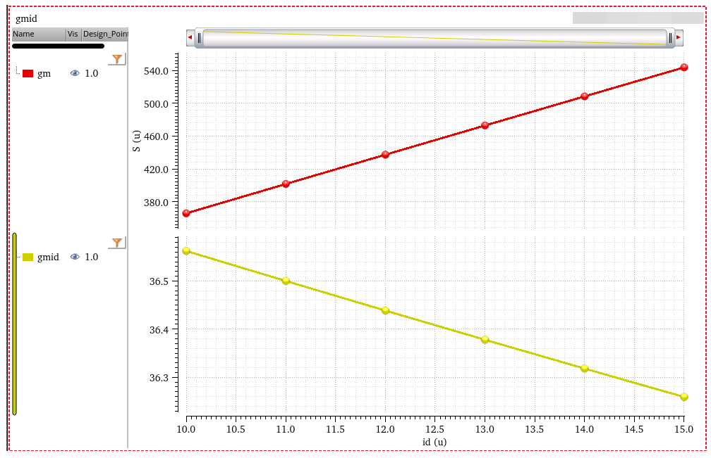

### PTAT with subthreshold MOS

MOS working in the **weak inversion region** (**"subthreshold conduction"**) have the similar characteristics to BJTs and diodes, since the effect of diffusion current becomes more significant than that of drift current

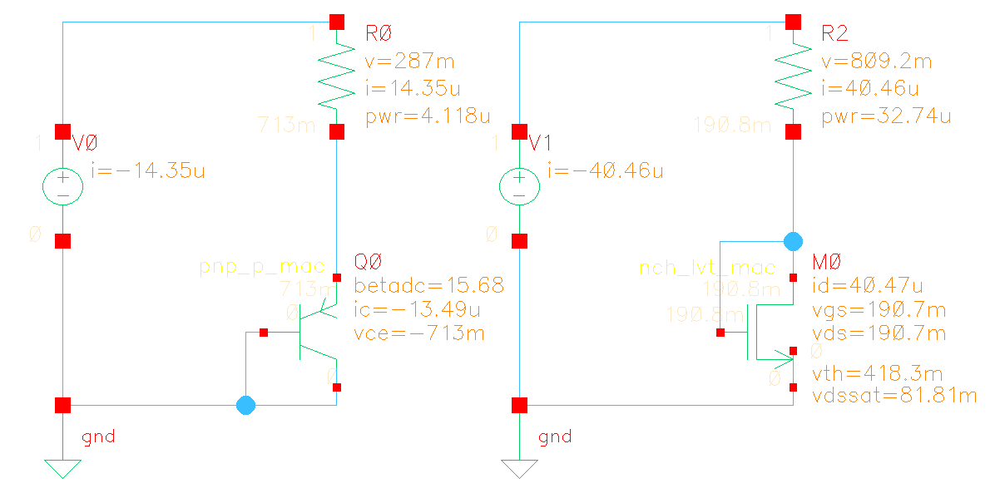

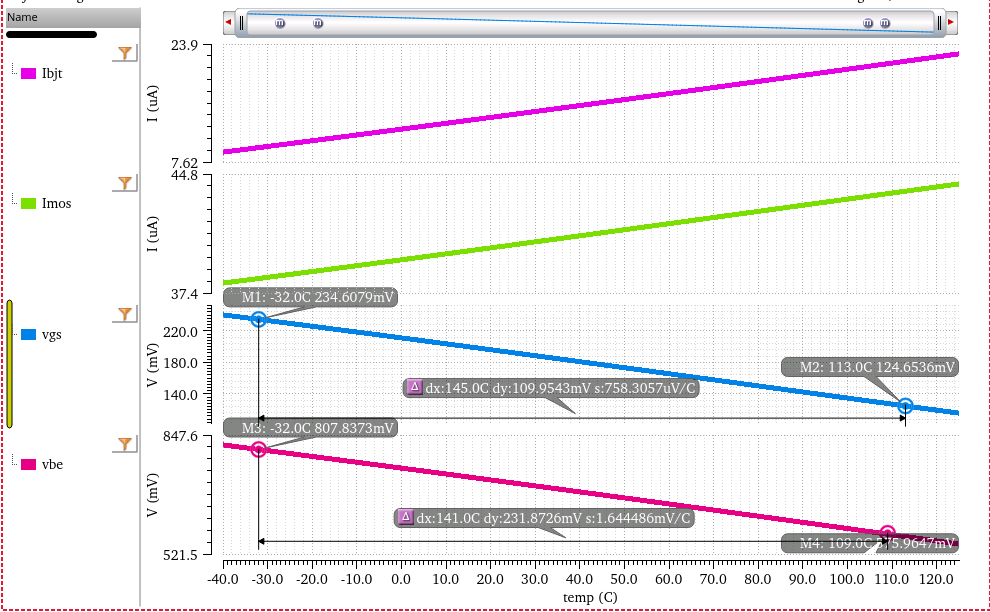

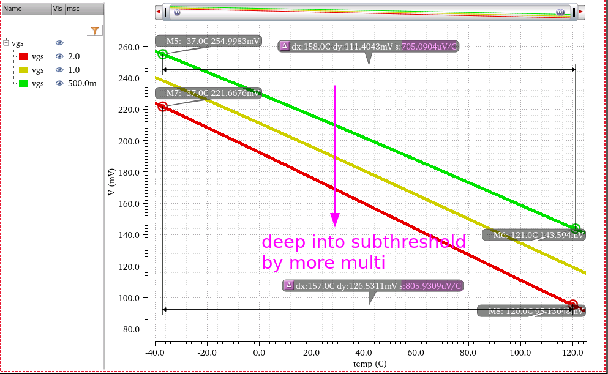

> Hongprasit, Saweth, Worawat Sa-ngiamvibool and Apinan Aurasopon. "Design of Bandgap Core and Startup Circuits for All CMOS Bandgap Voltage Reference." *Przegląd Elektrotechniczny* (2012): 277-280.

## VBE

- temperature coefficient of $V_{BE}$ itself depends on the temperature,

- temperature coefficient of the $V_{BE}$ at a given temperature T depends on the magnitude of $V_{BE}$ itself

> $\frac{kT}{q}$ is approximately 26mV, at room temperature 300K
>
> In advanced node, N4P, $V_{BE}$ is about -1.45mV/K

## constant-gm

> aka. **Beta-multiplier reference**

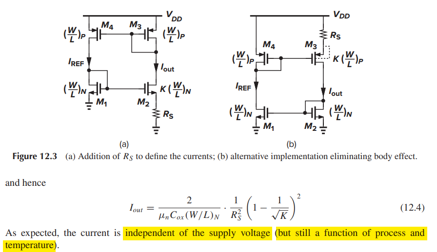

> $I_\text{out}$ is **PTAT** in case temperature coefficient of $R_s$ is less than that of $\mu_n$ 

---

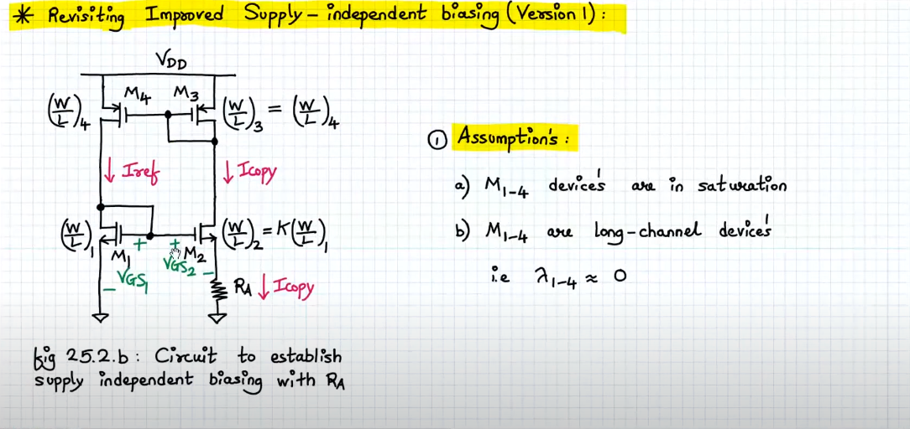

> Body effect of M2

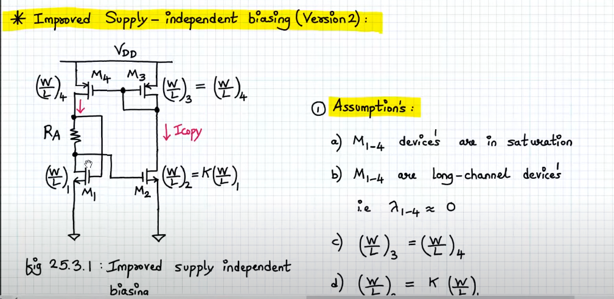

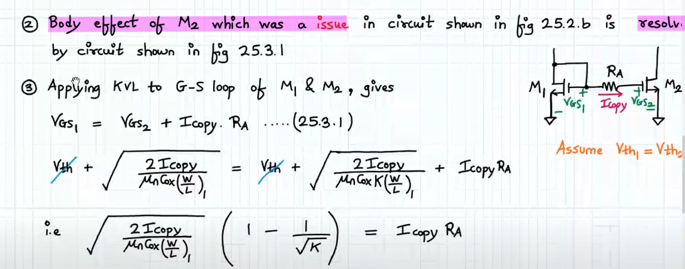

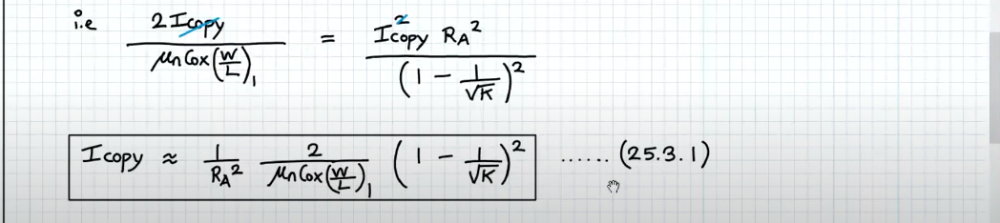

---

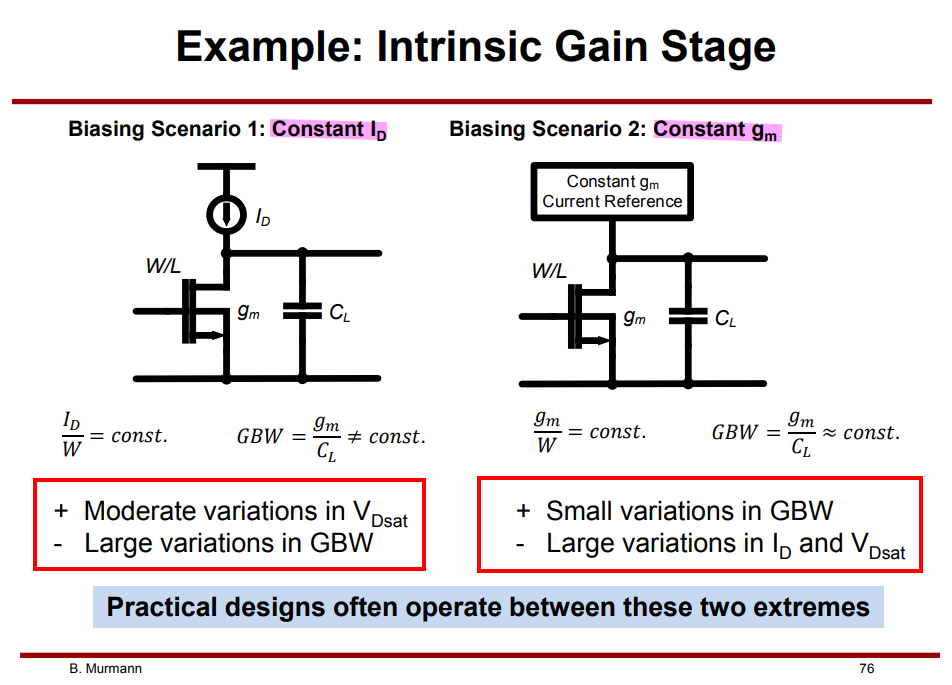

> Boris Murmann, Systematic Design of Analog Circuits Using Pre-Computed Lookup Tables

> S. Pavan, "Systematic Development of CMOS Fixed-Transconductance Bias Circuits," in *IEEE Transactions on Circuits and Systems II: Express Briefs*, vol. 69, no. 5, pp. 2394-2397, May 2022
>
> S. Pavan, "A Fixed Transconductance Bias Circuit for CMOS Analog Integrated Circuits", *IEEE International Symposium on Circuits and Systems*, ISCAS 2004, Vancouver , May 2004

## Why MOS in saturation ?

### $g_m$, $g_\text{ds}$ at fixed $V_\text{GS}$

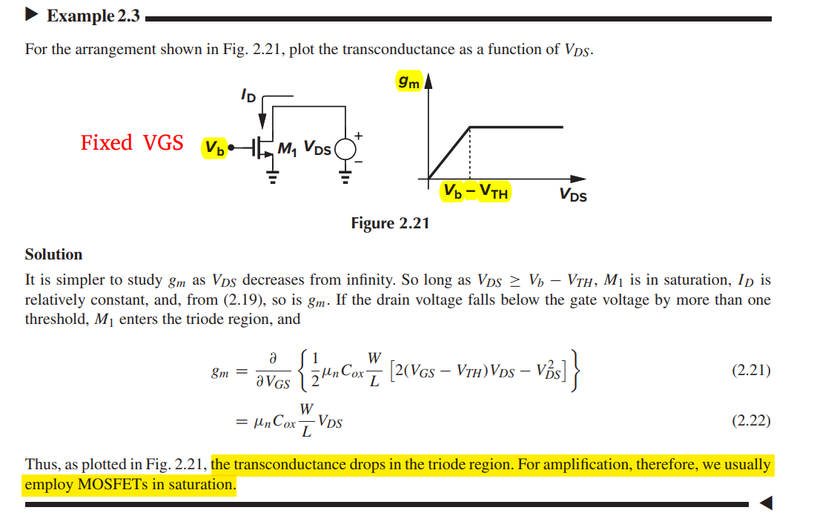

---

$g_{ds}$ is constant in saturation region

in triode region
$$
g_{ds} = \mu_nC_{ox}\frac{W}{L}(V_{GS}-V_{TH}-V_{DS})
$$

> Interestingly, $g_m$ in the saturation region is equal to the inverse of $R_\text{on}$ in the deep triode region.

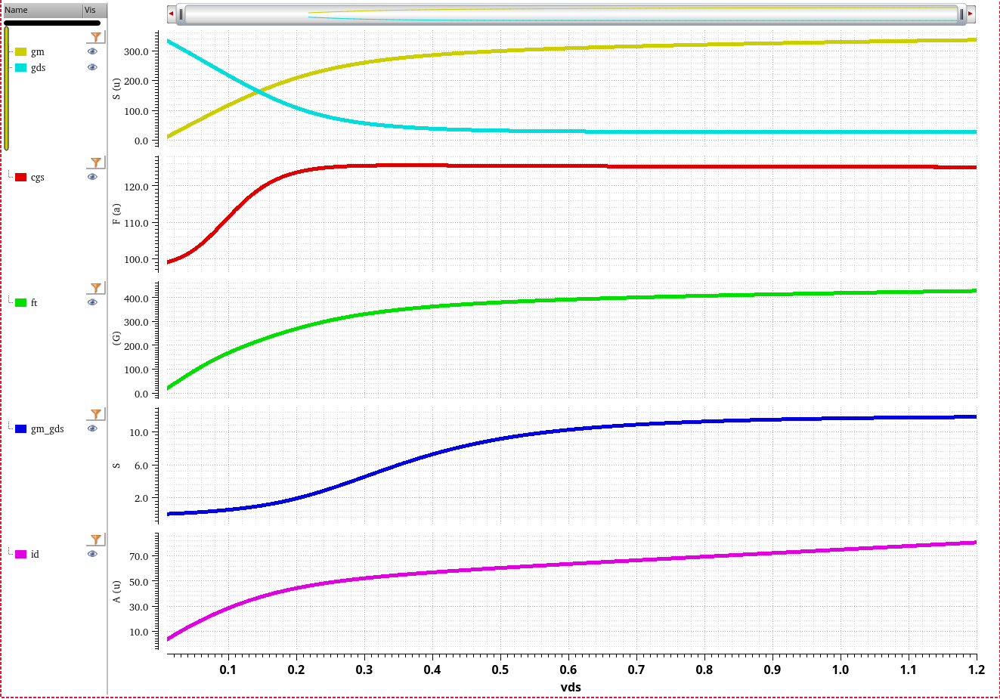

### $g_m$, $g_\text{ds}$ at fixed $I_d$, $V_G$

**In triode region**
$$
I_D  = \frac{1}{2}\mu_nC_{ox}\frac{W}{L}[2(V_{GS}-V_{TH})V_{DS}-V_{DS}^2]
$$
where $I_D$ and $V_G$ is fixed

Then $V_S$ can be expressed with $V_D$, that is
$$
V_S = V_{GT} - \sqrt{(V_{GT}-V_D)^2+V_{dsat}^2}
$$
where $V_{GT}=V_G-V_{TH}$, $V_{dsat}$ is $V_{DS}$ saturation voltage
$$
g_m = \mu_nC_{ox}\frac{W}{L}\left(V_D-V_{GT}+\sqrt{(V_{GT}-V_D)^2+V_{dsat}^2}\right)
$$
Then
$$
\frac{\partial g_m}{\partial V_D} \propto  1 - \frac{V_{GT}-V_D}{\sqrt{(V_{GT}-V_D)^2+V_{dsat}^2}} \gt 0
$$

That is, $g_m \propto V_D$​

---

$$\begin{align}
g_{ds} &= \mu_nC_{ox}\frac{W}{L}(V_{GS}-V_{TH}-V_{DS}) \\
&= \mu_nC_{ox}\frac{W}{L}(V_{GT}-V_{D})
\end{align}$$

That is, $g_{ds} \propto -V_D$

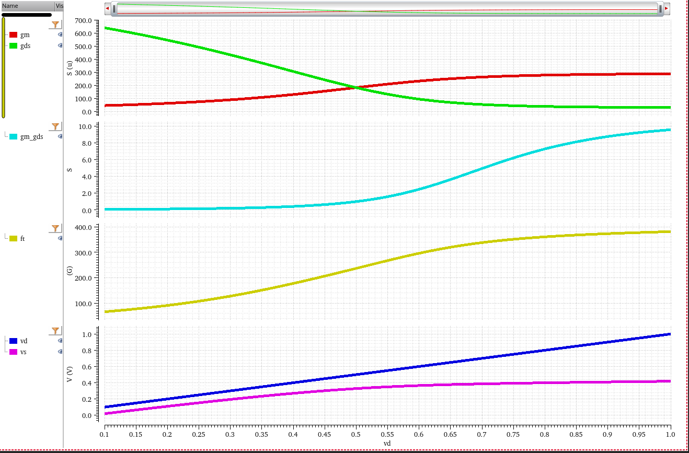

> Both gain and speed degrade once entering triode region, though Id is constant

## Cascode MOS 

The low threshold voltage of cascode MOS **don't** help decrease the minimum output voltage

## Channel-length modulation

> &#10071; There it **not** channel-length modulation in the triode region
>
> 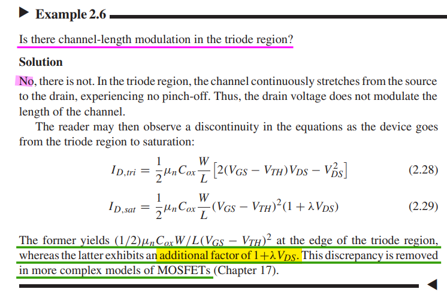

$$\begin{align}
I_D &=\frac{1}{2}\mu_nC_{ox}\frac{W}{L}(V_{GS}-V_{TH})^2(1+\frac{\Delta L}{L}) \\
I_D &=\frac{1}{2}\mu_nC_{ox}\frac{W}{L}(V_{GS}-V_{TH})^2(1+\lambda V_{DS}) \\
I_D &=\frac{1}{2}\mu_nC_{ox}\frac{W}{L}(V_{GS}-V_{TH})^2(1+\frac{V_{DS}}{V_A})
\end{align}$$

where $\frac{\Delta L}{L}=\lambda V_{DS}$ and $V_A=\frac{1}{\lambda}$ 

$\lambda$ is channel length modulation parameter

$V_A$, i.e. Early voltage is equal to inverse of channel length modulation parameter

The output resistance $r_o$

$$\begin{align}
r_o &= \frac{\partial V_{DS}}{\partial I_D} \\
&= \frac{1}{\partial I_D/\partial V_{DS}} \\
&= \frac{1}{\lambda I_D} \\
&= \frac{V_A}{I_D}
\end{align}$$

Due to  $\lambda \propto 1/L$, i.e. $V_A \propto L$
$$
r_o \propto \frac{L}{I_D}
$$
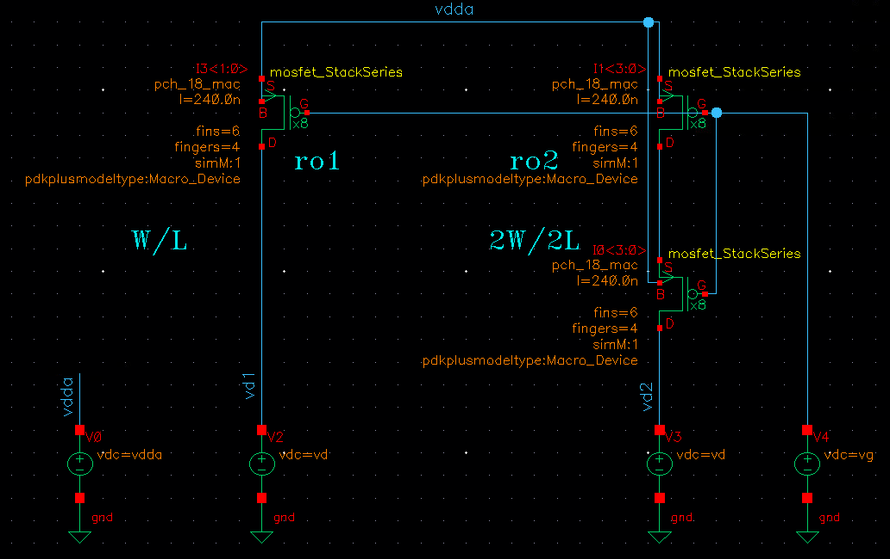

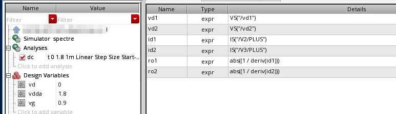

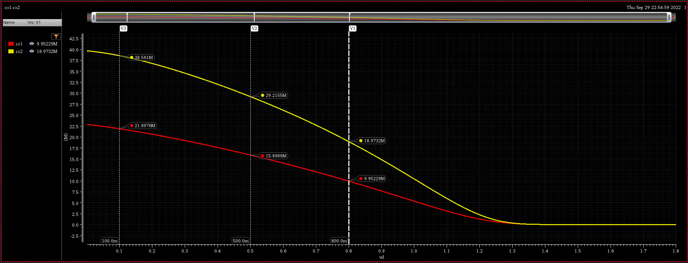

The output resistance is almost doubled using Stacked FET  in *saturation region*

> $V_t$ and mobility $\mu_{n,p}$ are sensitive to temperature
>
> - $V_t$ decreases by 2-mV for every 1$^oC$ rise in temperature
> - mobility $\mu_{n,p}$ decreases with temperature
>
>  Overall, increase in temperature results in lower drain currents

## current mirror mismatch

The current mismatch consists of two components.

- The first depends on threshold voltage mismatch and increases as the overdrive $(V_{GS} − V_t)$ is reduced.
- The second is geometry dependent and contributes a fractional current mismatch that is independent of bias point.

$$
\Delta I_D = g_m\cdot \Delta V_{TH}+I_D\cdot \frac{\Delta(W/L)}{W/L}
$$

where mismatches in $\mu_nC_{ox}$ are neglected

$$\begin{align}
\Delta V_{TH} &= \frac{A_{VTH}}{\sqrt{WL}} \\
\frac{\Delta(W/L)}{W/L} &= \frac{A_{WL}}{\sqrt{WL}}
\end{align}$$

**summary:**

| Size                                                         | $g_m$        | $\Delta V_{TH}$ | $\frac{\Delta(W/L)}{W/L}$ | mismatch (%)                                     | simu (%) |
| ------------------------------------------------------------ | ------------ | --------------- | ------------------------- | ------------------------------------------------ | -------- |
| W, L                                                         | 1            | 1               | 1                         | $I_{\Delta_{V_{TH}}}+I_{\Delta_{WL}}$            | 3.44     |
| W, 2L                                                        | $1/\sqrt{2}$ | $1/\sqrt{2}$    | $1/\sqrt{2}$              | $I_{\Delta_{V_{TH}}}/2+I_{\Delta_{WL}}/\sqrt{2}$ | 1.98     |
| 2W, L                                                        | $\sqrt{2}$   | $1/\sqrt{2}$    | $1/\sqrt{2}$              | $I_{\Delta_{V_{TH}}}+I_{\Delta_{WL}}/\sqrt{2}$   | 2.93     |
| We get $I_{\Delta_{V_{TH}}}\simeq 1.71\%$ and $I_{\Delta_{WL}} \simeq 1.73\%$ |              |                 |                           |                                                  |          |

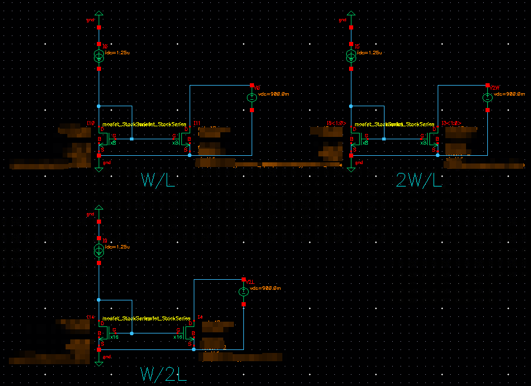

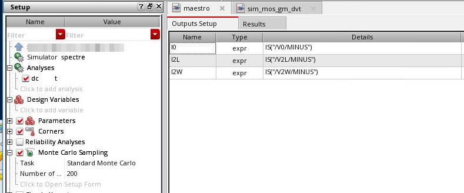

## Biasing current source and global variation Monte Carlo 

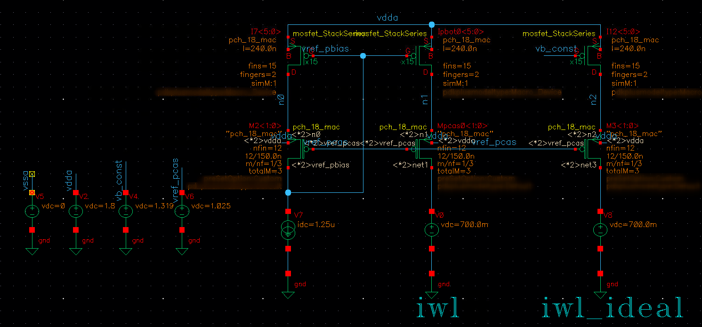

**iwl**: biased by mirror

**iwl_ideal**: biased by *vdc* source, whose value is *typical corner*

---

For **local variation**, constant voltage bias (*vb_const* in schematic) help reduce variation from $\sqrt{2}\Delta V_{th}$ to  $\Delta V_{th}$

For **global variation**, *all device have same variation*, mirror help reduce variation by sharing same $V_{gs}$ 

1. global variation + local variation (All MC)

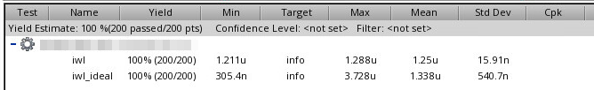

2. local variation (Mismatch MC)

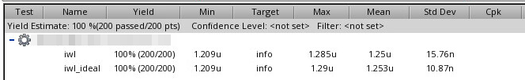

3. global variation (Process MC)

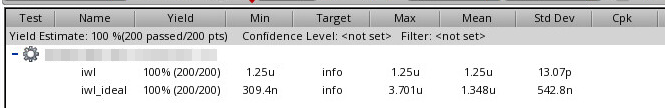

> We had better bias mos gate with mirror rather than the *vdc* source while simulating sub-block.
>
> This is real situation due to current source are always biased by mirror and *vdc* biasing don't give the right result in global variation Monte Carlo simulation (*542.8n* is too pessimistic, *13.07p* is right result)

## Operating points & Small gain theorem

> Dr. Degang Chen, **EE 501:** **CMOS Analog Integrated Circuit Design** [[https://class.ece.iastate.edu/djchen/ee501/2020/References.ppt](https://class.ece.iastate.edu/djchen/ee501/2020/References.ppt)]

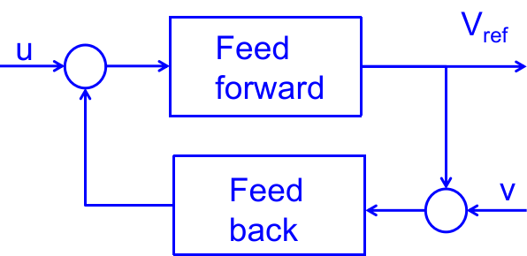

For any given constant values of *u* and *v*, the constant values of variables that solve the the feed back relationship are called the **operating points**, or **equilibrium points**.

> *Operating points* can be either *stable* or *unstable*.
>
> An operating point is unstable if any or some small perturbation near it causes divergence away from that operating point.

If the loop gain evaluated at an operating point is **less than one**, that operating point is **stable**.

> This is a sufficient condition

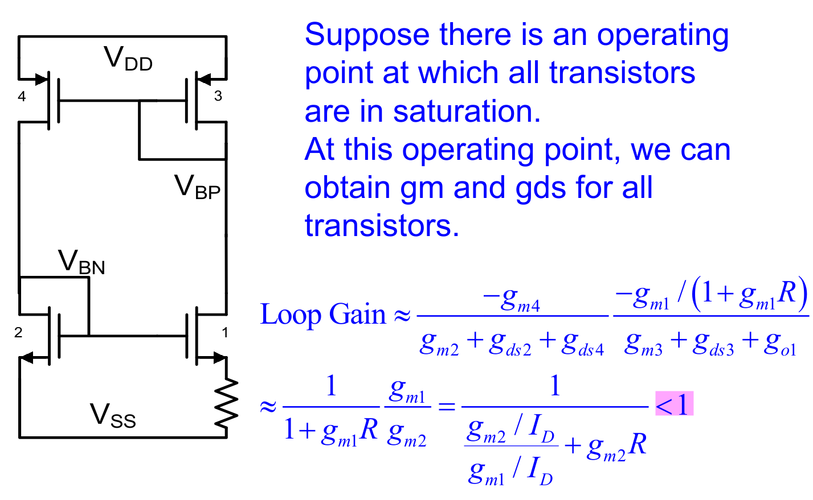

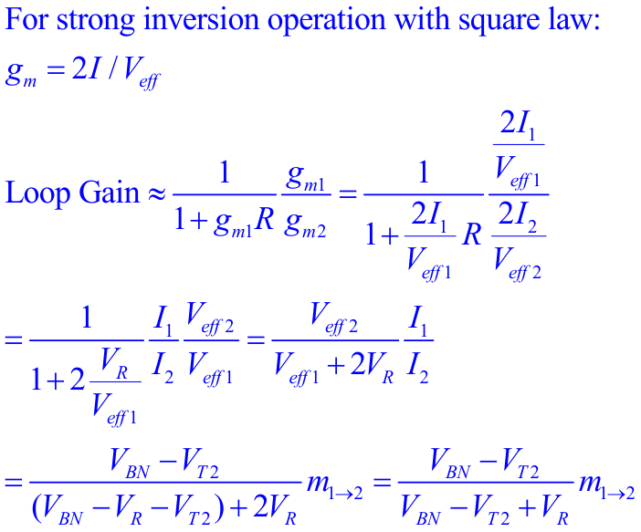

With $m_{1\to 2} = 1$
$$
\text{Loop Gain} \simeq \frac{V_{BN}-V_{T2}}{V_{BN}-V_{T2} + V_R} \tag{LG\_0}
$$
Assuming all MOS in strong inv operation, $I$, $V_{BN}$ and $V_R$ is obtain
$$\begin{align}
I &= \frac{2\beta _1 + 2\beta _2 - 4\sqrt{\beta _1 \beta _2}}{R^2\beta _1 \beta _2} \\
V_{BN} &= V_{T2} + \frac{2}{R\beta _2}(1- \sqrt{\frac{\beta _2}{\beta _1}}) \\
IR &= \frac{2}{R}\left( \frac{1}{\sqrt{\beta_2}} -  \frac{1}{\sqrt{\beta_1}} \right)
\end{align}$$

Substitute $V_{BN}$ and $V_R$ of $(LG\_0)$
$$\begin{align}
\text{Loop Gain} & \simeq \frac{1-\sqrt{\frac{\beta_2}{\beta_1}}}{\frac{\beta_2}{\beta_1} - 3\sqrt{\frac{\beta_2}{\beta_1}}+2} \\
&= \frac{1}{2-\sqrt{\frac{\beta_2}{\beta_1}}} \tag{LG\_1}
\end{align}$$

### Alternative approach for Loop Gain

> using derivation of large signal

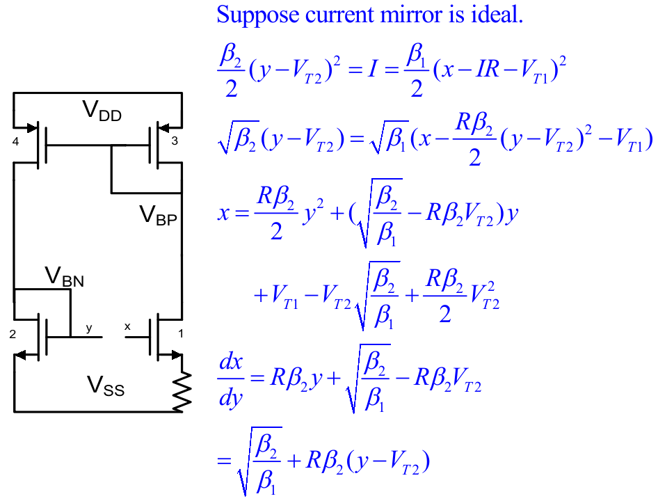

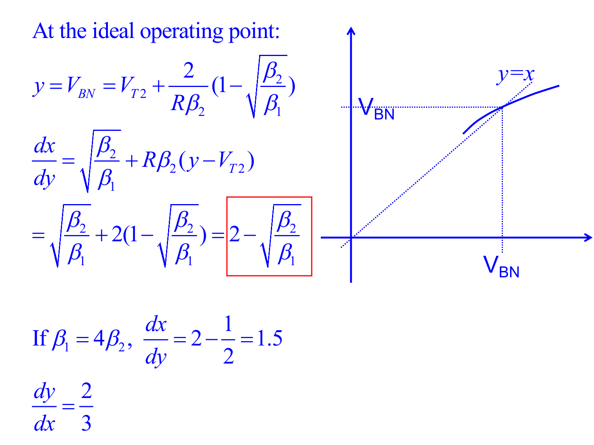

---

> &#10071;&#10071;&#10071; R should **not** be on the other side

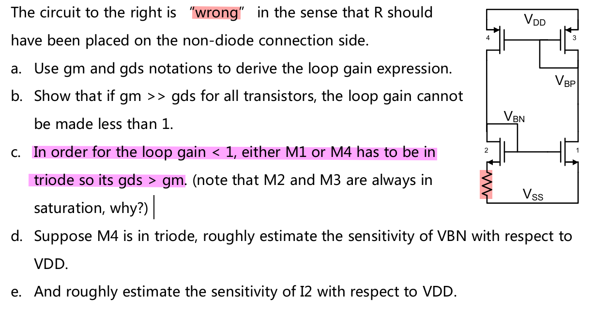

## Self-Biasing Cascode

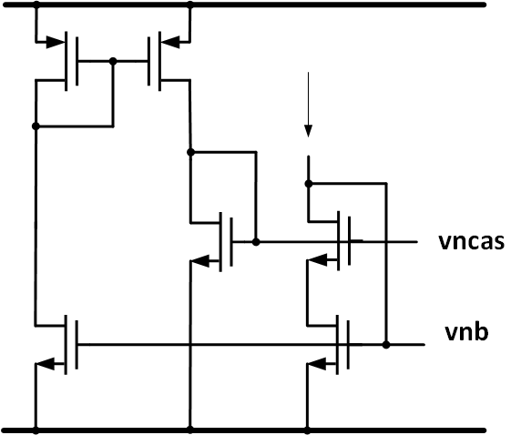

---

---

## reference

B. Razavi, "The Design of a Low-Voltage Bandgap Reference [The Analog Mind]," in *IEEE Solid-State Circuits Magazine*, vol. 13, no. 3, pp. 6-16, Summer 2021, doi: 10.1109/MSSC.2021.3088963

