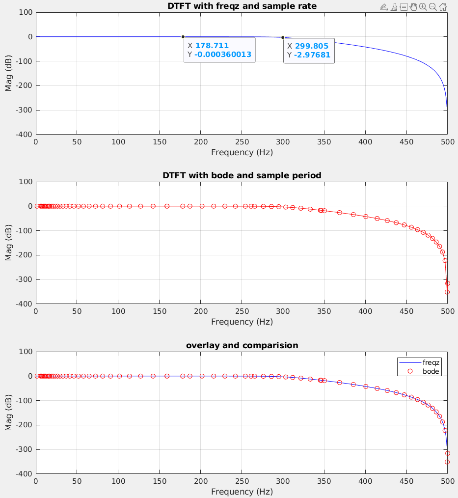

## Butterworth filter

> function varargout = butter(n, Wn, varargin)
>
> %   BUTTER Butterworth digital and analog filter design.
>
> %   [B,A] = BUTTER(N,Wn) designs an Nth order lowpass digital
>
> %   Butterworth filter and returns the filter coefficients in length
>
> %   N+1 vectors B (numerator) and A (denominator). The coefficients
>
> %   are listed in descending powers of z. The cutoff frequency
>
> %   Wn must be **0.0 < Wn < 1.0**, with 1.0 corresponding to
>
> %   half the sample rate.

$$
w_n = \frac{f_c}{0.5f_s}
$$

where $f_c$ is cutoff frequency, $f_s$ is sampling frequency


$$
\Phi = \omega T_s \text { ,}\Phi \in [0,2\pi]
$$

Find the relationship between $\omega_n$ and \Phi

$$\begin{align}
\Phi &= 2\pi f_c \frac{1}{f_s}  \\
&=\pi \frac{f_c}{0.5f_s} \\
&= \pi \omega _n
\end{align}$$


Given $f_c$ is 300 Hz and $f_s$ is 1000 Hz, we get
$$
\omega_n = \frac{f_c}{0.5*f_s} = 0.6
$$
and in `rad/sample` unit, cutoff frequency is 
$$
\Phi = \pi * \omega_n = 0.6 \pi \text {, unit: rad/sample}
$$

### Z-transform

$$
z= e^{-j\Phi}
$$

```matlab
fc = 300;
fs = 1000;

[b,a] = butter(6,fc/(fs/2));
fprintf('The numerator b is:\n ');
fprintf('%g ', b);
fprintf('\n');
fprintf('The denominator a is:\n ');
fprintf('%g ', a);
fprintf('\n');

figure(1)
freqz(b, a);
ylim([-400, 100])
```

> The numerator (`b`) and denominator (`a`) depend on the cutoff frequency and the order; the cutoff frequency is denominated with $\omega_n$ . Just multiply the $\pi$, we get the Z-transform $\Phi$ rad/sample, which is the plot of `freqz(b, a)`


### Transfer function with sample information

$$
z = e^{-j\omega T_s}
$$



```verilog
figure(2)
ylim([-400, 100])
[h,f] = freqz(b,a,[],fs);
hdb20 = 20*log10(abs(h));
subplot(3,1,1)
plot(f, hdb20, 'b')
ylim([-400, 100])
title('DTFT with freqz and sample rate')
xlabel('Frequency (Hz)')
ylabel('Mag (dB)')
grid on;

subplot(3,1,2)
sys = tf(b, a, 1/fs);
[mag, phs, wout] = bode(sys);
wout = wout(:);
whz = wout/2/pi;
hdb = 20*log10(mag(:));
plot(whz, hdb, 'r-o');
ylim([-400, 100])
title('DTFT with bode and sample period')
xlabel('Frequency (Hz)')
ylabel('Mag (dB)')
grid on;


subplot(3,1,3)
plot(f, hdb20,'b', whz, hdb, 'ro');
legend('freqz', 'bode')
ylim([-400, 100])
title('overlay and comparision')
xlabel('Frequency (Hz)')
ylabel('Mag (dB)')
grid on;

```

## Time Domain from Frequency Domain

Assume input is **sampled by** $f_s$

```verilog
figure(3)
% assume x is sampled by fs
x = rand(1, 50);
y = filter(b, a, x);
xt = (1:50);
plot(xt, x, '-s', xt, y, '-o')
legend('input', 'output')
xlabel('Sample')
ylabel('mag')
title('filter in Time domain')
grid on;
```


