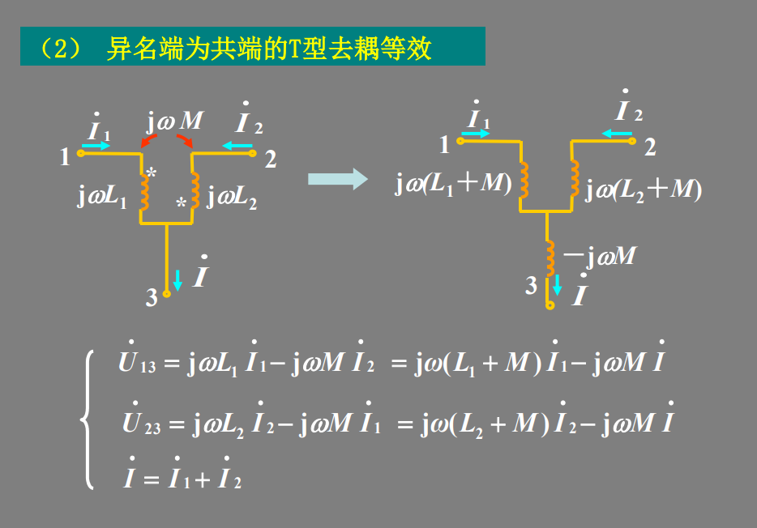

## T-Coil Peaking

***Capacitor Splitting*** + ***Magnetic Coupling***

> 

## Active Inductor

$$\begin{align}
A &= \frac{g_mR_L}{1+(g_{\text{m}_{\text{dio}}}+ g_{\text{ds}_\text{tot}})R_L}\cdot \frac{1+R_pC_Ps}{1+\frac{(1+g_{\text{ds}_{\text{tot}}}R_L)R_PC_P+C_PR_L+R_LC_L}{1+(g_{\text{m}_{\text{dio}}}+g_{\text{ds}_\text{tot}})R_L}s + \frac{R_LC_LR_PC_P}{1+(g_{\text{m}_\text{dio}}+g_{\text{ds}_{\text{tot}}})R_L}s^2} \\
&= \frac{g_mR_L}{1+(g_{\text{m}_{\text{dio}}}+ g_{\text{ds}_{\text{tot}}})R_L}\cdot \frac{R_PC_P}{ \frac{R_LC_LR_PC_P}{1+(g_{\text{m}_{\text{dio}}}+g_{\text{ds}_{\text{tot}}})R_L}}\cdot \frac{1/(R_PC_P)+s}{s^2 + \frac{(1+g_{\text{ds}_{\text{tot}}}R_L)R_PC_P+C_PR_L+R_LC_L}{R_PC_P}s + \frac{1+(g_{\text{m}_{\text{dio}}}+g_{\text{ds}_\text{tot}})R_L}{R_LC_LR_PC_P}} \\
&= A_0 \cdot A(s)
\end{align}$$

That is

$$\begin{align}
\omega_z &= \frac{1}{R_PC_P} \tag{1} \\ 
\omega_n &= \sqrt{\frac{1+(g_{\text{m}_{\text{dio}}}+ g_{\text{ds}_\text{tot}})R_L}{R_LC_LR_PC_P}} = \sqrt{\omega_{p0}\omega_z} \\
\zeta & = \frac{(1+g_{\text{ds}_\text{tot}}R_L)R_PC_P+C_PR_L+R_LC_L}{R_PC_P} \frac{1}{2 \omega_n}
\end{align}$$

Where
$$\begin{align}
\omega_{p0} &= \frac{1}{(R_L||\frac{1}{g_{\text{m}_{\text{dio}}}}||\frac{1}{g_{\text{m}_{\text{tot}}}})C_L}  \tag{2}
\end{align}$$

Here, relate $\omega_{p0}$ and $\omega_z$ by coefficient $\alpha$
$$
\omega_{p0} = \alpha \cdot  \omega_z \tag{3}
$$
This way
$$
\omega_n= \sqrt{\alpha}\cdot \omega_z
$$

$$
\zeta = \frac{1}{2}(K\sqrt{\alpha}+\frac{1+C_P/C_L}{\sqrt{\alpha}}) \tag{4}
$$

where
$$
K = \frac{R_L||\frac{1}{g_{\text{m}_{\text{dio}}}}||\frac{1}{g_{\text{m}_{\text{tot}}}}}{R_L||g_\text{ds\_tot}}
$$

And $A(s)$ can be expressed as
$$
A(s) = \frac{\frac{s}{\omega_z}+1}{\frac{s^2}{\omega_n^2}+2\frac{\zeta}{\omega_n}s+1}
$$
It magnitude in dB
$$
A_\text{dB} = 10\log\frac{1+(\omega/\omega_z)^2}{1+(\omega/\omega_n)^4+2\omega^2(2\zeta^2-1)/\omega_n^2}
$$
Substitute $\omega_n$ with Eq (2), followed is obtained
$$
A_\text{dB} = 10\log{\frac{\alpha^2(\omega_z^4 + \omega_z^2\omega^2)}{\alpha^2\omega_z^4+\omega^4+2\alpha\omega_z^2(2\zeta^2-1)\omega^2}}
$$
peaking frequency
$$
\omega_\text{peak} = \omega_z\cdot \sqrt{\sqrt{(\alpha+1)^2 - 4\alpha \zeta^2}-1}
$$
If $\zeta=1$
$$\begin{align}
\omega_{A_\text{dB = 0dB} }&= \sqrt{1-2/\alpha}\cdot \omega_{p0} \\
\omega_\text{peak} &= \omega_z\sqrt{\alpha-2} \\
A_\text{dB,peak} &= 10\log\frac{\alpha^2}{4(\alpha-1)}
\end{align}$$

## Transformer

任何封闭电路中感应电动势大小，等于穿过这一电路磁通量的变化率。
$$
\epsilon = -\frac{d\Phi_B}{dt}
$$
其中 $\epsilon$是电动势，单位为伏特

$\Phi_B$是通过电路的磁通量，单位为韦伯

电动势的方向（公式中的负号）由楞次定律决定

> **楞次定律**: 由于磁通量的改变而产生的感应电流，其方向为抗拒磁通量改变的方向。

> 在回路中产生感应电动势的原因是由于通过回路平面的磁通量的**变化**，而不是磁通量本身，即使通过回路的磁通量很大，但只要它不随时间变化，回路中依然不会产生感应电动势。

### 自感电动势

当电流$I$随时间变化时，在线圈中产生的自感电动势为
$$
\epsilon = -L\frac{dI}{dt}
$$

---

> **同名端**：当两个*电流*分别从两个线圈的对应端子流入 ，其所 产生的磁场相互加强时，则这两个对应端子称为同名端。

## reference

S. Shekhar, J. S. Walling and D. J. Allstot, "Bandwidth Extension Techniques for CMOS Amplifiers," in *IEEE Journal of Solid-State Circuits*, vol. 41, no. 11, pp. 2424-2439, Nov. 2006 [[pdf](https://people.engr.tamu.edu/spalermo/ecen689_oi/2006_passive_bw_extension_techniques_shekhar_jssc.pdf)]

David J. Allstot Bandwidth Extension Techniques for CMOS Amplifiers [[https://ewh.ieee.org/r5/denver/sscs/Presentations/2007_08_Allstot.pdf](https://ewh.ieee.org/r5/denver/sscs/Presentations/2007_08_Allstot.pdf)]

B. Razavi, "The Bridged T-Coil [A Circuit for All Seasons]," IEEE Solid-State Circuits Magazine, Volume. 7, Issue. 40, pp. 10-13, Fall 2015 [[https://www.seas.ucla.edu/brweb/papers/Journals/BRFall15TCoil.pdf](https://www.seas.ucla.edu/brweb/papers/Journals/BRFall15TCoil.pdf)]

—, "The Design of Broadband I/O Circuits [The Analog Mind]," IEEE Solid-State Circuits Magazine, Volume. 13, Issue. 2, pp. 6-15, Spring 2021 [[http://www.seas.ucla.edu/brweb/papers/Journals/BR_SSCM_2_2021.pdf](http://www.seas.ucla.edu/brweb/papers/Journals/BR_SSCM_2_2021.pdf)]

Deog-Kyoon Jeong. Topics in IC Design: T-Coil [[pdf](https://ocw.snu.ac.kr/sites/default/files/NOTE/Lec%2010%20-%20Bandwidth%20Extension%20Techniques.pdf)]

Cowan G. *Mixed-Signal CMOS for Wireline Communication: Transistor-Level and System-Level Design Considerations*. Cambridge University Press; 2024

J. Paramesh and D. J. Allstot, "Analysis of the Bridged T-Coil Circuit Using the Extra-Element Theorem," in IEEE Transactions on Circuits and Systems II: Express Briefs, vol. 53, no. 12, pp. 1408-1412, Dec. 2006 [[https://sci-hub.st/10.1109/TCSII.2006.885971](https://sci-hub.st/10.1109/TCSII.2006.885971)]

S. C. D. Roy, "Comments on "Analysis of the Bridged T-coil Circuit Using the Extra-Element Theorem," in IEEE Transactions on Circuits and Systems II: Express Briefs, vol. 54, no. 8, pp. 673-674, Aug. 2007 [[https://sci-hub.st/10.1109/TCSII.2007.899834](https://sci-hub.st/10.1109/TCSII.2007.899834)]

Starič, Peter and Erik Margan. “Wideband amplifiers.” (2006) [[pdf](https://www-f9.ijs.si/~margan/WBA3_4web/Wideband_Amplifiers_FPRL.pdf)]

Bob Ross. IBIS Summit [[T-Coils and Bridged-T Networks](https://ibis.org/summits/may11/ross2.pdf)], [[T-Coil Topics](https://ibis.org/summits/feb11/ross.pdf)]

A. A. Abidi, "The T-Coil Circuit Demystified," in IEEE Transactions on Circuits and Systems I: Regular Papers, vol. 72, no. 9, pp. 4469-4480, Sept. 2025

S. Lin, D. Huang and S. Wong, "Pi Coil: A New Element for Bandwidth Extension," in *IEEE Transactions on Circuits and Systems II: Express Briefs*, vol. 56, no. 6, pp. 454-458, June 2009

---

B. Razavi, "The Active Inductor [A Circuit for All Seasons]," in *IEEE Solid-State Circuits Magazine*, vol. 12, no. 2, pp. 7-11, Spring 2020 [[https://www.seas.ucla.edu/brweb/papers/Journals/BR_SSCM_2_2020.pdf](https://www.seas.ucla.edu/brweb/papers/Journals/BR_SSCM_2_2020.pdf)]

---

S. Galal and B. Razavi, "Broadband ESD protection circuits in CMOS technology," in IEEE Journal of Solid-State Circuits, vol. 38, no. 12, pp. 2334-2340, Dec. 2003, doi: 10.1109/JSSC.2003.818568.

M. Ker and Y. Hsiao, "On-Chip ESD Protection Strategies for RF Circuits in CMOS Technology," 2006 8th International Conference on Solid-State and Integrated Circuit Technology Proceedings, 2006, pp. 1680-1683, doi: 10.1109/ICSICT.2006.306371.

M. Ker, C. Lin and Y. Hsiao, "Overview on ESD Protection Designs of Low-Parasitic Capacitance for RF ICs in CMOS Technologies," in IEEE Transactions on Device and Materials Reliability, vol. 11, no. 2, pp. 207-218, June 2011, doi: 10.1109/TDMR.2011.2106129.

Kosnac, Stefan (2021) *Analysis* of On-*Chip Inductors* and *Arithmetic Circuits* in the *Context* of *High Performance Computing* [[https://archiv.ub.uni-heidelberg.de/volltextserver/30559/1/Dissertation_Stefan_Kosnac.pdf](https://archiv.ub.uni-heidelberg.de/volltextserver/30559/1/Dissertation_Stefan_Kosnac.pdf)]

Chapter 4.5. High Frequency Passive Devices [[https://www.cambridge.org/il/files/7713/6698/2369/HFIC_chapter_4_passives.pdf](https://www.cambridge.org/il/files/7713/6698/2369/HFIC_chapter_4_passives.pdf)]
