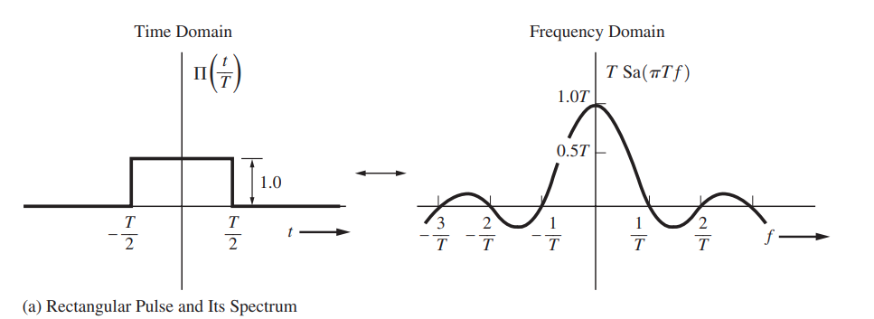
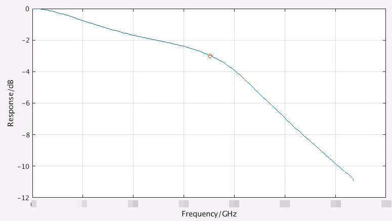
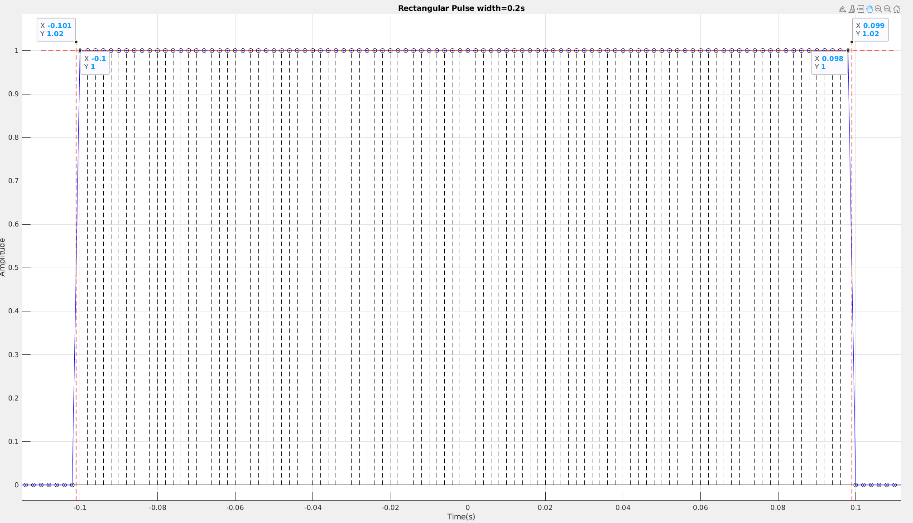
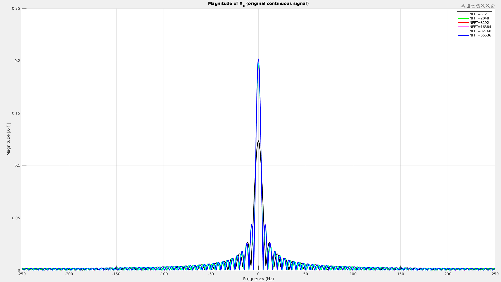

Convolution Property of the Fourier Transform
$$
x(t)*h(t)\longleftrightarrow  X(\omega)H(\omega)
$$
pulse response can be obtained by convolve impulse response with UI length rectangular
$$
H(\omega) = \frac{Y_{\text{pulse}}(\omega)}{X_{\text{rect}}(\omega)} = \frac{Y_{\text{pulse}}(\omega)}{\text{sinc}(\omega)}
$$


```matlab
% Convolution Property of the Fourier Transform
% pulse(t) = h(t) * rect(t)
% -> fourier transform
% PULSE = H * RECT
% FT(RECT) = sinc
% H = PULSE/RECT = PULSE/sinc
xx = pi*ui.*w(1:plt_num);
y_sinc = ui.*sin(xx)./xx;
y_sinc(1) = y_sinc(2);
y_sinc = y_sinc/y_sinc(1);  % we dont care the absoulte gain
h_ban1 = abs(h(1:plt_num))./abs(y_sinc);

h_dB = 20*log10(abs(h_ban1));
[hmin, Index] = min(abs(h_dB +3 ));
f_3dB = w(Index);
f_3dB = f_3dB/1e9;
```






## sinc function
Notice that the complete definition of $\operatorname{sinc}$ on $\mathbb R$ is
$$
\operatorname{Sa}(x)=\operatorname{sinc}(x) = \begin{cases} \frac{\sin x}{x} & x\ne 0, \\ 1, & x = 0, \end{cases}
$$
which is **continuous**.






To approach to real spectrum of continuous rectangular waveform, $\text{NFFT}$  has to be big enough.

```matlab
clear;
close all;
clc;

fs=500; %sampling frequency
Ts = 1/fs;
T=0.2; %width of the rectangule pulse in seconds

figure(1)
hold on;
t=-0.5:1/fs:0.5; %time base
x=rectpuls(t,T); %generating the square wave
sum(x>0.5)
stem(t,x,'--k');
plot(t, x, 'b.-')
xstart = T/2-Ts/2;
xend = -T/2-Ts/2;
plot([xstart, xstart], [-1, 1.02], 'r--');
plot([xend, xend], [-1, 1.02], 'r--');
plot([-0.11, 0.11], [1, 1], 'r--')
hold off;
grid on;
title(['Rectangular Pulse width=', num2str(T),'s']);
xlabel('Time(s)');
ylabel('Amplitude');
xlim([-0.12, 0.12]);
ylim([-0.05, 1.05]);

figure(2)
hold on
Titer = [1, 4, 16, 32, 64, 128];
color = {'k', 'g', 'r', 'm', 'c', 'b'};
formatSpec = 'NFFT=%d';
for k=1:length(Titer)
    t=-Titer(k):Ts:Titer(k); %time base
    x=rectpuls(t,T); %generating the square wave

    L=length(x);
    Np = nextpow2(L)-1;
    NFFT = 2^Np;
    X = fftshift(fft(x,NFFT)); %FFT with FFTshift for both negative & positive frequencies
    f = fs*(-NFFT/2:NFFT/2-1)/NFFT; %Frequency Vector
    Xc = abs(X)*Ts; % continuous signal spectrum
    plot(f, Xc, "Color",color{k}, 'LineWidth',2);
    legend_str{k} = [num2str(NFFT, formatSpec)];
end
hold off
legend(legend_str);
title('Magnitude of X_c (original continuous signal)');
xlabel('Frequency (Hz)')
ylabel('Magnitude |X(f)|');
grid on;
```


**reference**

L.W. Couch, *Digital and Analog Communication* *Systems*, 8th Edition, Pearson, 2013.

[Generating Basic signals – Rectangular Pulse and Power Spectral Density using FFT](https://www.gaussianwaves.com/2014/07/generating-basic-signals-rectangule-pulse-and-power-spectral-density-using-fft/)
