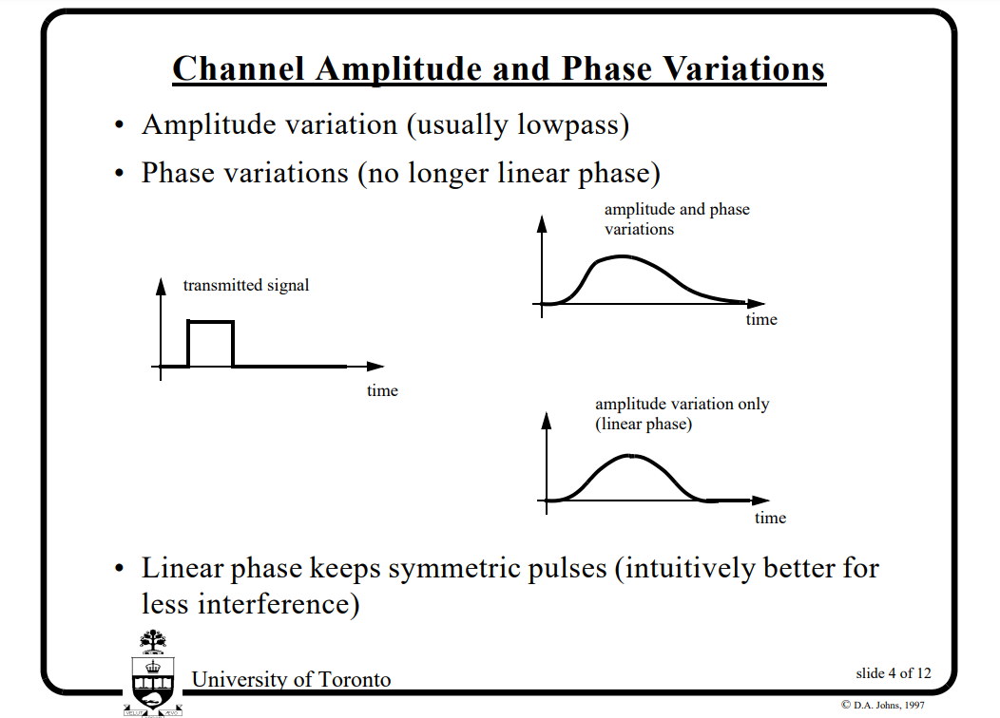
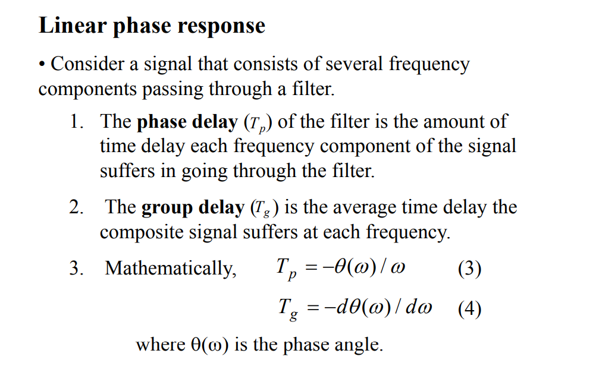
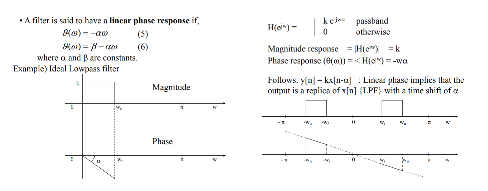

*TODO* &#128197;

## Linear phase

---

> [[https://web.ece.ucsb.edu/~yoga/courses/DSP/P10_Linear_phase_FIR.pdf](https://web.ece.ucsb.edu/~yoga/courses/DSP/P10_Linear_phase_FIR.pdf)]

## reference

B. Farhang-Boroujeny (2013), *Adaptive Filters: Theory and Applications* (2nd ed.). John Wiley & Sons, Inc.

Simon O. Haykin (2014), "Adaptive Filter Theory" Prentice-Hall, Inc. 5rd edition

Diniz, P. S. R. (2020). *Adaptive Filtering: Algorithms and Practical Implementation* (5th ed.). Springer

Jiang X, ed. *Digitally-Assisted Analog and Analog-Assisted Digital IC Design*. Cambridge University Press; 2015.

Albert Jerng. ISSCC2012 T7: *Digital Calibration for RF Transceivers* [[pdf](https://www.nishanchettri.com/isscc-slides/2012%20ISSCC/TUTORIALS/ISSCC2012Visuals-T7.pdf)]

Ahmed M. A. Ali. ISSCC2021 T5: *Calibration Techniques in ADCs* [[pdf](https://www.nishanchettri.com/isscc-slides/2021%20ISSCC/TUTORIALS/ISSCC2021-T5.pdf)]

Salvatore Levantino. ISSCC2024 T5: *Calibration Techniques in PLLs* [[pdf](https://www.nishanchettri.com/isscc-slides/2024%20ISSCC/TUTORIALS/T5.pdf)]

---

A. Chan Carusone and D. A. Johns, "Analog Filter Adaptation Using a Dithered Linear Search Algorithm," *IEEE Int. Symp. Circuits and Syst.*, May 2002. [[PDF](http://www.eecg.utoronto.ca/~tcc/iscas_02a.pdf)], [[Slides]](http://www.eecg.utoronto.ca/~tcc/iscas_02a_slides.pdf)

—, Ph. D. Thesis, "Digital Algorithms for Analog Adaptive Filters", Feb. 2002. [[http://www.eecg.utoronto.ca/~tcc/thesis.pdf]](http://www.eecg.utoronto.ca/~tcc/thesis.pdf)

—, "Analog Adaptive Filters," tutorial at the *IEEE Int. Symp. Circuits and Syst.*, Bangkok, Thailand, May 2003. [[http://www.eecg.utoronto.ca/~tcc/iscas03_tutorial.pdf](http://www.eecg.utoronto.ca/~tcc/iscas03_tutorial.pdf)]

David Johns, "Integrated Circuits for Digital Communications" [[https://www.eecg.toronto.edu/~johns/nobots/courses/ece1392/slides.pdf](https://www.eecg.toronto.edu/~johns/nobots/courses/ece1392/slides.pdf)]

Tai-Haur Kuo "Advanced Analog IC Design for Communications" [[http://msic.ee.ncku.edu.tw/course/AdvancedAnalogICDesign/AdvancedAnalogICDesign.html](http://msic.ee.ncku.edu.tw/course/AdvancedAnalogICDesign/AdvancedAnalogICDesign.html)]
