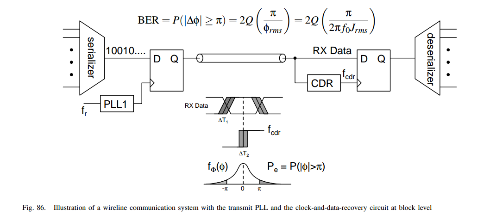
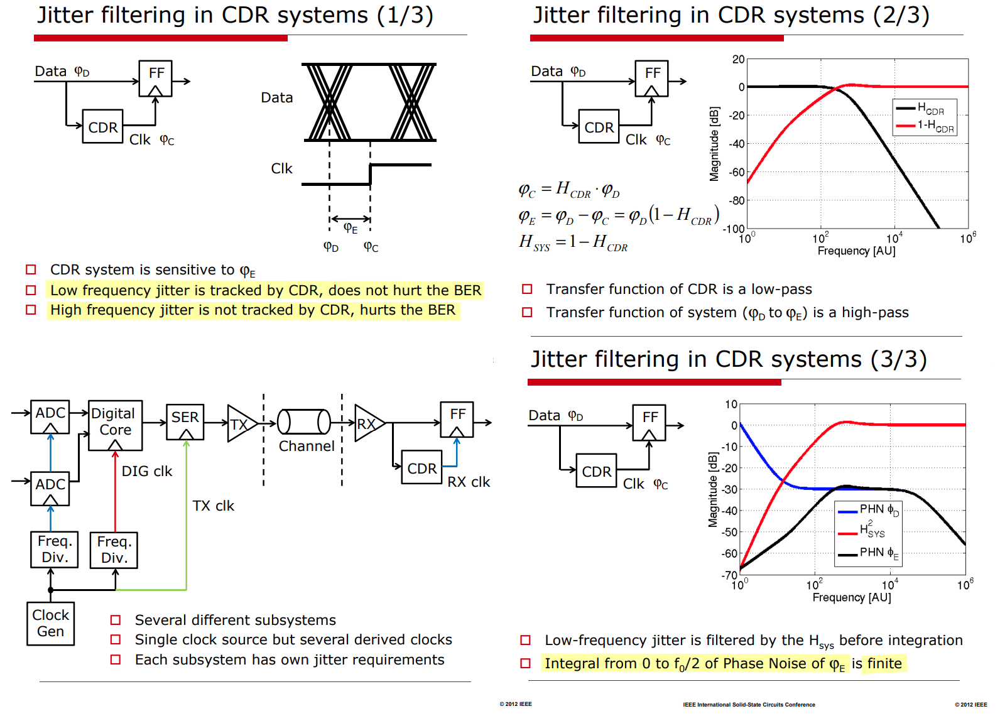

> Application of the theory of cascaded PLLs to wireline transceivers:  TX PLL & RX CDR
>
> 

## reference

Chembiyan T, A General Theory of Cascaded PLL Design [[link](https://media.licdn.com/dms/document/media/v2/D561FAQFvRADxXYwdhg/feedshare-document-pdf-analyzed/B56Zb4ktDGHwAY-/0/1747927149379?e=1749081600&v=beta&t=r_mMzwFUR0kPR0LdWSbeEGzMVk5hOC2qaiVqMVZbnGA)]

Nicola Da Dalt, ISSCC 2012 T5: JITTER basic and advanced concepts, statistics and applications [[https://www.nishanchettri.com/isscc-slides/2012%20ISSCC/TUTORIALS/ISSCC2012Visuals-T5.pdf](https://www.nishanchettri.com/isscc-slides/2012%20ISSCC/TUTORIALS/ISSCC2012Visuals-T5.pdf)]
