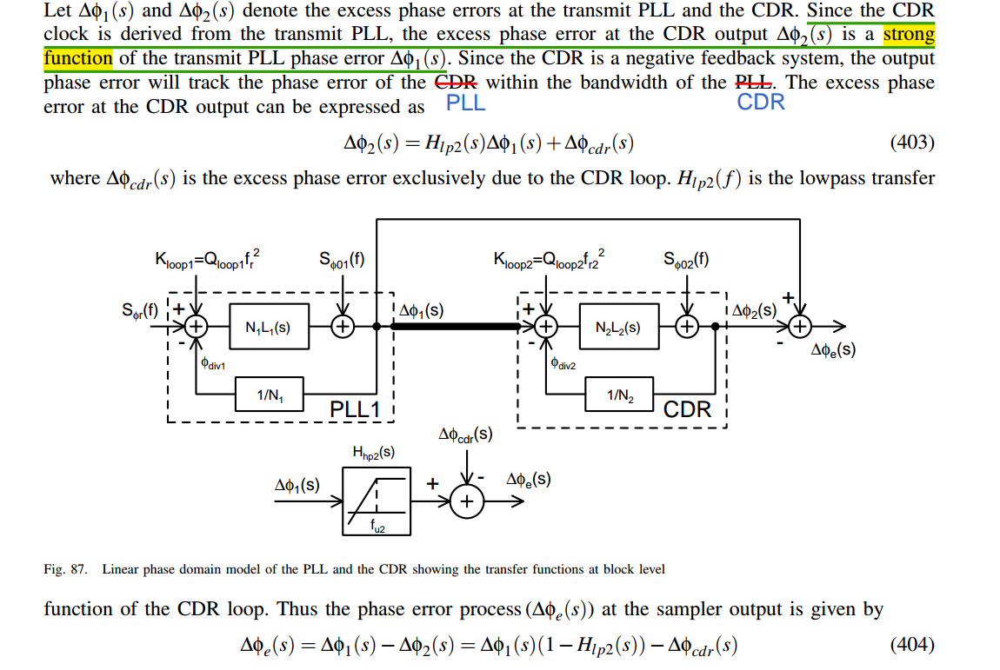

> To understand the impact of the clock jitter on the performance of a wireline system, *the transfer functions of the PLL in the transmitter side* and *the CDR loop in the receiver* should be taken into consideration
>
> 

> *the **minimum** jitter* occurs at the point where the *transmit PLL UGB is **minimum*** and the *CDR UGB is **maximized***

- the net rms jitter that impacts the performance of a wireline transceiver is much lower than the rms jitter of the transmit PLL
- the jitter requirements of the transmit PLL on the wireline system is much more relaxed compared to the wireless transceiver  

## reference

Chembiyan T, A General Theory of Cascaded PLL Design [[link](https://www.linkedin.com/posts/chembiyan-t-0b34b910_theory-of-cascaded-pll-activity-7331339385952448512-ZwxN?utm_source=share&utm_medium=member_desktop&rcm=ACoAAD-cuiIBDJ62eh9q3qTSSdslYXr-XMd8TGw)]

Nicola Da Dalt, ISSCC 2012 T5: JITTER basic and advanced concepts, statistics and applications [[https://www.nishanchettri.com/isscc-slides/2012%20ISSCC/TUTORIALS/ISSCC2012Visuals-T5.pdf](https://www.nishanchettri.com/isscc-slides/2012%20ISSCC/TUTORIALS/ISSCC2012Visuals-T5.pdf)]

—. ESSCIRC 2019 Tutorials: Jitter in Wireline and Data Converter Applications [[https://youtu.be/aapkfCeHTrQ](https://youtu.be/aapkfCeHTrQ)]
