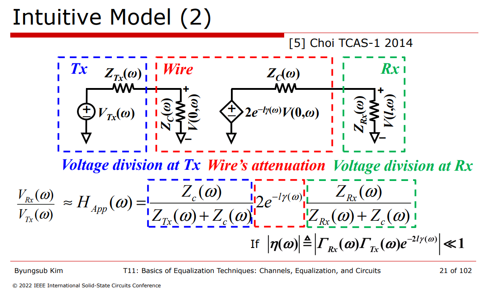
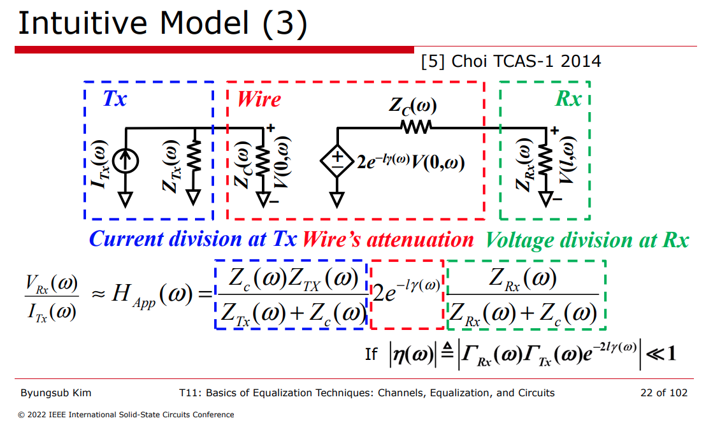

## voltage mode driver

## current mode driver

## reference

 Byungsub Kim,  2022 IEEE International Solid-State Circuits Conference, "T11: Basics of Equalization Techniques: Channels, Equalization, and Circuits"

Minsoo Choi et al., “An Approximate Closed-Form Channel Model for Diverse Interconnect Applications,” IEEE Transactions on Circuits and Systems-I: Regular Papers, vol. 61, no. 10, pp. 3034-3043, Oct. 2014.
