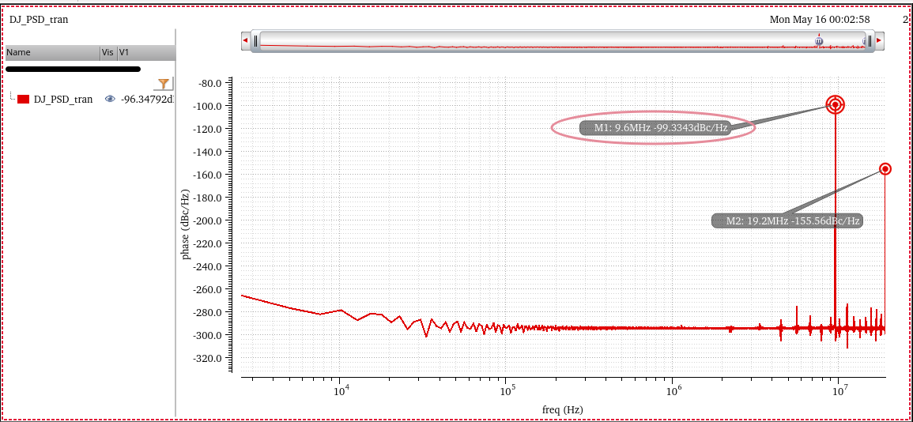
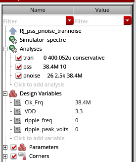
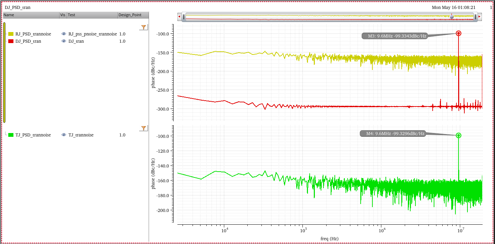

## QEC (Quadrature Error Corrector )

> Shaokang ZHAO, 2025, "Multi-Phase Clock Generator for High-Speed Wireline Systems," [[paper](https://yuegroup.hkust.edu.hk/sites/default/files/Thesis/1.Thesis/2.Mphil/Shaokang%20Thesis.pdf), [slides](https://yuegroup.hkust.edu.hk/sites/default/files/Thesis/2.Slides/2.Mphil/Shaokang_Zhao%20Slides.pdf)]

*TODO* &#128197;


## Standing Wave Based Clock Distribution Technique

> G. Li, W. Lee, D. Cui, B. Zhang, A. Momtaz and J. Cao, "Standing wave based clock distribution technique with application to a 10 × 11 Gbps transceiver in 28 nm CMOS," *2015 IEEE Asian Solid-State Circuits Conference (A-SSCC)*, Xiamen, China, 2015, pp. 1-4 [[https://sci-hub.se/10.1109/ASSCC.2015.7387451](https://sci-hub.se/10.1109/ASSCC.2015.7387451)]
>
> T. Ali *et al*., "6.4 A 180mW 56Gb/s DSP-Based Transceiver for High Density IOs in Data Center Switches in 7nm FinFET Technology," *2019 IEEE International Solid-State Circuits Conference - (ISSCC)*, San Francisco, CA, USA, 2019, pp. 118-120 [[https://sci-hub.se/10.1109/ISSCC.2019.8662523](https://sci-hub.se/10.1109/ISSCC.2019.8662523)]

*TODO* &#128197;


## Inductive-Loaded Clock Distribution Technique

> T. Shibasaki *et al*., "3.5 A 56Gb/s NRZ-electrical 247mW/lane serial-link transceiver in 28nm CMOS," *2016 IEEE International Solid-State Circuits Conference (ISSCC)*, San Francisco, CA, USA, 2016, pp. 64-65 [[https://sci-hub.se/10.1109/ISSCC.2016.7417908](https://sci-hub.se/10.1109/ISSCC.2016.7417908)]

*TODO* &#128197;


## AC-coupled buffer & DCC

The amount of correction can be set by intentional injection of an *offset current* into the summing input node of INV, ***threshold-adjustable inverter***

> Note that the change to the threshold is ***opposite in direction*** to the change to INV
>
> increasing DC of input signal is equivalent to lower down the threshold of INV


---


voltage at *INV1* will increased by:
$$
\frac{\Delta V_{DAC} - \Delta {INV1}}{R_{DAC}} = \frac{\Delta {INV1} +A_0 \Delta {INV1}}{R_{F}}
$$
therefore
$$
\Delta {INV1} = \Delta V_{DAC} \cdot \frac{R_F}{R_F+(A_0+1)R_{DAC}} \approx  \Delta V_{DAC} \cdot \frac{R_F}{A_0R_{DAC}}
$$

> variable $R_{DAC}$ can be used to tweak tuning resolution & range

If $R_{DAC} = R_F$
$$
\Delta {INV1}\approx \frac{\Delta V_{DAC}}{A_0}
$$

---


> C. Menolfi *et al*., "A 112Gb/S 2.6pJ/b 8-Tap FFE PAM-4 SST TX in 14nm CMOS," *2018 IEEE International Solid-State Circuits Conference - (ISSCC)* [[https://sci-hub.se/https://doi.org/10.1109/ISSCC.2018.8310205](https://sci-hub.se/https://doi.org/10.1109/ISSCC.2018.8310205)],[[visual](https://picture.iczhiku.com/resource/eetop/shiGDYTDYikLlnXv.pdf)]
>
> M. A. Kossel *et al*., "8.3 An 8b DAC-Based SST TX Using Metal Gate Resistors with 1.4pJ/b Efficiency at 112Gb/s PAM-4 and 8-Tap FFE in 7nm CMOS," *2021 IEEE International Solid-State Circuits Conference (ISSCC)*, San Francisco, CA, USA, 2021[[https://sci-hub.se/10.1109/ISSCC42613.2021.9365784](https://sci-hub.se/10.1109/ISSCC42613.2021.9365784)]
>
> C. Menolfi *et al*., "A 28Gb/s source-series terminated TX in 32nm CMOS SOI," *2012 IEEE International Solid-State Circuits Conference*, San Francisco, CA, USA, 2012
>
> Bob Lefferts, Navraj Nandra. SNUG Israel 2007 [[https://picture.iczhiku.com/resource/eetop/whKYwQorwYoPUVbm.pdf](https://picture.iczhiku.com/resource/eetop/whKYwQorwYoPUVbm.pdf)]

---


> Since duty-cycle error is *high frequency* component, the high-pass filter suppresses the duty-cycle error propagating to the output


- The AC-coupling capacitor blocks the low-frequency component of the input
- The feedback resistor sets common mode voltage to the crossover voltage


> Bae, Woorham; Jeong, Deog-Kyoon: 'Analysis and Design of CMOS Clocking Circuits for Low Phase Noise' (Materials, Circuits and Devices, 2020)
>
> Casper B, O'Mahony F. Clocking analysis, implementation and measurement techniques for high-speed data links: A tutorial. IEEE Transactions on Circuits and Systems I: Regular Papers. 2009;56(1):17-39


## divide-by-1.5 circuit

*TODO* &#128197;


## Deterministic Jitter


---


`j_Djpp` can be calculated by PSD,too



```matlab
fck = 38.4e6;
Nfft = 15000;
fres = fck/Nfft;
psddBc = -99.3343;
psBc = psddBc + 10*log10(fres);	% psd -> ps; 
phrad2 = 10^(psBc/10);
phrms = sqrt(phrad2);
Jrms = phrms/2/pi*1/fck;
Jpp = 2*sqrt(2)*Jrms;
```

```
Jpp =

   6.4038e-12
```

For DJ, we usually use peak to peak value

> BTW, the psd value at half of fundamental frequency ($f_s/2$) is ~~duty cycle distortion due to the NMOS/PMOS imbalance~~, *because of rising only data*


## Random Jitter

RJ can be accurately and efficiently measured using **PSS/Pnoise** or **HB/HBnoise**.  

Note that the **transient noise** can also be used to compute RJ; 

> However, the computation cost is typically very high, and the accuracy is lesser as compared to PSS/Pnoise and HB/HBnoise.

Since RJ follows a Gaussian distribution, it can be fully characterized using its Root-Mean-Squared value (RMS) or the standard deviation value ($\sigma$)

The Peak-to-Peak value of RJ ($\text{RJ}_{\text{p-p}}$) can be calculated under certain observation conditions
$$
\text{RJ}_{\text{p-p}}\equiv K \ast \text{RJ}_{\text{RMS}}
$$
Here, $K$ is a constant determined by the BER specification of the system given in the following Table

| BER        | Crest factor (K) |
| ---------- | ---------------- |
| $10^{-3}$  | 6.18             |
| $10^{-4}$  | 7.438            |
| $10^{-5}$  | 8.53             |
| $10^{-6}$  | 9.507            |
| $10^{-7}$  | 10.399           |
| $10^{-8}$  | 11.224           |
| $10^{-9}$  | 11.996           |
| $10^{-10}$ | 12.723           |
| $10^{-11}$ | 13.412           |
| $10^{-12}$ | 14.069           |
| $10^{-13}$ | 14.698           |

```matlab
K = 14.698;
Ks = K/2;
p = normcdf([-Ks Ks]);
BER = 1 - (p(2)-p(1));
```

```
BER =

   1.9962e-13
```





## Total Jitter

$$
\text{TJ}_{\text{p-p}}\equiv \text{DJ}_{\text{p-p}} + \text{RJ}_{\text{p-p}}(\text{BER})
$$




> In the psd of TJ, the spur is DJ and floor is RJ


## Phase Noise to Jitter

The **phase noise** is traditionally defined as the ratio of the power of the signal in 1Hz bandwidth at offset $f$ from the carrier $P$,
divided by the power of the carrier
$$
\ell (f) = \frac {S_v'(f_0+f)}{P}
$$
where $S_v'$ is is **one-sided voltage PSD** and $f \geqslant 0$

Under **narrow angle assumption**
$$
S_{\varphi}(f)= \frac {S_v'(f_0+f)}{P}
$$
where $\forall f\in \left[-\infty +\infty\right]$

Using the Wiener-Khinchin theorem, it is possible to easily derive the variance of the absolute jitter($J_{ee}$)via integration of the corresponding PSD
$$
J_{ee,rms}^2 = \int S_{J_{ee}}(f)df
$$

And we know the relationship between absolute jitter and excess phase is
$$
J_{ee}=\frac {\varphi}{\omega_0}
$$
Considering that phase noise is normally symmetrical about the zero frequency, multiplied by **two** is shown as below
$$
J_{ee,rms} = \frac{\sqrt{2\int_{0}^{+\infty}\ell(f)df}}{\omega_0}
$$
where phase noise is in linear units not in logarithmic ones.

Because the unit of phase noise in *Spectre-RF* is logarithmic unit (*dBc*), we have to convert the unit before applying the above equation
$$
\ell[linear] = 10^{\frac {\ell [dBc/Hz]}{10}}
$$
The complete equation using the simulation result of *Spectre-RF Pnoise* is
$$
J_{ee,rms} = \frac{\sqrt{2\int_{0}^{+\infty}10^{\frac {\ell [dBc/Hz]}{10}}df}}{\omega_0}
$$

The above equation has been verified for *sampled pnoise*, i.e.  *J<sub>ee</sub>* and *Edge Phase Noise*.

> - For **pnoise-sampled(jitter)**, *Direct Plot Form - Function: Jee:Integration Limits* can calculate it conveniently
> - But for **pnoise-timeaveage**, you have to use the below equation to get RMS jitter.

One example, integrate to $\frac{f_{osc}}{2}$ and $f_{osc} = 16GHz$


Of course, it apply to conventional pnoise simulation.

On the other hand, output rms voltage noise, $V_{out,rms}$ divied by slope should be close to $J_{ee,rms}$
$$
J_{ee,rms} = \frac {V_{out,rms}}{slope}
$$


## Pulse Width Jitter (PWJ)


> [[Spectre Tech Tips: Measuring Noise in Digital Circuits](https://community.cadence.com/cadence_blogs_8/b/cic/posts/spectre-tech-tips-measuring-noise-in-digital-circuits)]

**Pnoise sampled: Edge Delay mode** measures the noise defined by two edges. Both edges are defined by a threshold voltage and rising or falling edges, which measures the noise of the pulse itself and direct plot calculate the variation of the **pulse width**

*TODO* &#128197;


## Power supply induced jitter (PSIJ)

> Chulsoon Hwang. New Way to Improve Power Supply Induced Jitter Simulation Accuracy for IBIS Model [[https://ibis.org/summits/aug21b/ding.pdf](https://ibis.org/summits/aug21b/ding.pdf)]
>
> —, "A Generalized Power Supply Induced Jitter Model Based on Power Supply Rejection Ratio Response," in *IEEE Transactions on Very Large Scale Integration (VLSI) Systems*, vol. 29, no. 6, pp. 1052-1060, June 2021
>
> —, DesignCon 2021. A Generalized Power Supply Induced Jitter Model Based on Power Supply Rejection Ratio Response [[paper](https://par.nsf.gov/servlets/purl/10314293)]
>
> X. Mo, J. Wu, N. Wary and T. C. Carusone, "Design Methodologies for Low-Jitter CMOS Clock Distribution," in *IEEE Open Journal of the Solid-State Circuits Society*, vol. 1, pp. 94-103, 2021. [[https://ieeexplore.ieee.org/stamp/stamp.jsp?arnumber=9559395](https://ieeexplore.ieee.org/stamp/stamp.jsp?arnumber=9559395)]

A **sampled pxf** analysis can be used to simulate the *deterministic jitter* of a circuit due to *power supply ripple*


*TODO* &#128197;


## reference

Article (20500632) Title: How to simulate Random and Deterministic Jitters URL: https://support.cadence.com/apex/ArticleAttachmentPortal?id=a1O3w000009fiXeEAI

Spectre Tech Tips: Measuring Noise in Digital Circuits - Analog/Custom Design - Cadence Blogs - Cadence Community [https://community.cadence.com/cadence_blogs_8/b/cic/posts/s . . .](https://community.cadence.com/cadence_blogs_8/b/cic/posts/spectre-tech-tips-measuring-noise-in-digital-circuits)

Cadence RAK: Deterministic Jitter Measurement using SpectreRF

Frank Wiedmann. Using sampled pxf analysis to simulate deterministic jitter [[https://community.cadence.com/cadence_technology_forums/f/custom-ic-design/51605/using-sampled-pxf-analysis-to-simulate-deterministic-jitter](https://community.cadence.com/cadence_technology_forums/f/custom-ic-design/51605/using-sampled-pxf-analysis-to-simulate-deterministic-jitter)]

supply noise sensitivity: PSS+PAC or PSS+PX [[https://designers-guide.org/forum/YaBB.pl?num=1376500816](https://designers-guide.org/forum/YaBB.pl?num=1376500816)]

---

J. Kim et al., "A 112 Gb/s PAM-4 56 Gb/s NRZ Reconfigurable Transmitter With Three-Tap FFE in 10-nm FinFET," in IEEE Journal of Solid-State Circuits, vol. 54, no. 1, pp. 29-42, Jan. 2019, doi: 10.1109/JSSC.2018.2874040

— et al., "A 224-Gb/s DAC-Based PAM-4 Quarter-Rate Transmitter With 8-Tap FFE in 10-nm FinFET," in IEEE Journal of Solid-State Circuits, vol. 57, no. 1, pp. 6-20, Jan. 2022, doi: 10.1109/JSSC.2021.3108969

---

J. N. Tripathi, V. K. Sharma and H. Shrimali, "A Review on Power Supply Induced Jitter," in IEEE Transactions on Components, Packaging and Manufacturing Technology, vol. 9, no. 3, pp. 511-524, March 2019 [[https://sci-hub.st/10.1109/TCPMT.2018.2872608](https://sci-hub.st/10.1109/TCPMT.2018.2872608)]

H. Kim, J. Fan and C. Hwang, "Modeling of power supply induced jitter (PSIJ) transfer function at inverter chains," 2017 IEEE International Symposium on Electromagnetic Compatibility & Signal/Power Integrity (EMCSI), Washington, DC, USA, 2017 [[https://sci-hub.st/10.1109/ISEMC.2017.8077937](https://sci-hub.st/10.1109/ISEMC.2017.8077937)]

High Speed Communications Part 8 – On Die CMOS Clock Distribution. [[https://youtu.be/nx5CiHcwrF0](https://youtu.be/nx5CiHcwrF0)]

Low-Jitter CMOS Clock Distribution [[https://youtu.be/LMT-T41Y64U](https://youtu.be/LMT-T41Y64U)]

---

Mozhgan Mansuri. ISSCC2021 SC3: Clocking, Clock Distribution, and Clock Management in Wireline/Wireless Subsystems [[https://www.nishanchettri.com/isscc-slides/2021%20ISSCC/SHORT%20COURSE/ISSCC2021-SC3.pdf](https://www.nishanchettri.com/isscc-slides/2021%20ISSCC/SHORT%20COURSE/ISSCC2021-SC3.pdf)]

Phillip Restle. ISSCC2021 SC4: Processor Clock Generation, Distribution, and Clock Sensor/Management Loops [[https://www.nishanchettri.com/isscc-slides/2021%20ISSCC/SHORT%20COURSE/ISSCC2021-SC4.pdf](https://www.nishanchettri.com/isscc-slides/2021%20ISSCC/SHORT%20COURSE/ISSCC2021-SC4.pdf)]

Sam Palermo. Spring 2025 ECEN720 : High-Speed Links Circuits and Systems [[Lecture 14: Clock Distribution Techniques](https://people.engr.tamu.edu/spalermo/ecen689/lecture14_ee720_clk_distribution.pdf)]

Muhammad Aldacher. Analog Design of Clock Distribution Network using Standing-Waves [[https://github.com/muhammadaldacher/Analog-Design-of-Clock-Distribution-Network-using-Standing-Waves](https://github.com/muhammadaldacher/Analog-Design-of-Clock-Distribution-Network-using-Standing-Waves)]

Rhee, W. (2020). *Phase-locked frequency generation and clocking : architectures and circuits for modern wireless and wireline systems*. The Institution of Engineering and Technology
