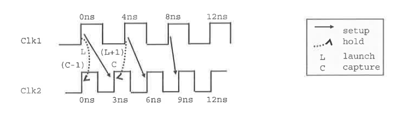

PT picks the most restrictive pair of edges for setup and for hold. It determines which edges to be used as follows:

1. Evaluate waveforms over the smallest common base period

2. For each capture edge, find the closest setup launch edge. Call these the **primary pairs**

3. Out of the **primary pairs**, pick the most restrictive setup launch and capture edges.

4. For each **primary pair**, draw two hold relationships:

   - Launch to (capture - 1)

   - (Launch + 1) to Capture

     From all of these hold relationships, pick the most restrictive.

PrimeTime uses the ideal clock waveform (as reported in `report_clock`) to determine the appropriate clock edges for inter-clock analysis.

> The most restrictive setup pair is from Clk1 8ns to Clk2 9ns
>
> The most restrictive hold pair is from Clk1 0ns to Clk2 0ns

