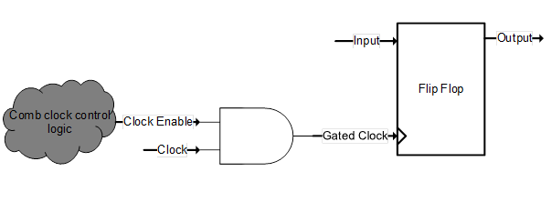
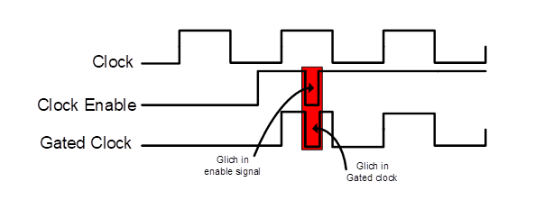
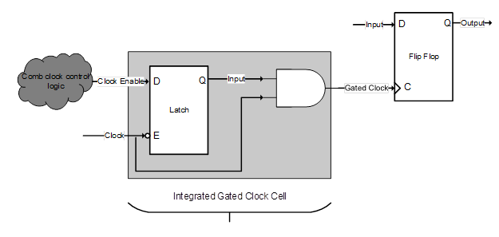
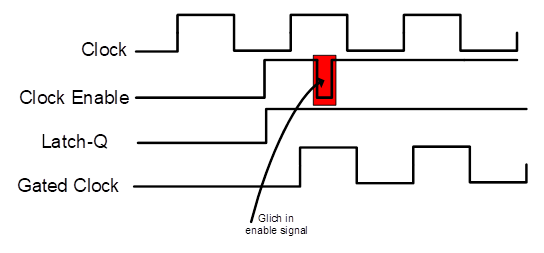

**Clock Gating** is defined as: "Clock gating is a technique/methodology to turn off the clock to certain parts of the digital design when not needed".

### Clock Gating Overview

#### AND gate-based clock gating

In *simplest form* a clock gating can be achieved by using an *AND gate* as shown in picture below

However, this simplest form of clock gating technique has some problem of generating **glitches** in the clock provide to the FF, which are not desirable.

> Glitches in enable/gated clock

#### Latch based clock gating

These glitches can be removed by introducing a negative edge triggered FF (assuming downstream FFs are positive edge) or low-level sensitive latch at the output of the clock enable signal.

This will make sure that any glitch in the clock enable signal will not be visible to the gated clock output. The Latch output will only be updated during the negative clock cycle and thus input to AND gate will be stable high.

> Glitch Free Gated Clock

### reference

The Ultimate Guide to Clock Gating [https://anysilicon.com/the-ultimate-guide-to-clock-gating/ ](https://anysilicon.com/the-ultimate-guide-to-clock-gating/)
