## OSPLL (Reference Oversampling PLL)

> J. -H. Seol, K. Choo, D. Blaauw, D. Sylvester and T. Jang, "Reference Oversampling PLL Achieving −256-dB FoM and −78-dBc Reference Spur," in *IEEE Journal of Solid-State Circuits*, vol. 56, no. 10, pp. 2993-3007, Oct. 2021 [[https://sci-hub.se/10.1109/JSSC.2021.3089930](https://sci-hub.se/10.1109/JSSC.2021.3089930)]
>
> Taekwang Jang SSCS DL talk : Ultra-low noise Phase-locked Loop Technique

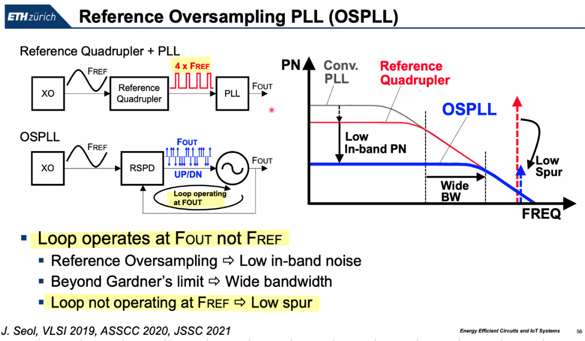

> K. J. Wang, A. Swaminathan and I. Galton, "Spurious Tone Suppression Techniques Applied to a Wide-Bandwidth 2.4 GHz Fractional-N PLL," in *IEEE Journal of Solid-State Circuits*, vol. 43, no. 12, pp. 2787-2797, Dec. 2008 [[https://sci-hub.se/10.1109/JSSC.2008.2005716](https://sci-hub.se/10.1109/JSSC.2008.2005716)]
>
> 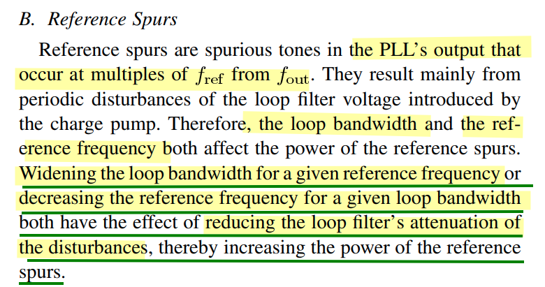

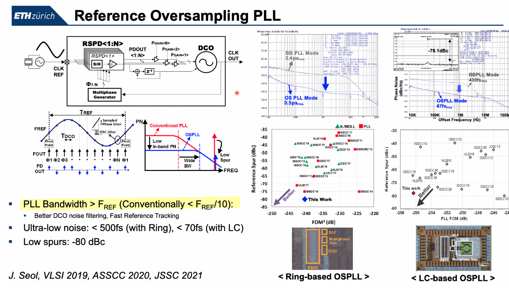

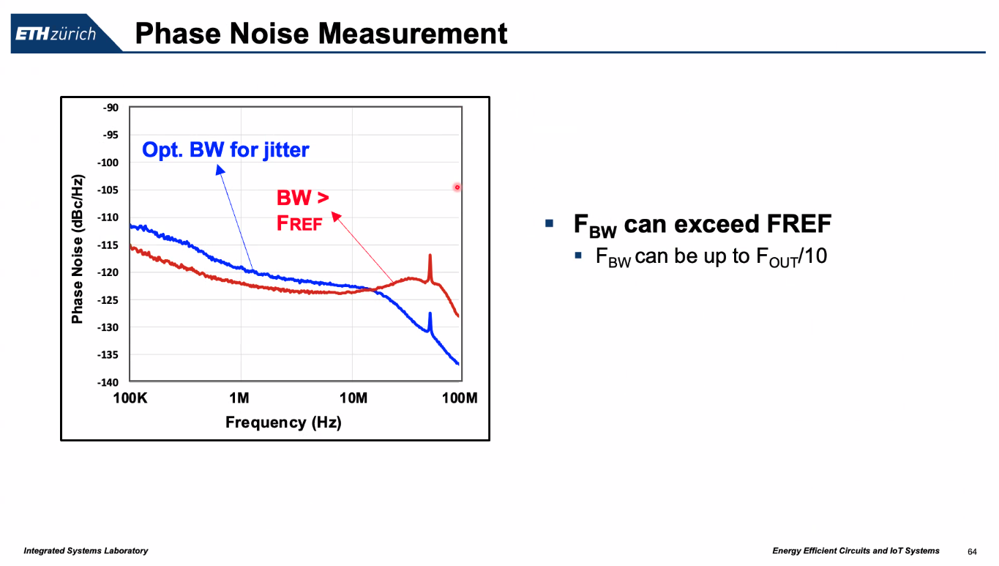

## Frequency Divider

> Gunnman, Kiran, and Mohammad Vahidfar. *Selected Topics in RF, Analog and Mixed Signal Circuits and Systems*. Aalborg: River Publishers, 2017
>
> Arora, Mohit. “Clock Dividers Made Easy.” (2002). [[https://www.mikrocontroller.net/attachment/177198/Clock_Dividers_Made_Easy.pdf](https://www.mikrocontroller.net/attachment/177198/Clock_Dividers_Made_Easy.pdf)]
>
> Darabi H. Radio Frequency Integrated Circuits and Systems. 2nd ed. Cambridge University Press; 2020.

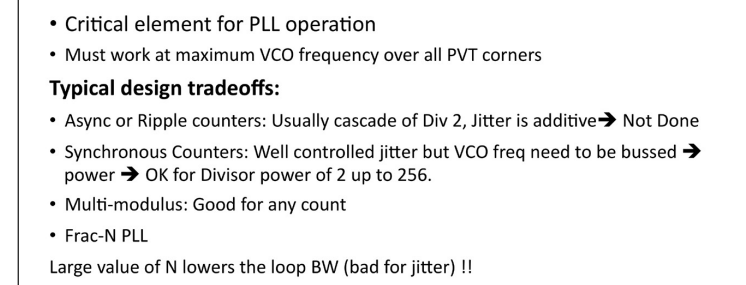

Large values of N lowers the loop BW which is bad for jitter

### Asynchronous vs Synchronous Divider

> Sam Palermo, ECEN620: Network Theory Broadband Circuit Design Fall 2025 Lecture 8: Divider Circuits  [[https://people.engr.tamu.edu/spalermo/ecen620/lecture08_ee620_dividers.pdf](https://people.engr.tamu.edu/spalermo/ecen620/lecture08_ee620_dividers.pdf)]

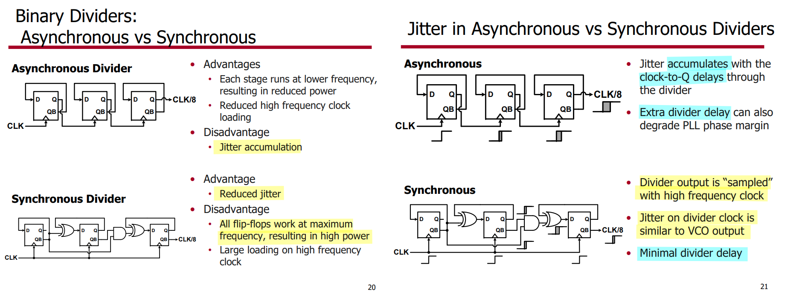

### Dual-Modulus Dividers

***divide-by-2/3***

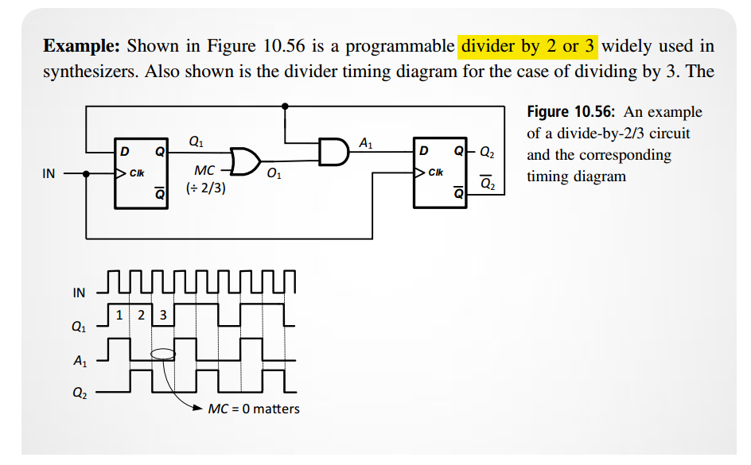

***divide-by-4/5***

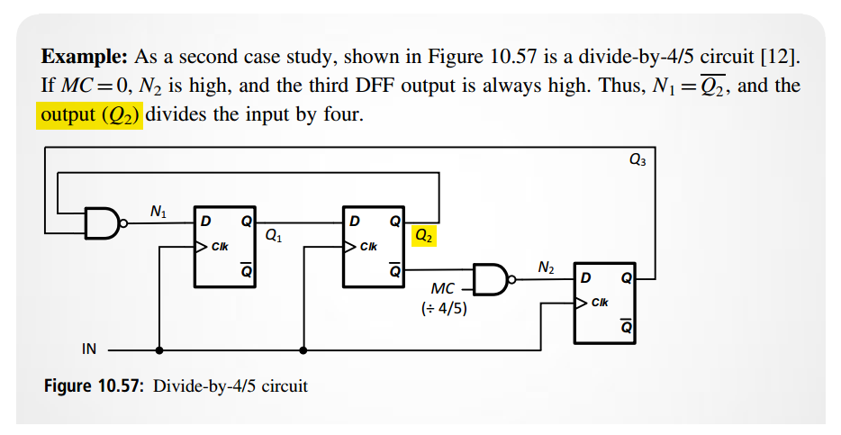

 ***Divide-by-8/9***

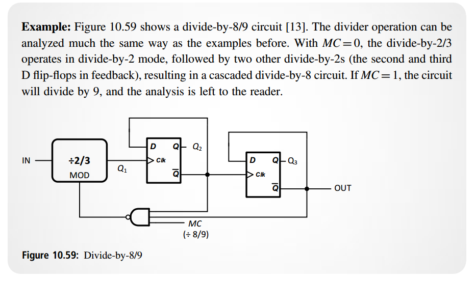

### Multi-Modulus Dividers (MMD)

***Multi-modulus divider using a cascade of divide-by-2/3s***

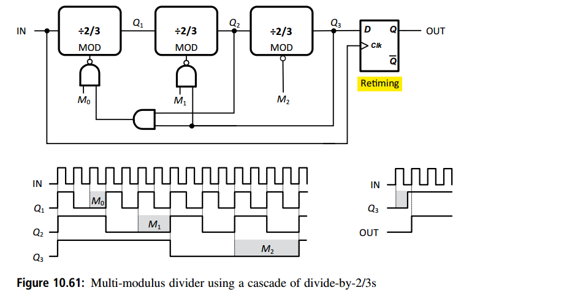

***extra one cycle delay*** vs ***reducing accumulated noise*** from the last retiming DFF

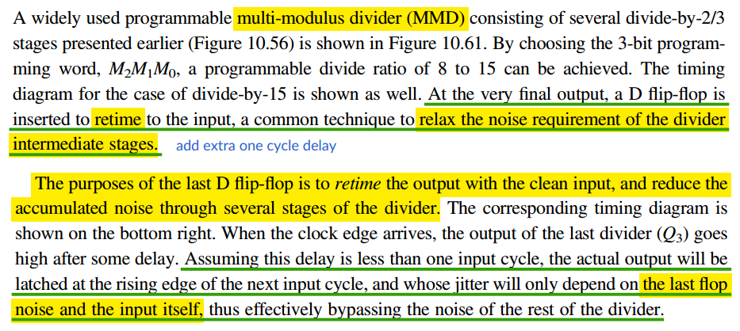

***Pulse-swallow multi-modulus divider***

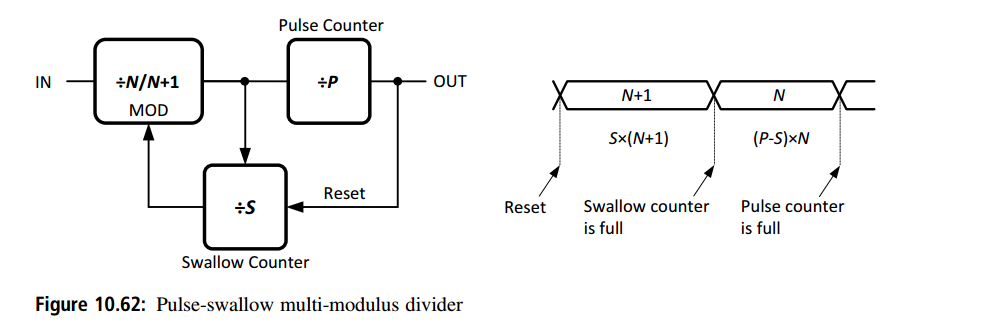

### Noise in dividers (jitter generation)

> S. Levantino, L. Romano, S. Pellerano, C. Samori and A. L. Lacaita, "Phase noise in digital frequency dividers," in *IEEE Journal of Solid-State Circuits*, vol. 39, no. 5, pp. 775-784, May 2004 [[https://sci-hub.se/10.1109/JSSC.2004.826338](https://sci-hub.se/10.1109/JSSC.2004.826338)]
>
> Lacaita, Andrea Leonardo, Salvatore Levantino, and Carlo Samori. *Integrated frequency synthesizers for wireless systems*. Cambridge University Press, 2007.

*TODO* &#128197;

---

> Enrico Rubiola. Phase Noise and Jitter in Digital Electronics [[https://rubiola.org/pdf-slides/2016T-EFTF--Noise-in-digital-electronics.pdf](https://rubiola.org/pdf-slides/2016T-EFTF--Noise-in-digital-electronics.pdf)]

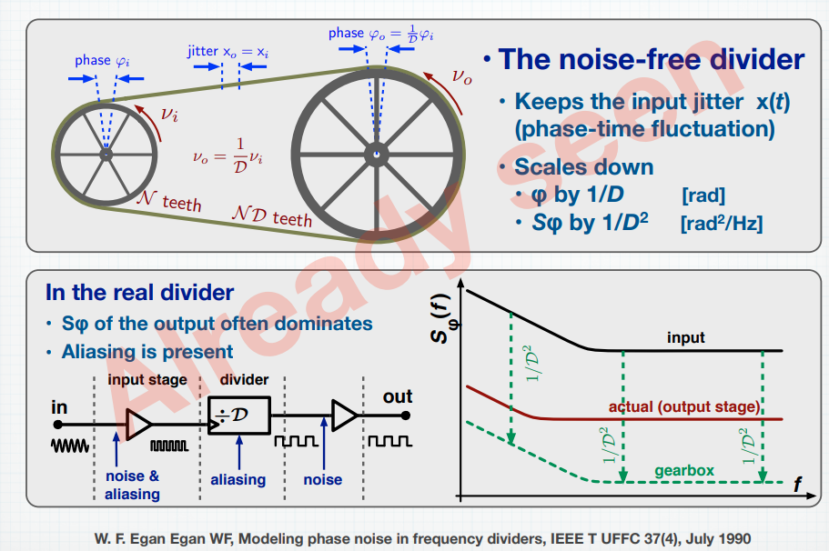

---

> W. F. Egan, "Modeling phase noise in frequency dividers," in IEEE Transactions on Ultrasonics, Ferroelectrics, and Frequency Control, vol. 37, no. 4, pp. 307-315, July 1990 [[https://sci-hub.se/10.1109/58.56498](https://sci-hub.se/10.1109/58.56498)]
>
> PLL + PSS + PNOISE convergence [[https://community.cadence.com/cadence_technology_forums/f/custom-ic-design/48474/pll-pss-pnoise-convergence/1376833](https://community.cadence.com/cadence_technology_forums/f/custom-ic-design/48474/pll-pss-pnoise-convergence/1376833)]

---

Signal Source Analyzer: measurement is based on time-average(or frequency-domain) method

real-time digital oscilloscope: measure sampled jitter directly

> [[https://community.cadence.com/cadence_technology_forums/f/custom-ic-design/41797/inconsistent-phase-noise-results-of-divide-by-2-phase-using-different-pnoise-method/1360890](https://community.cadence.com/cadence_technology_forums/f/custom-ic-design/41797/inconsistent-phase-noise-results-of-divide-by-2-phase-using-different-pnoise-method/1360890)]

### phase margin impact

 **type-I PLLs**

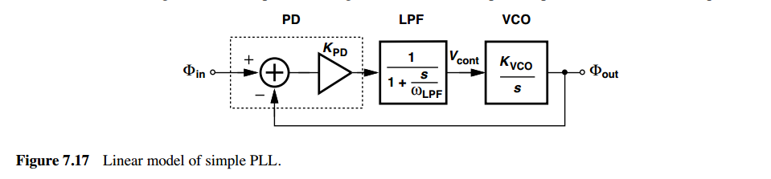

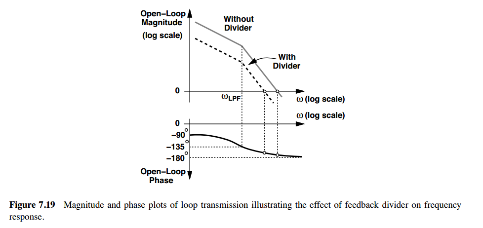

 frequency divider weakens the feedback and ***increases** the phase margin*

---

**type-II PLLs**

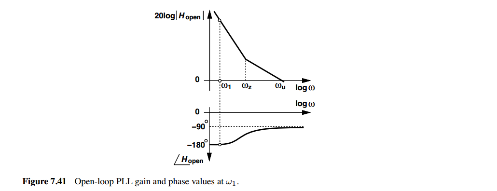

 frequency divider weakens the feedback and ***decrease** the phase margin*

### phase noise & jitter

> [[Timing 101: The Case of the Jitterier Divided-Down Clock, Silicon Labs]](https://community.silabs.com/s/share/a5U1M000000knweUAA/timing-101-the-case-of-the-jitterier-divideddown-clock?language=en_US)
>
> [[How division impacts spurs, phase noise, and phase]](https://www.planetanalog.com/how-division-impacts-spurs-phase-noise-and-phase/)
>
> [[Phase Noise Theory: Ideal Frequency Multipliers and Dividers]](http://www.ko4bb.com/~bruce/IdealFreqMultDiv.html)

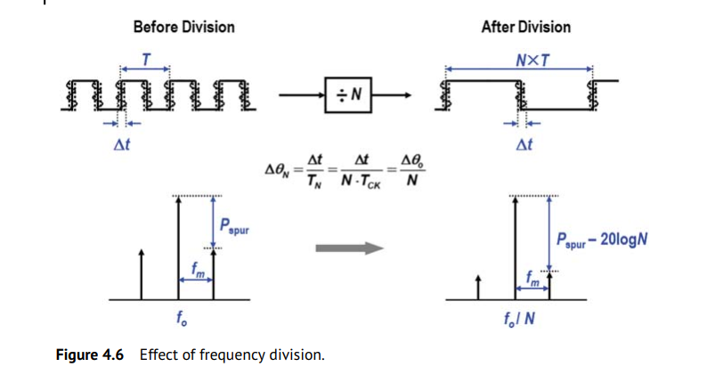

- Multiplying the frequency of a signal by a factor of N using an **ideal** frequency multiplier increases the phase noise of the multiplied signal by $20\log(N)$ dB.
- Similarly dividing a signal frequency by $N$ reduces the phase noise of the output signal by $20\log(N)$  dB

> The sideband offset from the carrier in the frequency multiplied/divided signal is the same as for the original signal.

#### $20\log (N)$ Rule

If the carrier frequency of a clock is divided down by a factor of $N$ then we expect the phase noise to decrease by $20\log(N)$.The primary assumption here is a *noiseless* conventional digital divider.

> The $20\log(N)$ rule only applies to *phase noise* and *not integrated phase noise or phase jitter*. Phase jitter should generally measure about the **same**.

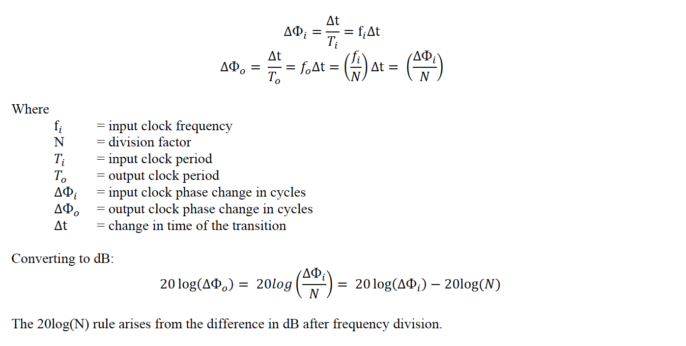

#### What About Phase Jitter?

We integrate *SSB* phase noise *L*(f) [dBc/Hz] to obtain rms phase jitter in seconds as follows for “brick wall” integration from f1 to f2 offset frequencies in Hz and where f0 is the carrier or clock frequency.

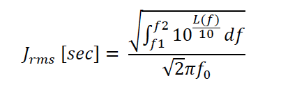

Note that the rms phase jitter in seconds is inversely proportional to f0. When frequency is divided down, the phase noise, *L*(f), goes down by a factor of 20log(N). However, since the frequency goes down by N also, the phase jitter expressed in units of time is constant.

Therefore, phase noise curves, related by 20log(N), with the same phase noise shape over the *jitter bandwidth*, are expected to yield the same phase jitter in seconds.

### Effective Divide Ratio

> Sam Palermo, ECEN620: Network Theory Broadband Circuit Design Fall 2025, *Lecture 10: Fractional-N Frequency Synthesizers* [[https://people.engr.tamu.edu/spalermo/ecen620/lecture10_ee620_fracn_freq_synth.pdf](https://people.engr.tamu.edu/spalermo/ecen620/lecture10_ee620_fracn_freq_synth.pdf)]

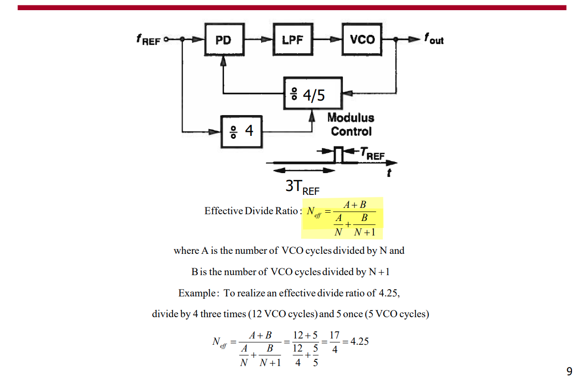

with $M_{ref}$, the number of reference clock cycles
$$
A\cdot \frac{T_{ref}}{N} + B\cdot \frac{T_{ref}}{N+1} = M_{ref} T_{ref} \qquad N_{vco} = A +B
$$

yield effective divide ratio
$$
N_{eff} = \frac{N_{vco}}{M_{ref}} = \boxed{ \frac{A+B}{\frac{A}{N} + \frac{B}{N+1}} } = \textcolor{red}{\frac{\frac{A}{N}}{\frac{A}{N} + \frac{B}{N+1}}}\cdot N + \textcolor{blue}{\frac{\frac{B}{N+1}}{\frac{A}{N} + \frac{B}{N+1}}}\cdot (N+1)
$$

## Reference Spur

**spurs** are carrier or clock frequency spectral imperfections measured in the frequency domain just like phase noise. However, unlike phase noise they are *discrete* frequency components.

- Spurs are deterministic

- Spur power is independent of bandwidth

- Spurs contribute bounded peak jitter in the time domain

***Sources of Spurs:***

- External (coupling from other noisy block)
  Supply, substrate, bond wires, etc.
- Internal (int-N/fractional-N operation)
  - **Frac spur**: Fractional divider (multi-modulus and frequency accumulation)
  - **Ref. spur**: PFD/charge pump/analog loop filter non-idealities, clock coupling

## Integer-N PLL

**integer-N PLL frequency synthesizers**

- the *frequency resolution*, is equal to the *reference frequency*, meaning that *only integer multiples of the reference frequency can be synthesized*

- *Stability requirements* limit the loop bandwidth to about *one tenth of the reference frequency*; therefore

  - decreasing the reference frequency increases the settling time as the loop bandwidth also has to be decreased
  - a reduced loop bandwidth allows less suppression of the VCO’s inherent phase noise

- Another drawback of the integer-N PLL is the *trade-off between phase noise and settling time* when the *divider ratio becomes large* (The contributions to the output phase noise of almost all PLL building blocks, except the VCO, are **multiplied by the division ratio**)

  > [[https://people.engr.tamu.edu/spalermo/ecen620/lecture03_ee620_pll_system.pdf](https://people.engr.tamu.edu/spalermo/ecen620/lecture03_ee620_pll_system.pdf)]
  >
  > 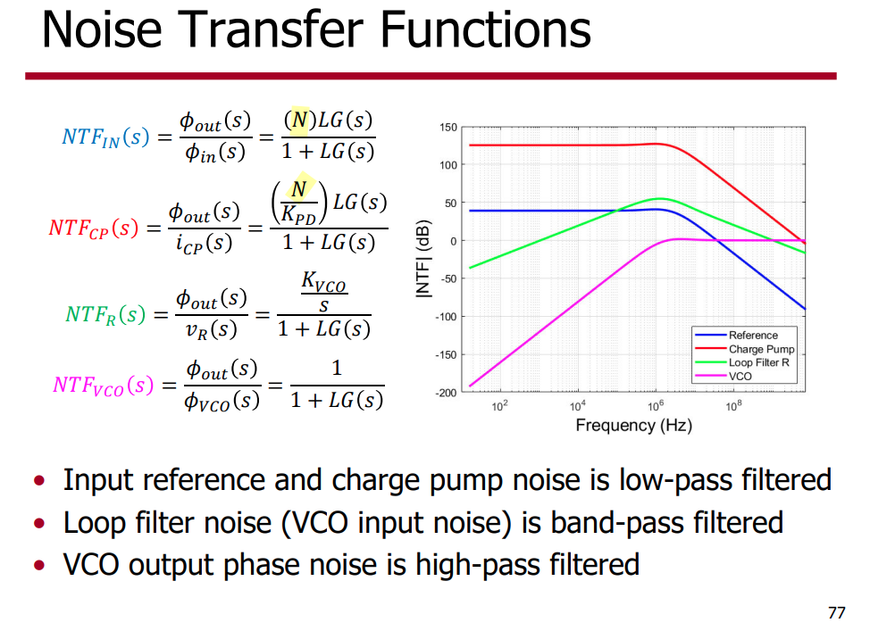

- if a small reference frequency is chosen, t*he reference spur in the output phase noise is located at a smaller offset frequency*

##  Fractional-N

1. ***Dither Feedback Divider Ratio by a delta-sigma modulator***

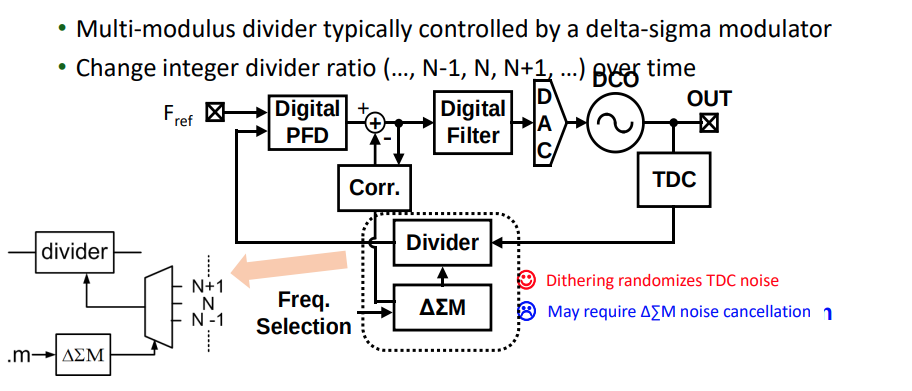

2. ***Frequency Accumulation***

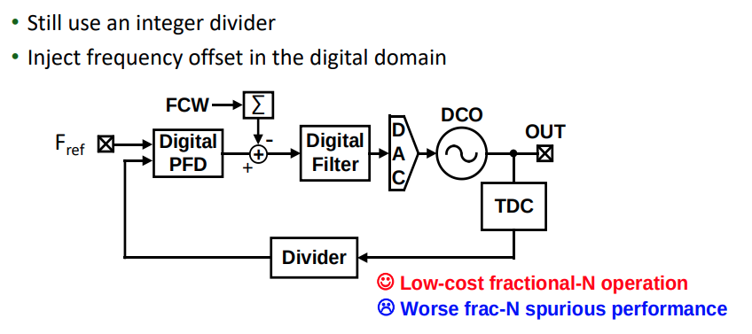

## Switched Capacitor Banks

Q: why $R_b$ ?

A:  *TODO* &#128197;

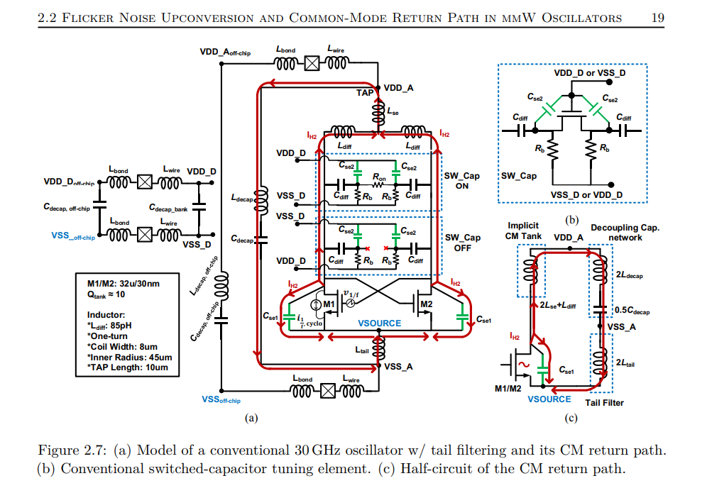

> Hu, Yizhe. "Flicker noise upconversion and reduction mechanisms in RF/millimeter-wave oscillators for 5G communications." PhD diss., 2019.
>
> S. D. Toso, A. Bevilacqua, A. Gerosa and A. Neviani, "A thorough analysis of the tank quality factor in LC oscillators with switched capacitor banks," *Proceedings of 2010 IEEE International Symposium on Circuits and Systems*, Paris, France, 2010, pp. 1903-1906

## False locking

*TODO* &#128197;

- divider failure
- even-stage ring oscillator ( multipath ring oscillators)
- DLL: harmonic locking,  stuck locking

## clock edge impact

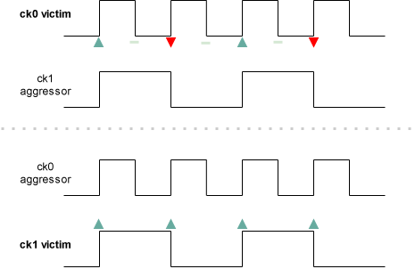

> ck1 is div2 of ck0

- edge of ck0 is affected differently by ck1

- edge of ck1 is affected equally by ck0

## Why Type 2 PLL ?

> **Type**: # of integrators within the loop
>
> **Order**: # of poles in the *closed-loop* transfer function
>
> *Type $\leq$ Order*

1. That is, to have a wide bandwidth, a high loop gain is required
2. More importantly, the type 1 PLL has the problem of a ***static phase error*** for the change of an input frequency

---

*Type 1 PLL with input phase step* $\Delta \phi \cdot u(t)$
$$\begin{align}
\Delta \phi\cdot u(t) - K\int_0^{t}\phi _e (\tau)d\tau &= \phi _e (t) \\
\phi _e (0) &= \Delta \phi
\end{align}$$

we obtain $\phi _e (t) = \Delta \phi \cdot e^{-Kt}\cdot u(t)$

and $\phi _e(\infty) = 0$

---

> Daniel Boschen. GRCon24 - Quick Start on Control Loops with Python Workshop [[https://events.gnuradio.org/event/24/contributions/599/attachments/187/480/Boschen%20Control%20Presentation.pdf](https://events.gnuradio.org/event/24/contributions/599/attachments/187/480/Boschen%20Control%20Presentation.pdf)]

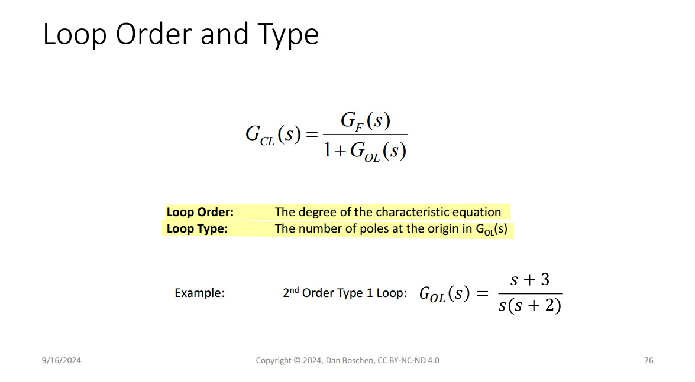

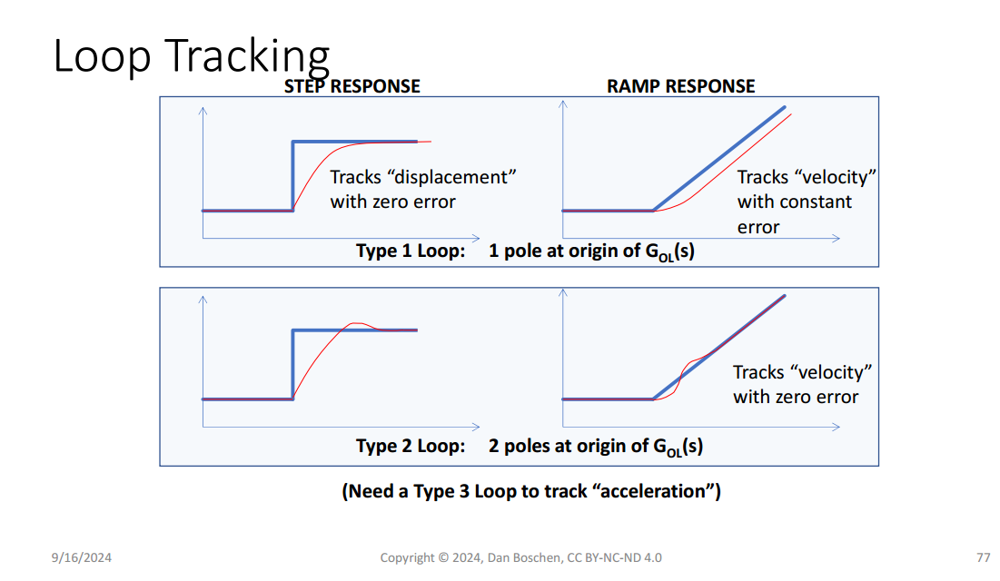

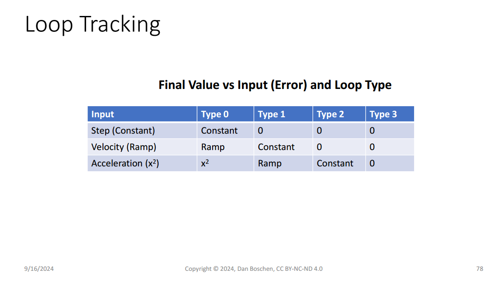

## reference

Dennis Fischette, Frequently Asked PLL Questions [[https://www.delroy.com/PLL_dir/FAQ/FAQ.htm](https://www.delroy.com/PLL_dir/FAQ/FAQ.htm)]

Ian Galton, ISSCC 2010 SC3: Fractional-N PLLs [[https://www.nishanchettri.com/isscc-slides/2010%20ISSCC/Short%20Course/SC3.pdf](https://www.nishanchettri.com/isscc-slides/2010%20ISSCC/Short%20Course/SC3.pdf)]

Mike Shuo-Wei Chen, ISSCC 2020 T6: Digital Fractional-N Phase Locked Loop Design [[https://www.nishanchettri.com/isscc-slides/2020%20ISSCC/TUTORIALS/T6Visuals.pdf](https://www.nishanchettri.com/isscc-slides/2020%20ISSCC/TUTORIALS/T6Visuals.pdf)]
