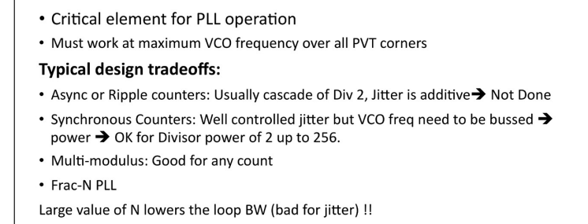
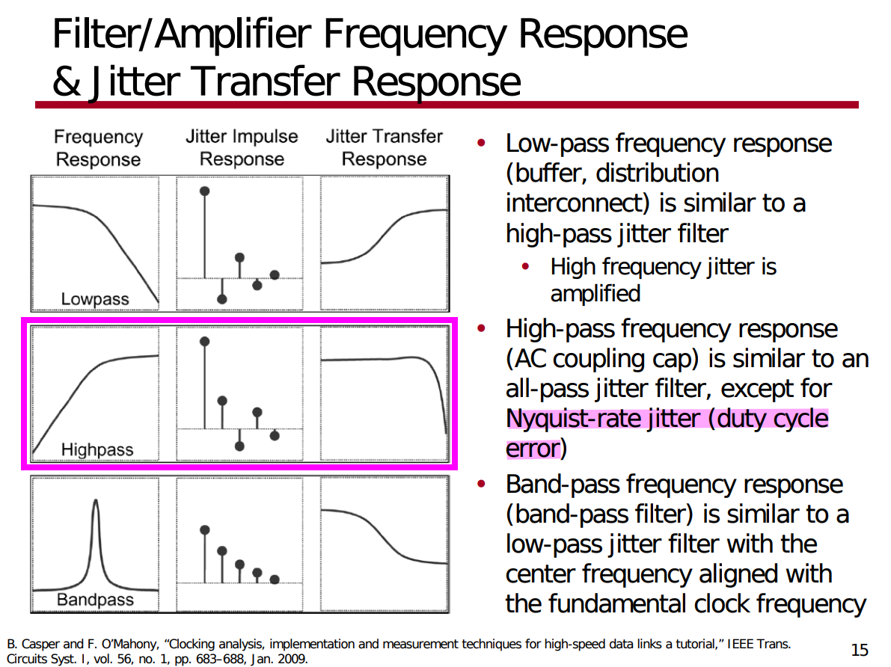
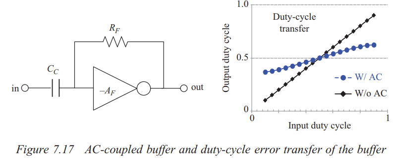
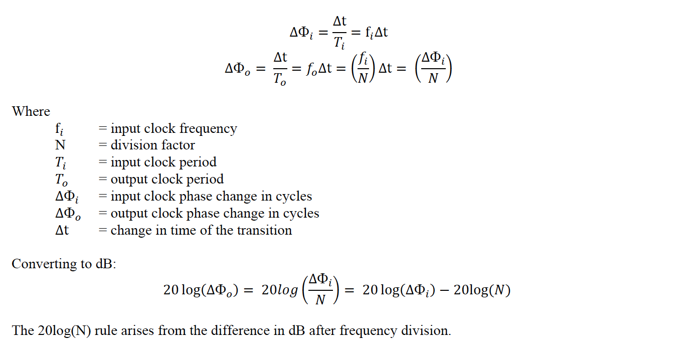
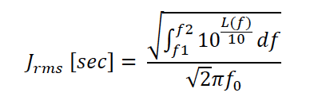
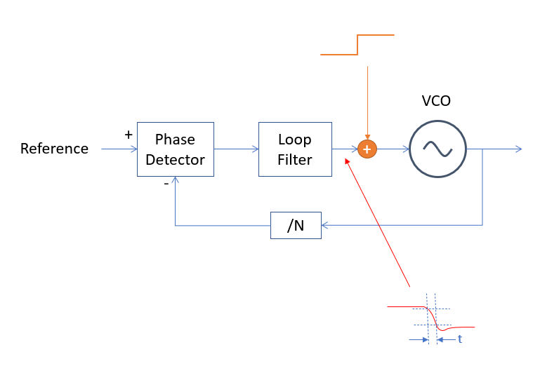

## Injection Lock

*TODO* &#128197;

## Impact of reference Clock Edges on PI Output

*TODO* &#128197;

> John T. Stonick, ISSCC 2011 tutorial. "DPLL Based Clock and Data Recovery" [[https://www.nishanchettri.com/isscc-slides/2011%20ISSCC/TUTORIALS/ISSCC2011Visuals-T5.pdf](https://www.nishanchettri.com/isscc-slides/2011%20ISSCC/TUTORIALS/ISSCC2011Visuals-T5.pdf)]

## False locking

*TODO* &#128197;

- divider failure
- even-stage ring oscillator ( multipath ring oscillators)
- DLL: harmonic locking,  stuck locking

## different frequency clock impact on edge

> ck1 is div2 of ck0

- edge of ck0 is affected differently by ck1

- edge of ck1 is affected equally by ck0

## limit cycle & hunting jitter 

>  *hunting jitter* is also called as **dithering jitter**

## CDR Loop Latency 

Denoting the CDR loop latency by $\Delta T$ , we note that the loop transmission is multiplied by $exp(-s\Delta T)\simeq 1-s\Delta T$.The resulting right-half-plane zero, $f_z$ degrades the phase margin and must remain about **one decade beyond the BW**
$$
f_z\simeq \frac{1}{2\pi \Delta T}
$$

> This assumption is true in practice since the bandwidth of the CDR (few mega Hertz) is much smaller than the data rate (multi giga bits/second).

> [Fernando , Marvell Italy."Considerations for CDR
Bandwidth Proposal" [https://www.ieee802.org/3/bs/public/16_03/debernardinis_3bs_01_0316.pdf](https://www.ieee802.org/3/bs/public/16_03/debernardinis_3bs_01_0316.pdf)]
>
>

### Decimation 

Decimation is commonly employed to alleviate the high-speed requirement. However, decimation increases *loop-latency* which causes excessive *dither jitter*

> L. Sonntag and J. Stonick, "A Digital Clock and Data Recovery Architecture for Multi-Gigabit/s Binary Links," in IEEE Journal of Solid-State Circuits, vol. 41, no. 8, pp. 1867-1875, Aug. 2006

## Loop Bandwidth

> The *closed-loop −3-dB bandwidth* is sometimes called the **“loop bandwidth”**

## Continuous-Time Approximation Limitations 

A rule of thumb often used to ensure slow changes in the loop is to select the *loop bandwidth* approximately equal to **one-tenth** of the *input frequency*. 

> Gardner, F.M. (1980). Charge-Pump Phase-Lock Loops. *IEEE Trans. Commun., 28*, 1849-1858.
>
> Homayoun, Aliakbar and Behzad Razavi. “On the Stability of Charge-Pump Phase-Locked Loops.” *IEEE Transactions on Circuits and Systems I: Regular Papers* 63 (2016): 741-750.
>
> N. Kuznetsov, A. Matveev, M. Yuldashev and R. Yuldashev, "Nonlinear Analysis of Charge-Pump Phase-Locked Loop: The Hold-In and Pull-In Ranges," in *IEEE Transactions on Circuits and Systems I: Regular Papers*, vol. 68, no. 10, pp. 4049-4061, Oct. 2021
>
> 

## clock distribution

> X. Mo, J. Wu, N. Wary and T. C. Carusone, "Design Methodologies for Low-Jitter CMOS Clock Distribution," in *IEEE Open Journal of the Solid-State Circuits Society*, vol. 1, pp. 94-103, 2021
>

## Feedback Dividers

- Large values of N lowers the loop BW which is bad for jitter

> Gunnman, Kiran, and Mohammad Vahidfar. *Selected Topics in RF, Analog and Mixed Signal Circuits and Systems*. Aalborg: River Publishers, 2017.

## clock gating

## PLL Type & Order

**Type**: # of integrators within the loop

**Order**: # of poles in the *closed-loop* transfer function 

> *Type $\leq$ Order*

## AC-coupled buffer 

> Since duty-cycle error is *high frequency* component, the high-pass filter suppresses the duty-cycle error propagating to the output

- The AC-coupling capacitor blocks the low-frequency component of the input
- The feedback resistor sets common mode voltage to the crossover voltage

> Bae, Woorham; Jeong, Deog-Kyoon: 'Analysis and Design of CMOS Clocking Circuits for Low Phase Noise' (Materials, Circuits and Devices, 2020)
>
> Casper B, O’Mahony F. Clocking analysis, implementation and measurement techniques for high-speed data links: A tutorial. IEEE Transactions on Circuits and Systems I: Regular Papers. 2009;56(1):17–39

## Clock Division with Jitter and Phase Noise

- Multiplying the frequency of a signal by a factor of N using an **ideal** frequency multiplier increases the phase noise of the multiplied signal by $20\log(N)$ dB. 
- Similarly dividing a signal frequency by N reduces the phase noise of the output signal by $20\log(N)$  dB

> The sideband offset from the carrier in the frequency multiplied/divided signal is the same as for the original signal.

### The 20log(N) Rule

If the carrier frequency of a clock is divided down by a factor of $N$ then we expect the phase noise to decrease by $20\log(N)$.The primary assumption here is a *noiseless* conventional digital divider.

> The $20\log(N)$ rule only applies to *phase noise* and *not integrated phase noise or phase jitter*. Phase jitter should generally measure about the **same**.

### What About Phase Jitter?

We integrate *SSB* phase noise *L*(f) [dBc/Hz] to obtain rms phase jitter in seconds as follows for “brick wall” integration from f1 to f2 offset frequencies in Hz and where f0 is the carrier or clock frequency.

Note that the rms phase jitter in seconds is inversely proportional to f0. When frequency is divided down, the phase noise, *L*(f), goes down by a factor of 20log(N). However, since the frequency goes down by N also, the phase jitter expressed in units of time is constant. 

Therefore, phase noise curves, related by 20log(N), with the same phase noise shape over the *jitter bandwidth*, are expected to yield the same phase jitter in seconds.

> [[Timing 101: The Case of the Jitterier Divided-Down Clock, Silicon Labs]](https://community.silabs.com/s/share/a5U1M000000knweUAA/timing-101-the-case-of-the-jitterier-divideddown-clock?language=en_US)
>
> [[How division impacts spurs, phase noise, and phase]](https://www.planetanalog.com/how-division-impacts-spurs-phase-noise-and-phase/)
>
> [[Phase Noise Theory: Ideal Frequency Multipliers and Dividers]](http://www.ko4bb.com/~bruce/IdealFreqMultDiv.html)

## Bang-Bang Phase Detector

> It's **ternary**, because *early*, *late* and *no transition*

### Linearing BB-PD

BB Gain is the slope of average BB output $\mu$, versus phase offset $\phi$, i.e. $\frac {\partial \mu}{\partial \phi}$,

BB only produces output for a transition and this de-rates the gain. Transition density = *0.5* for random data

$$
K_{BB} = \frac{1}{2}\frac {\partial \mu}{\partial \phi}
$$

where $\mu = (1)\times \mathrm{P}(\text{late}|\phi) + (-1)\times \mathrm{P}(\text{early}|\phi)$

> Both jitter and amplitude noise distribution are same, just scaled by slope 

### Self-Noise Term

One price we pay for *BB PD* versus *linear PD* is the self-noise term. For small phase errors BB output noise is the full
magnitude of the sliced data.

> BB-PD don't have any measure as to how early or how late and the way that tell loop is locked, is over a long time average, BB-PD have an equal number of earlies and lates 

$$\begin{align}
\sigma_{BB} &= [E(X^2) - E(X)^2] \cdot \mathrm{P}(\text{trans}) \\
&= [1 - 0]\cdot 0.5 \\
&= 0.5
\end{align}$$

> John T. Stonick, ISSCC 2011 TUTORIALS *T5: DPLL-Based Clock and Data Recovery*
>
> Walker, Richard. (2003). Designing Bang-Bang PLLs for Clock and Data Recovery in Serial Data Transmission Systems.  [[pdf](https://www.omnisterra.com/walker/pdfs.papers/BBPLL.pdf)]
>
> \- Clock and Data Recovery for Serial Data Communications, focusing on bang-bang CDR design methodology, ISSCC Short Course, February 2002. [[slides](https://www.omnisterra.com/walker/pdfs.talks/ISSCC2002.pdf)]

## PLL bandwidth test

A *step response test* is an easy way to determine the bandwidth.

*Sum a small step into the control voltage* of your oscillator (VCO or NCO), and measure the *90% to 10%* fall time of the corrected response at the output of the loop filter as shown in this block diagram

a first order loop 
$$
BW = \frac{0.35}{t} \space\space\space\space \text{(first order system)}
$$
Where $BW$ is the 3 dB bandwidth in Hz and $𝑡$​ is the 10%/90% rise or fall time.

For second order loops with a typical damping factor of *0.7* this relationship is closer to:
$$
BW = \frac{0.33}{t}\space\space\space\space \text{(second order system, damping factor = 0.7)}
$$

> [How can I experimentally find the bandwidth of my PLL?, [https://dsp.stackexchange.com/a/73654/59253](https://dsp.stackexchange.com/a/73654/59253)]

