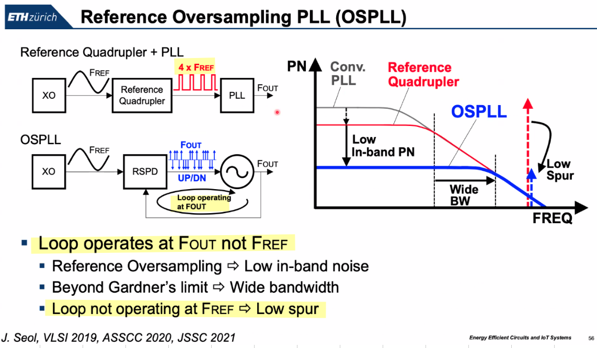
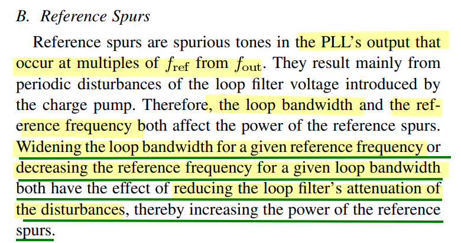
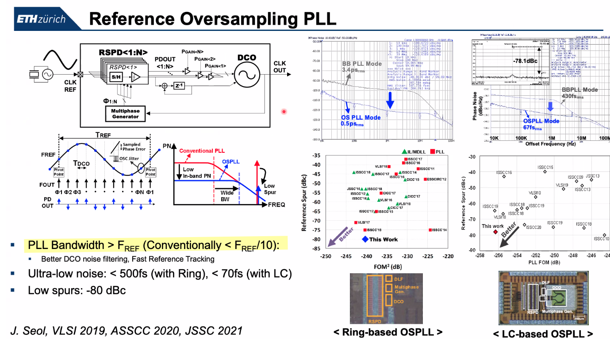
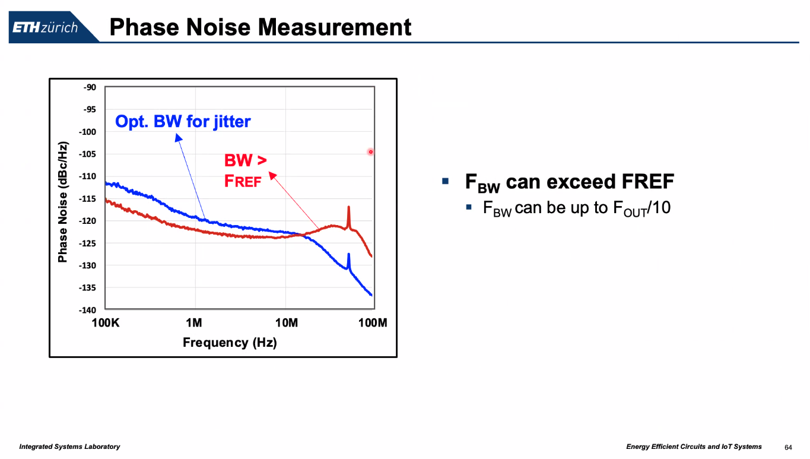
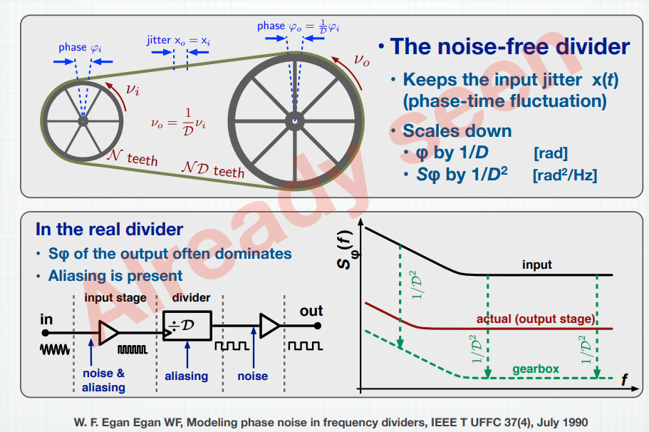
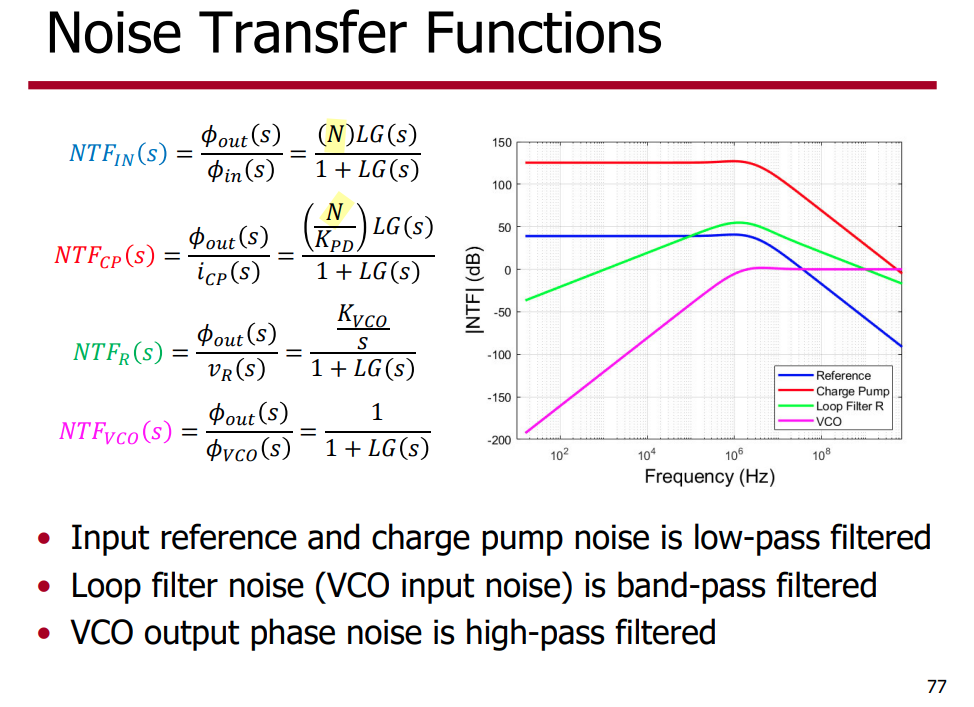
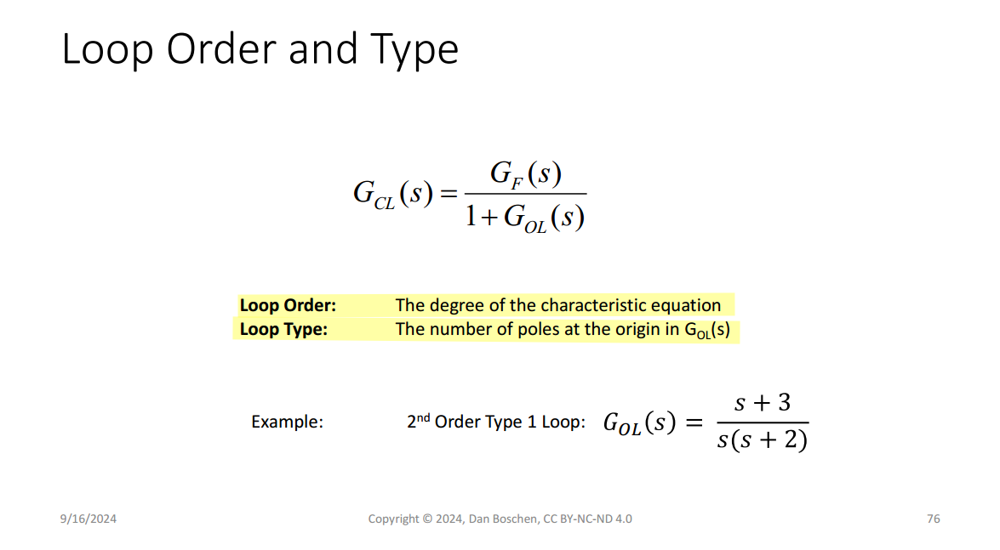
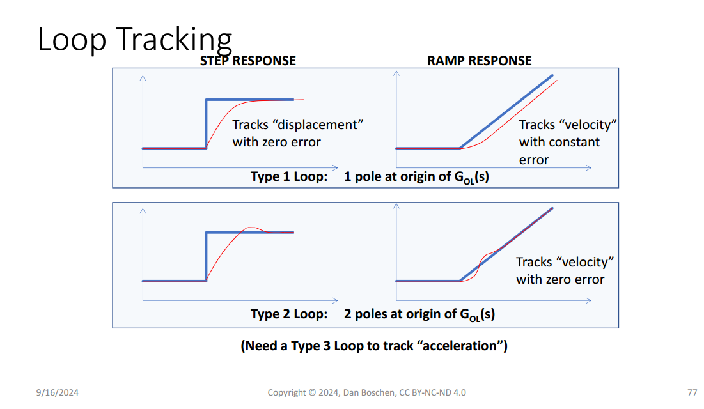
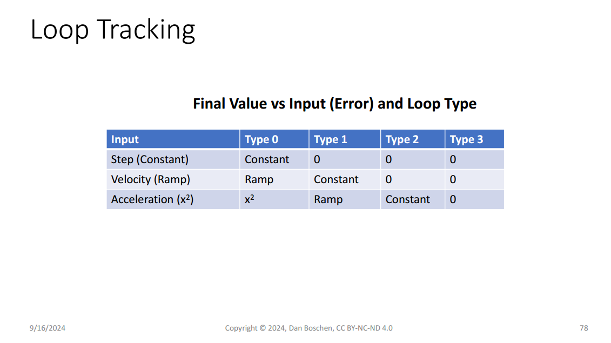

## Cycle Slips and Hangup

> Qasim Chaudhari. What are Cycle Slips and Hangup in Phase Locked Loops?  [[https://wirelesspi.com/what-are-cycle-slips-and-hangup-in-phase-locked-loops/](https://wirelesspi.com/what-are-cycle-slips-and-hangup-in-phase-locked-loops/)]

*TODO* &#128197;

## OSPLL (Reference Oversampling PLL)

> J. -H. Seol, K. Choo, D. Blaauw, D. Sylvester and T. Jang, "Reference Oversampling PLL Achieving −256-dB FoM and −78-dBc Reference Spur," in *IEEE Journal of Solid-State Circuits*, vol. 56, no. 10, pp. 2993-3007, Oct. 2021 [[https://sci-hub.se/10.1109/JSSC.2021.3089930](https://sci-hub.se/10.1109/JSSC.2021.3089930)]
>
> Taekwang Jang SSCS DL talk : Ultra-low noise Phase-locked Loop Technique

> K. J. Wang, A. Swaminathan and I. Galton, "Spurious Tone Suppression Techniques Applied to a Wide-Bandwidth 2.4 GHz Fractional-N PLL," in *IEEE Journal of Solid-State Circuits*, vol. 43, no. 12, pp. 2787-2797, Dec. 2008 [[https://sci-hub.se/10.1109/JSSC.2008.2005716](https://sci-hub.se/10.1109/JSSC.2008.2005716)]
>
> 

## Frequency Divider

> Gunnman, Kiran, and Mohammad Vahidfar. *Selected Topics in RF, Analog and Mixed Signal Circuits and Systems*. Aalborg: River Publishers, 2017

> Large values of N lowers the loop BW which is bad for jitter

---

### MMD (Multimodulus Divider)

*TODO* &#128197;

### Noise in dividers (jitter generation)

> S. Levantino, L. Romano, S. Pellerano, C. Samori and A. L. Lacaita, "Phase noise in digital frequency dividers," in *IEEE Journal of Solid-State Circuits*, vol. 39, no. 5, pp. 775-784, May 2004 [[https://sci-hub.se/10.1109/JSSC.2004.826338](https://sci-hub.se/10.1109/JSSC.2004.826338)]
>
> Lacaita, Andrea Leonardo, Salvatore Levantino, and Carlo Samori. *Integrated frequency synthesizers for wireless systems*. Cambridge University Press, 2007.

*TODO* &#128197;

---

> Enrico Rubiola. Phase Noise and Jitter in Digital Electronics [[https://rubiola.org/pdf-slides/2016T-EFTF--Noise-in-digital-electronics.pdf](https://rubiola.org/pdf-slides/2016T-EFTF--Noise-in-digital-electronics.pdf)]

---

> W. F. Egan, "Modeling phase noise in frequency dividers," in IEEE Transactions on Ultrasonics, Ferroelectrics, and Frequency Control, vol. 37, no. 4, pp. 307-315, July 1990 [[https://sci-hub.se/10.1109/58.56498](https://sci-hub.se/10.1109/58.56498)]
>
> PLL + PSS + PNOISE convergence [[https://community.cadence.com/cadence_technology_forums/f/custom-ic-design/48474/pll-pss-pnoise-convergence/1376833](https://community.cadence.com/cadence_technology_forums/f/custom-ic-design/48474/pll-pss-pnoise-convergence/1376833)]

---

Signal Source Analyzer: measurement is based on time-average(or frequency-domain) method

real-time digital oscilloscope: measure sampled jitter directly

> [[https://community.cadence.com/cadence_technology_forums/f/custom-ic-design/41797/inconsistent-phase-noise-results-of-divide-by-2-phase-using-different-pnoise-method/1360890](https://community.cadence.com/cadence_technology_forums/f/custom-ic-design/41797/inconsistent-phase-noise-results-of-divide-by-2-phase-using-different-pnoise-method/1360890)]

### phase margin impact

 **type-I PLLs**

 frequency divider weakens the feedback and ***increases** the phase margin*

---

**type-II PLLs**

 frequency divider weakens the feedback and ***decrease** the phase margin*

### DIV 1.5

> Xu, Haojie & Luo, Bao & Jin, Gaofeng & Feng, Fei & Guo, Huanan & Gao, Xiang & Deo, Anupama. (2022). A Flexible 0.73-15.5 GHz Single LC VCO Clock Generator in 12 nm CMOS. IEEE Transactions on Circuits and Systems II: Express Briefs. 69. 4238 - 4242. [[https://www.researchgate.net/publication/382240520_A_Flexible_073-155_GHz_Single_LC_VCO_Clock_Generator_in_12_nm_CMOS](https://www.researchgate.net/publication/382240520_A_Flexible_073-155_GHz_Single_LC_VCO_Clock_Generator_in_12_nm_CMOS)]

*TODO* &#128197;

### phase noise & jitter

> [[Timing 101: The Case of the Jitterier Divided-Down Clock, Silicon Labs]](https://community.silabs.com/s/share/a5U1M000000knweUAA/timing-101-the-case-of-the-jitterier-divideddown-clock?language=en_US)
>
> [[How division impacts spurs, phase noise, and phase]](https://www.planetanalog.com/how-division-impacts-spurs-phase-noise-and-phase/)
>
> [[Phase Noise Theory: Ideal Frequency Multipliers and Dividers]](http://www.ko4bb.com/~bruce/IdealFreqMultDiv.html)

- Multiplying the frequency of a signal by a factor of N using an **ideal** frequency multiplier increases the phase noise of the multiplied signal by $20\log(N)$ dB. 
- Similarly dividing a signal frequency by $N$ reduces the phase noise of the output signal by $20\log(N)$  dB

> The sideband offset from the carrier in the frequency multiplied/divided signal is the same as for the original signal.

#### $20\log (N)$ Rule

If the carrier frequency of a clock is divided down by a factor of $N$ then we expect the phase noise to decrease by $20\log(N)$.The primary assumption here is a *noiseless* conventional digital divider.

> The $20\log(N)$ rule only applies to *phase noise* and *not integrated phase noise or phase jitter*. Phase jitter should generally measure about the **same**.

#### What About Phase Jitter?

We integrate *SSB* phase noise *L*(f) [dBc/Hz] to obtain rms phase jitter in seconds as follows for “brick wall” integration from f1 to f2 offset frequencies in Hz and where f0 is the carrier or clock frequency.

Note that the rms phase jitter in seconds is inversely proportional to f0. When frequency is divided down, the phase noise, *L*(f), goes down by a factor of 20log(N). However, since the frequency goes down by N also, the phase jitter expressed in units of time is constant. 

Therefore, phase noise curves, related by 20log(N), with the same phase noise shape over the *jitter bandwidth*, are expected to yield the same phase jitter in seconds.

## excess phase around n-th harmonic

> $\Delta t$ is same for any n-th harmonic

## Spurious Tones

***S**pur-to-**C**arrier **R**atio* (**SCR**)

> Nicola Da Dalt, ISSCC 2012: Jitter Basic and Advanced Concepts, Statistics and Applications [[https://www.nishanchettri.com/isscc-slides/2012%20ISSCC/TUTORIALS/ISSCC2012Visuals-T5.pdf](https://www.nishanchettri.com/isscc-slides/2012%20ISSCC/TUTORIALS/ISSCC2012Visuals-T5.pdf)]

---

> P.E. Allen - 2003 ECE 6440 - Frequency Synthesizers: Lecture 150 – Phase Noise-I [[https://pallen.ece.gatech.edu/Academic/ECE_6440/Summer_2003/L150-PhaseNoise-I(2UP).pdf](https://pallen.ece.gatech.edu/Academic/ECE_6440/Summer_2003/L150-PhaseNoise-I(2UP).pdf)]

## Reference Spur

**spurs** are carrier or clock frequency spectral imperfections measured in the frequency domain just like phase noise. However, unlike phase noise they are *discrete* frequency components.

- Spurs are deterministic

- Spur power is independent of bandwidth

- Spurs contribute bounded peak jitter in the time domain

***Sources of Spurs:***

- External (coupling from other noisy block)
  Supply, substrate, bond wires, etc.
- Internal (int-N/fractional-N operation)
  - **Frac spur**: Fractional divider (multi-modulus and frequency accumulation)
  - **Ref. spur**: PFD/charge pump/analog loop filter non-idealities, clock coupling

## Fractional Spur

*TODO* &#128197;

## Integer-N PLL

**integer-N PLL frequency synthesizers**

- the *frequency resolution*, is equal to the *reference frequency*, meaning that *only integer multiples of the reference frequency can be synthesized*

- *Stability requirements* limit the loop bandwidth to about *one tenth of the reference frequency*; therefore

  - decreasing the reference frequency increases the settling time as the loop bandwidth also has to be decreased
  - a reduced loop bandwidth allows less suppression of the VCO’s inherent phase noise

- Another drawback of the integer-N PLL is the *trade-off between phase noise and settling time* when the *divider ratio becomes large* (The contributions to the output phase noise of almost all PLL building blocks, except the VCO, are **multiplied by the division ratio**)

  > [[https://people.engr.tamu.edu/spalermo/ecen620/lecture03_ee620_pll_system.pdf](https://people.engr.tamu.edu/spalermo/ecen620/lecture03_ee620_pll_system.pdf)]
  >
  > 

- if a small reference frequency is chosen, t*he reference spur in the output phase noise is located at a smaller offset frequency*

##  Fractional-N

1. ***Dither Feedback Divider Ratio by a delta-sigma modulator***

2. ***Frequency Accumulation***

## Switched Capacitor Banks

Q: why $R_b$ ?

A:  *TODO* &#128197;

> Hu, Yizhe. "Flicker noise upconversion and reduction mechanisms in RF/millimeter-wave oscillators for 5G communications." PhD diss., 2019.
>
> S. D. Toso, A. Bevilacqua, A. Gerosa and A. Neviani, "A thorough analysis of the tank quality factor in LC oscillators with switched capacitor banks," *Proceedings of 2010 IEEE International Symposium on Circuits and Systems*, Paris, France, 2010, pp. 1903-1906

## False locking

*TODO* &#128197;

- divider failure
- even-stage ring oscillator ( multipath ring oscillators)
- DLL: harmonic locking,  stuck locking

## clock edge impact

> ck1 is div2 of ck0

- edge of ck0 is affected differently by ck1

- edge of ck1 is affected equally by ck0

## Why Type 2 PLL ?

> **Type**: # of integrators within the loop
>
> **Order**: # of poles in the *closed-loop* transfer function 
>
> *Type $\leq$ Order*

1. That is, to have a wide bandwidth, a high loop gain is required
2. More importantly, the type 1 PLL has the problem of a ***static phase error*** for the change of an input frequency

---

*Type 1 PLL with input phase step* $\Delta \phi \cdot u(t)$
$$\begin{align}
\Delta \phi\cdot u(t) - K\int_0^{t}\phi _e (\tau)d\tau &= \phi _e (t) \\
\phi _e (0) &= \Delta \phi
\end{align}$$

we obtain $\phi _e (t) = \Delta \phi \cdot e^{-Kt}\cdot u(t)$

and $\phi _e(\infty) = 0$

---

> Daniel Boschen. GRCon24 - Quick Start on Control Loops with Python Workshop [[https://events.gnuradio.org/event/24/contributions/599/attachments/187/480/Boschen%20Control%20Presentation.pdf](https://events.gnuradio.org/event/24/contributions/599/attachments/187/480/Boschen%20Control%20Presentation.pdf)]

## PLL bandwidth test

A *step response test* is an easy way to determine the bandwidth.

*Sum a small step into the control voltage* of your oscillator (VCO or NCO), and measure the *90% to 10%* fall time of the corrected response at the output of the loop filter as shown in this block diagram

a first order loop 
$$
BW = \frac{0.35}{t} \space\space\space\space \text{(first order system)}
$$
Where $BW$ is the 3 dB bandwidth in Hz and $𝑡$​ is the 10%/90% rise or fall time.

For second order loops with a typical damping factor of *0.7* this relationship is closer to:
$$
BW = \frac{0.33}{t}\space\space\space\space \text{(second order system, damping factor = 0.7)}
$$

> [How can I experimentally find the bandwidth of my PLL?, [https://dsp.stackexchange.com/a/73654/59253](https://dsp.stackexchange.com/a/73654/59253)]

## reference

Dennis Fischette, Frequently Asked PLL Questions [[https://www.delroy.com/PLL_dir/FAQ/FAQ.htm](https://www.delroy.com/PLL_dir/FAQ/FAQ.htm)]

Ian Galton, ISSCC 2010 SC3: Fractional-N PLLs [[https://www.nishanchettri.com/isscc-slides/2010%20ISSCC/Short%20Course/SC3.pdf](https://www.nishanchettri.com/isscc-slides/2010%20ISSCC/Short%20Course/SC3.pdf)]

Mike Shuo-Wei Chen, ISSCC 2020 T6: Digital Fractional-N Phase Locked Loop Design [[https://www.nishanchettri.com/isscc-slides/2020%20ISSCC/TUTORIALS/T6Visuals.pdf](https://www.nishanchettri.com/isscc-slides/2020%20ISSCC/TUTORIALS/T6Visuals.pdf)]
