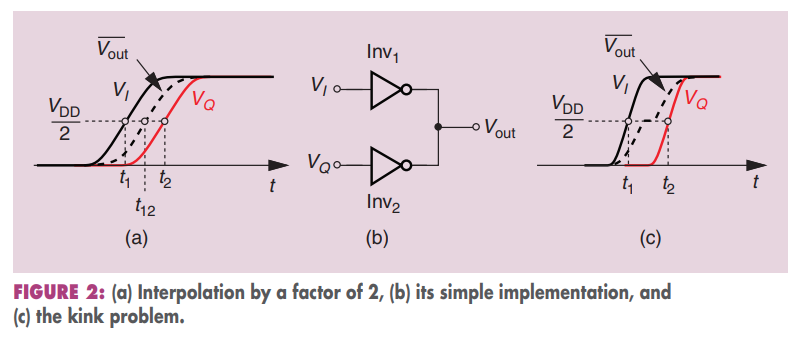

## Injection Locking

*TODO* 📅

> "Topics in IC(Wireline Transceiver Design): Lec 4 - Injection Locked Oscillators" [[https://ocw.snu.ac.kr/sites/default/files/NOTE/Lec%204%20-%20Injection%20Locked%20Oscillators.pdf](https://ocw.snu.ac.kr/sites/default/files/NOTE/Lec%204%20-%20Injection%20Locked%20Oscillators.pdf)]
>
> Cowan, Glenn. (2024). Mixed-Signal CMOS for Wireline Communication: Transistor-Level and System-Level Design Considerations. 10.1017/9781108779791. 

## Temperature compensation for VCO

*Temperature compensation for the VCO oscillation frequency* is a critical issue

*TODO* 📅

## DCC & IQ Calibration 

*TODO* 📅

> Bob Lefferts, Navraj Nandra. SNUG Israel 2007 [[https://picture.iczhiku.com/resource/eetop/whKYwQorwYoPUVbm.pdf](https://picture.iczhiku.com/resource/eetop/whKYwQorwYoPUVbm.pdf)]

## multi-modulus divider

*TODO* 📅

## Duty-cycle correction circuit 

The amount of correction can be set by intentional injection of an *offset current* into the summing input node of INV, ***threshold-adjustable inverter***

> Note that the change to the threshold is ***opposite in direction*** to the change to INV
>
> increasing DC of input signal is equivalent to lower down the threshold of INV

---

voltage at *INV1* will increased by:
$$
\frac{\Delta V_{DAC} - \Delta {INV1}}{R_{DAC}} = \frac{\Delta {INV1} +A_0 \Delta {INV1}}{R_{F}}
$$
therefore
$$
\Delta {INV1} = \Delta V_{DAC} \cdot \frac{R_F}{R_F+(A_0+1)R_{DAC}} \approx  \Delta V_{DAC} \cdot \frac{R_F}{A_0R_{DAC}}
$$

If $R_{DAC} = R_F$
$$
\Delta {INV1}\approx \frac{\Delta V_{DAC}}{A_0}
$$

> C. Menolfi *et al*., "A 112Gb/S 2.6pJ/b 8-Tap FFE PAM-4 SST TX in 14nm CMOS," *2018 IEEE International Solid-State Circuits Conference - (ISSCC)* [[https://sci-hub.se/https://doi.org/10.1109/ISSCC.2018.8310205](https://sci-hub.se/https://doi.org/10.1109/ISSCC.2018.8310205)]

## Auto-tracking high-Q BPF  

> The PLL is the only device that performs auto-tracking band-pass filtering with high-quality factor Q and wide tunability  

## charge pump with amplifier

> Young, I.A., Greason, J.K., Wong, K.L.: A PLL Clock Generator with 5 to 110MHz of Lock Range for Microprocessors. IEEE Journal of Solid-State Circuits 27(11), 1599– 1607 (1992)  [[https://people.engr.tamu.edu/spalermo/ecen620/pll_intel_young_jssc_1992.pdf](https://people.engr.tamu.edu/spalermo/ecen620/pll_intel_young_jssc_1992.pdf)]
>
> Johnson, M., Hudson, E.: A variable delay line PLL for CPU-coprocessor synchronization. IEEE Journal of Solid-State Circuits 23(10), 1218–1223 (1988)  [[https://sci-hub.se/10.1109/4.5947](https://sci-hub.se/10.1109/4.5947)]
>
> Sam Palermo, Lecture 5: Charge Pump Circuits, ECEN620: Network Theory Broadband Circuit Design Fall 2024 [[https://people.engr.tamu.edu/spalermo/ecen620/lecture05_ee620_charge_pumps.pdf](https://people.engr.tamu.edu/spalermo/ecen620/lecture05_ee620_charge_pumps.pdf)]

## "gain" of the PFD

##  Fractional-N

1. ***Dither Feedback Divider Ratio by a delta-sigma modulator***

2. ***Frequency Accumulation***

## Charge Pump Current noise

> consider only *thermal noise* in the analysis that follows

> Michael H. Perrott, PLL Design Using the PLL Design Assistant Program. [[https://designers-guide.org/forum/Attachments/pll_manual.pdf](https://designers-guide.org/forum/Attachments/pll_manual.pdf)]
>
> M.H. Perrott, M.D. Trott, C.G. Sodini, "A Modeling Approach for Sigma-Delta Fractional-N Frequency Synthesizers Allowing Straightforward Noise Analysis", JSSC, vol 38, no 8, pp 1028-1038, Aug 2002. [[https://www.cppsim.com/Publications/JNL/perrott_jssc02.pdf](https://www.cppsim.com/Publications/JNL/perrott_jssc02.pdf)]

## why 2nd loop filter ?

> PI (proportional - integral) Loop Filter

## Switched Capacitor Banks

Q: why $R_b$ ?

A:  *TODO* 📅

> Hu, Yizhe. "Flicker noise upconversion and reduction mechanisms in RF/millimeter-wave oscillators for 5G communications." PhD diss., 2019.
>
> S. D. Toso, A. Bevilacqua, A. Gerosa and A. Neviani, "A thorough analysis of the tank quality factor in LC oscillators with switched capacitor banks," *Proceedings of 2010 IEEE International Symposium on Circuits and Systems*, Paris, France, 2010, pp. 1903-1906

## SSC intuition

Due to $f= K_{vco}V_{ctrl}$, its derivate to $t$ is

$$
\frac{df}{dt} = K_{vco}\frac{dV_{ctrl}}{dt}
$$

For chargepump PLL, $dV_{ctrl} = \frac{\phi_e I_{cp}}{2\pi C}dt$, that is
$$
\frac{df}{dt} = K_{vco}  \frac{\phi_e I_{cp}}{2\pi C}
$$

## Injection Lock

*TODO* 📅

## Phase Interpolator (PI)

!!! Clock Edges

And for a phase interpolator, you need those reference clocks to be completely the opposite. Ideally they would be **triangular** shaped

> *four input clocks given by the cyan, black, magenta, red* 

> John T. Stonick, ISSCC 2011 tutorial. "DPLL Based Clock and Data Recovery" [[https://www.nishanchettri.com/isscc-slides/2011%20ISSCC/TUTORIALS/ISSCC2011Visuals-T5.pdf](https://www.nishanchettri.com/isscc-slides/2011%20ISSCC/TUTORIALS/ISSCC2011Visuals-T5.pdf)]

***kink problem***

> B. Razavi, **"The Design of a Phase Interpolator [The Analog Mind],"** IEEE Solid-State Circuits Magazine, Volume. 15, Issue. 4, pp. 6-10, Fall 2023.([https://www.seas.ucla.edu/brweb/papers/Journals/BR_SSCM_4_2023.pdf](https://www.seas.ucla.edu/brweb/papers/Journals/BR_SSCM_4_2023.pdf))

## DIV 1.5

*TODO* 📅

> Xu, Haojie & Luo, Bao & Jin, Gaofeng & Feng, Fei & Guo, Huanan & Gao, Xiang & Deo, Anupama. (2022). A Flexible 0.73-15.5 GHz Single LC VCO Clock Generator in 12 nm CMOS. IEEE Transactions on Circuits and Systems II: Express Briefs. 69. 4238 - 4242. [[https://www.researchgate.net/publication/382240520_A_Flexible_073-155_GHz_Single_LC_VCO_Clock_Generator_in_12_nm_CMOS](https://www.researchgate.net/publication/382240520_A_Flexible_073-155_GHz_Single_LC_VCO_Clock_Generator_in_12_nm_CMOS)]

## False locking

*TODO* 📅

- divider failure
- even-stage ring oscillator ( multipath ring oscillators)
- DLL: harmonic locking,  stuck locking

## clock edge impact

> ck1 is div2 of ck0

- edge of ck0 is affected differently by ck1

- edge of ck1 is affected equally by ck0

## clock distribution

*TODO* 📅

> X. Mo, J. Wu, N. Wary and T. C. Carusone, "Design Methodologies for Low-Jitter CMOS Clock Distribution," in *IEEE Open Journal of the Solid-State Circuits Society*, vol. 1, pp. 94-103, 2021
>

## Feedback Dividers

- Large values of N lowers the loop BW which is bad for jitter

> Gunnman, Kiran, and Mohammad Vahidfar. *Selected Topics in RF, Analog and Mixed Signal Circuits and Systems*. Aalborg: River Publishers, 2017.

## clock gating

## PLL Type & Order

**Type**: # of integrators within the loop

**Order**: # of poles in the *closed-loop* transfer function 

> *Type $\leq$ Order*

## Why Type 2 PLL ?

1. That is, to have a wide bandwidth, a high loop gain is required
2. More importantly, the type 1 PLL has the problem of a static phase error for the change of an input frequency

---

*Type 1 PLL with input phase step* $\Delta \phi \cdot u(t)$
$$\begin{align}
\Delta \phi\cdot u(t) - K\int_0^{t}\phi _e (\tau)d\tau &= \phi _e (t) \\
\phi _e (0) &= \Delta \phi
\end{align}$$

we obtain $\phi _e (t) = \Delta \phi \cdot e^{-Kt}\cdot u(t)$

and $\phi _e(\infty) = 0$

---

## AC-coupled buffer 

> Since duty-cycle error is *high frequency* component, the high-pass filter suppresses the duty-cycle error propagating to the output

- The AC-coupling capacitor blocks the low-frequency component of the input
- The feedback resistor sets common mode voltage to the crossover voltage

> Bae, Woorham; Jeong, Deog-Kyoon: 'Analysis and Design of CMOS Clocking Circuits for Low Phase Noise' (Materials, Circuits and Devices, 2020)
>
> Casper B, O’Mahony F. Clocking analysis, implementation and measurement techniques for high-speed data links: A tutorial. IEEE Transactions on Circuits and Systems I: Regular Papers. 2009;56(1):17–39

## Divider phase noise & jitter

- Multiplying the frequency of a signal by a factor of N using an **ideal** frequency multiplier increases the phase noise of the multiplied signal by $20\log(N)$ dB. 
- Similarly dividing a signal frequency by N reduces the phase noise of the output signal by $20\log(N)$  dB

> The sideband offset from the carrier in the frequency multiplied/divided signal is the same as for the original signal.

### The 20log(N) Rule

If the carrier frequency of a clock is divided down by a factor of $N$ then we expect the phase noise to decrease by $20\log(N)$.The primary assumption here is a *noiseless* conventional digital divider.

> The $20\log(N)$ rule only applies to *phase noise* and *not integrated phase noise or phase jitter*. Phase jitter should generally measure about the **same**.

### What About Phase Jitter?

We integrate *SSB* phase noise *L*(f) [dBc/Hz] to obtain rms phase jitter in seconds as follows for “brick wall” integration from f1 to f2 offset frequencies in Hz and where f0 is the carrier or clock frequency.

Note that the rms phase jitter in seconds is inversely proportional to f0. When frequency is divided down, the phase noise, *L*(f), goes down by a factor of 20log(N). However, since the frequency goes down by N also, the phase jitter expressed in units of time is constant. 

Therefore, phase noise curves, related by 20log(N), with the same phase noise shape over the *jitter bandwidth*, are expected to yield the same phase jitter in seconds.

> [[Timing 101: The Case of the Jitterier Divided-Down Clock, Silicon Labs]](https://community.silabs.com/s/share/a5U1M000000knweUAA/timing-101-the-case-of-the-jitterier-divideddown-clock?language=en_US)
>
> [[How division impacts spurs, phase noise, and phase]](https://www.planetanalog.com/how-division-impacts-spurs-phase-noise-and-phase/)
>
> [[Phase Noise Theory: Ideal Frequency Multipliers and Dividers]](http://www.ko4bb.com/~bruce/IdealFreqMultDiv.html)

## PLL bandwidth test

A *step response test* is an easy way to determine the bandwidth.

*Sum a small step into the control voltage* of your oscillator (VCO or NCO), and measure the *90% to 10%* fall time of the corrected response at the output of the loop filter as shown in this block diagram

a first order loop 
$$
BW = \frac{0.35}{t} \space\space\space\space \text{(first order system)}
$$
Where $BW$ is the 3 dB bandwidth in Hz and $𝑡$​ is the 10%/90% rise or fall time.

For second order loops with a typical damping factor of *0.7* this relationship is closer to:
$$
BW = \frac{0.33}{t}\space\space\space\space \text{(second order system, damping factor = 0.7)}
$$

> [How can I experimentally find the bandwidth of my PLL?, [https://dsp.stackexchange.com/a/73654/59253](https://dsp.stackexchange.com/a/73654/59253)]

## reference

Dennis Fischette, Frequently Asked PLL Questions [[https://www.delroy.com/PLL_dir/FAQ/FAQ.htm](https://www.delroy.com/PLL_dir/FAQ/FAQ.htm)]

