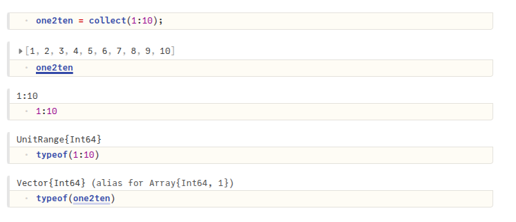

## Julia

*TODO* &#128197;

---

***UnitRange to Array***

a `UnitRange` is a specific type of range that represents a sequence of integers with a step of 1

`UnitRange` objects are "lazy" and efficient. They do not allocate memory for all elements in the range until explicitly converted to a concrete array (e.g., using `collect()`)



---

***views***

A `view` is essentially a ***pointer*** to a sub-section of another vector, but not a standalone vector itself

```julia
one2ten = collect(1:10);
println(one2ten)

one2five = one2ten[1:5]
one2five_view = view(one2ten, 1:5)

one2ten[1] = 10
println(one2five)
println(one2five_view)

# [1, 2, 3, 4, 5, 6, 7, 8, 9, 10]
# [1, 2, 3, 4, 5]
# [10, 2, 3, 4, 5]
```

> `@views` is a macro that converts sliced arrays into views (pointers are much cheaper than creating copies of arrays). For more information on how to use the `view` syntax correctly


## Conditional Compilation In C++

### Using g++ only

**conditional.cpp**

```c++
#include <iostream>

#define na 4

int main() {
  int a[na];

  a[0] = 2;
  for (int n = 1; n < na; n++) a[n] = a[n-1] + 1;

#ifdef DEBUG
  // Only kept by preprocessor if DEBUG defined
  for (int n = 0; n < na; n++) {
    std::cout << "a[" << n << "] = " << a[n] << std::endl;
  }
#endif 
  
  return 0;
}
```

---

**-DDEBUG** args

```bash
$ g++ -Wall -Wextra -Wconversion conditional.cpp -o conditional
$ ./conditional
$ g++ -Wall -Wextra -Wconversion conditional.cpp -o conditional -DDEBUG
$ ./conditional
a[0] = 2
a[1] = 3
a[2] = 4
a[3] = 5
```

---

---

### Using **CMakeLists.txt** *add_definitions*

```cmake
cmake_minimum_required(VERSION 3.2)

option(DEBUG "Option description" OFF)

if(DEBUG)
    add_definitions(-DDEBUG)
endif(DEBUG)

add_executable(cond conditional.cpp)
```

---

**without debug**

```bash
$ cmake ..
$ make
$ ./cond
```

**with debug**

```bash
$ cmake -DDEBUG=ON ..
$ make
$ ./cond
a[0] = 2
a[1] = 3
a[2] = 4
a[3] = 5
```

