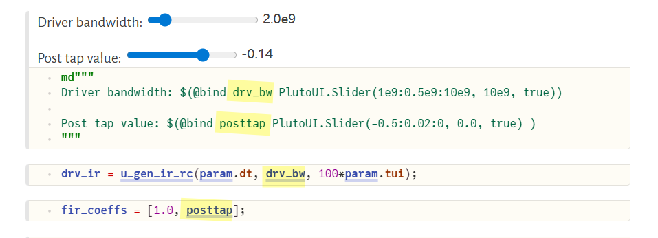
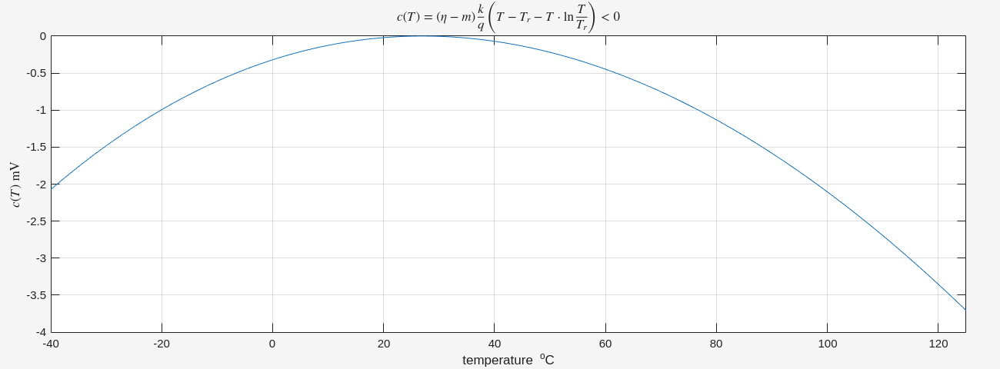
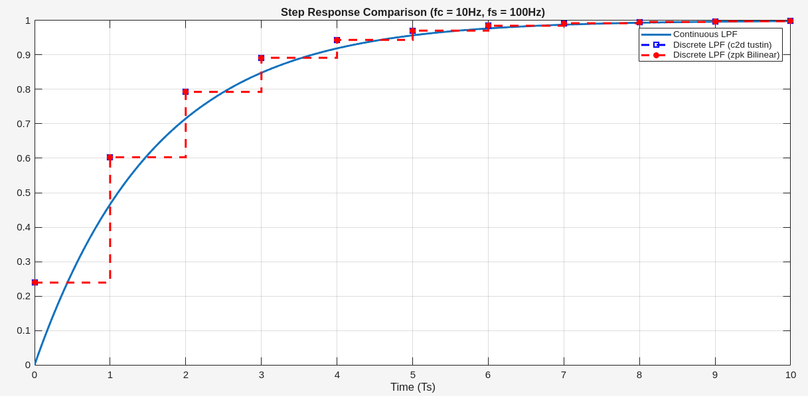
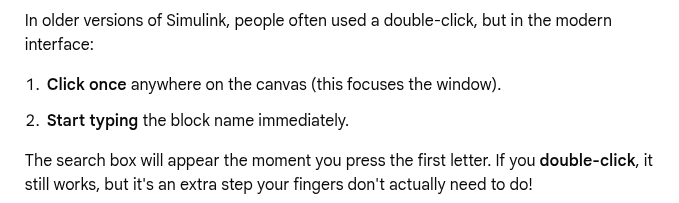
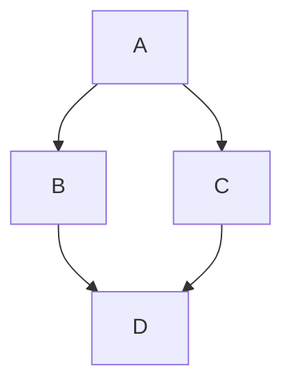

## Julia

***create a new project***

```
$ julia
```

`]`

```
(@v1.12) pkg> generate MyNewProj
```

`;`

```
shell> cd MyNewProj/
```

`]`

```
(@v1.12) pkg> activate .
```


---

`pkg> dev|develop`: add a local package, which not initialized by git

load custom module:

```julia
include("path/to/MyModule.jl")

struct0 = MyModule.Mystruct()
```


```julia
include("path/to/MyModule.jl")
import .MyModule:Mystruct

struct0 = Mystruct()
```


```julia
include("path/to/MyModule.jl")
using .MyModule		# !!! don't work in Pluto

struct0 = Mystruct()
```


---

activate a Julia environment and execute a file using the **command line**

```bash
julia --project=. your_script.jl
```

The `--project=.` argument tells Julia to look for a `Project.toml` and `Manifest.toml` file in the current directory (indicated by `.`)


---


***Sharing Project Environments***

`instantiate` command to download and install all packages and their dependencies listed in `Project.toml` (and `Manifest.toml` if present)

| Feature / Command      | **`activate`**                                            | **`generate`**                                               | **`resolve`**                                                | **`instantiate`**                                            |
| :--------------------- | :-------------------------------------------------------- | :----------------------------------------------------------- | :----------------------------------------------------------- | :----------------------------------------------------------- |
| **Primary Goal**       | Switch to a specific project folder's context.            | Create a brand new project skeleton from scratch.            | Recalculate the dependency tree for the **current** Julia version. | Download and install the specific versions listed in the Manifest. |
| **Julia Version Role** | Does not check version; just points Julia to a directory. | Creates a `Project.toml` compatible with the **running** Julia version. | **Crucial:** Filters package versions based on the `[compat] julia` field. | Uses the Julia version to ensure the Manifest is valid before downloading. |
| **Manifest Impact**    | None.                                                     | None (a manifest is only created once you add packages).     | **Rewrites** the `Manifest.toml` to match the current Julia environment. | **Follows** the existing `Manifest.toml` to recreate the environment. |
| **Cross-Version Use**  | Same command works across all Julia versions.             | Standard way to start a project regardless of Julia version. | Used to "fix" a Manifest when moving a project to a **newer/older** Julia version. | Used to "build" the project once `resolve` has created a valid Manifest. |
| **Error Handling**     | Rarely fails (unless the path doesn't exist).             | Fails if the directory name is invalid or already exists.    | Fails if no package versions support your **running** Julia version. | Fails if the Manifest was built for a **different** Julia version (pre-1.11). |


### Basics

`parentmodule`:  determine the package a function in Julia originates from

`names`: Get a vector of the public names of a Module, excluding deprecated names

`undef`: undef is a special marker used when constructing arrays (including vectors) to indicate that the elements of the array should not be initialized to any specific value.

`collect`: return an Array of all items in a collection or iterator, `collect(2:5)`, `collect('B':'D')`, `collect("HELLO")`

`!`: a function naming convention to indicate that a function mutates its arguments in place, meaning the changes will be visible outside the function. When a function is designed to modify its arguments, it is good practice to append a `!` (exclamation mark) to its name

`eltype`: To find the type of the elements that are iterated over in a collection

`typeof`: To determine the specific type of any given value

```julia
pizza_tuple = ("hawaiian", 'S', 10.5)
typeof(pizza_tuple) # Tuple{String, Char, Float64}
eltype(pizza_tuple)	# Any

arr = [1,2,3]
typeof(arr)		# Vector{Int64} (alias for Array{Int64, 1})
eltype(arr)		# Int64
```

`Any`: It is used to construct a heterogeneous array that can hold elements of any type, like `Any[1, "hello", 3.14]`

`^`: Repeat a regex `n` times (`s^n` is same with `repeat(s, n)`); Exponentiation operator

`parse`:  convert a text string to anything else. `parse(Int, "42")`, `parse(Float64, "42")`

String `*` : concatenate strings, `"The " * engine *`

String `$`:   string interpolation,  use `$(variable)` instead of `$variable` when there
is no whitespace that can clearly distinguish the variable name from the surrounding text

`vec`: Reshape the array as a *one-dimensional column vector*

---


***dictionary***

```julia
pizza = Dict("name" => "hawaiian", "size" => 'S', "price" => 10.5)
```

A problem with using a dictionary is that it requires every value to be of the *same type*

```julia
typeof(pizza)	# Dict{String, Any}
```


---

***symbols***

 It is denoted by *`:` (colon), followed by the name of the symbol,* built-in Julia type to represent identifiers


---

 ***named tuples***

```julia
pizza = (name = "hawaiian", size = 'S', price = 10.5)
```

A named tuple only allows you to use *symbols* as keys

All types of tuples are *immutable*, meaning you cannot change them


implicit naming from identifiers

```julia
x = 0
t = (; x) # t is (x = 0,)
u = (; t.x) # u is (x = 0,)
```


---

***composite type*** (`struct`) & ***type annotation***

`::` is used to annotate variables and expressions with their type. `x::T` means variable `x` should have type `T`. It helps Julia figure out how many bytes are needed to hold all fields in a `struct`

```julia
struct Archer
    name::String
    health::Int
    arrows::Int
end
```


---

 ***closure***


---

***varargs***

"varargs" (variable arguments) refers to the ability of a function to accept an arbitrary number of arguments. This is achieved using the *splat operator* (`...`) in the function definition.

```julia
function my_sum(a, b, rest...)
    total = a + b
    for x in rest
        total += x
    end
    return total
end
```

```julia
my_sum(1, 2, 3, 4, 5)	# 15
```

---

***keyword arguments***

a *semicolon* (`;`) separates positional arguments from keyword arguments in the function signature. All arguments to the right of the semicolon are treated as keyword arguments. They can optionally have default values


---

***views***

A `view` is essentially a ***pointer*** to a sub-section of another vector, but not a standalone vector itself

```julia
one2ten = collect(1:10);
println(one2ten)

one2five = one2ten[1:5]
one2five_view = view(one2ten, 1:5)

one2ten[1] = 10
println(one2five)
println(one2five_view)

# [1, 2, 3, 4, 5, 6, 7, 8, 9, 10]
# [1, 2, 3, 4, 5]
# [10, 2, 3, 4, 5]
```

> `@views` is a macro that converts sliced arrays into views (pointers are much cheaper than creating copies of arrays). For more information on how to use the `view` syntax correctly


---

***semicolon after steprange***

placing a semicolon `;` after a step range expression inside square brackets, e.g., `[1:10;]`, changes the resulting object from a `UnitRange` to a `Vector`

```julia
b = [1:2:10]	# Vector{StepRange{Int64, Int64}}
a = [1:2:10;]	# Vector{Int64}

size(b)	# (1)
size(a)	# (5)
```


---

***element-wise operations***

*Dot syntax for operators*: For binary operators like `+`, `-`, `*`, `/`, `^`

*Dot syntax for functions*: For functions, the dot is placed after the function name.

---

***Property destructuring*** 

```julia
julia> (; b, a) = (a=1, b=2, c=3)
(a = 1, b = 2, c = 3)

julia> a
1

julia> b
2
```


---

***One-line functions***

"*one-line function*" also known as the compact "*assignment form*"

```julia
function_name(parameters) = expression
```

---

***Anonymous Functions (Lambda Functions)***

functions without a name `(parameters) -> expression`, often defined inline for use with higher-order functions like `map`, `filter`, or `reduce`

```julia
numbers = [1, 2, 3]
doubled_numbers = map(x -> 2 * x, numbers) # doubled_numbers will be [2, 4, 6]
```

---

`do` keyword is **syntactic sugar** for creating an **anonymous function** and passing it as the **first argument** to another function

```julia
map([1, 2, 3]) do x
    y = x * 2
    return y + 1
end
```

- `do` starts the block.
- `x, y` (optional) following `do` are the **arguments** the anonymous function receives.
- `end` closes the block

---

`CircularBuffer`

| Feature            | `Vector` (Standard)             | `CircularBuffer` (DataStructures.jl) |
| :----------------- | :------------------------------ | :----------------------------------- |
| **Push/Pop Front** | $O(n)$ (Shifts all elements)    | $O(1)$ (Updates head pointer)        |
| **Push/Pop Back**  | $O(1)$ (Amortized)              | $O(1)$                               |
| **Random Access**  | $O(1)$ (Direct)                 | $O(1)$ (With index wrapping logic)   |
| **Capacity**       | **Dynamic**: Grows as needed    | **Fixed**: Initialized at set size   |
| **Overflow**       | Reallocates memory              | **Overwrites** the oldest data       |
| **Memory Layout**  | Contiguous                      | Contiguous (internally wraps)        |
| **Best Use Case**  | General collections / Appending | Sliding windows / Real-time buffers  |

```julia
using DataStructures

# Initialize a CircularBuffer of type Int with capacity 3
cb = CircularBuffer{Int}(3)

# Add elements
push!(cb, 1)        # [1]
push!(cb, 2)        # [1, 2]
append!(cb, [3, 4]) # [2, 3, 4] (1 is overwritten because capacity is 3)

# Add to the front
pushfirst!(cb, 0)   # [0, 2, 3] (4 is overwritten)
```


- **`push!(cb, item)`**: Adds a single item to the back of the buffer. If the buffer is at its capacity, the item at the front (the oldest) is removed to make room.
- **`append!(cb, collection)`**: Adds multiple items from another collection to the back of the buffer. This is essentially a shorthand for calling `push!` on each element of the collection.

| Feature    | `push!`                            | `append!`                           |
| :--------- | :--------------------------------- | :---------------------------------- |
| **Input**  | A single **item**                  | A **collection** of items           |
| **Action** | Adds one element as a single entry | Unpacks all elements from the input |

---

***`using` vs `import`***

that’s the difference between `using` and `import` - the former brings all exported names into scope, while the latter only brings NiceStuff (the module identifier) into scope.

> [[https://discourse.julialang.org/t/difference-between-include-use-and-import/65918/5](https://discourse.julialang.org/t/difference-between-include-use-and-import/65918/5)]


---

***PlutoUI.Slider***



---

---

***multiple dispatch***

A function can take arguments of different types, and share the same name


---

`@.` :  used for **automatic broadcasting** across an entire expression

```julia
# Manual broadcasting
y = exp.(sin.(x)) .+ 2 .* x


# Automatic broadcasting
@. y = exp(sin(x)) + 2 * x
```


---


`Revise.jl` Context Summary


| Context            | Role                                                         | Key Mechanism                                                |
| :----------------- | :----------------------------------------------------------- | :----------------------------------------------------------- |
| **REPL**           | Hot-reloads functions and modules without restarting Julia.  | `using Revise` then `using MyPackage`                        |
| **Scripts**        | Watches standalone `.jl` files for changes on save.          | `includet("path/to/script.jl")`                              |
| **Pluto.jl**       | Tracks updates to **external** packages used in the notebook. | `using Revise` in a cell (Internal cells are natively reactive). |
| **Jupyter/IJulia** | Updates package code without needing to restart the kernel.  | `using Revise` in the first cell.                            |
| **VS Code**        | Powers the integrated "Execute" and "Debugger" workflows.    | Usually auto-enabled by the Julia Extension.                 |


### Makie.jl & Observables.jl

> Storopoli, Huijzer and Alonso (2021). Julia Data Science. [[https://juliadatascience.github.io/JuliaDataScience/](https://juliadatascience.github.io/JuliaDataScience/)]

`non-mutating` methods of plotting function:  `Figure` `Axis` `plot object` in collection`FigureAxisPlot`

`mutating` methods of plotting function: `plot object`


**Figure + Axis + plot + axislegend**

```julia
fig = Figure()
ax = Axis(fig[1,1])
scatterlines!(ax, 0.5:0.2:3pi, x -> -cos(x)/x, label = "cos(x)/x")
axislegend(; position=:rt)	# plot function's label rather xlabel, ylabel of Axis
fig
```

***Observable***

The argument to the `Observable()` **constructor** provides both an **initial value** and determines the **type of the observable variable**.

There are two ways to access/update an observable's value - w/ `.val` or `[]`

The difference is that only using `[]` will trigger the listener event when updating the observable
value

| Feature          | `lift`                                  | `on`                                    |
| :--------------- | :-------------------------------------- | :-------------------------------------- |
| **Return Value** | A **new Observable**                    | A **Handler** (for disconnecting later) |
| **Purpose**      | To transform data (create a dependency) | To perform an action (side effect)      |
| **Data Flow**    | Value flows from parent to child        | Value triggers an external event        |

```julia
using GLMakie

x = Observable(0.0)

on(x) do x
    println("New value of x is $x")
end

x[] = 5.0
```


### DifferentialEquations.jl & Callback Functions


## Python

`np.fft.fft` vs `np.fft.rfft`

```python
import numpy as np

def custom_rfft(x):
    # Ensure input is a NumPy array
    x = np.asarray(x)

    # 1. Compute the full standard FFT
    full_fft = np.fft.fft(x)

    # 2. Calculate the required output length: (n // 2) + 1
    n = len(x)
    rfft_len = (n // 2) + 1

    # 3. Slice and return only the unique positive frequencies
    return full_fft[:rfft_len]


# Test data
even_signal = [1.0, 2.0, 3.0, 4.0]
odd_signal  = [1.0, 2.0, 3.0, 4.0, 5.0]

# Verification
print(np.allclose(custom_rfft(even_signal), np.fft.rfft(even_signal)))  # True
print(np.allclose(custom_rfft(odd_signal), np.fft.rfft(odd_signal)))    # True
```

`np.fft.irfft`

Since the discrete Fourier Transform of real input is **Hermitian-symmetric**, the negative frequency terms are taken to be the complex conjugates of the corresponding positive frequency terms

---

- **`scipy.signal.residue`**: \(H(s) = \frac{B(s)}{A(s)} \rightarrow\) Converts numerator/denominator arrays into residues, poles, and a direct polynomial
- **`scipy.signal.invres`**: \(H(s) \rightarrow\) Converts residues, poles, and a direct polynomial back into numerator/denominator arrays

$$
H(s) = \frac{s + z}{(s + p_1)(s + p_2)} = \frac{z-p_1}{p_2-p_1}\frac{1}{s + p_1} + \frac{z-p_2}{p_1-p_2}\frac{1}{s + p_2}=\frac{r_1}{s+p_1} + \frac{r_2}{s+p_2}
$$

```python
# https://github.com/capn-freako/PyBERT/blob/master/src/pybert/utility/sigproc.p


def make_ctle(rx_bw: float, peak_freq: float, peak_mag: float, w: Rvec) -> tuple[Rvec, Cvec]:  # pylint: disable=too-many-arguments  # noqa: F405
    """
    Generate the frequency response of a continuous time linear equalizer (CTLE), given the:

        - signal path bandwidth,
        - peaking specification, and
        - list of frequencies of interest.

    Args:
        rx_bw: The natural (or, unequalized) signal path bandwidth (Hz).
        peak_freq: The location of the desired peak in the frequency response (Hz).
        peak_mag: The desired relative magnitude of the peak (dB).
        w: The list of frequencies of interest (rads./s).

            - The zero location is chosen, so as to provide the desired degree of peaking.
    """

    p2 = -2.0 * pi * rx_bw
    p1 = -2.0 * pi * peak_freq
    z = p1 / pow(10.0, peak_mag / 20.0)
    if p2 != p1:
        r1 = (z - p1) / (p2 - p1)
        r2 = 1 - r1
    else:
        r1 = -1.0
        r2 = z - p1
    b, a = invres([r1, r2], [p1, p2], [])
    w, H = freqs(b, a, w)
    H /= max(abs(H))

    return (w, H)
```


---

`np.where`

There are actually two distinct call signatures:

| Call                   | Returns                                      | Use                |
| ---------------------- | -------------------------------------------- | ------------------ |
| `np.where(cond, a, b)` | array, `a`/`b` chosen element-wise           | **select values**  |
| `np.where(cond)`       | tuple of index arrays where `cond` is `True` | **find positions** |


## Matlab

***LaTeX code for the expression*** 

```matlab
title('$c(T) = (\eta - m) \frac{k}{q} \left( T - T_r - T \cdot \ln \frac{T}{T_r} \right) < 0$', 'Interpreter', 'latex');

ylabel('$c(T)$ mV', 'Interpreter', 'latex');
```

**Dollar Signs (`$`):** Wrapping the equation in `$...$` tells the LaTeX engine to use "inline math mode," which ensures proper spacing and formatting for symbols.

**Interpreter:** Adding `'Interpreter', 'latex'` at the end is the "switch" that tells MATLAB not to use its basic text engine.



---

---

***identify class of an object or variable***

```matlab
x = 42;
type_name = class(x); % Returns 'double'
disp(type_name)
```

---

---

***zpk***

Use `zpk` to create zero-pole-gain models

`sys = zpk(zeros,poles,gain)` creates a **continuous-time** zero-pole-gain model with zeros and poles specified as vectors and the scalar value of gain.

`sys = zpk(zeros,poles,gain,ts)` creates a **discrete-time** zero-pole-gain model with sample time ts. Set `ts` to `-1` or `[]` to leave the sample time unspecified.

---

***zpkdata***

Access zero-pole-gain data

```matlab
[z,p,k] = zpkdata(sys,'v')
```

the sampling time associated with that ZPK data

```matlab
Ts = sys_d.Ts; % Returns the sampling interval (1/fs)
```


```matlab
% 1. Define Continuous ZPK Model
fc = 10;                % Cutoff frequency in Hz
wc = 2 * pi * fc;       % Cutoff frequency in rad/s

z = [];                 % No zeros
p = -wc;                % Single pole at -wc
k = wc;                 % Gain (to ensure DC gain = 1)

sys_c = zpk(z, p, k);

% 2. Convert to Discrete via Bilinear Transformation
fs = 100;               % Sampling frequency in Hz
dt = 1/fs;

% 'tustin' flag is the standard name for the bilinear transformation in control theory
sys_d = c2d(sys_c, dt, 'tustin'); % 'tustin' is the Bilinear method in MATLAB

% Extract zeros, poles, and gain from sys_c
[zc, pc, kc] = zpkdata(sys_c, 'v');
[zd, pd, kd] = bilinear(zc, pc, kc, fs);
sys_dbli = zpk(zd, pd, kd, dt);


% 3. Plot and Compare Step Response
[yc, tc] = step(sys_c, 0:dt/100:dt*10);
tt = 0:dt:dt*10;
[yd, ~] = step(sys_d, tt);
[ydbli, ~] = step(sys_dbli, tt);

plot(tc/dt, yc, LineWidth=2); hold on
stairs(tt/dt, yd, 'bs--', LineWidth=2); stairs(tt/dt, ydbli, 'r*--', LineWidth=2)
title(['Step Response Comparison (fc = ', num2str(fc), 'Hz, fs = ', num2str(fs), 'Hz)']);
legend('Continuous LPF', 'Discrete LPF (c2d tustin)', 'Discrete LPF (zpk Bilinear)');
grid on; xlabel('Time (Ts)')
```




---

---

> `syms` and `sym` in MATLAB's Symbolic Math Toolbox both create symbolic objects, but they differ in usage and behavior.

`syms`: The command to create symbolic objects.


define **symbolic scalar variables**

```matlab
syms t x a b;
```


define **symbolic scalar functions** that depend on the variable `t`

```matlab
syms f(t) g(t) h(t) vc0(t) vc1(t) vc2(t);
```

---

create a set of *symbolic row vectors* with `sym`

```matlab
m=2500;
ic=zeros(1,m);
```


---

---

3D surface plot, importing data from a CSV file

```matlab
clear; clc
df = readmatrix('/path/to/core_lod_sodab_sab.csv');
nsab = df(:, 3);
nsodab = df(:,4);

svtN = df(:,8)*1e3;	% mV
lvtN = df(:,9)*1e3;
ulvtN = df(:,10)*1e3;
elvtN = df(:,11)*1e3;

vth_plot = svtN;

% Uses logical indexing to find rows where nsab is greater than nsodab.
% set to NaN to filter them out completely
vth_plot(nsab>nsodab) = NaN;

[nsabq, nsodabq] = meshgrid(linspace(min(nsab), max(nsab), 20), linspace(min(nsodab), max(nsodab), 20));

vth_plotq = griddata(nsab, nsodab, vth_plot, nsabq, nsodabq);

surf(nsabq, nsodabq, vth_plotq);
xlabel('CPODE(SA/SB)'); ylabel('PODE(SODA/SODB)'); title('svtN (mV)'); view(135,30)
```

By using `NaN`, the `surf` command will simply not render any polygons over the invalid coordinates. Your 3D plot will sharply truncate exactly at the physical layout boundary rule line ($nsab = nsodab$)


## Simulink

**Quick Insert** menu

- **Single-click** anywhere on the empty white space of your model canvas.
- **Type** the name of the block you want (e.g., "Gain", "Scope", or "Triggered Subsystem")

> 

---

---

***Configure Model Layout***

**Rotate Clockwise:** `Ctrl+R`.

**Rotate Counterclockwise:** `Ctrl+Shift+R`.

**Flip Horizontally:** `Ctrl+I`.

**Flip Vertically:** Right-click block \(\rightarrow \) **Rotate & Flip** \(\rightarrow \) **Flip Block** (or apply clockwise rotation twice)


## Mathematica


`/.`:  **ReplaceAll** command


---

---

`WhenEvent[event,action]`

*Sequential Execution*: If multiple actions are assigned to a single event (e.g., `WhenEvent[cond, {action1, action2}]`), they are evaluated in order.

---

---

`DiscreteVariables` in `NDSolve`: handle state variables that only change at specific, discontinuous moments rather than changing continuously with the independent variable (usually time $t$), solution returned will be a **piecewise constant**


## Markdown

**`> [!NOTE]`**: General useful information

> [!NOTE]


**`> [!IMPORTANT]`**: Crucial information for user success

> [!IMPORTANT]


**`> [!WARNING]`**: Urgent information to avoid potential problems

> [!WARNING]


**`> [!TIP]`**: Helpful advice or better ways to do things

> [!TIP]


**`> [!CAUTION]`**: Negative consequences or risks of certain actions

> [!CAUTION]


## Latex

In math mode, LaTeX provides several commands to insert horizontal space of specific widths:

| Command  | Width    | Name                |
| -------- | -------- | ------------------- |
| `\,`     | 3/18 em  | thin space          |
| `\:`     | 4/18 em  | medium space        |
| `\;`     | 5/18 em  | thick space         |
| `\!`     | −3/18 em | negative thin space |
| `\quad`  | 1 em     | quad                |
| `\qquad` | 2 em     | double quad         |

---

---

`\operatorname{...}` — **math operator** in an upright (roman) font with appropriate mathematical spacing
$$
\operatorname{sinc}(x)
$$


## mermaid

*Mermaid is a JavaScript based diagramming and charting tool* that takes Markdown-inspired text definitions and creates diagrams dynamically in the browser


```mermaid
graph TD;A-->B;A-->C;B-->D;C-->D;
```


## C++

***Using g++ only***

**conditional.cpp**

```c++
#include <iostream>

#define na 4

int main() {
  int a[na];

  a[0] = 2;
  for (int n = 1; n < na; n++) a[n] = a[n-1] + 1;

#ifdef DEBUG
  // Only kept by preprocessor if DEBUG defined
  for (int n = 0; n < na; n++) {
    std::cout << "a[" << n << "] = " << a[n] << std::endl;
  }
#endif 
  
  return 0;
}
```

---

**-DDEBUG** args

```bash
$ g++ -Wall -Wextra -Wconversion conditional.cpp -o conditional
$ ./conditional
$ g++ -Wall -Wextra -Wconversion conditional.cpp -o conditional -DDEBUG
$ ./conditional
a[0] = 2
a[1] = 3
a[2] = 4
a[3] = 5
```

---

---

***add_definitions in CMakeLists.txt***

```cmake
cmake_minimum_required(VERSION 3.2)

option(DEBUG "Option description" OFF)

if(DEBUG)
    add_definitions(-DDEBUG)
endif(DEBUG)

add_executable(cond conditional.cpp)
```

---

**without debug**

```bash
$ cmake ..
$ make
$ ./cond
```

**with debug**

```bash
$ cmake -DDEBUG=ON ..
$ make
$ ./cond
a[0] = 2
a[1] = 3
a[2] = 4
a[3] = 5
```

