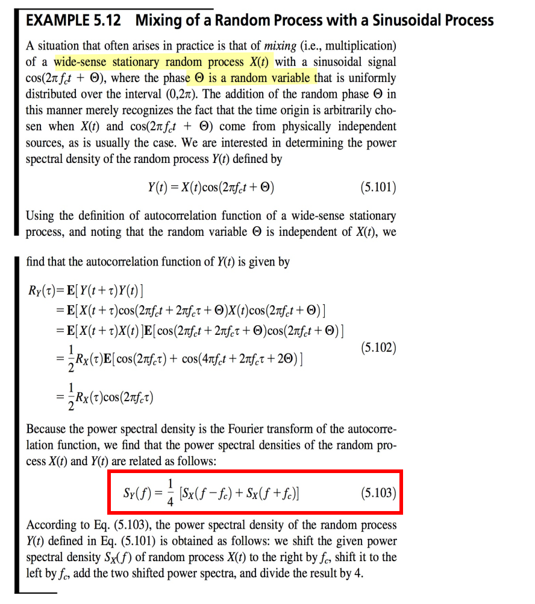
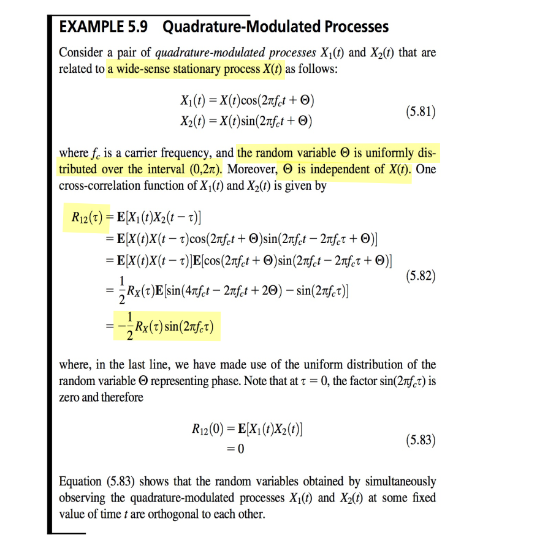
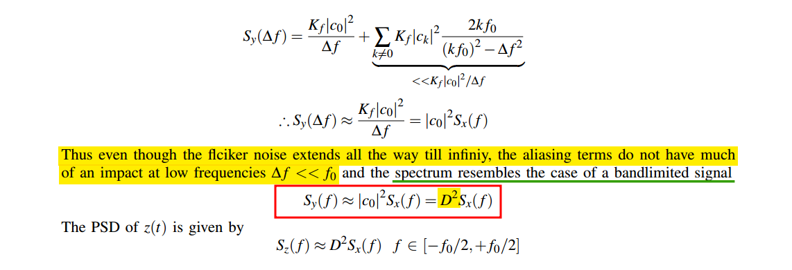

## Modulation of WSS process

> Balu Santhanam, Probability Theory & Stochastic Process 2020: [Modulation of Random Processes](https://ece-research.unm.edu/bsanthan/ece541/mod.pdf)

### modulated with a random cosine

---

> Haykin, Simon S., and Michael Moher. *Communication Systems*. 5th ed. John Wiley & Sons, 2009. - *Mixing of a Random Process with a Sinusoidal Process*

### modulated with a deterministic cosine

---

> Hayder Radha, ECE 458 Communications Systems Laboratory Spring 2008: Lecture 7 - EE 179: Introduction to Communications - Winter 2006–2007 [Energy and Power Spectral Density and Autocorrelation](https://www.egr.msu.edu/classes/ece458/radha/ss07Keyur/Lab-Handouts/PSDESDetc.pdf)

---

### Quadrature-Modulated Processes

> Haykin, Simon S., and Michael Moher. *Communication Systems*. 5th ed. John Wiley & Sons, 2009.

## Sampling of WSS process

> Balu Santhanam, Probability Theory & Stochastic Process 2020: [Impulse sampling of Random Processes](https://ece-research.unm.edu/bsanthan/ece541/impulse_sampling_of_random_signals.pdf)

### DT sequence $x[n]$

Owing to $\phi[0] = \phi_c(0)$,  the average power of the sampled version $x[n]$ is the ***same*** as its input $x_c(t)$

### impulse train $x_s(t)$

That is
$$
P_{x_s x_s} (f)= \frac{1}{T_s^2}P_{xx}(f)
$$
where $x[n]$ is sampled discrete-time sequence, $x_s(t)$ is sampled impulse train

### Noise Aliasing

*apply foregoing observation*

## Pulsed Noise Signals

> Chembian Thambidurai, "Power Spectral Density of Pulsed Noise Signals" [[link](https://www.linkedin.com/posts/chembiyan-t-0b34b910_psd-of-pulsed-noise-signal-activity-6992527460886040577-a0im?utm_source=share&utm_medium=member_desktop)]

> Above,  the output of the multiplier be $y(t)$ is passed through a ideal brick wall low pass filter with a bandwidth of $f_0/2$

When a random signal is multiplied by a *pulse function*, the resulting signal becomes a *cyclo-stationary random process*. 

As rule of thumb, the spectrum of such a pulsed noise signal  

- ***thermal noise*** is multiplied by $\color{red}D$

- ***flicker noise*** is multiplied by $\color{red}D^2$, 

where $D$ is the duty cycle of the pulse signal

### banlimited input (no aliasing)

###  wideband white noise input

### flicker noise input

with $S_x(f)=\frac{K_f}{f}$

Assuming $\Delta f \ll f_0$

---

---

***Rectangular Pulse Sampling***

> Balu Santhanam. ece439 Introduction to Digital Signal Processing. Example: Rectangular Pulse Sampling [[http://ece-research.unm.edu/bsanthan/ece439/recsamp.pdf](http://ece-research.unm.edu/bsanthan/ece439/recsamp.pdf)]

## reference

Alan V Oppenheim, Ronald W. Schafer. Discrete-Time Signal Processing, 3rd edition [[pdf](https://file.fouladi.ir/courses/dsp/books/%28Prentice-Hall%20Signal%20Processing%20Series%29%20Alan%20V.%20Oppenheim%2C%20Ronald%20W.%20Schafer-Discrete-Time%20Signal%20Processing-Prentice%20Hall%20%282009%29.pdf)]

R. E. Ziemer and W. H. Tranter, Principles of Communications, 7th ed., Wiley, 2013 [[pdf](https://physicaeducator.wordpress.com/wp-content/uploads/2018/03/principles-of-communications-7th-edition-ziemer.pdf)]

John G. Proakis and Masoud Salehi, Fundamentals of communication systems 2nd ed [[pdf](http://www.pce-fet.com/common/library/books/51/9492_[John_G._Proakis,_Masoud_Salehi]_Fundamentals_of_C(b-ok.org).pdf)]

Rhee, W. and Yu, Z., 2024. *Phase-Locked Loops: System Perspectives and Circuit Design Aspects*. John Wiley & Sons

Lacaita, Andrea Leonardo, Salvatore Levantino, and Carlo Samori. *Integrated frequency synthesizers for wireless systems*. Cambridge University Press, 2007

Phillips, Joel R. and Kenneth S. Kundert. "Noise in mixers, oscillators, samplers, and logic: an introduction to cyclostationary noise." Proceedings of the IEEE 2000 Custom Integrated Circuits Conference. [[pdf](https://designers-guide.org/theory/cyclo-paper.pdf), [slides](https://designers-guide.org/theory/cyclo-preso.pdf)]

Antoni, J., "Cyclostationarity by examples", <i>Mechanical Systems and Signal Processing</i>, vol. 23, no. 4, pp. 987–1036, 2009 [[https://docente.unife.it/docenti/dleglc/a-a-2010-2011-dmsm/ciclostazionarieta.pdf](https://docente.unife.it/docenti/dleglc/a-a-2010-2011-dmsm/ciclostazionarieta.pdf)]

Kundert, Ken. (2006). Simulating Switched-Capacitor Filters with SpectreRF.  URL:[https://designers-guide.org/analysis/sc-filters.pdf](https://designers-guide.org/analysis/sc-filters.pdf)

STEADY-STATE AND CYCLO-STATIONARY RTS NOISE IN MOSFETS [[https://ris.utwente.nl/ws/portalfiles/portal/6038220/thesis-Kolhatkar.pdf](https://ris.utwente.nl/ws/portalfiles/portal/6038220/thesis-Kolhatkar.pdf)]

Christian-Charles Enz. "High precision CMOS micropower amplifiers" [[pdf](https://picture.iczhiku.com/resource/eetop/wYItQFykkAQDFccB.pdf)]

L.W. Couch, *Digital and Analog Communication* *Systems*, 8th Edition, Pearson, 2013.
