## asymmetric sideband

> The spectrum of the narrowband FM signal is very similar to that of an amplitude modulation (AM) signal but has the **phase reversal** for the other sideband component

Assume the modulation frequency of PM and AM are same, $\omega_m$

$$\begin{align}
x(t) &= (1+A_m\cos{\omega_m t})\cos(\omega_0 t + P_m \sin\omega_m t) \\
&= \cos(\omega_0 t + P_m \sin\omega_m t) + A_m\cos{\omega_m t}\cos(\omega_0 t + P_m \sin\omega_m t) \\
&= X_{pm}(t) + X_{apm}(t)
\end{align}$$

$X_{pm}(t)$, PM only part
$$
X_{pm}(t) = \cos\omega_0 t - \frac{P_m}{2}\cos(\omega_0 - \omega_m)t + \frac{P_m}{2}\cos(\omega_0 + \omega_m)t
$$
$X_{apm}(t)$, AM & PM part
$$\begin{align}
X_{apm}(t) &= A_m \cos{\omega_m t} (\cos\omega_0 t-P_m\sin\omega_m t\sin\omega_0 t) \\
&= \frac{A_m}{2}[\cos(\omega_0 + \omega_m)t + \cos(\omega_0 -\omega_m)t] - \frac{A_mP_m}{2}\sin(2\omega_m t)\sin(\omega_0 t) \\
&= \frac{A_m}{2}\cos(\omega_0 + \omega_m)t + \frac{A_m}{2}\cos(\omega_0 -\omega_m)t - \frac{A_mP_m}{4}\cos(\omega_0 - 2\omega_m)t + \frac{A_mP_m}{4}\cos(\omega_0 + 2\omega_m)t
\end{align}$$

That is
$$\begin{align}
x(t) &=  \cos\omega_0 t + \frac{A_m-P_m}{2}\cos(\omega_0 - \omega_m)t + \frac{A_m+P_m}{2}\cos(\omega_0 + \omega_m)t \\
&\space\space\space\space\space\space\space\space\space\space\space\space\space\space\space\space\space\space - \frac{A_mP_m}{4}\cos(\omega_0 - 2\omega_m)t + \frac{A_mP_m}{4}\cos(\omega_0 + 2\omega_m)t
\end{align}$$

For general case, $x(t) = (1+A_m\cos{\omega_{am} t})\cos(\omega_0 t + P_m \sin\omega_{pm} t)$, i.e., PM is $\omega_{pm}$, AM is $\omega_{am}$

$$\begin{align}
x(t) &=  \cos\omega_0 t - \frac{P_m}{2}\cos(\omega_0 - \omega_{pm})t + \frac{P_m}{2}\cos(\omega_0 + \omega_{pm})t \\
&\space\space\space\space\space\space\space\space\space\space\space\space\space\space\space\space\space\space + \frac{A_m}{2}\cos(\omega_0 - \omega_{am})t + \frac{A_m}{2}\cos(\omega_0 + \omega_{am})t \\
&\space\space\space\space\space\space\space\space\space\space\space\space\space\space\space\space\space\space - \frac{A_mP_m}{4}\cos(\omega_0 - \omega_{pm}-\omega_{am})t + \frac{A_mP_m}{4}\cos(\omega_0 + \omega_{pm}+\omega_{am})t \\
&\space\space\space\space\space\space\space\space\space\space\space\space\space\space\space\space\space\space + \frac{A_mP_m}{4}\cos(\omega_0 + \omega_{pm}-\omega_{am})t - \frac{A_mP_m}{4}\cos(\omega_0 - \omega_{pm}+\omega_{am})t
\end{align}$$

Therefore, sideband is asymmetric if $\omega_{pm} = \omega_{am}$

> Ken Kundert, Measuring AM, PM & FM Conversion with SpectreRF [[https://designers-guide.org/analysis/am-pm-conv.pdf](https://designers-guide.org/analysis/am-pm-conv.pdf)]

## Modulation of WSS process

> Balu Santhanam, Probability Theory & Stochastic Process 2020: [Modulation of Random Processes](https://ece-research.unm.edu/bsanthan/ece541/mod.pdf)

### modulated with a random cosine

### modulated with a deterministic cosine

---

> Hayder Radha, ECE 458 Communications Systems Laboratory Spring 2008: Lecture 7 - EE 179: Introduction to Communications - Winter 2006–2007 [Energy and Power Spectral Density and Autocorrelation](https://www.egr.msu.edu/classes/ece458/radha/ss07Keyur/Lab-Handouts/PSDESDetc.pdf)

---

## Sampling of WSS process

> Balu Santhanam, Probability Theory & Stochastic Process 2020: [Impulse sampling of Random Processes](https://ece-research.unm.edu/bsanthan/ece541/impulse_sampling_of_random_signals.pdf)

### DT sequence $x[n]$

---

### impulse train $x_s(t)$

That is
$$
P_{x_s x_s} (f)= \frac{1}{T_s^2}P_{xx}(f)
$$
where $x[n]$ is sampled discrete-time sequence, $x_s(t)$ is sampled impulse train

### Noise Aliasing

*apply foregoing observation*

## Cyclostationary Noise (Modulated Noise)

### White Noise Modulation

> Noisy Resistor & Clocked Switch

$$
v_t (t) = v_i(t)\cdot m_t(t)
$$
where  $v_i(t)$ is input *white* noise, whose autocorrelation is $A\delta(\tau)$, and $m_t(t)$ is periodically operating switch, then autocorrelation of $v_t(t)$
$$\begin{align}
R_t (t_1, t_2) &= E[v_t(t_1)\cdot v_t(t_2)] \\
&= R_i(t_1, t_2)\cdot  m_t(t_1)m_t(t_2)
\end{align}$$

Then
$$\begin{align}
R_t(t, t-\tau) &= R_i(\tau)\cdot m_t(t)m_t(t-\tau) \\
& = A\delta(\tau) \cdot m_t(t)m_t(t-\tau) \\
& = A\delta(\tau) \cdot m_t(t)
\end{align}$$
Because $m_t(t)=m_t(t+T)$, $R_t(t, t-\tau)$ is is periodic in the variable $t$ with period $T$

The time-averaged ACF is denoted as $\tilde{R_t}(\tau)$

$$
\tilde{R}_{t}(\tau) = m\cdot A\delta(\tau)
$$
That is,
$$
S_t(f) = m\cdot S_{A}(f)
$$

---

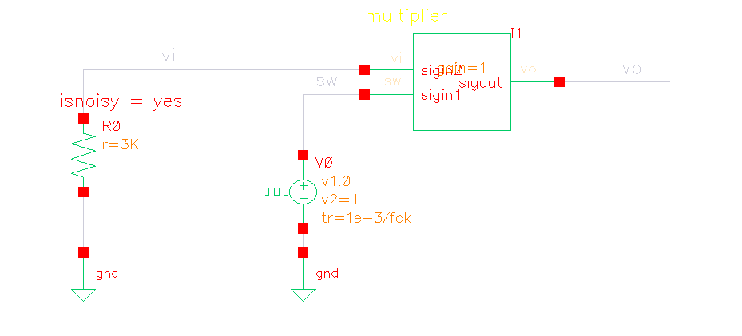

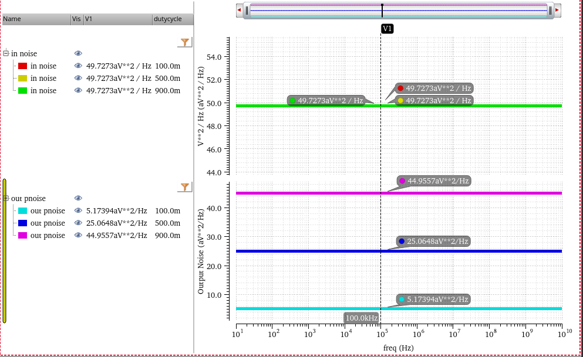

> 

### Colored Noise Modulation

$$
\tilde{R_t}(\tau) = R_i(\tau)\cdot m_{tac}(\tau)
$$

where $m_t(t)m_t(t-\tau)$ averaged on $t$  is denoted as $m_{tac}(\tau)$ or $\overline{m_t(t)m_t(t-\tau)}$

The DC value of $m_{tac}(\tau)$ can be calculated as below

1. for $m\le 0.5$, the DC value of $m_{tac}(\tau)$
   $$
   \frac{m\cdot mT}{T} = m^2
   $$

2. for $m\gt 0.5$, the DC value of $m_{tac}(\tau)$
   $$
   \frac{(m+2m-1)(1-m)T + (2m-1)\{mT -(1-m)T\}}{T} = m^2
   $$
   

Therefore, time-average power spectral density and total power are *scaled by $m^2$ in fundamental frequency sideband*

---

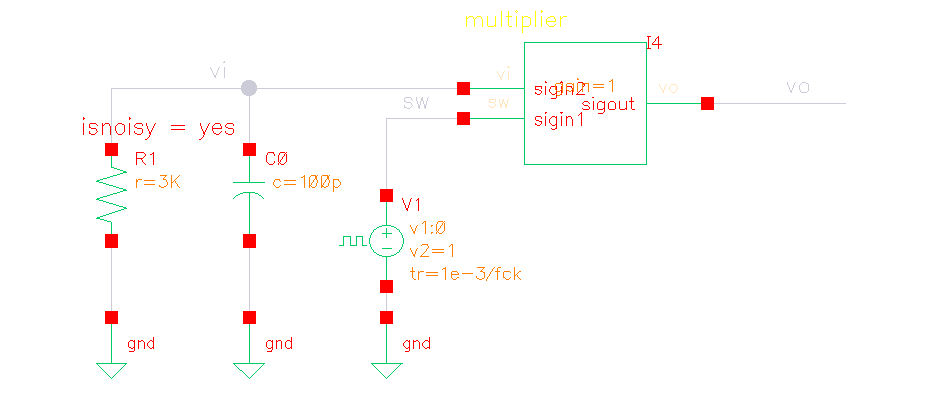

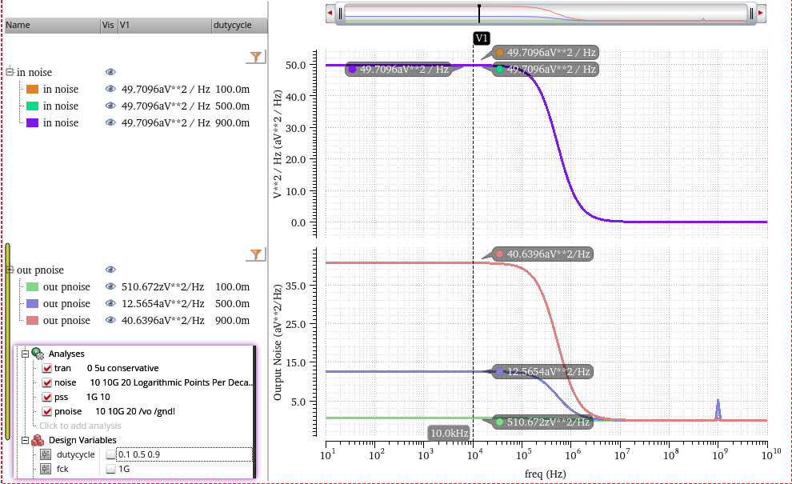

>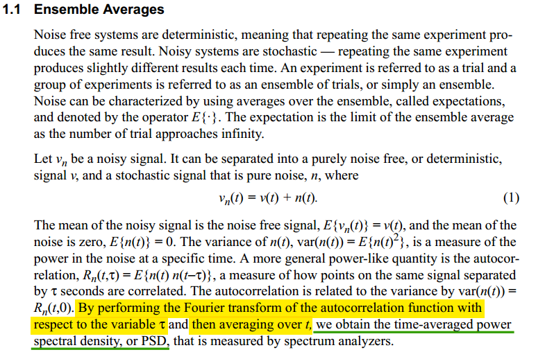

---

### Switched-Capacitor Track signal

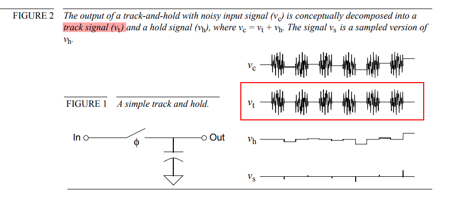

#### track signal pnoise (sc)

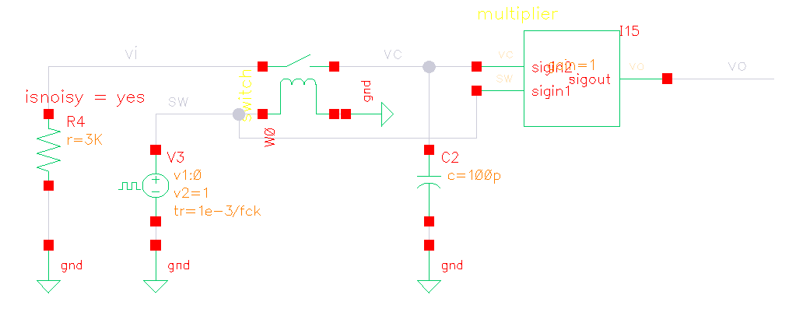

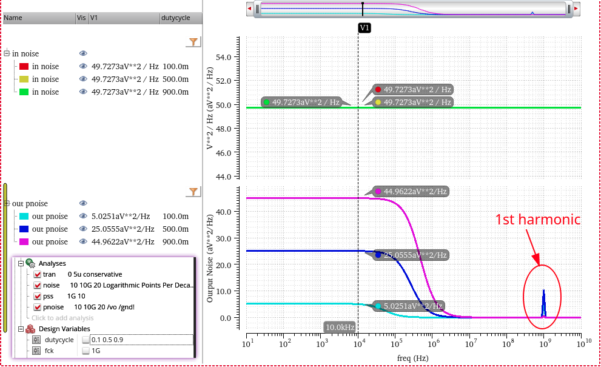

zoom in first harmonic by linear step of pnoise

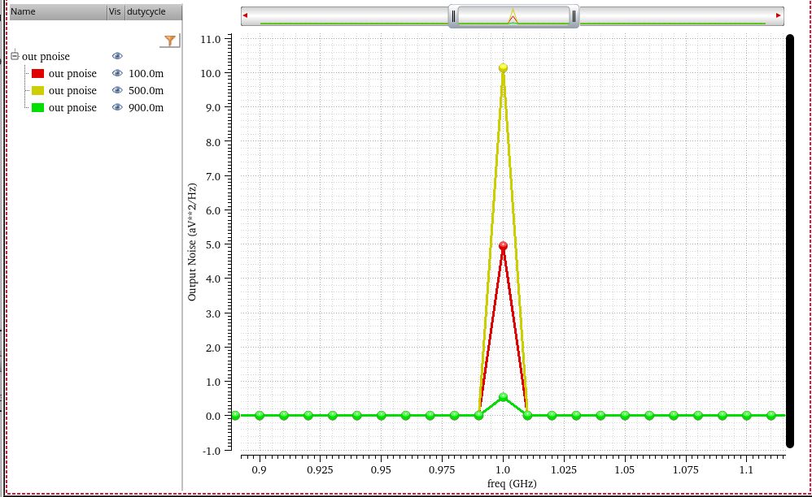

#### equivalent circuit for pnoise (eq)

1. thermal noise of R is *modulated at first*
2. *then filtered* by RC filter

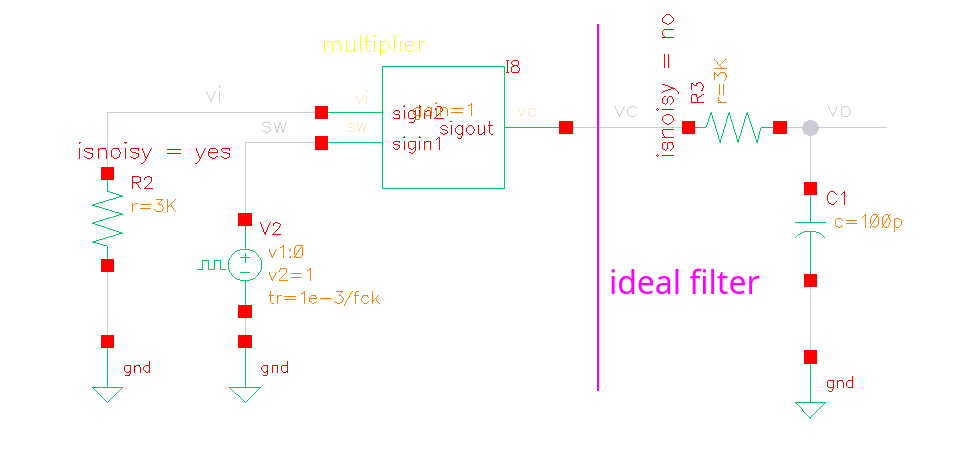

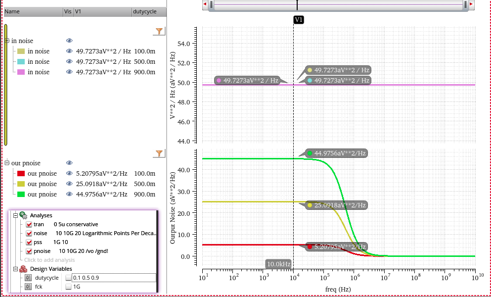

---

#### sc vs eq

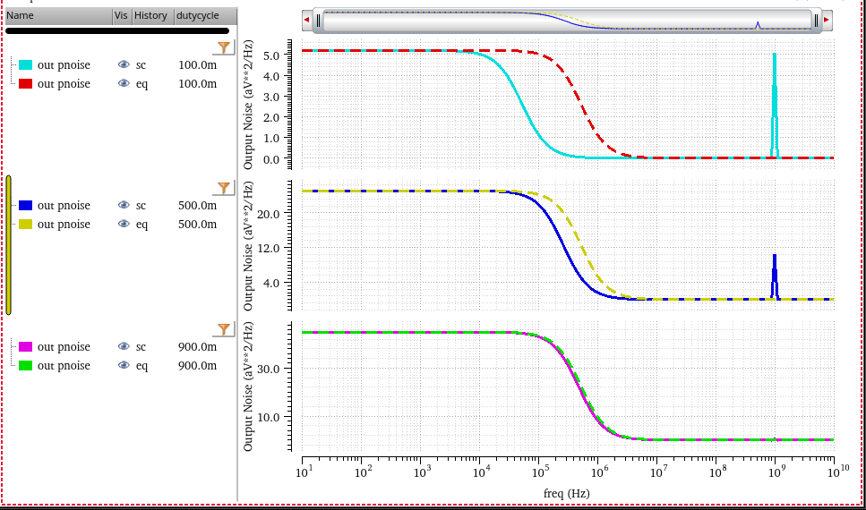

- sc: harmonic distortion
- eq: no harmonic distortion

## reference

Alan V Oppenheim, Ronald W. Schafer. Discrete-Time Signal Processing, 3rd edition [[pdf](https://file.fouladi.ir/courses/dsp/books/%28Prentice-Hall%20Signal%20Processing%20Series%29%20Alan%20V.%20Oppenheim%2C%20Ronald%20W.%20Schafer-Discrete-Time%20Signal%20Processing-Prentice%20Hall%20%282009%29.pdf)]

R. E. Ziemer and W. H. Tranter, Principles of Communications, 7th ed., Wiley, 2013 [[pdf](https://physicaeducator.wordpress.com/wp-content/uploads/2018/03/principles-of-communications-7th-edition-ziemer.pdf)]

John G. Proakis and Masoud Salehi, Fundamentals of communication systems 2nd ed [[pdf](http://www.pce-fet.com/common/library/books/51/9492_[John_G._Proakis,_Masoud_Salehi]_Fundamentals_of_C(b-ok.org).pdf)]

Rhee, W. and Yu, Z., 2024. *Phase-Locked Loops: System Perspectives and Circuit Design Aspects*. John Wiley & Sons

Phillips, Joel R. and Kenneth S. Kundert. "Noise in mixers, oscillators, samplers, and logic: an introduction to cyclostationary noise." Proceedings of the IEEE 2000 Custom Integrated Circuits Conference. [[pdf](https://designers-guide.org/theory/cyclo-paper.pdf), [slides](https://designers-guide.org/theory/cyclo-preso.pdf)]

Kundert, Ken. (2006). Simulating Switched-Capacitor Filters with SpectreRF.  URL:[https://designers-guide.org/analysis/sc-filters.pdf](https://designers-guide.org/analysis/sc-filters.pdf)

STEADY-STATE AND CYCLO-STATIONARY RTS NOISE IN MOSFETS [[https://ris.utwente.nl/ws/portalfiles/portal/6038220/thesis-Kolhatkar.pdf](https://ris.utwente.nl/ws/portalfiles/portal/6038220/thesis-Kolhatkar.pdf)]

Christian-Charles Enz. "High precision CMOS micropower amplifiers" [[pdf](https://picture.iczhiku.com/resource/eetop/wYItQFykkAQDFccB.pdf)]
