## AM, PM (asymmetric sideband)

> The spectrum of the narrowband FM signal is very similar to that of an amplitude modulation (AM) signal but has the **phase reversal** for the other sideband component

Assume the modulation frequency of PM and AM are **same**, $\omega_m$

$$\begin{align}
x(t) &= (1+A_m\cos{\omega_m t})\cos(\omega_0 t + P_m \sin\omega_m t) \\
&= \cos(\omega_0 t + P_m \sin\omega_m t) + A_m\cos{\omega_m t}\cos(\omega_0 t + P_m \sin\omega_m t) \\
&= X_{pm}(t) + X_{apm}(t)
\end{align}$$

$X_{pm}(t)$, **PM only** part
$$
X_{pm}(t) = \cos\omega_0 t - \frac{P_m}{2}\cos(\omega_0 - \omega_m)t + \frac{P_m}{2}\cos(\omega_0 + \omega_m)t
$$
$X_{apm}(t)$, **AM & PM part**
$$\begin{align}
X_{apm}(t) &= A_m \cos{\omega_m t} (\cos\omega_0 t-P_m\sin\omega_m t\sin\omega_0 t) \\
&= \frac{A_m}{2}[\cos(\omega_0 + \omega_m)t + \cos(\omega_0 -\omega_m)t] - \frac{A_mP_m}{2}\sin(2\omega_m t)\sin(\omega_0 t) \\
&= \frac{A_m}{2}\cos(\omega_0 + \omega_m)t + \frac{A_m}{2}\cos(\omega_0 -\omega_m)t - \frac{A_mP_m}{4}\cos(\omega_0 - 2\omega_m)t + \frac{A_mP_m}{4}\cos(\omega_0 + 2\omega_m)t
\end{align}$$

That is
$$\begin{align}
x(t) &=  \cos\omega_0 t + \frac{A_m-P_m}{2}\cos(\omega_0 - \omega_m)t + \frac{A_m+P_m}{2}\cos(\omega_0 + \omega_m)t \\
&\space\space\space\space\space\space\space\space\space\space\space\space\space\space\space\space\space\space - \frac{A_mP_m}{4}\cos(\omega_0 - 2\omega_m)t + \frac{A_mP_m}{4}\cos(\omega_0 + 2\omega_m)t
\end{align}$$

For general case, $x(t) = (1+A_m\cos{\omega_{am} t})\cos(\omega_0 t + P_m \sin\omega_{pm} t)$, i.e., PM is $\omega_{pm}$, AM is $\omega_{am}$

$$\begin{align}
x(t) &=  \cos\omega_0 t - \frac{P_m}{2}\cos(\omega_0 - \omega_{pm})t + \frac{P_m}{2}\cos(\omega_0 + \omega_{pm})t \\
&\space\space\space\space\space\space\space\space\space\space\space\space\space\space\space\space\space\space + \frac{A_m}{2}\cos(\omega_0 - \omega_{am})t + \frac{A_m}{2}\cos(\omega_0 + \omega_{am})t \\
&\space\space\space\space\space\space\space\space\space\space\space\space\space\space\space\space\space\space - \frac{A_mP_m}{4}\cos(\omega_0 - \omega_{pm}-\omega_{am})t + \frac{A_mP_m}{4}\cos(\omega_0 + \omega_{pm}+\omega_{am})t \\
&\space\space\space\space\space\space\space\space\space\space\space\space\space\space\space\space\space\space + \frac{A_mP_m}{4}\cos(\omega_0 + \omega_{pm}-\omega_{am})t - \frac{A_mP_m}{4}\cos(\omega_0 - \omega_{pm}+\omega_{am})t
\end{align}$$

Therefore, sideband is **asymmetric** if $\omega_{pm} = \omega_{am}$ **same**

> Ken Kundert, Measuring AM, PM & FM Conversion with SpectreRF [[https://designers-guide.org/analysis/am-pm-conv.pdf](https://designers-guide.org/analysis/am-pm-conv.pdf)]

---

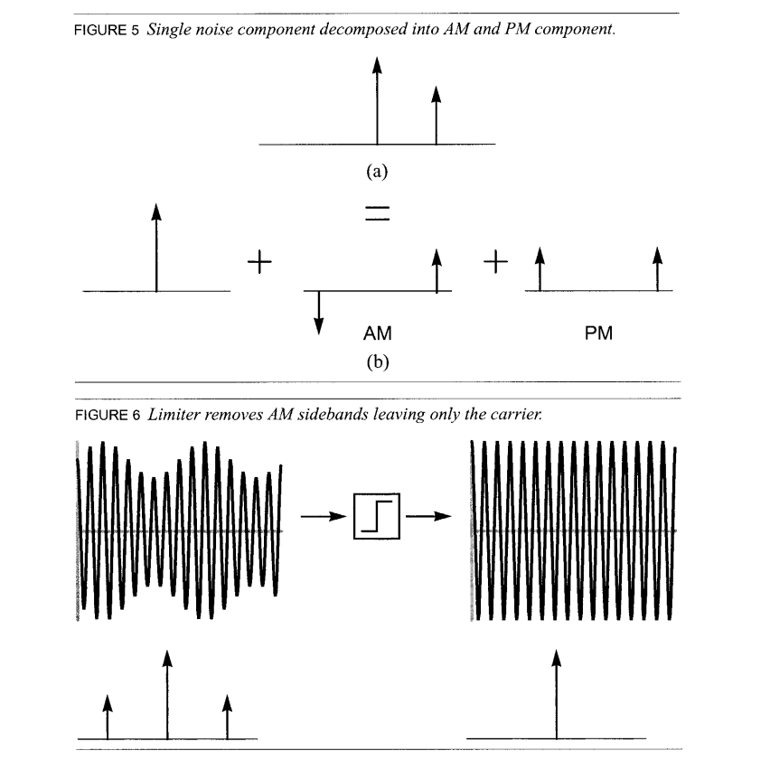

> Emad Hegazi , Jacob Rael , Asad Abidi, 2005. The Designer's Guide to High-Purity Oscillators [[https://picture.iczhiku.com/resource/eetop/whkgGLPAHoORYxbC.pdf](https://picture.iczhiku.com/resource/eetop/whkgGLPAHoORYxbC.pdf)]

## AN-PN Conversion

> G. Giust, Influence of Noise Processes on Jitter and Phase Noise Measurements [[https://www.signalintegrityjournal.com/articles/800-influence-of-noise-processes-on-jitter-and-phase-noise-measurements](https://www.signalintegrityjournal.com/articles/800-influence-of-noise-processes-on-jitter-and-phase-noise-measurements)]
>
> —. "Methodologies for PCIe5 Refclk Jitter Analysis,", PCI-SIG Electrical Workgroup Meeting (Jan. 19, 2018)
>
> —. How to Identify the Source of Phase Jitter through Phase Noise Plots [[https://www.sitime.com/company/newsroom/blog/how-identify-source-phase-jitter-through-phase-noise-plots](https://www.sitime.com/company/newsroom/blog/how-identify-source-phase-jitter-through-phase-noise-plots)]
>
> AN10072 Determine the Dominant Source of Phase Noise, by Inspection [[https://www.sitime.com/support/resource-library/application-notes/an10072-determine-dominant-source-phase-noise-inspection](https://www.sitime.com/support/resource-library/application-notes/an10072-determine-dominant-source-phase-noise-inspection)]

### phase noise analyzer vs spectrum analyzer

*TODO* &#128197;

### Phasor representation

> Timing 201 #1: The Case of the Phase Noise That Wasn't - Part 1 [[https://community.silabs.com/s/share/a5U1M000000knpiUAA/timing-201-1-the-case-of-the-phase-noise-that-wasnt-part-1?](https://community.silabs.com/s/share/a5U1M000000knpiUAA/timing-201-1-the-case-of-the-phase-noise-that-wasnt-part-1?)]

> [[https://en.lntwww.de/Modulation_Methods/Single-Sideband_Modulation](https://en.lntwww.de/Modulation_Methods/Single-Sideband_Modulation)]

## Narrowband FM Approximation

$$
y(t) = A\cos(2\pi f_0t+\phi_n(t)) \approx A \cos(2\pi f_0 t) - A \phi_n (t)\sin(2\pi f_0 t)
$$

$$
R_x(\tau) = \frac{A^2}{2}\cos(2\pi f_0\tau) +  \frac{A^2}{2}R_\phi(\tau)\cos(2\pi f_0\tau)
$$
The PSD of the signal x(t) is given by
$$
S_x(f) = \mathcal{F}\{R_x(\tau)\} = \frac{P_c}{2}\left[\delta(f+f_0)+\delta(f-f_0)\right]+\frac{P_c}{2}\left[S_\phi(f+f_0)+S_\phi(f-f_0)\right]
$$
where $P_c = A^2/2$ is the carrier power of the signal

## Modulation of WSS process

> Balu Santhanam, Probability Theory & Stochastic Process 2020: [Modulation of Random Processes](https://ece-research.unm.edu/bsanthan/ece541/mod.pdf)

### modulated with a random cosine

### modulated with a deterministic cosine

---

> Hayder Radha, ECE 458 Communications Systems Laboratory Spring 2008: Lecture 7 - EE 179: Introduction to Communications - Winter 2006–2007 [Energy and Power Spectral Density and Autocorrelation](https://www.egr.msu.edu/classes/ece458/radha/ss07Keyur/Lab-Handouts/PSDESDetc.pdf)

---

## Sampling of WSS process

> Balu Santhanam, Probability Theory & Stochastic Process 2020: [Impulse sampling of Random Processes](https://ece-research.unm.edu/bsanthan/ece541/impulse_sampling_of_random_signals.pdf)

### DT sequence $x[n]$

---

### impulse train $x_s(t)$

That is
$$
P_{x_s x_s} (f)= \frac{1}{T_s^2}P_{xx}(f)
$$
where $x[n]$ is sampled discrete-time sequence, $x_s(t)$ is sampled impulse train

### Noise Aliasing

*apply foregoing observation*

## Cyclostationary Noise (Modulated Noise)

> [[https://ece-research.unm.edu/bsanthan/ece541/cyclo.pdf](https://ece-research.unm.edu/bsanthan/ece541/cyclo.pdf)]
>
> Chembian Thambidurai, "Power Spectral Density of Pulsed Noise Signals" [[link](https://www.linkedin.com/posts/chembiyan-t-0b34b910_psd-of-pulsed-noise-signal-activity-6992527460886040577-a0im?utm_source=share&utm_medium=member_desktop)]

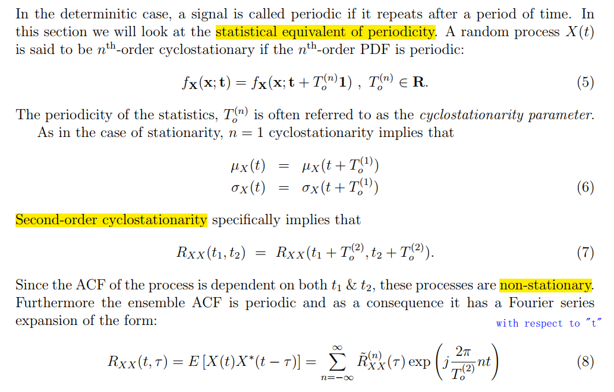

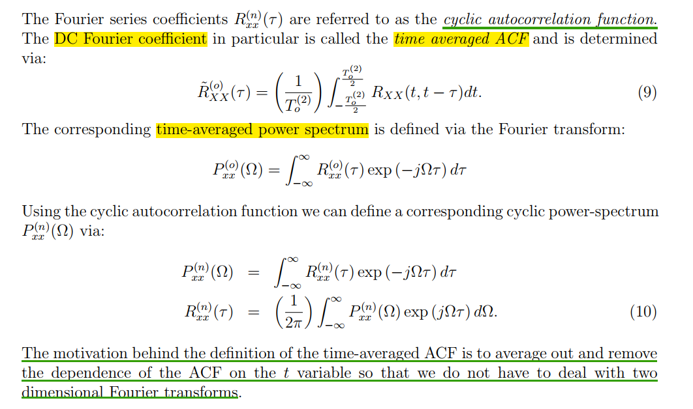

> 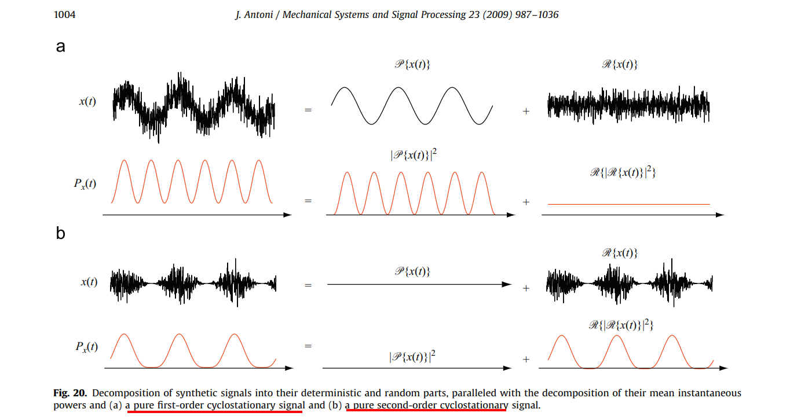

### White Noise Modulation

> Noisy Resistor & Clocked Switch

$$
v_t (t) = v_i(t)\cdot m_t(t)
$$
where  $v_i(t)$ is input *white* noise, whose autocorrelation is $A\delta(\tau)$, and $m_t(t)$ is periodically operating switch, then autocorrelation of $v_t(t)$
$$\begin{align}
R_t (t_1, t_2) &= E[v_t(t_1)\cdot v_t(t_2)] \\
&= R_i(t_1, t_2)\cdot  m_t(t_1)m_t(t_2)
\end{align}$$

Then
$$\begin{align}
R_t(t, t-\tau) &= R_i(\tau)\cdot m_t(t)m_t(t-\tau) \\
& = A\delta(\tau) \cdot m_t(t)m_t(t-\tau) \\
& = A\delta(\tau) \cdot m_t(t)
\end{align}$$
Because $m_t(t)=m_t(t+T)$, $R_t(t, t-\tau)$ is is periodic in the variable $t$ with period $T$

The time-averaged ACF is denoted as $\tilde{R_t}(\tau)$

$$
\tilde{R}_{t}(\tau) = m\cdot A\delta(\tau)
$$
That is,
$$
S_t(f) = m\cdot S_{A}(f)
$$

---

> 

### Colored Noise Modulation

$$
\tilde{R_t}(\tau) = R_i(\tau)\cdot m_{tac}(\tau)
$$

where $m_t(t)m_t(t-\tau)$ averaged on $t$  is denoted as $m_{tac}(\tau)$ or $\overline{m_t(t)m_t(t-\tau)}$

The DC value of $m_{tac}(\tau)$ can be calculated as below

1. for $m\le 0.5$, the DC value of $m_{tac}(\tau)$
   $$
   \frac{m\cdot mT}{T} = m^2
   $$

2. for $m\gt 0.5$, the DC value of $m_{tac}(\tau)$
   $$
   \frac{(m+2m-1)(1-m)T + (2m-1)\{mT -(1-m)T\}}{T} = m^2
   $$
   

Therefore, time-average power spectral density and total power are *scaled by $m^2$ in fundamental frequency sideband*

---

>

---

### Switched-Capacitor Track signal

#### track signal pnoise (sc)

zoom in first harmonic by linear step of pnoise

> decreasing the rising/falling time of clock, the harmonics still retain

#### equivalent circuit for pnoise (eq)

1. thermal noise of R is *modulated at first*
2. *then filtered* by ideal filter

---

#### sc vs eq

- sc: harmonic distortion
- eq: no harmonic distortion

## Non-Stationary Processes

> T. Sepke, P. Holloway, C. G. Sodini and H. -S. Lee, "Noise Analysis for Comparator-Based Circuits," in IEEE Transactions on Circuits and Systems I: Regular Papers, vol. 56, no. 3, pp. 541-553, March 2009 [[https://dspace.mit.edu/bitstream/handle/1721.1/61660/Speke-2009-Noise%20Analysis%20for%20Comparator-Based%20Circuits.pdf](https://dspace.mit.edu/bitstream/handle/1721.1/61660/Speke-2009-Noise%20Analysis%20for%20Comparator-Based%20Circuits.pdf)]
>
> Sepke, Todd. "Comparator design and analysis for comparator-based switched-capacitor circuits." (2006). [[https://dspace.mit.edu/handle/1721.1/38925](https://dspace.mit.edu/handle/1721.1/38925)]

### Wide-Sense-Stationary Noise

Much like sinusoidal-steady-state signal analysis, **steady-state noise** analysis methods assume an input $x(t)$ of **infinite duration**, which is a **Wide-Sense Stationary (WSS) random process**

#### Frequency-domain Analysis

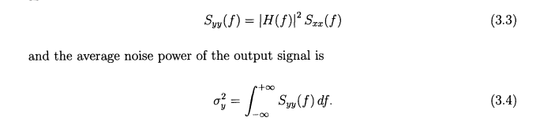

#### Time-domain Analysis

The output $y(t)$ of a linear time-invariant (LTI) system $h(t)$ 
$$\begin{align}
R_{yy}(\tau) &= R_{xx}(\tau)*[h(\tau)*h(-\tau)] \\
&= S_{xx}(0)\delta(\tau) * [h(\tau)*h(-\tau)] \\
&= S_{xx}(0)[h(\tau)*h(-\tau)] \\
&= S_{xx}(0) \int_\alpha h(\alpha)h(\alpha-\tau)d\alpha
\end{align}$$

with WSS white noise input $x(t)$, $R_{xx}(\tau)=S_{xx}(0)\delta(\tau)$, therefore

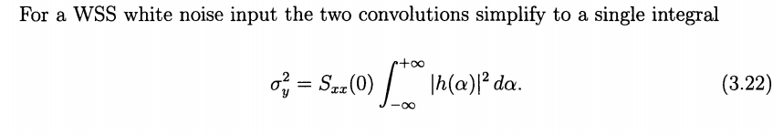

### Non-stationary Noise

Assuming the noise applied duration is much less than the time constant, the *output voltage does not reach steady-state and WSS noise analysis does not apply*

> In order to determine the response of an LTI system to a **step noise input**, the problem is *more conveniently solved in the time-domain*

input signal: step ramp input

noise current: step

#### Time-domain Analysis

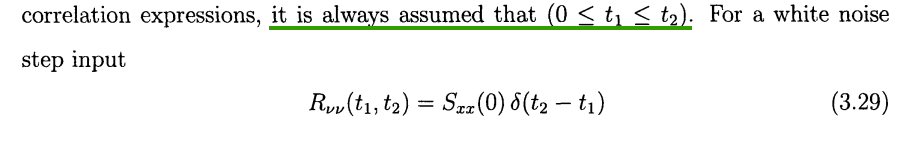

The step noise input $x(t) = \nu(t)u(t)$
$$
R_{xx}(t_1,t_2) = E[x(t_1)x(t_2)] = R_{\nu\nu}(t_1, t_2)u(t_1)u(t_2)=R_{\nu\nu}(t_1, t_2)
$$
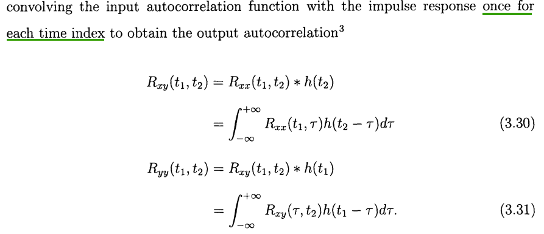

>$$
>R_{xy}(t_1, t_2) = E[x(t_1)y(t_2)] = E[x(t_1)(x(t_2)*h(t_2))] = E(x(t_1)x(t_2))*h(t_2) = R_{xx}(t_1,t_2)*h(t_2)
>$$
>
>$$
>R_{yy}(t_1,t_2) = E[y(t_1)y(t_2)] = E[(x(t_1)*h(t_1))y(t_2)] = E[x(t_1)y(t_2)]*h(t_1)=R_{xy}(t_1,t_2)*h(t_1)
>$$

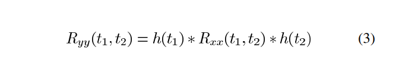

> the absolute value of each time index is important for a non-stationary signal, and only the time difference was important for WSS signals

 $$\begin{align}
R_{yy}(t_1,t_2) &= h(t_1)*R_{\nu\nu}(t_1, t_2)*h(t_2) \\
&= h(t_1)*S_{xx}(0)\delta(t_2-t_1)*h(t_2) \\
&=S_{xx}(0) h(t_1)*(\delta(t_2-t_1)*h(t_2)) \\
&= S_{xx}(0)h(t_1)*h(t_2-t_1) \\
&= S_{xx}(0)\int_\tau h(\tau)h(t_2-t_1+\tau))d\tau
\end{align}$$

That is
$$
\sigma^2_y (t)= R_{yy}(t_1,t_2)|_{t_1=t_2=t}=S_{xx}(0)\int_{-\infty}^t |h(\tau)|^2d\tau
$$

> $t$, the upper limit of integration is just intuitive,  which lacks strict derivation
>
> Because stable systems have impulse responses that decay to *zero* as time goes to *infinity*, **the output noise variance approaches the WSS result as time approaches infinity**  

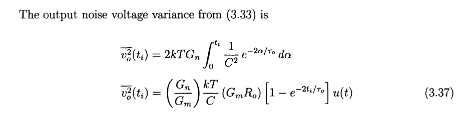

#### Frequency-domain Analysis  

Because the definition of the PSD assumes that the variance of the noise process is independent of time, the PSD of a non-stationary process is not very meaningful

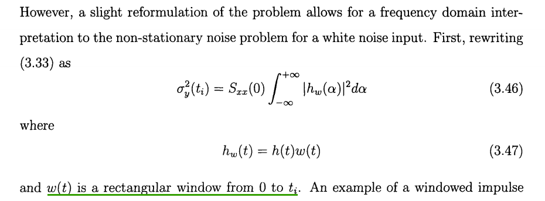

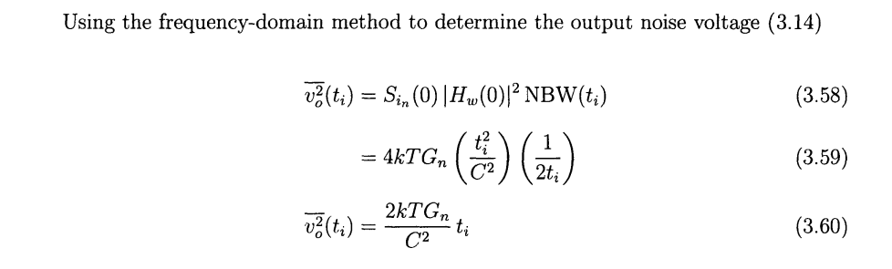

> Richard Schreier. ECE1371 Advanced Analog Circuits Lecture 8 - COMPARATOR & FLASH ADC DESIGN [[http://individual.utoronto.ca/schreier/lectures/2015/8-6.pdf](http://individual.utoronto.ca/schreier/lectures/2015/8-6.pdf)]
>
> 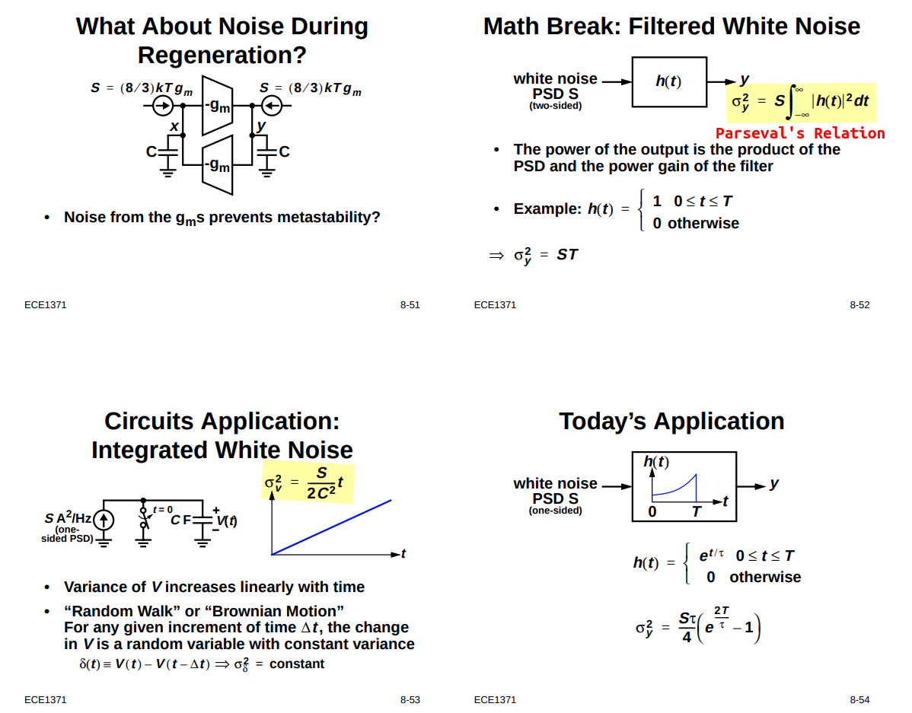
>
> 
> $$
> R_{yy}(0) = \frac{1}{2\pi}\int_{-\infty}^{\infty}|H(\omega)|^2S_{xx}(\omega)d\omega = S \cdot \frac{1}{2\pi}\int_{-\infty}^{\infty}|H(\omega)|^2d\omega \overset{\text{Parseval's Relation}}{=} S\cdot \int_{-\infty}^{\infty}|h(t)|^2dt
> $$

#### Input Referred Noise  

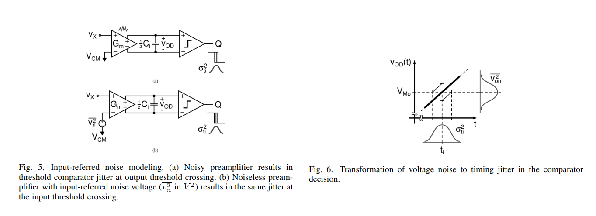

***Noise Voltage to Timing Jitter Conversion & noise gain***

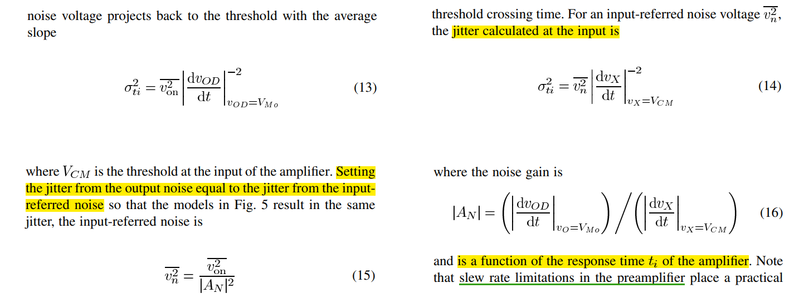

with a step ramp input  $v_X(t) = Mtu(t)$

The **noise gain** is
$$
|A_N(t_i)| = A_0 (1-e^{t_i/\tau_o})u(t)
$$
where $t_i$ is crossing time of ideal threshold comparator  
$$\begin{align}
\overline{v_n^2} &= \frac{\overline{v_{on}^2}}{|A_N|^2} \\
&= \frac{G_n}{G_m}\frac{kT}{C}\frac{1}{A_0}\frac{1+e^{-t_i/\tau_o}}{1-e^{-t_i/\tau_o}} \\
&=4kT\frac{G_n}{G_m^2}\frac{1}{4R_oC} \coth(\frac{t_i}{2\tau_o}) \\
&= 4kTR_n\frac{1}{4\tau_o} \coth(\frac{t_i}{2\tau_o})
\end{align}$$

where $R_n = \frac{G_n}{G_m^2}$, the equivalent thermal noise resistance

> 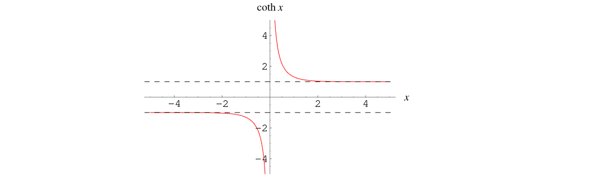

## reference

Alan V Oppenheim, Ronald W. Schafer. Discrete-Time Signal Processing, 3rd edition [[pdf](https://file.fouladi.ir/courses/dsp/books/%28Prentice-Hall%20Signal%20Processing%20Series%29%20Alan%20V.%20Oppenheim%2C%20Ronald%20W.%20Schafer-Discrete-Time%20Signal%20Processing-Prentice%20Hall%20%282009%29.pdf)]

R. E. Ziemer and W. H. Tranter, Principles of Communications, 7th ed., Wiley, 2013 [[pdf](https://physicaeducator.wordpress.com/wp-content/uploads/2018/03/principles-of-communications-7th-edition-ziemer.pdf)]

John G. Proakis and Masoud Salehi, Fundamentals of communication systems 2nd ed [[pdf](http://www.pce-fet.com/common/library/books/51/9492_[John_G._Proakis,_Masoud_Salehi]_Fundamentals_of_C(b-ok.org).pdf)]

Rhee, W. and Yu, Z., 2024. *Phase-Locked Loops: System Perspectives and Circuit Design Aspects*. John Wiley & Sons

Phillips, Joel R. and Kenneth S. Kundert. "Noise in mixers, oscillators, samplers, and logic: an introduction to cyclostationary noise." Proceedings of the IEEE 2000 Custom Integrated Circuits Conference. [[pdf](https://designers-guide.org/theory/cyclo-paper.pdf), [slides](https://designers-guide.org/theory/cyclo-preso.pdf)]

Antoni, J., "Cyclostationarity by examples", <i>Mechanical Systems and Signal Processing</i>, vol. 23, no. 4, pp. 987–1036, 2009 [[https://docente.unife.it/docenti/dleglc/a-a-2010-2011-dmsm/ciclostazionarieta.pdf](https://docente.unife.it/docenti/dleglc/a-a-2010-2011-dmsm/ciclostazionarieta.pdf)]

Kundert, Ken. (2006). Simulating Switched-Capacitor Filters with SpectreRF.  URL:[https://designers-guide.org/analysis/sc-filters.pdf](https://designers-guide.org/analysis/sc-filters.pdf)

STEADY-STATE AND CYCLO-STATIONARY RTS NOISE IN MOSFETS [[https://ris.utwente.nl/ws/portalfiles/portal/6038220/thesis-Kolhatkar.pdf](https://ris.utwente.nl/ws/portalfiles/portal/6038220/thesis-Kolhatkar.pdf)]

Christian-Charles Enz. "High precision CMOS micropower amplifiers" [[pdf](https://picture.iczhiku.com/resource/eetop/wYItQFykkAQDFccB.pdf)]

