## asymmetric sideband

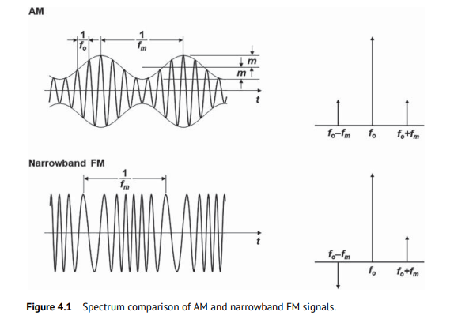

> The spectrum of the narrowband FM signal is very similar to that of an amplitude modulation (AM) signal but has the **phase reversal** for the other sideband component

Assume the modulation frequency of PM and AM are same, $\omega_m$

$$\begin{align}
x(t) &= (1+A_m\cos{\omega_m t})\cos(\omega_0 t + P_m \sin\omega_m t) \\
&= \cos(\omega_0 t + P_m \sin\omega_m t) + A_m\cos{\omega_m t}\cos(\omega_0 t + P_m \sin\omega_m t) \\
&= X_{pm}(t) + X_{apm}(t)
\end{align}$$

$X_{pm}(t)$, PM only part
$$
X_{pm}(t) = \cos\omega_0 t - \frac{P_m}{2}\cos(\omega_0 - \omega_m)t + \frac{P_m}{2}\cos(\omega_0 + \omega_m)t
$$
$X_{apm}(t)$, AM & PM part
$$\begin{align}
X_{apm}(t) &= A_m \cos{\omega_m t} (\cos\omega_0 t-P_m\sin\omega_m t\sin\omega_0 t) \\
&= \frac{A_m}{2}[\cos(\omega_0 + \omega_m)t + \cos(\omega_0 -\omega_m)t] - \frac{A_mP_m}{2}\sin(2\omega_m t)\sin(\omega_0 t) \\
&= \frac{A_m}{2}\cos(\omega_0 + \omega_m)t + \frac{A_m}{2}\cos(\omega_0 -\omega_m)t - \frac{A_mP_m}{4}\cos(\omega_0 - 2\omega_m)t + \frac{A_mP_m}{4}\cos(\omega_0 + 2\omega_m)t
\end{align}$$

That is
$$\begin{align}
x(t) &=  \cos\omega_0 t + \frac{A_m-P_m}{2}\cos(\omega_0 - \omega_m)t + \frac{A_m+P_m}{2}\cos(\omega_0 + \omega_m)t \\
&\space\space\space\space\space\space\space\space\space\space\space\space\space\space\space\space\space\space - \frac{A_mP_m}{4}\cos(\omega_0 - 2\omega_m)t + \frac{A_mP_m}{4}\cos(\omega_0 + 2\omega_m)t
\end{align}$$

For general case, $x(t) = (1+A_m\cos{\omega_{am} t})\cos(\omega_0 t + P_m \sin\omega_{pm} t)$, i.e., PM is $\omega_{pm}$, AM is $\omega_{am}$

$$\begin{align}
x(t) &=  \cos\omega_0 t - \frac{P_m}{2}\cos(\omega_0 - \omega_{pm})t + \frac{P_m}{2}\cos(\omega_0 + \omega_{pm})t \\
&\space\space\space\space\space\space\space\space\space\space\space\space\space\space\space\space\space\space + \frac{A_m}{2}\cos(\omega_0 - \omega_{am})t + \frac{A_m}{2}\cos(\omega_0 + \omega_{am})t \\
&\space\space\space\space\space\space\space\space\space\space\space\space\space\space\space\space\space\space - \frac{A_mP_m}{4}\cos(\omega_0 - \omega_{pm}-\omega_{am})t + \frac{A_mP_m}{4}\cos(\omega_0 + \omega_{pm}+\omega_{am})t \\
&\space\space\space\space\space\space\space\space\space\space\space\space\space\space\space\space\space\space + \frac{A_mP_m}{4}\cos(\omega_0 + \omega_{pm}-\omega_{am})t - \frac{A_mP_m}{4}\cos(\omega_0 - \omega_{pm}+\omega_{am})t
\end{align}$$

Therefore, sideband is asymmetric if $\omega_{pm} = \omega_{am}$

> Ken Kundert, Measuring AM, PM & FM Conversion with SpectreRF [[https://designers-guide.org/analysis/am-pm-conv.pdf](https://designers-guide.org/analysis/am-pm-conv.pdf)]

## Modulation of WSS process

> Balu Santhanam, Probability Theory & Stochastic Process 2020: [Modulation of Random Processes](https://ece-research.unm.edu/bsanthan/ece541/mod.pdf)

### modulated with a random cosine

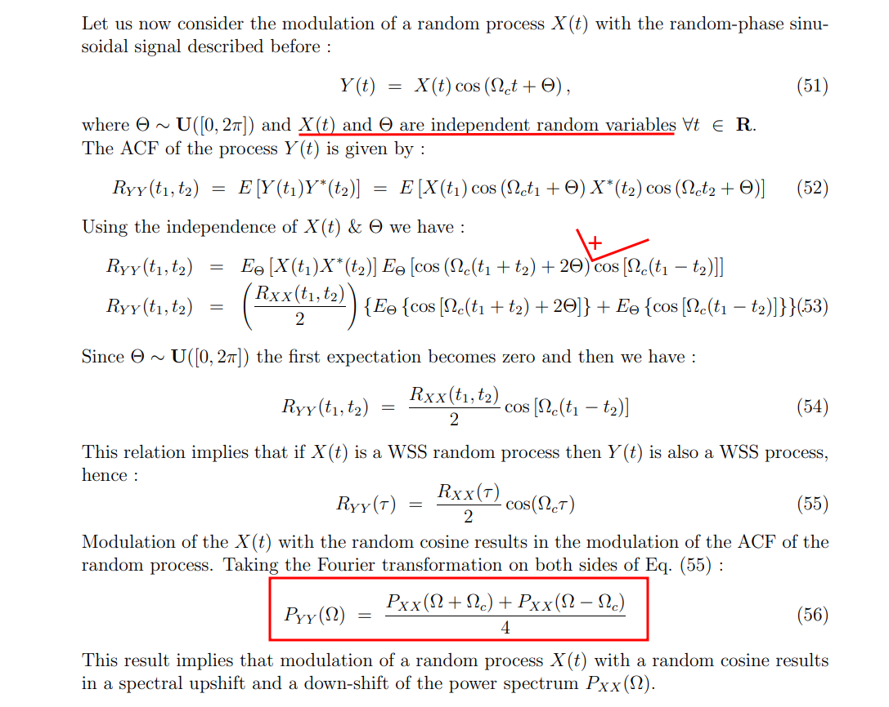

### modulated with a deterministic cosine

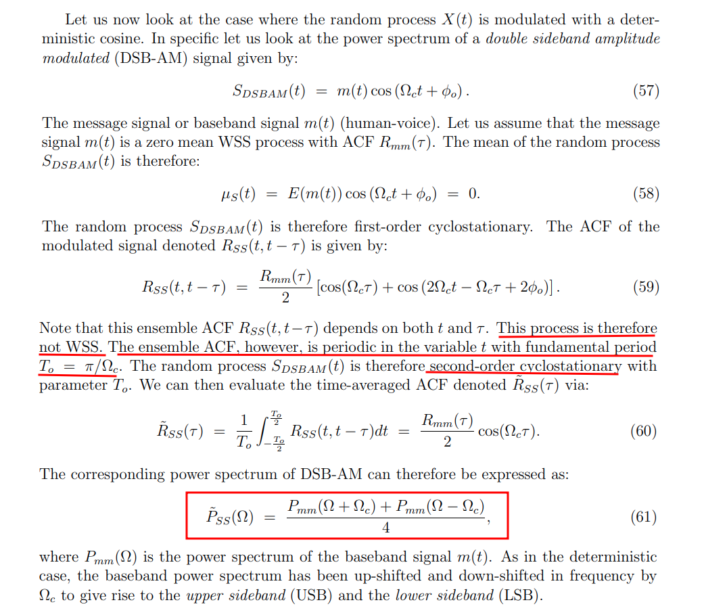

---

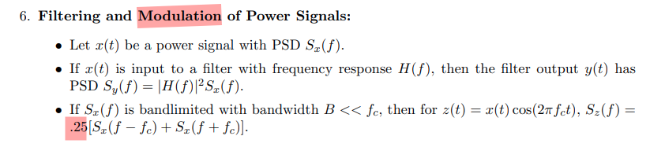

> Hayder Radha, ECE 458 Communications Systems Laboratory Spring 2008: Lecture 7 - EE 179: Introduction to Communications - Winter 2006–2007 [Energy and Power Spectral Density and Autocorrelation](https://www.egr.msu.edu/classes/ece458/radha/ss07Keyur/Lab-Handouts/PSDESDetc.pdf)

---

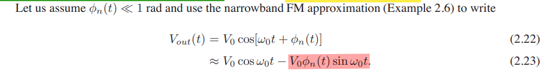

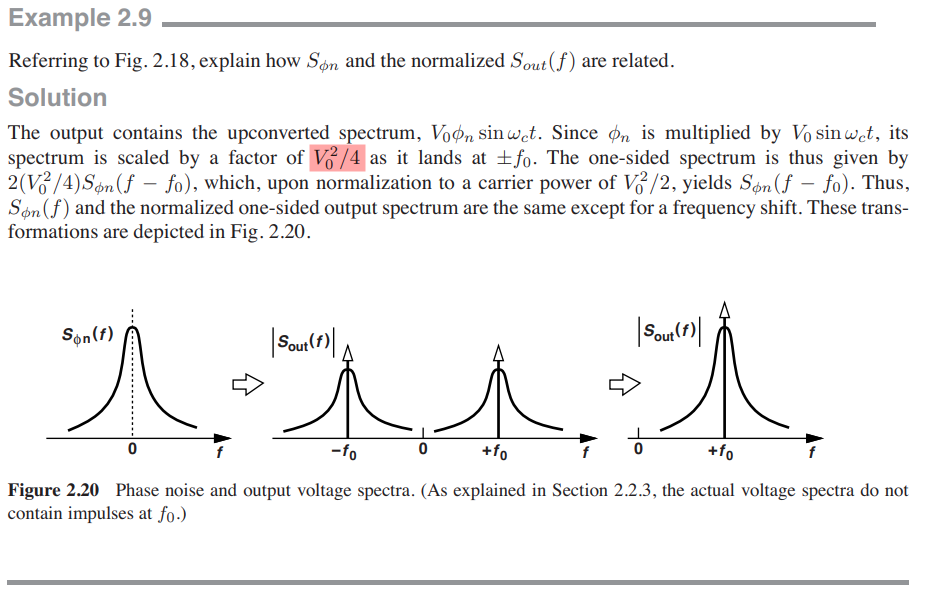

## Sampling of WSS process

> Balu Santhanam, Probability Theory & Stochastic Process 2020: [Impulse sampling of Random Processes](https://ece-research.unm.edu/bsanthan/ece541/impulse_sampling_of_random_signals.pdf)

### DT sequence $x[n]$

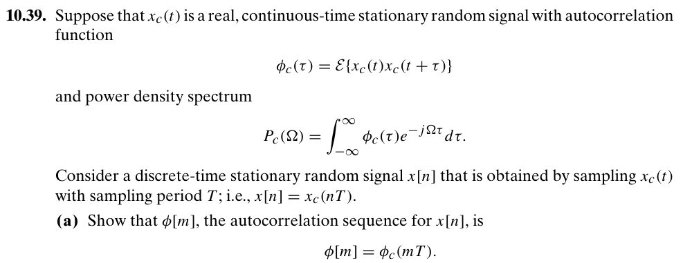

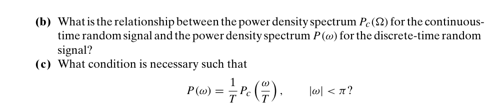

---

### impulse train $x_s(t)$

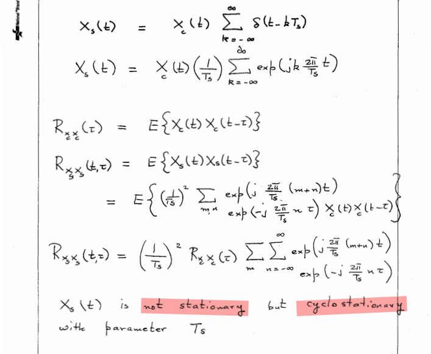

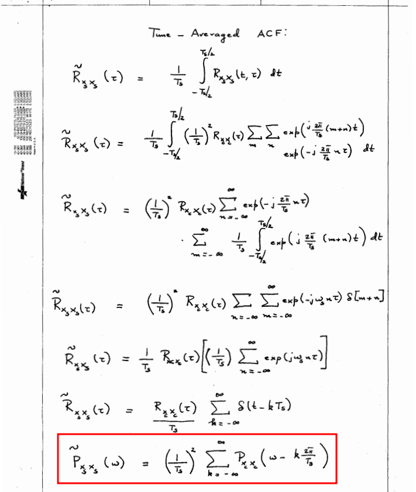

That is
$$
P_{x_s x_s} (f)= \frac{1}{T_s^2}P_{xx}(f)
$$
where $x[n]$ is sampled discrete-time sequence, $x_s(t)$ is sampled impulse train

### Noise Aliasing

*apply foregoing observation*

## Cyclostationary Noise (Modulated Noise)

### track signal noise

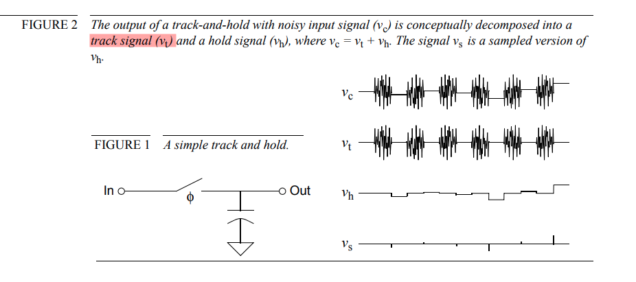

#### White Noise

> Noisy Resistor & Clocked Switch

The track signal ($v_t$), which is cyclostationary, with period $T$
$$
R_{t}(t,\tau) = \left\{ \begin{array}{cl}
A\cdot\delta(\tau) &  \ 0 \leq t \leq mT  \\
0 &  \ mT \lt t \lt T
\end{array} \right.
$$
Then the time-averaged ACF denoted $\tilde{R}_t(\tau)$ via:
$$
\tilde{R}_{t}(\tau) = m\cdot A\cdot\delta(\tau)
$$
That is,
$$
S_t(f) = mS_{A}(f)
$$
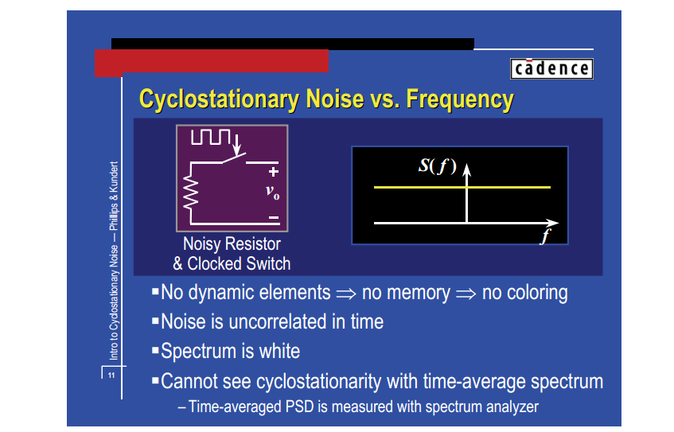

#### Colored Noise

> Noisy Resistor +  & Switched-Capacitor

*TODO* &#128197;

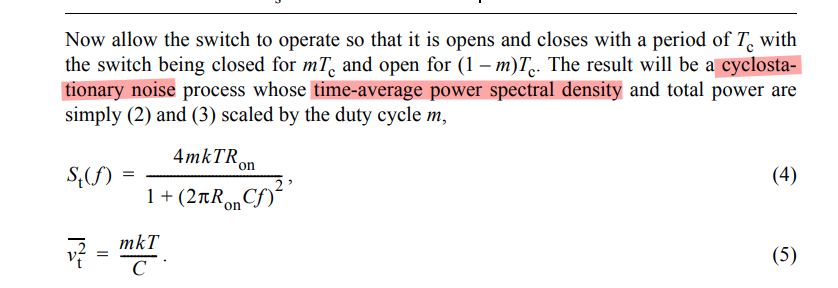

## reference

Alan V Oppenheim, Ronald W. Schafer. Discrete-Time Signal Processing, 3rd edition [[pdf](https://file.fouladi.ir/courses/dsp/books/%28Prentice-Hall%20Signal%20Processing%20Series%29%20Alan%20V.%20Oppenheim%2C%20Ronald%20W.%20Schafer-Discrete-Time%20Signal%20Processing-Prentice%20Hall%20%282009%29.pdf)]

R. E. Ziemer and W. H. Tranter, Principles of Communications, 7th ed., Wiley, 2013 [[pdf](https://physicaeducator.wordpress.com/wp-content/uploads/2018/03/principles-of-communications-7th-edition-ziemer.pdf)]

John G. Proakis and Masoud Salehi, Fundamentals of communication systems 2nd ed [[pdf](http://www.pce-fet.com/common/library/books/51/9492_[John_G._Proakis,_Masoud_Salehi]_Fundamentals_of_C(b-ok.org).pdf)]

Rhee, W. and Yu, Z., 2024. *Phase-Locked Loops: System Perspectives and Circuit Design Aspects*. John Wiley & Sons

Phillips, Joel R. and Kenneth S. Kundert. "Noise in mixers, oscillators, samplers, and logic: an introduction to cyclostationary noise." Proceedings of the IEEE 2000 Custom Integrated Circuits Conference. [[pdf](https://designers-guide.org/theory/cyclo-paper.pdf), [slides](https://designers-guide.org/theory/cyclo-preso.pdf)]

STEADY-STATE AND CYCLO-STATIONARY RTS NOISE IN MOSFETS [[https://ris.utwente.nl/ws/portalfiles/portal/6038220/thesis-Kolhatkar.pdf](https://ris.utwente.nl/ws/portalfiles/portal/6038220/thesis-Kolhatkar.pdf)]
