## Modulation of WSS process

> Balu Santhanam, Probability Theory & Stochastic Process 2020: [[Modulation of Random Processes](https://ece-research.unm.edu/bsanthan/ece541/mod.pdf)]
>
> Chembian Thambidurai, "Power Spectral Density of Pulsed Noise Signals" [[link](https://www.linkedin.com/posts/chembiyan-t-0b34b910_psd-of-pulsed-noise-signal-activity-6992527460886040577-a0im?utm_source=share&utm_medium=member_desktop)]

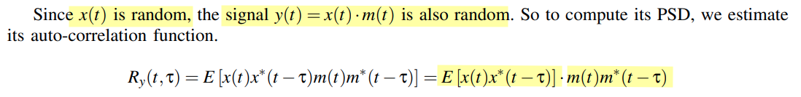

| Case                                         | Signal                             | Carrier phase                                        | Ensemble ACF                                                 | Stationarity                 | PSD / averaged PSD                                           |
| -------------------------------------------- | ---------------------------------- | ---------------------------------------------------- | ------------------------------------------------------------ | ---------------------------- | ------------------------------------------------------------ |
| **Oscillator with small random phase noise** | $v(t)=A\sin(\omega_0t+\varphi(t))$ | fixed carrier $\omega_0t$, small random $\varphi(t)$ | $\displaystyle R_v(t,\tau)$ contains terms like $\cos(2\omega_0t+\omega_0\tau)$ | **Cyclostationary**, not WSS | Time-averaged: $\displaystyle S_v(f)=\frac{A^2}{4}\left[\delta(f-f_0)+\delta(f+f_0)+S_\varphi(f-f_0)+S_\varphi(f+f_0)\right]$ |
| **Random process × random-phase cosine**     | $Y(t)=X(t)\cos(\Omega_c t+\Theta)$ | $\Theta\sim U[0,2\pi)$                               | $\displaystyle R_{YY}(\tau)=\frac{R_{XX}(\tau)}{2}\cos(\Omega_c\tau)$ | **WSS**, if $X(t)$ is WSS    | $\displaystyle P_{YY}(\Omega)=\frac{P_{XX}(\Omega+\Omega_c)+P_{XX}(\Omega-\Omega_c)}{4}$ |
| **Random process × deterministic cosine**    | $S(t)=m(t)\cos(\Omega_c t+\phi_0)$ | fixed $\phi_0$                                       | $\displaystyle R_{SS}(t,\tau)=\frac{R_{mm}(\tau)}{2}\left[\cos(\Omega_c\tau)+\cos(2\Omega_c t+\Omega_c\tau+2\phi_0)\right]$ | **Cyclostationary**, not WSS | Time-averaged: $\displaystyle \tilde P_{SS}(\Omega)=\frac{P_{mm}(\Omega+\Omega_c)+P_{mm}(\Omega-\Omega_c)}{4}$ |

### modulated with small perturbation

> Nicola Da Dalt , Understanding Jitter and Phase Noise: 3.1.3 Voltage to Excess Phase Transformations: Random Noise

Given $\color{blue}\phi(t)\ll 1$, the autocorrelation still depends on absolute time $t$. Therefore $v(t)$ is **cyclostationary**, and they must take a **time average over one carrier period**.

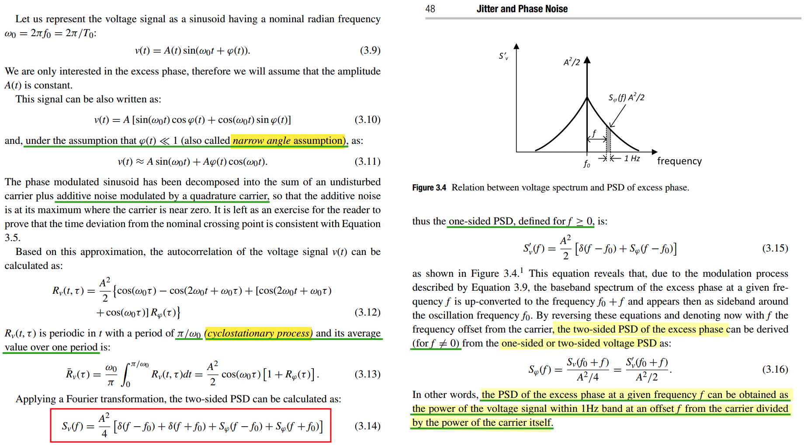

---

> Chembiyan T. Jitter and Phase Noise in Phase Locked Loops [[link](https://www.linkedin.com/posts/chembiyan-t-0b34b910_jitter-and-phase-noise-activity-7031985595304345600-uSx3)]

$$
y(t) = A\cos(2\pi f_0t+\phi_n(t)) \approx A \cos(2\pi f_0 t) - A \phi_n (t)\sin(2\pi f_0 t)
$$

$$
R_x(\tau) = \frac{A^2}{2}\cos(2\pi f_0\tau) +  \frac{A^2}{2}R_\phi(\tau)\cos(2\pi f_0\tau)
$$
The PSD of the signal $x(t)$ is given by
$$
S_x(f) = \mathcal{F}\{R_x(\tau)\} = \frac{P_c}{2}\left[\delta(f+f_0)+\delta(f-f_0)+S_\phi(f+f_0)+S_\phi(f-f_0)\right]
$$
where $P_c = A^2/2$ is the carrier power of the signal

### modulated with full-cycle random

Given $\color{blue}\Theta\sim U[0,2\pi]$, after ensemble averaging, the autocorrelation becomes **WSS**

---

> Haykin, Simon S., and Michael Moher. *Communication Systems*. 5th ed. John Wiley & Sons, 2009. - *Mixing of a Random Process with a Sinusoidal Process*

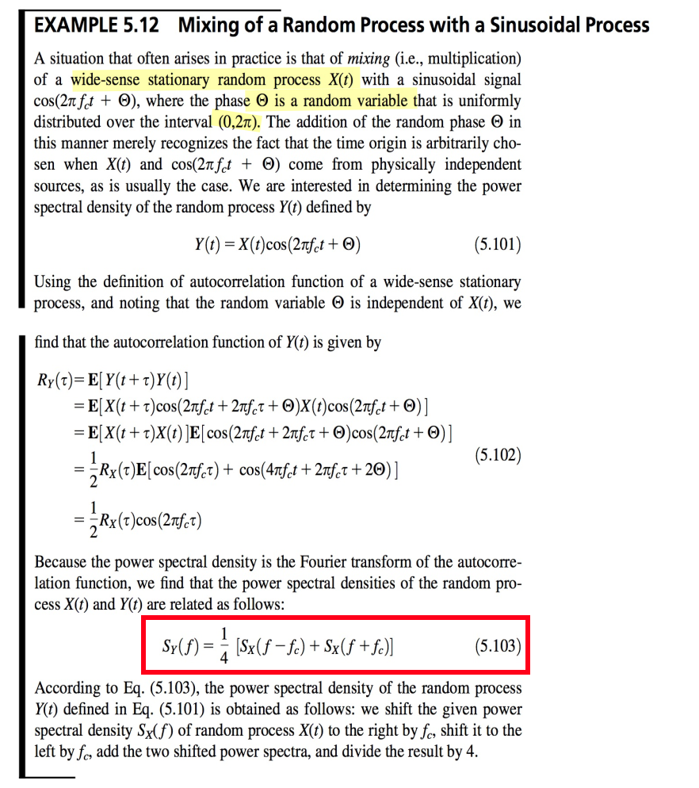

---

---

***sinewaves discrete approximate for continuous white noise***

> A. A. Abidi and D. Murphy, "How to Design a Differential CMOS LC Oscillator," in IEEE Open Journal of the Solid-State Circuits Society, vol. 5, pp. 45-59, 2025 [[https://ieeexplore.ieee.org/stamp/stamp.jsp?arnumber=10818782](https://ieeexplore.ieee.org/stamp/stamp.jsp?arnumber=10818782)]

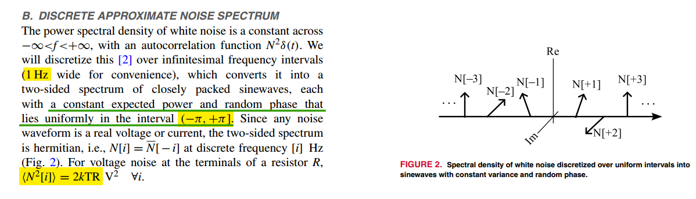

suppose $\color{blue}n(t) = \sum_i N[i]e^{ji\omega_0 t}$ where $\color{blue}N[i] = \sigma\, e^{j\theta_i} \quad \theta_i \ \text{i.i.d. } \mathcal{U}(-\pi, +\pi]$

the three related quantities are:
$$
|N[i]| = \sigma \quad(\text{deterministic}), \qquad \langle N[i]\rangle = \sigma\,\langle e^{j\theta_i}\rangle = 0, \qquad N[i]\,\overline{N[i]} = \sigma e^{j\theta_i}\cdot \sigma e^{-j\theta_i} = \sigma^2.
$$
with the definition of the (ensemble) autocorrelation of a complex process 
$$
R_n(\tau) = \big\langle\, n(t+\tau)\,\overline{n(t)}\,\big\rangle = \sum_i \sum_k \big\langle N[i]\,\overline{N[k]}\big\rangle\, e^{j(i-k)\omega_0 t}\, e^{ji\omega_0 \tau} = \sum_i \sigma^2\, e^{ji\omega_0 \tau}
$$
The delta-function limit is then a Riemann sum: with $\color{blue}\sigma^2 = N^2\Delta f$ and $\omega_0 = 2\pi\Delta f$,
$$
R_n(\tau) = \sum_i N^2\,e^{j2\pi (i\Delta f) \tau}\,\Delta f \;\xrightarrow{\;\Delta f \to 0\;}\; N^2\!\int_{-\infty}^{\infty} e^{j2\pi f\tau}\,df = N^2\delta(\tau),
$$
recovering the ideal white-noise autocorrelation stated in the paper

---

$$
\color{blue}\boxed{
\text{fixed magnitude + uniform phase}
\Rightarrow
\text{approximately Gaussian for many tones}
}
$$

whereas
$$
\boxed{
\text{complex Gaussian coefficients}
\Rightarrow
\text{exactly Gaussian band-limited noise}
}.
$$
If every sinusoid has a fixed amplitude and only its phase is random,
$$
N_k
=
\sqrt{P_k}e^{j\Theta_k},
$$
then a finite sum is not exactly Gaussian. However, when many independent components are added, the time-domain distribution becomes approximately Gaussian by the central limit effect.

For an exactly Gaussian frequency-domain construction, the spectral coefficients should be complex Gaussian:
$$
N_k
=
N_{I,k}+jN_{Q,k},
$$
where
$$
N_{I,k},N_{Q,k}
\sim
\mathcal N(0,\sigma_k^2).
$$
In that case:
$$
\Theta_k\sim\mathcal U(-\pi,\pi],
$$
but the magnitude is also random and has a Rayleigh distribution

---

Assume $\Theta\sim \mathcal U[0,2\pi)$ is a **single random phase that remains constant for all $t$**:
$$
\color{blue}\boxed{X(t)=A\cos(\omega_0t+\Theta).}
$$

***Mean***
$$
\begin{aligned}
m_X(t)
&=\mathbb E[X(t)]\\
&=\frac{A}{2\pi}\int_0^{2\pi}
\cos(\omega_0t+\theta)\,d\theta\\
&=0.
\end{aligned}
$$

Thus, the mean is independent of $t$.

***Autocorrelation***

For $t_1$ and $t_2$,
$$
R_X(t_1,t_2)
=
\mathbb E[X(t_1)X(t_2)].
$$
Using $\cos a\cos b=\frac{1}{2}\left[\cos(a-b)+\cos(a+b)\right],$

we obtain
$$
\begin{aligned}
R_X(t_1,t_2)
&=
\frac{A^2}{2}
\mathbb E\left[
\cos\big(\omega_0(t_1-t_2)\big)
+
\cos\big(\omega_0(t_1+t_2)+2\Theta\big)
\right].
\end{aligned}
$$
Since $\Theta$ is uniform,
$$
\mathbb E\left[
\cos\big(\omega_0(t_1+t_2)+2\Theta\big)
\right]=0.
$$
Therefore,
$$
\boxed{
R_X(t_1,t_2)
=
\frac{A^2}{2}
\cos\big(\omega_0(t_1-t_2)\big)
}
$$
or, defining $\tau=t_1-t_2$,
$$
\boxed{
R_X(\tau)=\frac{A^2}{2}\cos(\omega_0\tau)
}.
$$
The autocorrelation depends only on the time difference $\tau$.

***Is it WSS?***

Yes. The two WSS conditions are satisfied:
$$
m_X(t)=0,
$$
which is constant, and
$$
R_X(t_1,t_2)=R_X(t_1-t_2).
$$
Thus,
$$
\boxed{X(t)\text{ is wide-sense stationary.}}
$$
In fact, because a time shift simply changes the uniformly distributed phase,
$$
X(t+t_0)
=
A\cos\left(\omega_0t+\underbrace{\Theta+\omega_0t_0}_{\text{still uniform modulo }2\pi}\right),
$$
the process is also **strict-sense stationary**.

***Power spectral density***

Using the angular-frequency Fourier-transform convention
$$
S_X(\omega)
=
\int_{-\infty}^{\infty}
R_X(\tau)e^{-j\omega\tau}\,d\tau,
$$
and
$$
\mathcal F\{\cos(\omega_0\tau)\}
=
\pi\left[
\delta(\omega-\omega_0)+\delta(\omega+\omega_0)
\right],
$$
we get
$$
\boxed{
S_X(\omega)
=
\frac{\pi A^2}{2}
\left[
\delta(\omega-\omega_0)
+
\delta(\omega+\omega_0)
\right]
}.
$$
Thus, the PSD consists of two spectral lines at $\omega=\pm\omega_0$.

The total average power is
$$
R_X(0)=\frac{A^2}{2},
$$
and equivalently,
$$
\frac{1}{2\pi}\int_{-\infty}^{\infty}S_X(\omega)\,d\omega
=
\frac{A^2}{2}.
$$
For frequency $f$, where $f_0=\omega_0/(2\pi)$,
$$
\color{blue}\boxed{
S_X(f)
=
\frac{A^2}{4}
\left[
\delta(f-f_0)+\delta(f+f_0)
\right]
}.
$$
The random phase makes the **ensemble stationary**; a sinusoid with a fixed deterministic phase is not normally regarded as a stationary random process because it contains no random ensemble.

### modulated with deterministic cosine

the carrier phase/time origin is fixed, not randomized, it not WSS but **cyclostationary**

---

> Hayder Radha, ECE 458 Communications Systems Laboratory Spring 2008: Lecture 7 - EE 179: Introduction to Communications - Winter 2006–2007 [Energy and Power Spectral Density and Autocorrelation](https://www.egr.msu.edu/classes/ece458/radha/ss07Keyur/Lab-Handouts/PSDESDetc.pdf)

---

### Quadrature-Modulated Processes

> Haykin, Simon S., and Michael Moher. *Communication Systems*. 5th ed. John Wiley & Sons, 2009.

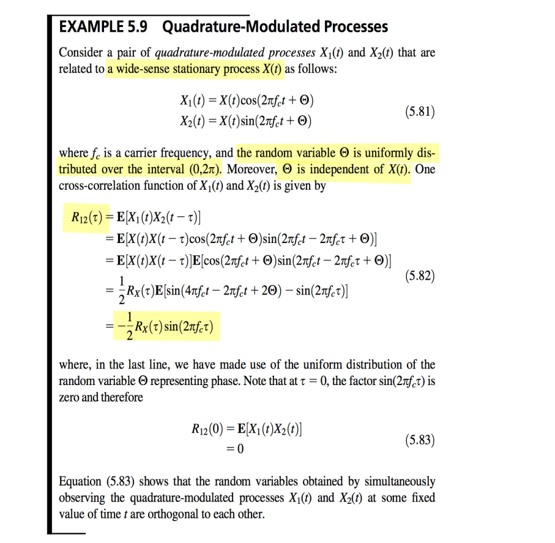

---

> Dr. Vishal Saxena, ECE518 Memory/Clock Synchronization IC Design: Oscillator Phase Noise [[https://www.eecis.udel.edu/~vsaxena/courses/ece504/Handouts/Oscillator%20Phase%20Noise.pdf](https://www.eecis.udel.edu/~vsaxena/courses/ece504/Handouts/Oscillator%20Phase%20Noise.pdf)]

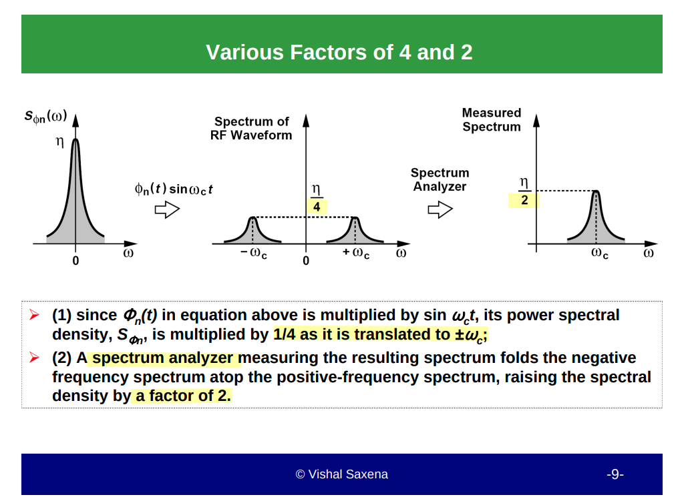

## Sampling of WSS process

> Balu Santhanam, Probability Theory & Stochastic Process 2020: [Impulse sampling of Random Processes](https://ece-research.unm.edu/bsanthan/ece541/impulse_sampling_of_random_signals.pdf)

### DT sequence $x[n]$

Owing to $\phi[0] = \phi_c(0)$,  the average power of the sampled version $x[n]$ is the ***same*** as its input $x_c(t)$

### impulse train $x_s(t)$

That is
$$
P_{x_s x_s} (f)= \frac{1}{T_s^2}P_{xx}(f)
$$
where $x[n]$ is sampled discrete-time sequence, $x_s(t)$ is sampled impulse train

### Noise Aliasing

*apply foregoing observation*

## Pulsed Noise Signals

> Chembian Thambidurai, "Power Spectral Density of Pulsed Noise Signals" [[link](https://www.linkedin.com/posts/chembiyan-t-0b34b910_psd-of-pulsed-noise-signal-activity-6992527460886040577-a0im?utm_source=share&utm_medium=member_desktop)]

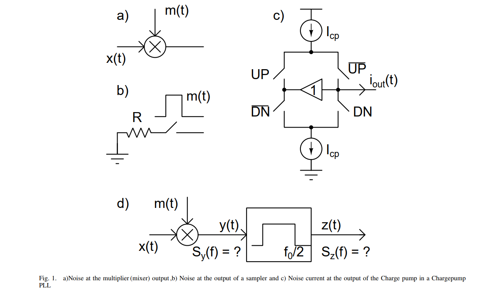

> Above,  the output of the multiplier be $y(t)$ is passed through a ideal brick wall low pass filter with a bandwidth of $f_0/2$

When a random signal is multiplied by a *pulse function*, the resulting signal becomes a *cyclo-stationary random process*. 

As rule of thumb, the spectrum of such a pulsed noise signal  

- ***thermal noise*** is multiplied by $\color{red}D$

- ***flicker noise*** is multiplied by $\color{red}D^2$, 

where $D$ is the duty cycle of the pulse signal

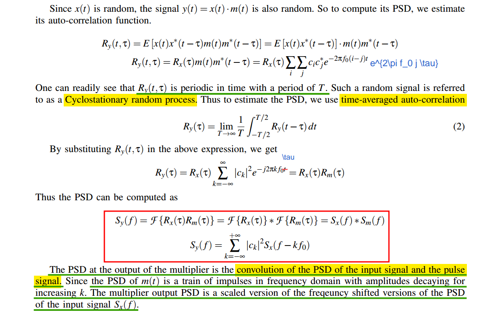

### banlimited input (no aliasing)

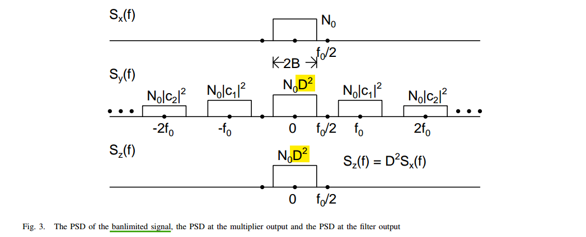

###  wideband white noise input

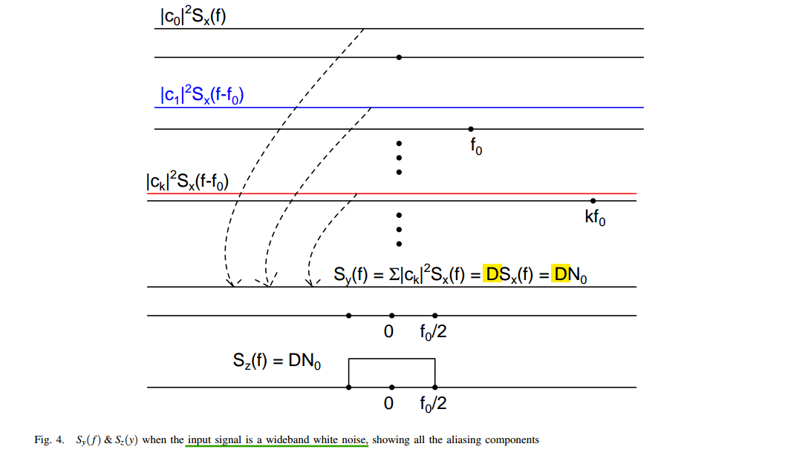

### flicker noise input

with $S_x(f)=\frac{K_f}{f}$

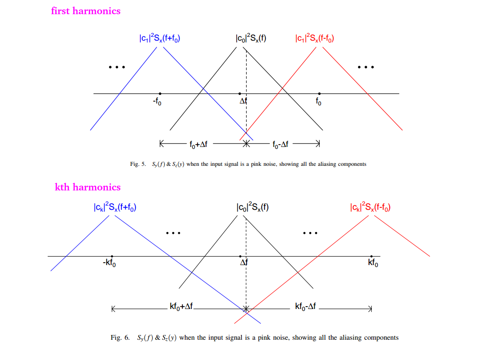

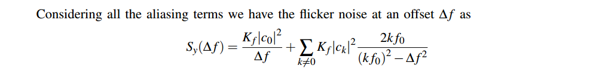

Assuming $\Delta f \ll f_0$

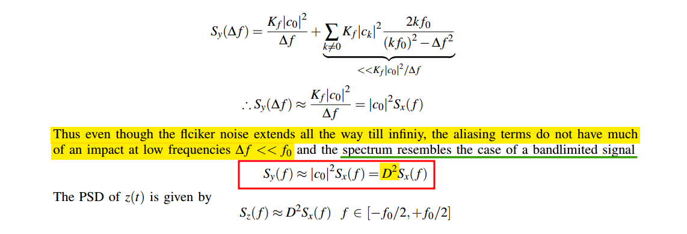

---

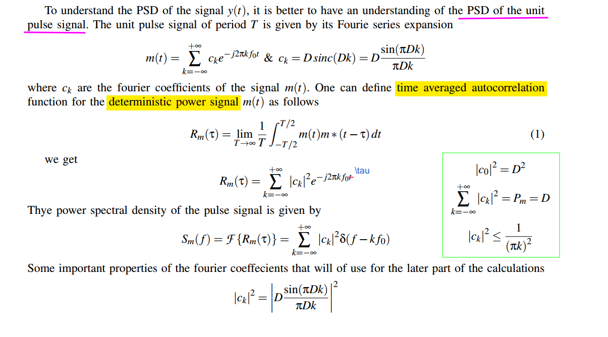

---

***Rectangular Pulse Sampling***

> Balu Santhanam. ece439 Introduction to Digital Signal Processing. Example: Rectangular Pulse Sampling [[http://ece-research.unm.edu/bsanthan/ece439/recsamp.pdf](http://ece-research.unm.edu/bsanthan/ece439/recsamp.pdf)]

## reference

Alan V Oppenheim, Ronald W. Schafer. Discrete-Time Signal Processing, 3rd edition [[pdf](https://file.fouladi.ir/courses/dsp/books/%28Prentice-Hall%20Signal%20Processing%20Series%29%20Alan%20V.%20Oppenheim%2C%20Ronald%20W.%20Schafer-Discrete-Time%20Signal%20Processing-Prentice%20Hall%20%282009%29.pdf)]

R. E. Ziemer and W. H. Tranter, Principles of Communications, 7th ed., Wiley, 2013 [[pdf](https://physicaeducator.wordpress.com/wp-content/uploads/2018/03/principles-of-communications-7th-edition-ziemer.pdf)]

John G. Proakis and Masoud Salehi, Fundamentals of communication systems 2nd ed [[pdf](http://www.pce-fet.com/common/library/books/51/9492_[John_G._Proakis,_Masoud_Salehi]_Fundamentals_of_C(b-ok.org).pdf)]

Rhee, W. and Yu, Z., 2024. *Phase-Locked Loops: System Perspectives and Circuit Design Aspects*. John Wiley & Sons

Lacaita, Andrea Leonardo, Salvatore Levantino, and Carlo Samori. *Integrated frequency synthesizers for wireless systems*. Cambridge University Press, 2007

Phillips, Joel R. and Kenneth S. Kundert. "Noise in mixers, oscillators, samplers, and logic: an introduction to cyclostationary noise." Proceedings of the IEEE 2000 Custom Integrated Circuits Conference. [[pdf](https://designers-guide.org/theory/cyclo-paper.pdf), [slides](https://designers-guide.org/theory/cyclo-preso.pdf)]

Antoni, J., "Cyclostationarity by examples", <i>Mechanical Systems and Signal Processing</i>, vol. 23, no. 4, pp. 987–1036, 2009 [[https://docente.unife.it/docenti/dleglc/a-a-2010-2011-dmsm/ciclostazionarieta.pdf](https://docente.unife.it/docenti/dleglc/a-a-2010-2011-dmsm/ciclostazionarieta.pdf)]

Kundert, Ken. (2006). Simulating Switched-Capacitor Filters with SpectreRF.  URL:[https://designers-guide.org/analysis/sc-filters.pdf](https://designers-guide.org/analysis/sc-filters.pdf)

STEADY-STATE AND CYCLO-STATIONARY RTS NOISE IN MOSFETS [[https://ris.utwente.nl/ws/portalfiles/portal/6038220/thesis-Kolhatkar.pdf](https://ris.utwente.nl/ws/portalfiles/portal/6038220/thesis-Kolhatkar.pdf)]

Christian-Charles Enz. "High precision CMOS micropower amplifiers" [[pdf](https://picture.iczhiku.com/resource/eetop/wYItQFykkAQDFccB.pdf)]

L.W. Couch, *Digital and Analog Communication* *Systems*, 8th Edition, Pearson, 2013. [[pdf](https://rizkia.staff.telkomuniversity.ac.id/files/2016/02/Digital-and-Analog-Communication-Systems-Leon-W.-Couch.pdf)]
