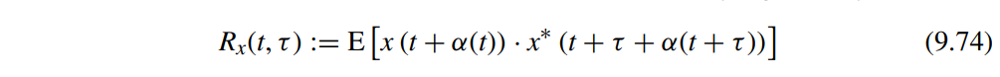

## Autozeroing techniques

> offset is **sampled** and then subtracted from the input.

## Chopping techniques

> offset is **modulated** away from the signal band and then filtered out.

**Good**: Magically reduces offset, 1/f noise, drift

**Bad**: But creates switching spikes, chopper ripple and other artifacts …

> C. C. Enz and G. C. Temes, "Circuit techniques for reducing the effects of op-amp imperfections: autozeroing, correlated double sampling, and chopper stabilization," in Proceedings of the IEEE, vol. 84, no. 11, pp. 1584-1614, Nov. 1996, doi: 10.1109/5.542410. [[http://www2.ing.unipi.it/~a008309/mat_stud/MIXED/archive/2019/Articles/Offset_canc_Enz_Temes_96.pdf](http://www2.ing.unipi.it/~a008309/mat_stud/MIXED/archive/2019/Articles/Offset_canc_Enz_Temes_96.pdf)]
>
> Bernhard E. Boser, M12 Precision Techniques [[https://people.eecs.berkeley.edu/~boser/courses/240B/lectures/M12%20Precision%20Techniques.pdf](https://people.eecs.berkeley.edu/~boser/courses/240B/lectures/M12%20Precision%20Techniques.pdf)]
>
> Qinwen Fan, Evolution of precision amplifiers
>
> Wu, R., Huijsing, JH., & Makinwa, KAA. (2013). Precision Instrumentation Amplifiers and Read-Out Integrated Circuits. Springer. https://doi.org/10.1007/978-1-4614-3731-4
>
> Kofi Makinwa, UPC 2009 [Overcoming Offset](https://electronicengineering.phd.upc.edu/en/courses-and-seminars/courses-materials/2008-2009/slides-makinwa-1)
>
> Kofi Makinwa, ISSCC 2007 Dynamic-Offset Cancellation Techniques in CMOS [[https://picture.iczhiku.com/resource/eetop/sYkywlkpwIQEKcxb.pdf](https://picture.iczhiku.com/resource/eetop/sYkywlkpwIQEKcxb.pdf)]
>
> Chopper Amplifiers Demystified Kofi A. A. Makinwa [[https://youtu.be/J19rRjKV7kk?si=oHXskwd9y-B35cJt](https://youtu.be/J19rRjKV7kk?si=oHXskwd9y-B35cJt)]
>
> ESSCIRC2023 Circuit Insights Kofi Makinwa [[https://youtu.be/uwRpP20Lprc?si=D8S4kjexbdsbuhb7](https://youtu.be/uwRpP20Lprc?si=D8S4kjexbdsbuhb7)]
>
> Cadence Tutorial Part-4: Chopping Technique; Dynamic Offset Cancellation; Chopper Amp Simulations [[https://youtu.be/gF8sOlK7TM8?si=6o_ABKN-IWs-1Khm](https://youtu.be/gF8sOlK7TM8?si=6o_ABKN-IWs-1Khm)]

## narrowband approximation

A sine wave with phase modulation is expressed as
$$
y(t) = A_0 \sin(2\pi f_0 t + \phi _0 +\phi (t))
$$
where $\phi (t)$ is a time-varying phase modulation function

Assuming a *narrowband phase modulation (PM)*, that is, the absolute amount of modulated phase is small enough

> *otherwise the modulation becomes frequency modulation (FM) and its analysis becomes more complex*

$$
y(t) \simeq A_0 \sin(2\pi f_0 t +\phi _0) + A_0 \phi (t)\cos(2\pi f_0 t + \phi _0)
$$

> Because $\cos \phi(t)$ and $\sin \phi(t)$ are approximated to $1$ and $\phi (t)$, respectively

The Fourier transform of $y(t)$ is
$$
Y(f) = \frac{1}{2}A_0 e^{j\phi _0}\delta(f-f_0) -\frac{1}{2}A_0e^{-j\phi_0}\delta(f+f_0)+\frac{1}{2}A_0e^{j\phi_0}\Phi(f-f_0)-\frac{1}{2}A_0e^{-j\phi_0}\Phi(f+f_0)
$$

> where $\Phi(f)$ is the Fourier transform pair of $\phi(t)$

The autocorrelation of $y(t)$ is

$$\begin{align}
R(\tau) &= E(y(t)y(t+\tau))\\
&= E([A_0\sin(2\pi f_0 t + \phi_0)+A_0\phi(t)\cos(2\pi f_0 t+\phi _0)]\\
&\cdot [A_0\sin(2\pi f_0 t + \phi_0+2\pi f_0\tau)+A_0\phi(t+\tau )\cos(2\pi f_0 t+\phi _0+2\pi f_0\tau)]) \\
&=A_0^2 E( \alpha_t^2\cos(2\pi f_0 \tau) + \alpha_t\beta_t\sin(2\pi f_0\tau)+ \phi(t+\tau)[\alpha_t \beta_t \cos(2\pi f_0 \tau) - \alpha_t^2\sin(2\pi f_0 \tau)] \\
&+ \phi(t)[\alpha_t \beta_t \cos(2\pi f_0\tau) + \beta_t^2 \sin(2\pi f_0 \tau)] \\
&+ \phi(t)\phi(t+\tau)[\beta_t^2 \cos(2\pi f_0 \tau)-\alpha_t\beta_t \sin(2\pi f_0 \tau)]) \\
&= A_0^2E(\alpha_t^2 \cos(2\pi f_0 \tau) + \phi(t)\phi(t+\tau)\beta_t^2\cos(2\pi f_0 \tau)) \\
&= \frac{1}{2}A_0^2 \cos(2\pi f_0 \tau)(1+E(\phi(t)\phi(t+\tau))) \\
&= \frac{1}{2}A_0^2 \cos(2\pi f_0 \tau)(1+R_{\phi}(\tau))
\end{align}$$

Fourier transform of $R(\tau)$ is
$$
S_y(f) = \frac{1}{4}A_0^2 \delta (f-f_0) + \frac{1}{4}A_0\delta(f+f_0) + \frac{1}{4}A_0^2S_\phi (f-f_0)+\frac{1}{4}A_0^2S_\phi (f+f_0)
$$

### approximation limitation

**Don't** retain the same total power

## Leeson's model

Leeson's equation is an *empirical* expression that describes an oscillator's phase noise spectrum

Limitation:

​	that the PSD diverges to *infinity* for very low values of the frequency offset $f$​

## Lorentzian Spectrum

> phase noise spectrum is different from **voltage spectrum**, which is called **Lorentzian spectrum**
>
> 

The spectrum of a free-running oscillator does indeed have a Lorentzian profile

- it is flat for frequencies below a given corner frequency and rolls off as $1/f^2$ above it

The periodic signal $x(t)$ can be expanded in Fourier series as:

Assume that the signal is subject to excess phase noise, which is modeled by adding a time-dependent noise component $\alpha(t)$. The noisy signal can be written $x(t+\alpha(t))$, the added excess phase $\phi(t)= \frac{\alpha(t)}{\omega_0}$

The autocorrelation of the noisy signal is by definition:

The *autocorrelation averaged over time* results in:

By taking the Fourier transform of the autocorrelation, the spectrum of the signal $x(t + \alpha(t))$​ can be expressed as

It is also interesting to note how the integral in Equation 9.80 around each harmonic is equal to the power of the harmonic itself $|X_n|^2$

The integral $S_x(f)$ around harmonic is
$$\begin{align}
P_{x,n} &= \int_{f=-\infty}^{\infty} |X_n|^2\frac{\omega_0^2n^2c}{\frac{1}{4}\omega_0^4n^4c^2+(\omega +n\omega_0)^2}df \\
&= |X_n|^2\int_{\Delta f=-\infty}^{\infty}\frac{2\beta}{\beta^2+(2\pi\cdot\Delta f)^2}d\Delta f \\
&= |X_n|^2\frac{1}{\pi}\arctan(\frac{2\pi \Delta f}{\beta})|_{-\infty}^{\infty} \\
&= |X_n|^2
\end{align}$$

> The phase noise does not affect the total power in the signal, it only affects its distribution. 
>
> - Without phase noise, $S_v(f)$ is a series of impulse functions at the harmonics of $f_o$. 
> - With phase noise, the impulse functions spread, becoming fatter and shorter but retaining the *same total power*

## AM-PM conversion

*TODO* &#128197;

## reference

Nicola Da Dalt and Ali Sheikholeslami. 2018. Understanding Jitter and Phase Noise: A Circuits and Systems Perspective (1st. ed.). Cambridge University Press, USA.

K. S. Kundert, "Introduction to RF simulation and its application,"

J. Phillips and K. Kundert, "Noise in mixers, oscillators, samplers, and logic - an introduction to cyclostationary noise,"

Rohde, Dr. Ulrich L.. "Noise analysis, then and today." (2018).[[https://synergymwave.com/articles/2018/Large-signal-oscillator-noise-analysis-then-and-today_s.pdf](https://synergymwave.com/articles/2018/Large-signal-oscillator-noise-analysis-then-and-today_s.pdf)]

Pulikkoonattu, R. (June 12, 2007), [*Oscillator Phase Noise and Sampling Clock Jitter*](http://documents.epfl.ch/users/p/pu/pulikkoo/private/report_pn_jitter_oscillator_ratna.pdf), Tech Note, Bangalore, India: ST Microelectronics, retrieved March 29, 2012

Keysight EEsof EDA, "Overview on Phase Noise and Jitter"

Krishna Sankar, "Oscillator phase noise". [[https://dsplog.com/2012/06/08/oscillator-phase-noise/](https://dsplog.com/2012/06/08/oscillator-phase-noise/)] 

C. C. Enz and G. C. Temes, "Circuit techniques for reducing the effects of op-amp imperfections: autozeroing, correlated double sampling, and chopper stabilization," in *Proceedings of the IEEE*, vol. 84, no. 11, pp. 1584-1614, Nov. 1996

Bae, Woorham; Jeong, Deog-Kyoon: 'Analysis and Design of CMOS Clocking Circuits for Low Phase Noise' (Materials, Circuits and Devices, 2020)
