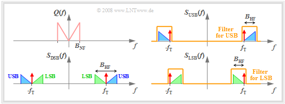

## AM & PM Noise

> The spectrum of the narrowband FM signal is very similar to that of an amplitude modulation (AM) signal but has the **phase reversal** for the other sideband component

Assume the modulation frequency of PM and AM are **same**, $\omega_m$

$$\begin{align}
x(t) &= (1+A_m\cos{\omega_m t})\cos(\omega_0 t + P_m \sin\omega_m t) \\
&= \cos(\omega_0 t + P_m \sin\omega_m t) + A_m\cos{\omega_m t}\cos(\omega_0 t + P_m \sin\omega_m t) \\
&= X_{pm}(t) + X_{apm}(t)
\end{align}$$

$X_{pm}(t)$, **PM only** part
$$
X_{pm}(t) = \cos\omega_0 t - \frac{P_m}{2}\cos(\omega_0 - \omega_m)t + \frac{P_m}{2}\cos(\omega_0 + \omega_m)t
$$
$X_{apm}(t)$, **AM & PM part**
$$\begin{align}
X_{apm}(t) &= A_m \cos{\omega_m t} (\cos\omega_0 t-P_m\sin\omega_m t\sin\omega_0 t) \\
&= \frac{A_m}{2}[\cos(\omega_0 + \omega_m)t + \cos(\omega_0 -\omega_m)t] - \frac{A_mP_m}{2}\sin(2\omega_m t)\sin(\omega_0 t) \\
&= \frac{A_m}{2}\cos(\omega_0 + \omega_m)t + \frac{A_m}{2}\cos(\omega_0 -\omega_m)t - \frac{A_mP_m}{4}\cos(\omega_0 - 2\omega_m)t + \frac{A_mP_m}{4}\cos(\omega_0 + 2\omega_m)t
\end{align}$$

That is
$$\begin{align}
x(t) &=  \cos\omega_0 t + \frac{A_m-P_m}{2}\cos(\omega_0 - \omega_m)t + \frac{A_m+P_m}{2}\cos(\omega_0 + \omega_m)t \\
&\space\space\space\space\space\space\space\space\space\space\space\space\space\space\space\space\space\space - \frac{A_mP_m}{4}\cos(\omega_0 - 2\omega_m)t + \frac{A_mP_m}{4}\cos(\omega_0 + 2\omega_m)t
\end{align}$$

For general case, $x(t) = (1+A_m\cos{\omega_{am} t})\cos(\omega_0 t + P_m \sin\omega_{pm} t)$, i.e., PM is $\omega_{pm}$, AM is $\omega_{am}$

$$\begin{align}
x(t) &=  \cos\omega_0 t - \frac{P_m}{2}\cos(\omega_0 - \omega_{pm})t + \frac{P_m}{2}\cos(\omega_0 + \omega_{pm})t \\
&\space\space\space\space\space\space\space\space\space\space\space\space\space\space\space\space\space\space + \frac{A_m}{2}\cos(\omega_0 - \omega_{am})t + \frac{A_m}{2}\cos(\omega_0 + \omega_{am})t \\
&\space\space\space\space\space\space\space\space\space\space\space\space\space\space\space\space\space\space - \frac{A_mP_m}{4}\cos(\omega_0 - \omega_{pm}-\omega_{am})t + \frac{A_mP_m}{4}\cos(\omega_0 + \omega_{pm}+\omega_{am})t \\
&\space\space\space\space\space\space\space\space\space\space\space\space\space\space\space\space\space\space + \frac{A_mP_m}{4}\cos(\omega_0 + \omega_{pm}-\omega_{am})t - \frac{A_mP_m}{4}\cos(\omega_0 - \omega_{pm}+\omega_{am})t
\end{align}$$

Therefore, sideband is **asymmetric** if $\omega_{pm} = \omega_{am}$ **same**

> Ken Kundert, Measuring AM, PM & FM Conversion with SpectreRF [[https://designers-guide.org/analysis/am-pm-conv.pdf](https://designers-guide.org/analysis/am-pm-conv.pdf)]

---

> Emad Hegazi , Jacob Rael , Asad Abidi, 2005. The Designer's Guide to High-Purity Oscillators [[https://picture.iczhiku.com/resource/eetop/whkgGLPAHoORYxbC.pdf](https://picture.iczhiku.com/resource/eetop/whkgGLPAHoORYxbC.pdf)]

### Equipartition theorem

> [[https://www.ieeetoronto.ca/wp-content/uploads/2020/06/DL-VCO-short.pdf](https://www.ieeetoronto.ca/wp-content/uploads/2020/06/DL-VCO-short.pdf)]

---

Stationary noise can also be decomposed into AM and PM components, but there will always be ***equal amounts of both***.

> Ken Kundert. Re: Question about phase noise simulation result [[https://designers-guide.org/forum/YaBB.pl?num=1309258199/15#15](https://designers-guide.org/forum/YaBB.pl?num=1309258199/15#15)]

---

> Noise in mixers, oscillators, samplers, and logic: an introduction to cyclostationary noise [[https://designers-guide.org/theory/cyclo-preso.pdf](https://designers-guide.org/theory/cyclo-preso.pdf)]
>
> [[https://designers-guide.org/theory/cyclo-paper.pdf](https://designers-guide.org/theory/cyclo-paper.pdf)]

### Single Sideband Modulation (SSB)

---

> 肥肥牛是只虎. PSS+Pnoise仿真：基本设置 [[https://mp.weixin.qq.com/s/etyQ2UkfisPkvbc44XFw4w](https://mp.weixin.qq.com/s/etyQ2UkfisPkvbc44XFw4w)]

### AM & PM in Phasor

---

> A. A. Abidi and D. Murphy, "How to Design a Differential CMOS LC Oscillator," in *IEEE Open Journal of the Solid-State Circuits Society*, vol. 5, pp. 45-59, 2025, doi: 10.1109/OJSSCS.2024 [[pdf](https://ieeexplore.ieee.org/stamp/stamp.jsp?tp=&arnumber=10818782)]

---

> Timing 201 #1: The Case of the Phase Noise That Wasn't - Part 1 [[https://community.silabs.com/s/share/a5U1M000000knpiUAA/timing-201-1-the-case-of-the-phase-noise-that-wasnt-part-1?](https://community.silabs.com/s/share/a5U1M000000knpiUAA/timing-201-1-the-case-of-the-phase-noise-that-wasnt-part-1?)]

> [[https://en.lntwww.de/Modulation_Methods/Single-Sideband_Modulation](https://en.lntwww.de/Modulation_Methods/Single-Sideband_Modulation)]

### AM-PM conversion in asymmetrical linear system

> Golara, S. (2015). Identifying Mechanisms of AM-PM Distortion in Large Signal Amplifiers. UCLA [[https://escholarship.org/uc/item/4jp786z8](https://escholarship.org/uc/item/4jp786z8)]

---

> Bob Nelson. Phase Noise 101: Basics, Applications and Measurements [[https://www.qsl.net/ab4oj/test/docs/20180720_KEE7_PhaseNoise.pdf])https://www.qsl.net/ab4oj/test/docs/20180720_KEE7_PhaseNoise.pdf]

### AN-PN Conversion

> G. Giust, Influence of Noise Processes on Jitter and Phase Noise Measurements [[https://www.signalintegrityjournal.com/articles/800-influence-of-noise-processes-on-jitter-and-phase-noise-measurements](https://www.signalintegrityjournal.com/articles/800-influence-of-noise-processes-on-jitter-and-phase-noise-measurements)]
>
> —. "Methodologies for PCIe5 Refclk Jitter Analysis,", PCI-SIG Electrical Workgroup Meeting (Jan. 19, 2018)
>
> —. How to Identify the Source of Phase Jitter through Phase Noise Plots [[https://www.sitime.com/company/newsroom/blog/how-identify-source-phase-jitter-through-phase-noise-plots](https://www.sitime.com/company/newsroom/blog/how-identify-source-phase-jitter-through-phase-noise-plots)]
>
> AN10072 Determine the Dominant Source of Phase Noise, by Inspection [[https://www.sitime.com/support/resource-library/application-notes/an10072-determine-dominant-source-phase-noise-inspection](https://www.sitime.com/support/resource-library/application-notes/an10072-determine-dominant-source-phase-noise-inspection)]
>
> Enrico Rubiola, February 7, 2025. Phase Noise - Art, Science and Experimental Methods [[https://rubiola.org/pdf-lectures/Scient-Instrum-Files/!-Phase-noise.pdf](https://rubiola.org/pdf-lectures/Scient-Instrum-Files/!-Phase-noise.pdf)]

- AM alone doesn't introduce jitter (e.g., doesn't change zero-crossings) nor impact phase

- AM changes slew rate, and so influences the conversion of amplitude noise to jitter when amplitude noise (BB) is present

---

> 

### Amplitude Noise

> Deog-Kyoon Jeong. Topics in IC Design: 1.1 Introduction to Jitter [[https://ocw.snu.ac.kr/sites/default/files/NOTE/Lec%201%20-%20Jitter%20and%20Phase%20Noise.pdf](https://ocw.snu.ac.kr/sites/default/files/NOTE/Lec%201%20-%20Jitter%20and%20Phase%20Noise.pdf)]

with $x(t) = A_0\sin (2\pi f_0 t +\phi _0)$, then $y(t) = x(t) + n_v(t)$

$$\begin{align}
R_y(\tau) &= \mathrm{E}[y(t)y(t+\tau)] \\
&= \mathrm{E}[x(t)x(t+\tau)] + \mathrm{E}[x(t)]\mathrm{E}[n_v(t+\tau)] + \mathrm{E}[x(t+\tau)]\mathrm{E}[n_v(t)] + \mathrm{E}[n_v(t)n_v(t+\tau)]\\
&= \mathrm{E}[x(t)x(t+\tau)] + \mathrm{E}[n_v(t)n_v(t+\tau)] \\
&= R_x(\tau) + R_{n_v}(\tau)
\end{align}$$

### phase noise analyzer vs spectrum analyzer

> Phase Noise Measurement Solutions [[https://www.keysight.com/vn/en/assets/7018-02528/technical-overviews/5990-5729.pdf](https://www.keysight.com/vn/en/assets/7018-02528/technical-overviews/5990-5729.pdf)]

The three most widely adopted techniques are **direct spectrum**, **phase detector**, and **two-channel cross-correlation**. 

While the direct spectrum technique measures phase noise with the existence of the carrier signal, the other two remove the carrier (demodulation) before phase noise is measured.

Though *direct spectrum technique method* may not be useful for measuring *very close-in phase noise* to a drifting carrier, it is convenient for qualitative quick evaluation on sources with relatively high noise

## Narrowband FM Approximation

$$
y(t) = A\cos(2\pi f_0t+\phi_n(t)) \approx A \cos(2\pi f_0 t) - A \phi_n (t)\sin(2\pi f_0 t)
$$

$$
R_x(\tau) = \frac{A^2}{2}\cos(2\pi f_0\tau) +  \frac{A^2}{2}R_\phi(\tau)\cos(2\pi f_0\tau)
$$
The PSD of the signal x(t) is given by
$$
S_x(f) = \mathcal{F}\{R_x(\tau)\} = \frac{P_c}{2}\left[\delta(f+f_0)+\delta(f-f_0)\right]+\frac{P_c}{2}\left[S_\phi(f+f_0)+S_\phi(f-f_0)\right]
$$
where $P_c = A^2/2$ is the carrier power of the signal

## Modulation of WSS process

> Balu Santhanam, Probability Theory & Stochastic Process 2020: [Modulation of Random Processes](https://ece-research.unm.edu/bsanthan/ece541/mod.pdf)

### modulated with a random cosine

### modulated with a deterministic cosine

---

> Hayder Radha, ECE 458 Communications Systems Laboratory Spring 2008: Lecture 7 - EE 179: Introduction to Communications - Winter 2006–2007 [Energy and Power Spectral Density and Autocorrelation](https://www.egr.msu.edu/classes/ece458/radha/ss07Keyur/Lab-Handouts/PSDESDetc.pdf)

---

## Sampling of WSS process

> Balu Santhanam, Probability Theory & Stochastic Process 2020: [Impulse sampling of Random Processes](https://ece-research.unm.edu/bsanthan/ece541/impulse_sampling_of_random_signals.pdf)

### DT sequence $x[n]$

Owing to $\phi[0] = \phi_c(0)$,  the average power of the sampled version $x[n]$ is the ***same*** as its input $x_c(t)$

### impulse train $x_s(t)$

That is
$$
P_{x_s x_s} (f)= \frac{1}{T_s^2}P_{xx}(f)
$$
where $x[n]$ is sampled discrete-time sequence, $x_s(t)$ is sampled impulse train

### Noise Aliasing

*apply foregoing observation*

## Rectangular Pulse Sampling

> Balu Santhanam. ece439 Introduction to Digital Signal Processing. Example: Rectangular Pulse Sampling [[http://ece-research.unm.edu/bsanthan/ece439/recsamp.pdf](http://ece-research.unm.edu/bsanthan/ece439/recsamp.pdf)]

## reference

Alan V Oppenheim, Ronald W. Schafer. Discrete-Time Signal Processing, 3rd edition [[pdf](https://file.fouladi.ir/courses/dsp/books/%28Prentice-Hall%20Signal%20Processing%20Series%29%20Alan%20V.%20Oppenheim%2C%20Ronald%20W.%20Schafer-Discrete-Time%20Signal%20Processing-Prentice%20Hall%20%282009%29.pdf)]

R. E. Ziemer and W. H. Tranter, Principles of Communications, 7th ed., Wiley, 2013 [[pdf](https://physicaeducator.wordpress.com/wp-content/uploads/2018/03/principles-of-communications-7th-edition-ziemer.pdf)]

John G. Proakis and Masoud Salehi, Fundamentals of communication systems 2nd ed [[pdf](http://www.pce-fet.com/common/library/books/51/9492_[John_G._Proakis,_Masoud_Salehi]_Fundamentals_of_C(b-ok.org).pdf)]

Rhee, W. and Yu, Z., 2024. *Phase-Locked Loops: System Perspectives and Circuit Design Aspects*. John Wiley & Sons

Lacaita, Andrea Leonardo, Salvatore Levantino, and Carlo Samori. *Integrated frequency synthesizers for wireless systems*. Cambridge University Press, 2007

Phillips, Joel R. and Kenneth S. Kundert. "Noise in mixers, oscillators, samplers, and logic: an introduction to cyclostationary noise." Proceedings of the IEEE 2000 Custom Integrated Circuits Conference. [[pdf](https://designers-guide.org/theory/cyclo-paper.pdf), [slides](https://designers-guide.org/theory/cyclo-preso.pdf)]

Antoni, J., "Cyclostationarity by examples", <i>Mechanical Systems and Signal Processing</i>, vol. 23, no. 4, pp. 987–1036, 2009 [[https://docente.unife.it/docenti/dleglc/a-a-2010-2011-dmsm/ciclostazionarieta.pdf](https://docente.unife.it/docenti/dleglc/a-a-2010-2011-dmsm/ciclostazionarieta.pdf)]

Kundert, Ken. (2006). Simulating Switched-Capacitor Filters with SpectreRF.  URL:[https://designers-guide.org/analysis/sc-filters.pdf](https://designers-guide.org/analysis/sc-filters.pdf)

STEADY-STATE AND CYCLO-STATIONARY RTS NOISE IN MOSFETS [[https://ris.utwente.nl/ws/portalfiles/portal/6038220/thesis-Kolhatkar.pdf](https://ris.utwente.nl/ws/portalfiles/portal/6038220/thesis-Kolhatkar.pdf)]

Christian-Charles Enz. "High precision CMOS micropower amplifiers" [[pdf](https://picture.iczhiku.com/resource/eetop/wYItQFykkAQDFccB.pdf)]

