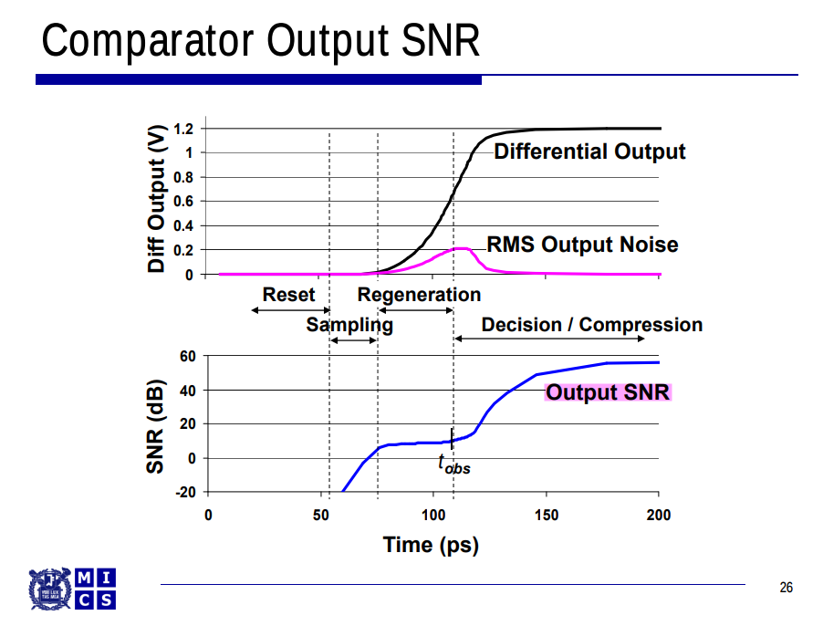
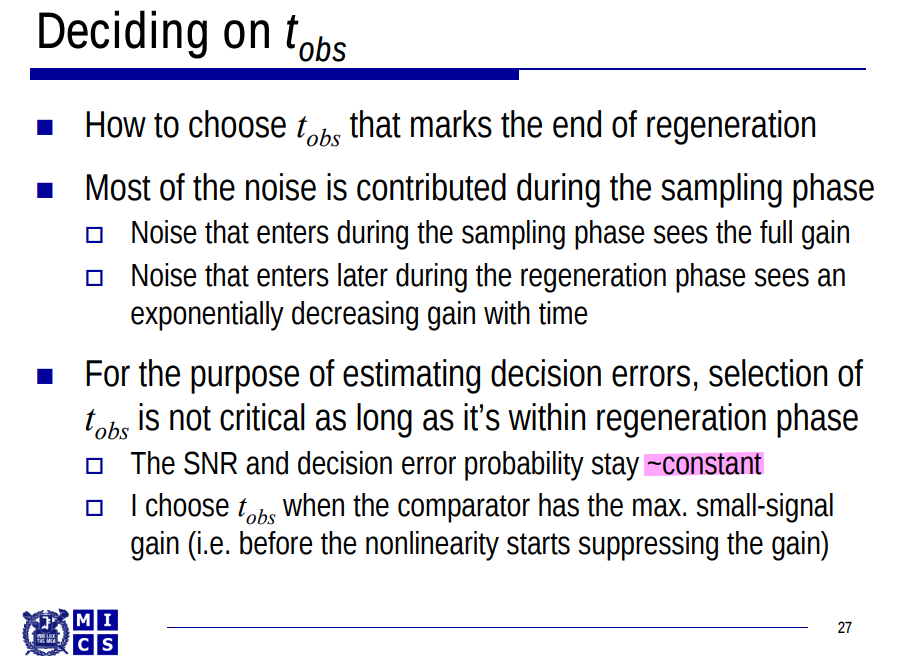

## Noise Analysis

*TODO* &#128197;

## Noise Simulation

> SNR during sampling region and decison region increase
>
> SNR during regeneration region is *constant*, where noise is critical 

$$
\text{SNR} = \frac{V_{o,sig}^2}{V_{o,n}^2} = \frac{V_{i,sig}^2}{V_{i,n}^2}
$$

we can get $V_{i,n}^2 = \frac{V_{i,sig}^2}{\text{SNR}}$, which is constant also

That is 
$$
V_{i,n}^2 = \frac{V_{i,sig}^2}{V_{o,sig}^2}V_{o,n}^2 = \frac{V_{o,n}^2}{A_v^2}
$$
where $V_{i,sig}$ is constant signal is applied to input of comparator

## offset

## reference

Xu, H. (2018). Mixed-Signal Circuit Design Driven by Analysis: ADCs, Comparators, and PLLs. *UCLA*. ProQuest ID: Xu_ucla_0031D_17380. Merritt ID: ark:/13030/m5f52m8x. Retrieved from [[https://escholarship.org/uc/item/88h8b5t3](https://escholarship.org/uc/item/88h8b5t3)]

A. Abidi and H. Xu, "Understanding the Regenerative Comparator Circuit," Proceedings of the IEEE 2014 Custom Integrated Circuits Conference, San Jose, CA, 2014, pp. 1-8.

T. Sepke, P. Holloway, C. G. Sodini and H. -S. Lee, "Noise Analysis for Comparator-Based Circuits," in IEEE Transactions on Circuits and Systems I: Regular Papers, vol. 56, no. 3, pp. 541-553, March 2009 [[https://dspace.mit.edu/bitstream/handle/1721.1/61660/Speke-2009-Noise%20Analysis%20for%20Comparator-Based%20Circuits.pdf](https://dspace.mit.edu/bitstream/handle/1721.1/61660/Speke-2009-Noise%20Analysis%20for%20Comparator-Based%20Circuits.pdf)]

Sepke, Todd. "Comparator design and analysis for comparator-based switched-capacitor circuits." (2006). [[https://dspace.mit.edu/handle/1721.1/38925](https://dspace.mit.edu/handle/1721.1/38925)]

P. Nuzzo, F. De Bernardinis, P. Terreni and G. Van der Plas, "Noise Analysis of Regenerative Comparators for Reconfigurable ADC Architectures," in *IEEE Transactions on Circuits and Systems I: Regular Papers*, vol. 55, no. 6, pp. 1441-1454, July 2008 [[https://picture.iczhiku.com/resource/eetop/SYirpPPPaAQzsNXn.pdf](https://picture.iczhiku.com/resource/eetop/SYirpPPPaAQzsNXn.pdf)]

J. Kim, B. S. Leibowitz, J. Ren and C. J. Madden, "Simulation and Analysis of Random Decision Errors in Clocked Comparators," in IEEE Transactions on Circuits and Systems I: Regular Papers, vol. 56, no. 8, pp. 1844-1857, Aug. 2009, doi: 10.1109/TCSI.2009.2028449. URL:[https://people.engr.tamu.edu/spalermo/ecen689/simulation_analysis_clocked_comparators_kim_tcas1_2009.pdf](https://people.engr.tamu.edu/spalermo/ecen689/simulation_analysis_clocked_comparators_kim_tcas1_2009.pdf)

Jaeha Kim, Lecture 12. Aperture and Noise Analysis of Clocked Comparators URL:[https://ocw.snu.ac.kr/sites/default/files/NOTE/7038.pdf](https://ocw.snu.ac.kr/sites/default/files/NOTE/7038.pdf)

Rabuske, Taimur & Fernandes, Jorge. (2017), Chapter 5 Noise-Aware Synthesis and Optimization of Voltage Comparators, "Charge-Sharing SAR ADCs for Low-Voltage Low-Power Applications"

Y. Luo, A. Jain, J. Wagner and M. Ortmanns, "Input Referred Comparator Noise in SAR ADCs," in IEEE Transactions on Circuits and Systems II: Express Briefs, vol. 66, no. 5, pp. 718-722, May 2019. [[https://sci-hub.se/10.1109/TCSII.2019.2909429](https://sci-hub.se/10.1109/TCSII.2019.2909429)]

Art Schaldenbrand, Senior Product Manager, Keeping Things Quiet: A New Methodology for Dynamic Comparator Noise Analysis URL:[https://www.cadence.com/content/dam/cadence-www/global/en_US/videos/tools/custom-_ic_analog_rf_design/NoiseAnalyisposting201612Chalk%20Talk.pdf](https://www.cadence.com/content/dam/cadence-www/global/en_US/videos/tools/custom-_ic_analog_rf_design/NoiseAnalyisposting201612Chalk%20Talk.pdf)

X. Tang et al., "An Energy-Efficient Comparator With Dynamic Floating Inverter Amplifier," in IEEE Journal of Solid-State Circuits, vol. 55, no. 4, pp. 1011-1022, April 2020
